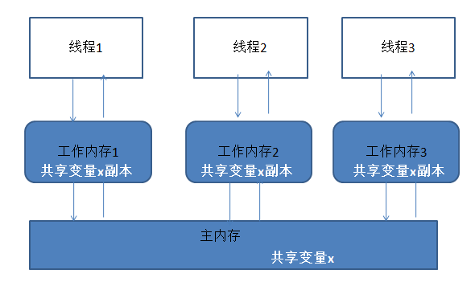

# Note of Java

## MultiThread

**可见性:** 　如果一个线程对共享变量值的修改，能够及时的被其他线程看到，叫做共享变量的可见性。如果一个变量同时在多个线程的工作内存中存在副本，那么这个变量就叫共享变量.

**有序性:　**在Java内存模型中，允许编译器和处理器对指令进行重排序，但是重排序过程不会影响到单线程程序的执行，却会影响到多线程并发执行的正确性。

**原子性:** 操作是不可被中断的，要么执行，要么不执行。在Java中，对基本数据类型的变量的读取和赋值操作是原子性操作，但是自增等操作不是原子性的。

```Java
x = 10;        // 原子性
y = x;         //　非原子性
x++;           //　非原子性
x = x + 1;     //　非原子性
```


**Java Memory Model:** 　多个线程同时对主内存的一个共享变量进行读取和修改时，首先会读取这个变量到自己的工作内存中成为一个副本，对这个副本进行改动之后，再更新回主内存中变量所在的地方。由于CPU时间片是以线程为最小单位，所以这里的工作内存实际上就是指的物理缓存，CPU运算时获取数据的地方；而主内存也就是指的是内存，也就是原始的共享变量存放的位置.



JMM规定：

+ 线程对共享变量的所有操作必须在工作内存中进行，不能直接操作主内存。
+ 不同线程间不能访问彼此的工作内存中的变量，线程间变量值的传递都必须经过主内存。

如果一个线程1对共享变量x的修改对线程2可见的话，需要经过下列步骤：

+ 线程1将更改x后的值更新到主内存。
+ 主内存将更新后的x的值更新到线程2的工作内存中x的副本。


1. **volatile**

  volatile变量每次被线程访问时，都强迫线程从主内存中重读该变量的最新值，而当该变量发生修改变化时，也会强迫线程将最新的值刷新回主内存中。这样一来，不同的线程都能及时的看到该变量的最新值。但是volatile不能保证变量更改的原子性。

1. **synchronized**
    保证原子性，可见性，有序性。依赖于JVM实现的非公平锁，后期版本引入偏向锁，自旋锁之后性能和　ReentrantLock　差不多。

1. **ReentrantLock**
    保证原子性，可见性，有序性。基于JDK实现，用户使用更加灵活，需要手工声明来加锁和释放锁，为了避免忘记手工释放锁造成死锁，所以最好在finally中声明释放锁。

  特性：

  + ReenTrantLock可以指定是公平锁还是非公平锁。

  + 提供了一个Condition（条件）类，用来实现分组唤醒需要唤醒的线程们，而不是像synchronized要么随机唤醒一个线程要么唤醒全部线程。

  + ReenTrantLock提供了一种能够中断等待锁的线程的机制，通过lock.lockInterruptibly()来实现这个机制。

  原理：ReenTrantLock的实现是一种自旋锁，通过循环调用CAS操作来实现加锁。它的性能比较好也是因为避免了使线程进入内核态的阻塞状态。

1. **Atomic数据类型**

   保证原子性，可见性，有序性。比如AtomicInteger，一个提供原子操作的Integer的类，类似的还有其他数据类型。

## Other

**Native method**：一个Native method是一个用非java代码实现的java方法；在定义一个native method时，并不提供实现体（类似java interface），其实现体由非java语言在外面实现：

```java
public class IHaveNatives
{
　　native public void Native1( int x ) ;
　　native static public long Native2() ;
　　native synchronized private float Native3( Object o ) ;
　　native void Native4( int[] ary ) throws Exception ;
}
```

native 标识符可以与除abstract之外的其他标识符连用