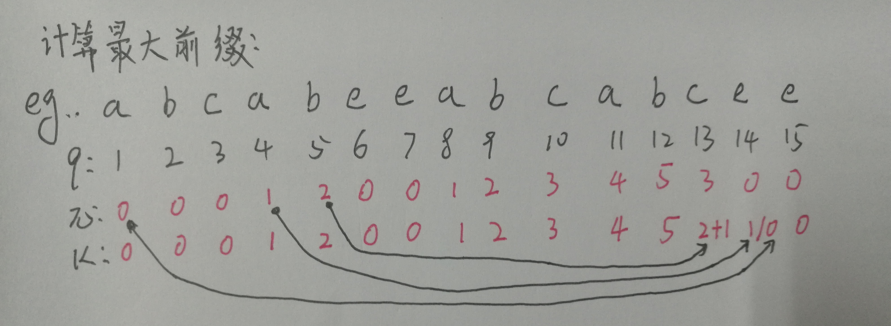

# Review of Algorithm
## Tips
1. 题型：
	1. 算法分析(6')
	1. 简答：原理、举例
	1. 算法设计(14-16')：伪代码
	1. 算法实现(16'):语言不限
1. 时间：2018/11/9(2.5H)

## Content
1. P1: 递归算法效率分析
    1. 确定一个参数定义输入大小;
    1. 确定算法的基本操作;
    1. 确定同样输入大小的不同输入是否引起基本操作次数的改变:如果是分开讨论最差,平均,最优;
    1. 带有初始条件的递归关系;
    1. 求解方程;
1. P2-1: 分治
	1. Quick-hull<P64> Average:Θ(nlogn), worst:Θ(n2) (as quicksort)
		```
		算法 QuickHull(vector<Node> nodes)
		// 使用分治法求闭包;
		// 输入:存储二维点对的向量,按照x排序;
		// 输出:存储闭包二维点对的向量 result;
		// 取得x最小和最大的点
		//重要公式:X1Y2+X2Y3+X3Y1-X2Y1-X3Y2-X1Y3;
		P1 <- nodes[0];
		P2 <- nodes[size-1];
		result.push(P1);
		result.push(P2);
		uFiled <- P1P2左侧的点;
		pMax <- 左侧距离P1P2最远的点;
		lFiled <- P1P2右侧的点;
		pMin <- 右侧距离P1P2最远的点;
		// 在P1P2左侧递归求上包;
		upperHull(P1,P2,pMax,uFiled);
			result.push(pMax);
			if empty(uFiled):
				return;
			newMax1<- 左侧距离P1pMax最远的点;
			filed1<- P1pMax左侧(除去 newMax1)的点;
			newMax2<- 左侧距离pMaxP2最远的点;
			filed2<- pMaxP2左侧(除去 newMax2)的点;
			upperHull(P1,pMax,newMax,filed1);
			upperHull(pMax,P2,newMax2,filed2);
		// 在P1P2右侧递归求下包;
		lowerHull(P1,P2,pMin,lFiled);
			result.push(pMin);
			if empty(lFiled):
				return;
			newMin1<- 右侧距离P1pMax最远的点;
			filed1<- P1pMin右侧(除去 newMin1)的点;
			newMin2<- 右侧距离pMaxP2最远的点;
			filed2<- pMinP2右侧(除去 newMin2)的点;
			lowerHull(P1,pMin,newMin1,filed1);
			lowerHull(pMin,P2,newMin2,filed2);
		```
	1. Closest Pairs<P48>
		```
		算法 EfficientClosestPair(l,r)
		// 使用分治算法求解最近点对问题
		// 输入:存储点坐标的二维数组,并按照x升序排列;l,r本次递归比较的起始位置;
		// 输出:l,r之间的点的最近的距离.
		len = r-l+1;
		if len<=3:
			蛮力求解;
		else:
			mid = (int)l+(r-l/2);
			dl = EfficientClosestPair(l,mid);
			dr = EfficientClosestPair(mid+1, r);
			minD = min{dl,dr};
			// 将离边界d的点取出,放入sideArea;
			sideArea;
			sideNodeNum = 0;
			for i<- l to r:
				if abs(_nodes[i].x - _nodes[mid].x) < minD:
					sideArea.push(_nodes[i]);
					sideNodeNum ++;
			// 按照Y升序排列 sideArea;
			sort(sideArea);
			// 从下往上扫描sideArea
			for i <-0 to sideNodeNum -1:
				k = i+1;
				while(k<= sideNodeNum -1 and sideArea[k].y - sideArea[i].y < minD):
					minD = min{Distance(sideArea[k], sideArea[i]), minD};
					k++;
			return minD;
		```
	1. 归并（递归）
		```
		// 归并排序的实现;
		// Input: 数组,左右边界 l, r;
		mergeSort(arr,l,r):
			if l<r:
				m<-l+r/2;
				mergeSort(arr,l,m);
				mergeSort(arr,m+1,r);
				// 合并两个拍好的数组;
				arr1<-arr[l,m];
				arr2<-arr[m+1,r];
				for i <- 0,j <- 0,k <- l; k<=r;k++:
					arr[k] <- arr1[i] <= arr2[j]?arr1[i++]:arr2[j++];
				delete arr1, arr2;
		```

1. P2-2: 减治
	1. 关节点<P42>
		- 移除关节点图变得不连接.
		- Analysis
			1. 叶子节点不是关节点;
			1. 根节点如果有两个儿子则为关节点;
			1. 内部节点 'u' 是一个关节点,如果 'u' 有一个或者多个子树,子树中没有点有回边连接到 'u' 的祖先.
		- Step
			```
			// 递归方法 ArtDFS;
			// Input: 全局变量 图G,当前遍历的节点 u, 
			// 记录遍历顺序的变量 vOrder,
			// visited[] 数组记录节点遍历的顺序,low[]数组辅助判断回边;
			// Output: 确定一个关节点,打印出来
			    // Browse order
            vOrder = 0;
            visited = new int[nodeNum];
            low = new int[nodeNum];
            for i <- 0 to nodeNum-1:
                visited[i] <- 0;
			ArtDFS(u):
				// 1.初始化: 
				low[u] <- visited[u] <- ++vOrder;
				for v<- u所有邻接点:
					// v已经遍历过,回边 
					if visited[v] != 0:
						Low[u] = min{Low[u], visited[v]}
					// 树边;
					else:
						// 深度优先;
						ArtDFS(v);
						Low[u] = min{Low[u], Low[v]}
					// 最后,判断是关节点;
					if visited[u] <= low[u]:
						print("关节点",u);
			```
	1. BST 删除
	```
	// 函数:删除 BST 中一个 Key 对应的节点;
	// Input: key;
	// Output: 删除完成后的树, 如果没有这个节点则不删除;
	delNode(tree,key):
		if tree == null:
			return null;
		if key < tree.value:
			tree.Lson <- delNode(tree.Lson,key);
		else if key > tree.value:
			tree.Rson <- delNode(tree.Rson, key);
		else:
			// 待删除节点有两个儿子;
			if null != tree.Lson and null != tree.Rson:
				// 使用右子树中最小节点或者左子树中最大节点替换删除节点,删除替换节点;
				maxNode <- max(tree.Lson);
				tree.value <- maxNode.value;
				tree.Lson <- deleteNode(tree.Lson, maxNode.value);
			// 待删除节点只有一个儿子或者没有;
			else:
				temp <- tree;
				if null != tree.Lson:
					tree <- tree.Lson;
				else:
					tree <- tree.Rson;
				delete temp;
		return tree;
	```

	1. BST 排序
		1. 构建BST树;
			```
			// 函数:二叉搜索树添加节点;
			// Input: key, tree;
			// Output: 增加完成之后的 tree 或 null:节点重复;
			addNode(tree, key);
				if null == root:
					root <- new Node(key);
					return true;
				else:
					if key<tree.value:
						tree.Lson <- addNode(tree.Lson, key);
					else if key > tree.value:
						tree.Rson <- addNode(tree.Rson, key);
					else:
						// 与树中的节点重复;
						return null;
				return tree;
			```
		1. 中序遍历;
			```
			// 函数: 中序遍历二叉树;
			// Input tree;
			// Output: 输出节点值;
			inOrder(tree):
				if null != tree:
					inOrder(node.Lson);
					print(node.value);
					inOrder(node.Rson);
			```

1. P2-3:
	1. AVL 树构建
		```
		// 增加节点函数
		// Input:父节点 father, 需要添加的值 value;
		// Output: 完成增加节点的 father;
		Node * addNode(father, value):
			if null == father:
				father = new Node(value);
			else if value < father.value:
				// 向左递归;
				father.Lson <- addNode(node.Lson, value);
				// 如果违背平衡规则
				if updateHeight(father.Lson) - updateHeight(father.Rson) == 2:
					if value < father.Lson.value:
						rightRotation(father);
					else:
						leftRightRotation(father);
			else if value > father.value:
				// 向右递归;
				father.Rson <- addNode(node.Rson, value);
				// 如果违背平衡规则
				if updateHeight(father.Rson) - updateHeight(father.Lson) == 2:
					if value > father.Rson.value:
						leftRotation(father);
					else:
						rightleftRotation(father);
			else:
				log("Error: 不允许插入重复节点")
			father.height <- updateHeight(father);
			return node;
		```
	1. 红黑树构建<10.19>
		1. 规则
			1. 每个节点是红色或者黑色;
			1. 根节点是黑色;
			1. 每个叶节点是NIL是黑色;
			1. 一个红色节点的两个儿子必须是黑色;
			1. 对于每一个节点,从这个节点到它子孙的叶节点包含相同个数的黑色.
		1. 添加节点
			```
			// 红黑树增加节点;
			像BST一样插入点;
			node.color = RED;
			// 修复规则
			while null != (father <- getFather(node)) and isRed(father):
				gFather = getFather(father);
				// 父节点是祖父节点的左孩子
				if father == gFather.left:
					uncle <- gFather.right;
					// Case 1:叔叔是红色
					if null != uncle and isRed(uncle):
						setBlack(uncle);
						setBlack(faher);
						setRed(gFather);
						node <- gFather;
					else:
						// Case 2:叔叔是黑色,当前节点是左儿子;
						// 左旋转,交换 father 和 node 指针后变为 case3;
						if node == father.right:
							leftRotate(father);
							temp <- parent;
							father <- node;
							node <- temp;
						// Case 3:叔叔是黑色,当前节点是左儿子;
						setBlack(father);
						setRed(gFather);
						rightRotate(gFather);
				// 父节点是祖父节点的右孩子
				else:
					uncle <- gFather.left;
					// Case 1:叔叔是红色;
					if null != uncle and isRed(uncle):
						setBlack(uncle);
						setBlack(faher);
						setRed(gFather);
						node <- gFather;
					else:
						// Case 2: 叔叔是黑色,当前节点是左儿子;
						// 右旋转,交换 father 和 node 指针后变为 case3;
						if node == father.left:
							rightRotate(father);
							temp <- parent;
							father <- node;
							node <- temp;
						// Case3: 叔叔是黑色,当前节点是右儿子;
						setBlack(father);
						setRed(gFather);
						leftRotate(gFather);
			// 将根节点设置为黑色;
			setBlack(root);
			```

	1. 优先队列<P101>
		- heap(最小堆):
			1. Construct(bottom-up)
				```
				// 函数:创建堆
				// Input: 包含元素的数组 arr, size;
				// Output: 符合堆规则的数组;
				createHeap(arr):
					if size>1:
						// 从最右边一个非叶子节点开始;
						for i<- (size-1)/2 to 1:
							index <- i;
							while (left <- 2*index) <= size:
								small <- left;
								//有两个儿子;
								if left+1 < size:
   									if arr[left+1]<arr[left]:
   										small <- left+1;
								// index节点比两个儿子小,不用修改,否则和小的交换;
								if arr[index]<arr[small]:
									return;
								else:
									swap(arr[small], arr[index]);
									index <- small;
				```
			1. Add ele
				```
				// 函数:堆增加节点
				// Input: 新的元素 node, 存储数组 arr, size;
				// Output: 增加完成的存储结构;
				push(node):
					// 将元素增加到最后, size +1;
					arr[size] <- node;
					size ++;
					// 和父节点比较,如果小于则交换, 直到不小于或者到达根节点;
					index <- size;
					while index != 0:
						father<- index/2;
						if arr[index]<arr[father]:
							swap(arr[index],arr[father]);
							index <- father;
						else:
							return;
				```
			1. Remove Top
				```
				// 函数: 移除堆顶第一个元素;
				// 全局变量: 存储结构 arr, size;
				// Output: 堆顶元素;
				pop():
					// 取出第一个元素;
					res<- arr[1];
					// 将最后一个元素放到第一个元素;
					arr[1]<-arr[size];
					// size -1
					size --;
					// 将第一个元素和儿子比较,如果大于最小的儿子,则下移;
					index <- 1;
					while (left <- 2*index) <= len:
						small <- left;
						if left+1<len:
   							if arr[left+1]<arr[left]:
   								small <- left+1;
						// index节点比两个儿子小,不用修改,否则和小的交换;
						if arr[index]<arr[small]:
							return;
						else:
							swap(arr[small], arr[index]);
							index <- small;
				```

1. P2-4: 时空权衡
  1. KMP
    1. 计算最大前缀表(应用回溯)
      ```
      // 函数: 基数 模式p的最大前缀表;
      // Input: 模式;
      // Output: Pi 数组;
      m=length[p]
      Pi[1]=0 
      k=0
      for q <-2 to m:
      	while k > 0 and p[k+1] != p[q]:
      		k=Pi[k] // 回溯;
      	if p[k+1] == p[q]:
      		k++
      	Pi[q]=k
      return Pi
      ```
      

    1. 匹配
    	```
    	n=length[S]
    	m=length[P]
    	k=0				// 匹配字符的个数;
    	for q <- 1 to n:
    		while k>0 and p[k+1] != S[q]:
    			k=Pi[k]	// 下一个字符串不匹配;
    		if p[k+1]==S[q]:
    			k++		// 下一个字符匹配了;
    		if k==m:	// 模式匹配完成;
    			print "match:" q-m
    			k=Pi[k]
    	```

  1. Boyer-Moore<书P207>
  	1. 预先计算两个表
  		1. 坏符号表：没有匹配上时移动的距离
  		    ```
  		    // 函数:计算坏符号表;
  		    // Input: 模式p;
  		    // Output:坏符号表 shiftTable;
  		    // 使用shiftTable时,如果不在表内,则跳转 len(p);
  		    getShiftTable(p):
  		        len <- len(p);
  		        // 在pattern 的前 len-1 出现，值为该字符到pattern最右端的距离；
  		        for i<- 1 to len-1:
  		            if p[i] not in shiftTable:
  		                shiftTable[p[i]] <- len -i;
  		    ```
  		1. 好后缀表(m>k>0时使用)：匹配上时移动多少
  		    ```
  		    // 函数:计算好后缀表;
  		    // Input: 模式p;
  		    // Output:好后缀表 suffixTable;
  		    // 匹配长度为k的部分在pattern再次出现，移动距离d2等于最右边出现的位置;
  		    // 匹配长度为k的部分在pattern没有出现，d2等于l < k的最长后缀最右边出现的位置.
  		    getSuffixTable():
  				    len <- len(p);
  				    //后缀的长度
  				    for k <- 1 to len - 1:
  				        subSuffix <- 0;
  				        subSuffix_loc <- -1;
  				        //从右边第二个往左扫描的指针
  				        i <- len -2;
  				        while subSuffix <k and i>=0:
  				            temp_i <- i;
  				            //与后缀匹配上的长度
  				            temp_subSuffix <- 0;
  				            while temp_suffix < k and temp_i >= 0 and p[temp_i] == p[len-1-temp_subSuffix]:
  				                temp_subSuffix ++;
  				                temp_i --;
  				            if temp_subSuffix >= subSuffix:
  				                subSuffix <- temp_subSuffix;
  				                subSuffix_loc <- i;
  				            i--;
  				        suffixTable[k-1] <- len-1-subSuffix_loc;
  		    ```
  	1. 从右到左比较字符
  	    ```
  	    // 算法:boyerMoore;
  	    // Input: 字符串 text,模式p;
  	    boyerMoore(text,p):
  	        预先计算好坏符号表和后缀表;
  	        len_p <- len(p);
  	        len_t <- len(t);
  	        i <- len_p -1; // 定位到模式的最右边
  	        while i < len_t:
  	            k <- 0; // 匹配上的字符数;
  	            while k<len_p and p[len_p -1-k] == text[i-k]:
  	                k++;
  	            if k == len_p:
  	                print("得到一个匹配",i-len_p+1);
  	                i <- i+getShift(text[i]);
  	            else:
  	                // 部分匹配或者没匹配
  	                // 取d1(匹配失败字符c对应坏符号表)-k和d2(好后缀表)的最大值移动pattern;
  	                d1 <- getShift(text[i-k]);
  	                d1 <- max{d1-k,1};
  	                d2 <- 0;
  	                if k>0:
  	                    d2 <- suffixTable[k-1];
  	                maxD <- max{d1,d2};
  	                i <- i+maxD;
  	    ```
  1. 拓展 hash<P54>
  	1. 特性
  		1. Hash函数产生的值在一个较大范围内变化,一般是32bit整数;
  		1. 永远只需要一个 prefix 来索引 bucket 的地址;
  		1. prefix 的长度为i bits, 0<=i<=32;
  		1. Bucket 地址表的空间大小为2^i, 初始时 i=0;
  		1. i的值随着数据库的变化而变化;
  		1. bucket 地址表上可能多个入口指向同一个 bucket.
  		1. 所以实际的 bucket 个数<2^i;
  			1. buckets 的个数随着 bucket 的合并和分裂改变.
  		1. 每个 bucket j存储了一个值Ij,桶地址表上指向同一个 bucket 的的入口前Ij bits位的值相同.
  	1. 查询一个 Kj 所在的 bucket 地址:
  		```
  		// 函数: 获取Kj 所在 bocket 位置;
  		// Input: 键 Kj;
  		// Output: Kj 所在的 bucket;
  		getBucket(Kj):
  			X <- h(Kj);
  			// 取前i高阶位;
  			hOrder <- X.subStr(0,i);
  			// bucket 地址表中对应位置存储着 bucket 的指针;
  			hPrefix <- prefix[hOrder];
  			bucket <- *hPrefix;
  		```
  	1. 插入一条记录, R(Kj,V):
  		```
  		// 函数: 插入一条记录
  		// Input: a record R(Kj,V);
  		Insert(Kj ,V):
  			j <- getBucket(Kj);
  			if hasRoom(j):
  				insert(R);
  			else:
  				if i==ij: // 只有一个入口指向 bucket j;
  					增加 i 并且让 bucket 地址表加倍;
  					把表中的每个入口替换为两个指向同一个 bucket 的入口;
  					重新计算 Kj 的 bucket 位置;
  					// 现在, i>ij 使用 i>ij对应的处理;
  				if i>ij: // 多个入口指向 bucket j;
  					z <- new bucket();
  					iz <- ij + 1;
  					ij <- ij +1;
  					让后半部分指向 j 的入口指向z;
  					移除 bucket j 中的所有记录,并重新插入;
  					重新计算 Kj 的 bucket 位置并重新插入;
  						如果分裂几次后 bucket 还是满的(多次重复插入某个值);
  							创建一个溢出表;
  		```
  	1. 删除 kj 指向的值:
  		```
  		// 函数: 删除 kj指向的值;
  		// Input: Kj;
  		Del(Kj):
  			// 找到具体位置,并删除;
  			j <- getBucket(Kj);
  			loc <- j.getRoom(kj);
  			j.del(loc);
  			// 如果 bucket 为空,也删除;
  			if empty(j):
  				del(j);
  				调整 bucket 地址表;
  			// 可以合并 bucket;
  			合并 ij 值相同并且 ij-1 前缀相同的 bucket;
  			// 建议在 bucket 的个数远小于表的空间时,缩小 bucket 地址表;
  			如果合适,缩小 bucket 地址表;
  		```

1. P2-5: 贪心
	1. Prim<书P247>
		```
		// Prim算法;
		// Input: 图G=(nodes,edges); 最小堆存储 node;
		// Output: 最小生成树;
		Prim(nodes, edges):
			vector<Node> mst;
			while !empty(nodes):
				node <- nodes.pop();
				// 更新邻接点存储的最短距离,和最短距离的点;
				for adj <- node 每个邻接点:
					distance <- edges[node][adj];
					if adj.nDis > distance:
						adj.nDis <- distance;
						adj.nNode <- node;
				mst.push(node);
			return mst;
		```

	1. Krascal<书P252>
		```
		// Krascal 算法;
		// 初始化: 自定义 Edge, vector<Edge> edges存储, 一维数组标记点是否已经加入mst;
		Krascal(edges):
			// 按照边权重排序;
			sort(edges);
			vector<Edge> mst;
			for edge:edges:
				if 不构成回边(edge):
					mst.push(edge);
			return mst;
		```

	1. Hofumen<书P262>
		```
		// 算法:Hofumen;
		// Input: vector<Node> nodes 包含字符和对应的概率;
		// Output: 每个字符和对应的编码;
		Hofumen():
			// 放入优先队列;
			chars <- heap();
			for node:nodes:
				chars.push(node);
			// 不断地从最小堆取出频率最小的两个点合并为一个点,放回最小堆;
			while chars.len >1:
				father <- Node();
				father.Lson <- chars.pop();
				father.Rson <- chars.pop();
				father.ratio <- father.Lson.ratio + father.Rson.ratio;
				chars.push(father);
			// 深度优先遍历编码树,左'0'右'1';
			tree <- chars.pop();
			DFS(tree, label):
				if tree != null:
					if 叶子节点:
						print(tree.value, label);
					DFS(tree.Lson, label+'0');
					DFS(tree.Rson, label+'1');
		```

1. P2-6: 动态规划
	1. OBST<书P231>
		```
		// 算法: 动态规划实现 OBST;
		// Input: P数组存储每个节点的概率，节点个数n；
		// 初始化
		for i<- 1 to n: 
   			// mainTable rootTable [1,n+1]行[0,n]列；
   			mainTable[i][i]==p[i];
   			rootTable[i][i]=i;
   			mainTable[i][i-1]=0;
   		mainTable[n+1][n]<-0;
   		
		//平行于对角线填表:
		for d<-0 to len_p:
		    for i<-0 to len_p:
		        j<-i+d+1;
		        minVal <- MAXNUM;
		        minK <- MAXNUM;
		        // 对于每一个空格(每一对i,j), i<=k<=j循环, 求minVal:
		        for k<- i to j:
		            temp <- mainTable[i][k-1]+mainTable[k+1][j];
		            if minVal > temp:
		                minVal <- temp;
		                minK<-k;
		        rootTable[i][j] <- minK;
		        sum <p[i];
		        for s<- i+1 to j:
		            sum += p[s];
		        mainTable[i][j] <- minVal + sum;
		```

	1. 0-1背包（memory）<书P228>
		```
		// 算法: 带记忆的 01背包问题;
		// 物品数量n,背包承重量w, Weights[n], Values[n], Memory[n+1][w+1];
		// 初始化 Memory,i或j为0的地方初始化为0,其余初始化为-1;
		// MFKnap(i,j):
			if (Memory[i][j] < 0):
		        int value = 0;
		        if (j < Weights[i])
		            value = MFKnap(i - 1, j);
		        else
		            int notChose = MFKnap(i - 1, j);
		            int choose = Values[i] + MFKnap(i - 1, j - Weights[i]);
		            value = max{notChose,choose};
		        Memory[i][j] = value;
		```

	1. LCS<P62>
	    ```
	    //算法：最长公共子串；
		//输入：str1=a1a2...am, str2=b1b2...bn.
		//len(i,j)表示子串 a1a2...ai和b1b2...bj的匹配长度;
		//i==0 或 j==0 初始化为 0;
		for i <- 0 to len1:
		    len(i,0) = 0
        for j <- 1 to len2:
            len(0,j) = 0
        for int i = 1 to len1:
            for int j = 1 to len2:
                // last char equal
                if str1[i] == str2[j]
                    len[i][j].val = len[i - 1][j - 1].val +1;
                    len[i][j].label = Label ::LeftUp;
                // subStr1 缩小一个字符匹配；
                else if len[i - 1][j].val >= len[i][j - 1].val:
                    len[i][j].val = len[i - 1][j].val;
                    len[i][j].label = Label::Up;
                // subStr2 缩小一个字符匹配；
                else
                    len[i][j].val = len[i][j - 1].val;
                    len[i][j].label = Label::Left;
		```
		```
		//函数：输出结果；
		Print(i,j):
		    if i == 0 or j == 0:
                return;
            if len[i][j].label == Label::LeftUp:
                output(i - 1, j - 1);
                print(str1[i]);
            else if len[i][j].label == Label::Up:
                output(i - 1, j);
            else
                output(i, j - 1);
		```
1. P2-7:
	1. 回溯
		```
		// 算法:回溯思想实现n皇后问题求解;
		// Input:未放置的皇后个数 count,放置到第几行 row;
		// 全局变量: N 总的皇后个数, table[N][N] 放置的表;
		// Output: true 本次放置成功并且下一个放置成功, 否则返回false;
		bool place(count, row):
			if count>0:
				bool placeSuccess = false;
				for i<-0 to N:
					if not confict(row,i):
						table[row][i] = Queen;
						if place(count -1, row+1):
							placeSuccess = true;
							break;
						else:
							// 下一个无法放置,回溯
							table[row][i] = Undef;
				return placeSuccess;
			else:
				printResult();
				// 如果只需要得到一个结果,这里返回true;
				return true;
		```
	1. 爬山
		1. DFS的一种变种,选择局部最优节点进行拓展;
		1. 框架
			```
			// 全局变量: 包含根节点的单元素stack;
			// Output: 目标结果;或者搜索失败.
			while !Empty(stack):
				if isGoal(stack.top())
					return stack.pop();
				else:
					element = stack.top();
					stack.pop();
					sons = getSon(element);
					// 根据评价函数排序
					sortByEval(sons);
					stack.add(sons);
			```
	1. 最佳优先<一种启发式搜索>
		1. 结合了DFS和BFS;
		1. 选择所有节点中预估最好的节点;
		1. 这种方法有全局视角;
		1. 可以使用优先队列(堆)作为数据结构;
		1. 框架
			```
			// 全局变量: 包含根节点的单元素 list;
			// Output: 目标结果;或者搜索失败.
			while !Empty(list):
				if isGoal(list.top())
					return list.pop();
				else:
					element = list.top();
					list.pop();
					sons = getSon(element);
					list.add(sons);
					// 将整个list按照评价函数排序
					softByEst(list);
			```

1. P2-8:<10.28>
	1. 单纯形法
		1. 初始化单纯形表,根据基本解标记基本变量;
		1. 目标行负数绝对值大的那个数确定输入变量和主元列;
		1. 确定最小 thta比率,得出分离变量和主元行;
		1. 求 row_new(主元行所有单元格除以主元),其他行-C*row_new;
	1. 最大网络流
		```
		一维数组存储顶点,二维数组Edges存储边,新建一个队列;
		源点Label标记为Endless,from标记为Undef, 并加入队列;
		while not Empty(Q):
			from = Q.front();Q.pop();
			for j<-0 to _nodeNum:
				tempEdge <- Edges[from][j]
				//正向边
				if tempEdge.max > 0 and notLebled(j):
				    //剩余流量
					r = tempEdge.max - tempEdge.used;
					if r > 0:
						nodes[j].label = min{from.label, r};
						nodes[j].from = from.id;
						nodesQue.push(nodes[j]);
				//反向边
				else if tempEdge.max < 0 and notLebled(j):
					//可用流量
					r = -tempEdge.max;
					if r >0:
						nodes[j].label = min{from.label, r};
						nodes[j].from = -from.id;
						nodesQue.push(nodes[j]);
			//如果汇点被标记，增益
			if Labled(final):
				j = final;
				while j != source:
					if j.from >0:
					    //正向
						edges[j.from][j.id].used += nodes[final.id].label;
					else:
					    //反向
						edges[j.from][j.id].used -= nodes[final.id].label;
					j = nodes[j.from];
				//清除所有标记
				for i<0 to nodeNum:
					if i!= source:
						nodes[i].reset();
				//使用源点重新初始化队列；
				clearQue();
				nodesQue.push(source);
		```
	1. 二分图最大匹配
		```
		// 使用类似于宽度优先搜索的方式找出一个二分图最大匹配
		// 输入: 二分图G=<V,U,E>, 包含V中所有自由定点的队列Q;
		// 输出: 最大的匹配；
		// 将V中的自由点放入Q；
		while not Empty(Q);
			w <- Q.front();
			Q.pop();
			if w belong V:
				for 邻接w的每一个点u:
					if isFree(u):
						// 增益
						M <- addM(w,u);
						v <- w;
						while labled(v):
							u <- getNode(v.label);
							M <- removeM(v,u);
							v <- getNode(u.label);
							M <- addM(v,u);
						// 删除所有定点标记,使用V中自由顶点重新初始化Q
						removeLabels();
						initQ();
						break;
					else:
						// u 已经匹配
						if !isMatched(w,u) and !labled(u):
							u.label = w;
							Q.push(u); 
			else:
				// w属于U,用w来标记w的对偶v;
				v = getMate(w);
				v.label = w;
				Q.push(v);
		```
