# Lucene And Solr

## Lucene

1. Lucene 中文分词

	&emsp;&emsp;在做索引阶段，调用 addDocumtnt(doc) 时，Lucnce 内部调用 Analyzer，Analyzer 是 TokenStream 的外围包装类，负责整个解析工作
	在搜索阶段，调用 QueryParser.parse(queryText) 来解析字符串时，QueryParser 会调用 Analyzer 来拆分查询字符串，但是对于通配符等查询不会调用 Analyzer。

	&emsp;&emsp;Lucene 中的 StandardAnalyzer 对于中文采用了单字切分的方法。

	&emsp;&emsp;对不同的数据写了不同用途的分析器，需要在同一个索引中针对不同的索引列使用。一般情况下只使用一个分析器，可以通过 PerFieldAnalyzerWrapper 指定默认的分析器，也可以通过 addAnalyzer 方法对不同的列使用不同的分析器。

	&emsp;&emsp;可以自己实现 Analyzer、Tokenizer、TokerStream。

1. 查找词典算法

	1. `标准 Trie 树`：

		树类：增加单词到搜索树； 从文本的指定位置开始匹配单词
		节点类： 

	1. 三叉 Trie 树：

		三叉搜索树只有三个指针： 左右和向下，向下指向单词的下一个数据单元。
		选择一个排序后数据单元集合的中间值，并把它作为开始节点，可以创建一个平衡的三叉树。

1. 中文分词原理

	1. 正向最大长度匹配、逆向最大长度匹配
	1. 概率语言模型的分词： 计算条件概率、然后采用概率大的值的切分方案（字符串在语料库中出现的概率）

1. N元分词法

	1. `马尔科夫假设`： 一个词的出现仅仅依赖于它前面出现的一个或者几个词。
	
	1. `二元模型`：一个词的出现仅依赖于它前面出现的一个词。
	P(Wi/Wi-1)=fred(Wi-1)/fred(Wi-1)
	
	1. 三元模型：一个词的出现仅依赖于它前面的两个词。
	P(Wi/Wi-2,Wi-1)=fred(Wi-2,Wi-1,Wi)/fred(Wi-2,Wi-1)

1. 新词发现

	可以使用`信息熵`的公式来度量两个词的结合紧密程度：

	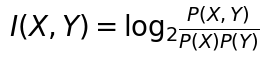
	
	再结合前面的N元模型，可以求出信息熵的值。

	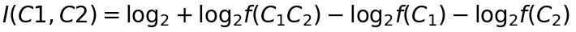

1. 未登录词

	常见的未登录词包括人名、地名、机构名

	1. 对未登录人名的有用信息包括：未登录词所在的上下文、未登录词本身的概率
		动词+中国人名+标点符号 =》动词+姓+名+标点符号
		可以通过以上匹配规则来识别未登录词，为了实现同时查找多个规则，可以把右边组织成 Trie 树，左边的模式作为节点属性。全切分词图匹配上右边的模式后用左边的模式替换。

	1. 未登录地名识别过程：

		选取未登录地名候选串。
		未登录地名特征识别。
		对每个候选未登录地名根据特征判断是否是真的地名。判断方法可以用 SVM 二值分类。
		整合地名词图。

1. 词性标注

	&emsp;&emsp;隐马尔可夫模型和基于转换的学习方法整合了频率和上下文特征来取得好的标注结果。

	1. `隐马尔可夫模型`： 同时考虑了词的生成概率和磁性之间的转移概率

		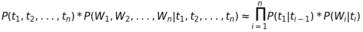

		这里把w叫做显状态，词性t叫做隐状态。条件概率P(t1|ti-1)叫做转移概率，条件概率P(wi|ti)叫做发射概率。

	1. `基于转换的错误学习方法`：先把每个词标注上最可能的词性，然后通过转换规则修正错误的标注，提高标注精度。

1. 平滑算法

	&emsp;&emsp;平滑又黑盒和白盒两种，黑盒平滑放法把一个项目作为不可分割的整体；而白盒平滑放法把项目作为一个可拆分的，可用于N元模型。

	1. 加法平滑算法：每个项目增加lambda(0-1),然后除以总数作为项目新的概率。

	1. Good-Turing:使用观察到的r+1的全部概率去估计类别r的全部概率。
		1. 估计语料库中没有见过的词的总概率 p0=N1/N，分摊到每个词的概率为 N1/(N*N0)。
		1. 估计语料库中出现过一次的词的总概率 p1=N2*2/N，分摊到每个词的概率为 N2*2/(N*N1)。
		1. 以此类推，当r值比较大时，Nr可能是0，这时候不再平滑。

1. 停用词表

	&emsp;&emsp;在基于词的检索系统中，停用词是指出现频率太高、没有太大检索意义的词，比如“的、了、吧”等，英文的“of、the”等。

1. 句法分析树

	1. 移进-规约算法：

		1. 移进：从从句子左端讲一个终结符移到栈顶。
		1. 规约：根据规则，将栈顶的若干符号替换成一个符号。
		1. 接受：句子中所有词语都已移进栈中，且栈中只剩下一个符号S，分析成功，结束。
		1. 拒绝：句子中所有词语都已移进栈中，栈中并非只剩下一个符号S，也无法进行任何规约操作，分析失败，结束。

1. 相似度计算

	&emsp;&emsp; 衡量两段文字距离的方法有：海明距离、编辑距离、欧氏距离、文档向量的夹角余弦距离、最长公共子串。最长公共子串与夹角余弦相比，最长公共子串体现了词的顺序，而夹角余弦没有。以上方法没有考虑词语之间的语义相关度，可以使用分类体系的语义词典提取词语语义相关度，以下因素经常使用：

		最短路径长度
		局部网络密度
		节点在层次中的深度
		连接的类型
		概念节点的信息含量
		概念的释义

1. 文档排重

	1. 语义指纹：直接提取一个文档的位二进制数组表示的语义，通过比较相等来判断网页是否重复。可以采用内存数据库 BerkeleyDB 或者采用布隆过滤器来判断指纹是否重复。

		1. 将每个网页分词表示成基于词的特征向量，使用 TF*IDF 作为每个特征向量的权值。地名，专有名词等，名词性的词汇往往有更高的语义权重。
		1. 将特征按照词权重排序。
		1. 取前n个特征项，然后重新按照字符排序。如果不排序，关键词就找不到对应的关系。
		1. 调用 MD5 算法，将每个特征项串转化为一个128位的串，作为该网页的指纹。

	1. 两个相似文档的语义指纹只相差几位或更少，这样的语义指纹叫做 SimHash。可以用海明距离来衡量近似的语义指纹。
	海明距离：针对长度相同的字符串或二进制数组而言，两个数组对应位有差别的数量。假定 SimHash 的长度为64位，文档的 SimHash 计算过程如下：

		1. 初始化长度为64位的数组，该数组每个元素都是0。
		1. 取得每个特征的64为hash值，如果这个值的第i位是1，则将数组的第i个数加上该特征的权重；反之，则将数组的第i个数减去该特征的权重。
		1. 将数组中正数对应位设为1，负数对应位设为0，得到64位的最终 SimHash。

	&emsp;&emsp;按词做维度的文档向量维度很高，可以把 SimHash 看成一种维度削减技术。SimHash 除了可以用在文档排重上还可以用在任何需要计算文档之间的距离应用上，例如文本分类或聚类。MD5方法的语义指纹无法找出特征近似的文档，关键字的微小差异会导致 MD5 的 hash 值差异巨大，这是 MD5 算法中雪崩效应。

	&emsp;&emsp;SimHash 的计算依据是待比较对象的特征，对于结构话的记录可以按列提取特征，而非结构化的文档特征则不明显。如果是新闻，特征可以用标题或者最长的几句话表示。

1. 中文关键词提取

	步骤：文本、系统参数输入-->分词、过滤停用词-->单个词的权重计算、排序-->文本关键词

	根据以下几点来判断词的权重：

		TF*IDF
		利用位置信息
		标题中出现的词往往比内容中的词更重要
		利用词性信息
		利用词或字的互信息
		利用标点符号
		构建文本词网络
		把出现的词按照语义聚类。

	1. HITS 算法：可以选出有向带权重图中的最重要节点。

		Authority 值： 指向该节点的所有节点的 Hub 值之和。
		Hub 值： 指向该节点的所有节点的 Authority 值之和。

		Authority 更新： 更新每个节点的 Authority 值成为指向该节点的所有节点的 Hub 值之和。
		Hub 更新：更新每个节点的 Hub 值成为指向该节点的所有节点的 Authority 值之和。

		算法步骤：

		1. 设置每个点的 Hub 值和 Authority 值
		1. 执行 Authority 更新
		1. 执行 Hub 更新
		1. 对Hub 值和 Authority 值归一化。每个 Hub 值除以所有 Hub 值的平方和，每个 Authority 值除以所有 Authority 值的平方和。
		1. 重复步骤b直到达到指定的迭代次数，或者 Authority 值和 Hub 值变化很小为止。

1. 相关搜索词

	从搜索日志中挖掘字面相似的词作为相关搜索词列表。从一个给定的词语挖掘多个相关搜索词，可以用编辑距离为主的放法查找一个词的字面相似词。

	也可以把多个用户共同查询的词看成相关搜索词，需要有记录用户 IP 的搜索日志才能实现。

	当我们需要为新建立的搜索引擎开发相关搜索时，如果没有搜索日志而用户文本很多的时候：

		运行 IndexMaker 从待搜索的文档中提取关键词并生成索引。
		运行 RelatedWords 从索引生成相关词表。

1. 信息提取

	1. 定义词的类别
	1. 根据词库做全切分
	1. 最大概率动态规划求解
	1. HMM 词性标注
	1. 基于规则的未登录词识别
	1. 根据切分和标注的结果提取信息

1. 拼写检查与建议

	1. 可以建立正误词表来检查，但是词表有限，垂直搜索引擎需要整理和自己行业相关的词库才能达到好的匹配效果。
	
	1. 编辑距离自动机：构建一个有限状态自动机准确的识别出和目标词在给定的编辑距离内的字符串集合。可以输入任何词，然后自动机可以基于是否和目标词的编辑距离最多不超过给定距离从而接受或拒绝它。由于FSA的内在特性，上述过程可以在O(n)时间内完成。

1. 自动摘要

	自动摘要的主要方法有基于句子重要度的方法和基于篇章结构的方法。

	1. Classifier4J通过统计高频词和句子分析来实现自动摘要。

		1. 取得高频词。
			1. 遍历整个单词序列时，使用一个散列表记录所有的单词频率。散列表的关键字是词，而值是词频，该过程花费O(n)时间内完成。
			1. 对散列表按值从大到小排序。使用通常的排序算法话费O(n*lg(n))时间内完成。
			1. 排序后提取前k个词。
		1. 把内容拆分为句子。
		1. 取得包含高频词的前k个句子。
		1. 将句子按照在文中出现的顺序重新排列，添加适当的分隔符后输出。

	1. Lucene 拓展包中有一个实现自动摘要的包 ---HighLighter，返回一个或多个和搜索关键词最相关的段落。原理是：首先由分段器（Fragmenter）把文本分成多个段落，然后 QueryScorer 计算每个段落的分值。QueryScorer 只包含需要做高亮的 Term。

1. 文本分类

	常见的分类方法有支持向量机(SVM)、k个最近的邻居(KNN)、朴素贝叶斯(Naive Bayes)等。支持向量机适合长文本分类。

	交叉验证是用来验证分类器性能的一种统计分析方法。把在某种意义下将原始数据进行分组，一部分作为训练集，另一部分作为验证集，首先用训练集对分类器进行训练，再利用验证集来测试训练得到的模型。

	1. 特征提取

		可以按照词性进行过滤，只选择某些词性作为分类特征。分类特征不一定就是一个词，例如可以检查标题和签名把文本分类成是否是信件内容。

		1. CHI方法

			CHI方法基于如下假设：在指定类别文本中出现频率高的词条与在其他类别文本中出现频率比较高的词条，对判定文档是否属于该类别都是很有帮助的。

			CHI方法衡量单词 term 和类别 class 之间的依赖关系。如果 term 和 class 是相互独立的，则该值接近于0。一个单词的CHI统计通过下表计算：

			分类| 属于 class 类 | 不属于 class 类 | 合计 
			- | :-: |:-: | -: 
			包含 term | a | b | a+b
			不包含 term | c | d | c+d
			合计 | a+c | b+d | a+b+c+d=n

			表中的一个单词 term 的 CHI 统计公式：

			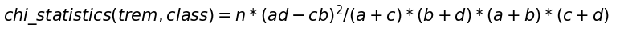

		1. 信息增益方法

			信息论中，信息增益的概念是：某个特征的值对分类结果的确定程度增加了多少。

			信息增益的计算方法： 把文档集合D看成一个符合某种概率分布的信息源，依靠文档集合的信息熵和文档中词语的条件熵之间信息量的增益关系确定该词语在文本分类中所能提供的信息量。词语W的信息量计算公式：

			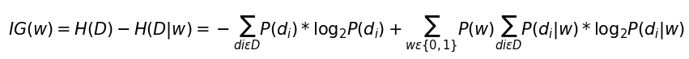

	1. 中心向量法

		中心向量法使用 TF/IDF 带权重的向量表示文档。通过把训练集文档中的向量加在一起对每一个类别计算一个原型向量。把测试文档和每一个类别的原型向量计算相似度，把该文档归为相似度最近的原型向量所代表的类。

	1. 朴素贝叶斯

		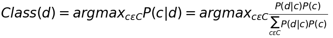

	1. 支持向量机

	1. 规则方法

		分类模型可以看做生成规则和对规则排序两个过程。

		生成规则的方法说明如下：先用特征选择的放法（例如：CHI）生成每个类别的特征词。然后根据

1. 概念搜索

	同义词的处理，简单的做法就是将同义词保存在一个 HashMap 中。如果同义词词表很大，可以把同义词保存在一个索引库当中。实现这个功能的步骤如下：

		1. 准备语义词库。
		1. 把语义词库转换为同义词库索引。
		1. 在 SynonymAnalyzer 中使用同义词索引库。

1. 情感识别

	1. 确定词语的褒贬倾向:

		1. 从网络以及现有的褒贬词典中收集出一定数量的褒贬词汇作为种子词库。
		1. 对该词库进行词频统计，分别计算每个单字在褒贬词库中的频率，根据公式算出每个单字的褒贬性。
			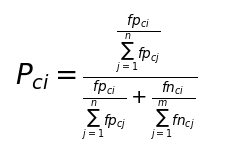
			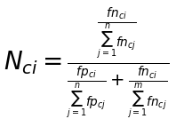

			其中，fpci 代表 ci 在褒义词词库中的词频， fnci 代表 ci 在贬义词库中的词频，Pci 和 Nci 分别表示该字作为褒义词和贬义词时的权重。n 和 m 分别代表词库中不同字符的个数。

			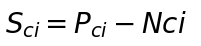
			
			上式代表字 Ci的褒贬倾向。
		
		1. 最终根据公式计算出每个词汇的褒贬性

			对于又p个字符 C1,C2,...,Cp 构成的词语 w, 其褒贬倾向 Sw 定义如下：
			
			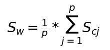

	1. 实现情感识别

		识别句子的极性与星级评分的流程:

		1. 关键词匹配
		1. 模板提取
		1. 模板匹配
		1. 计算极性与星级评分

## Solr

Solr 把对 Lucene 索引的调用和管理做了一个 REST 风格的封装。它是一个 Web 方式的索引服务器。可以把它看成类似 MySQL 的数据库系统，在配置文件 schema.xml 中定义表结构。

Solr 中的 multi core 功能指在同一个 Web 应用中管理多个索引。在并发量很少的情况，multi core 在性能上优势比较明显，当并发量增加后， multi core 响应速度比标准配置慢。

// TODO 可能项目中的 multi core 模式需要优化性能考虑

1. 主要配置文件：

	1. solrconfig.xml：用来配置 solr 运行的系统参数，例如，缓存，插件等。

		<maxWarmingSearcher></maxWarmingSearcher> 定义自动加载的线程数

	1. schema.xml(v6.0之后 managed-schema)：主要定义索引结构相关信息，例如，types、fields 和其他的一些默认设置。

		<field> 定义列
		<filedType> 定义列类型
		<uniqueKey> 指定索引库的唯一标识列，类似于主键。
		<defaultSearchField> 指定默认搜索列

1. 基本命令
	```bash
	# 创建 core
	bin/solr create -c solr_hello
	# 删除 core
	bin/solr delete -c solr_hello2
	# 上传文件到索引
	bin/post -c solr_hello ~/Downloads/Software.json
	```

1. 通过 xml 文件增删改数据

	1. 写入添加数据到索引的XML文件包含三个重要的标签，<add> </add>, <doc></doc>, 以及 <field></field>。
		
		add − 这是用于将文档添加到索引的根标记。它包含一个或多个要添加的文档。
		doc − 添加的文档应该包含在<doc> </ doc>标记中。文档包含字段形式的数据。
		field − 字段标记包含文档的字段的名称和值。

	1. 写入更新数据的XML文件就类似之前用来添加文档的XML文件。 但唯一的区别是这里使用字段的一个update属性。

	1. 要从Apache Solr的索引中删除文档，我们需要在<delete> </ delete>标记之间指定要删除的文档的ID。
		
		有时，需要基于除ID以外的字段来删除文档。例如，可能需要删除城市是Chennai的文档。在这种情况下，需要在<query> </ query>标记对中指定字段的名称和值。

1. 通过SolrJ 操作数据
	我们通过客户端程序把数据转换为符合 Solr 格式的 xml 数据流，然后通过 HTTP 发送出去。	
	
	1. 写入数据

		```java
        String urlString = "http://localhost:8983/solr/solr_hello";
        SolrClient Solr = new HttpSolrClient.Builder(urlString).build();   
        SolrInputDocument doc = new SolrInputDocument(); 
        doc.addField("id", "003"); 
        doc.addField("name", "Rajaman"); 
        doc.addField("age","34"); 
        doc.addField("addr","vishakapatnam"); 
        Solr.add(doc);
        Solr.commit();
		```

	1. 更新数据

		```java
		public void Update(SolrInputDocument doc,String value,String changeNum){
        	Map<String,Object> map=new HashMap<String, Object>();  
        	map.put("set",changeNum);
        	doc.addField(value, map);
        }

		String urlString = "http://localhost:8983/solr/solr_hello";
        SolrClient Solr = new HttpSolrClient.Builder(urlString).build();   
        SolrInputDocument doc = new SolrInputDocument(); 
        doc.addField("id", "003"); 
	    Update(doc, "name", "wbq813");
	    Update(doc, "age","23");
	    Update(doc, "addr","china guangzhou");
        Solr.add(doc);
        Solr.commit();
		```
	1. 删除数据

		```java
	    //Preparing the Solr client 
	    SolrClient Solr = new HttpSolrClient.Builder(urlString).build();   
	    
	    Solr.deleteById("003");
	    Solr.deleteByQuery("city:Chennai");
	    Solr.commit();
		```

1. 在Apache Solr中的构面或分组(faceting)指的是将搜索结果分类到各种类别中，Apache Solr中可用的faceting类型:

		查询faceting - 返回当前搜索结果中与给定查询匹配的文档数。
		日期faceting - 它返回在特定日期范围内的文档数。


1. 搜索优化

	1. 在做索引时给不同的列设置不同的权重。
	1. 也可以在搜索时动态加权。
	1. 使用 dismax 请求处理器，在参数 qf 中对指定的列加权。
	1. 使用函数式查询实现日期和相关度混合排序。
	1. 修改 SolrQueryParser 实现先按照短语匹配，后按照分词进行垂直搜索。

1. 拓展与定制

	1. 字词混合索引
	1. 相关检索： MoreLikeThis

1. 分布式搜索

	一个新的叫做 MultiSearchRequestHandler 的 Request Handler 执行对多个子搜索的分布式搜索。

	如果 shards 出现在请求参数中，分布式搜索就开始起作用了，否则搜索的是本地索引库。

1. SolrJ 查询分析器

	为了支持像 AND、OR、NOT 这样的查询语法，Lucene 使用 JavaCC 生成的 QueryParser 类实现用户查询串的解析。SolrJ 自身没有这样的实现。

	词法分析：根据用户输入返回单词符号序列，从左导游扫描用户输入查询串，从而识别出标识符、保留字、整数、浮点数、算符、界符。

	语法分析：根据单词符号序列返回需要的查询串，可以使用 BYACC/J 实现语法分析。

1. spring + solrj 实现搜索界面
	1. 添加配置文件  applicationContextSolr.xml
		```xml
		<?xml version="1.0" encoding="UTF-8"?>
		<beans xmlns="http://www.springframework.org/schema/beans"
		       xmlns:xsi="http://www.w3.org/2001/XMLSchema-instance"
		       xsi:schemaLocation="http://www.springframework.org/schema/beans
		        http://www.springframework.org/schema/beans/spring-beans.xsd">
		    <bean id="HttpSolrClient" class="org.apache.solr.client.solrj.impl.HttpSolrClient">
		        <constructor-arg name="builder" value="localhost:8983"/>
		    </bean>
		</beans>
		```

	1. 在 Service 可以利用 Spring 的 IOC 自动注入

		```java
		@Autowired
        private HttpSolrClient httpSolrClient;
		```

	1. solrj 自带高亮，返回结果中高亮了三元组，这是对用户不够友好的，这里暂时采用正则表达式。

		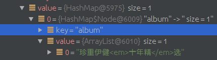

1. 从服务器转储数据到本地 solr

	1. 将 index 目录整个打包，复制出来
	1. 将 solr 整个复制过来。
	1. 由于 index 存储的位置进行了修改，查找配置并改为自己的位置。

		这是在 solr/bin/solr.in.sh里边修改
		
		```bash
		SOLR_INSTALL_DIR=/opt/solr
		SOLR_PID_DIR=${SOLR_INSTALL_DIR}/bin
		SOLR_HOME=${SOLR_INSTALL_DIR}/server/solr
		# LOG4J_PROPS=/home/solr/log4j.properties
		SOLR_LOGS_DIR=${SOLR_INSTALL_DIR}/server/logs
		SOLR_PORT=8983
		```