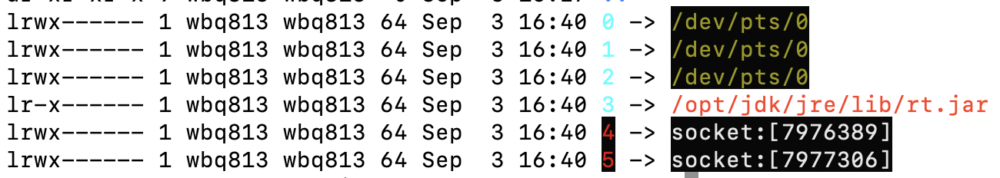
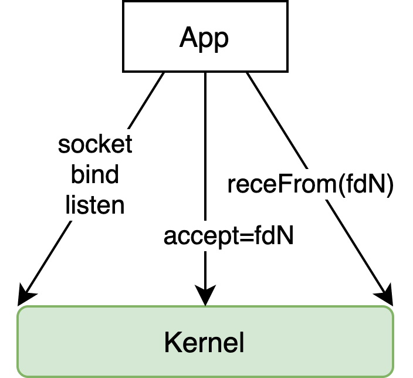
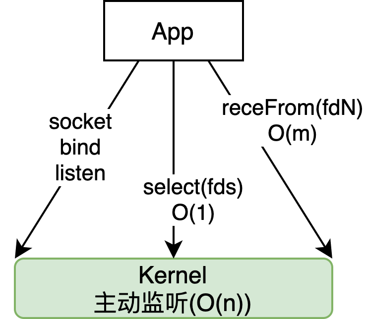
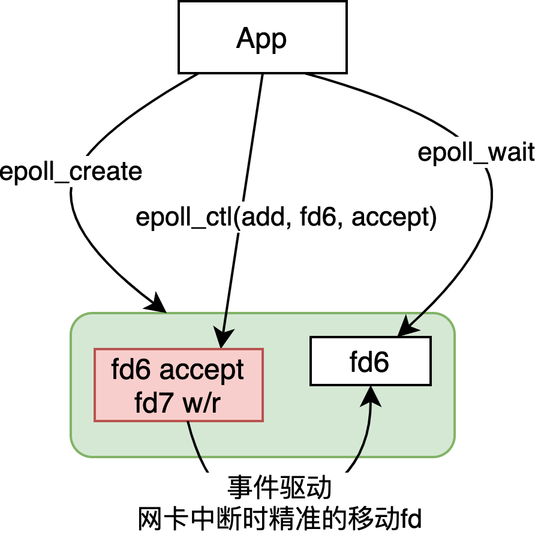

## 1. 背景

kernel进入内存成为第一个进程，然后GDT划分空间：内核空间(保护模式)、用户空间。CPU指令集也有划分range，内核指令range0，用户指令比如range3。

划分内核空间和用户空间后，程序不能直接访问内核管理的硬件，只能通过systemcall间接访问。程序调用IO需要通过systemCall调用内核，存在较高成本。

### 1.1中断

可改变处理器执行的指令顺序的事件。中断信号使处理器去运行正常控制流之外的代码，当中断信号到达时，CPU必须停止正在做的事情，保留上下文，并切换产生中断后的一个空间。

由中断处理程序执行的代码是一个内核执行路径，代表中断发生时正在运行的进程执行，中断处理程序比一个进程更轻量，因此，中断的切换开销小于进程切换。

+ **同步中断（异常）** 指令执行时由CPU控制单元产生

  由于程序的错误产生：内核通过发送信号来处理

  由内核必须处理的异常条件产生：执行恢复异常需要的步骤，比如缺页中断。

+ **异步中断**：硬件设备依照CPU时钟信号随机产生

  由间隔定时器和IO设备产生，

## 2. IO 模型

linux还未支持异步，目前这几种都是同步读写。

### 2.0 栗子

```java
public static void main(String[] args) throws IOException {
  ServerSocket server = new ServerSocket(8090);
  System.out.println("step1: new ServerSocket(8090)");
  while (true) {
    // 接收连接
    Socket client = server.accept();
    System.out.println("step2: client\t" + client.getPort());
    // 用新的线程处理socket IO
    new Thread(()->{
      try {
        InputStream in = client.getInputStream();
        BufferedReader reader = new BufferedReader(new InputStreamReader(in));
        while (true){
          System.out.println(reader.readLine());
        }
      } catch (IOException e) {
        e.printStackTrace();
      }
    }).start();
  }
}
```

利用`strace`命令抓取程序发生的系统调用:

```bash
# strace - trace system calls and signals
strace -ff -o syscall java TestSocket
# 函数里边还没有多线程但是这里多个文件，因为jvm有一些gc线程
# 通过grep可以找出main函数是哪个文件，进入之后可看到systemcall
grep 'step1' ./*
```

```bash
# jps获取PID
jps
# 进入/proc/PID，linux一切都是文件
# /proc/PID/task 下目录对应此进程下的线程
# /proc/PID/fd 下是文件描述符，包括stdIn,stdOut,stdErr以及其他
```



这里的4，5就是socket文件描述符，分别是ipv4，ipv6.

```bash
# 可以在端口监听中找到PID
netstat -natp
# 使用nc连接服务端口
wget localhost:8090
```

```
tcp6       0      0 :::8090                 :::*                    LISTEN      6483/java                    
tcp6       0      0 ::1:8090                ::1:55092               ESTABLISHED 6483/java  
```

发起连接后在状态中可以看到一个新的`ESTABLISHED`socket出现。在程序的输出中也接收到的连接。

```
step1: new ServerSocket(8090)
step2: client	55092
GET / HTTP/1.1
User-Agent: Wget/1.14 (linux-gnu)
Accept: */*
Host: localhost:8090
Connection: Keep-Alive
```

`syscall.6484`中出现新的系统调用`accept`此方法返回新的文件描述符6用于新连接的读写。

### 2.1 BIO

服务端必要的`sysCall`：

```
socket = fd5
bind 8090
listen fd5
accept fd5 = fd6 阻塞
```

`accept`及其之后的处理只能通过新线程处理，避免主线程阻塞。每个线程对应一个客户端连接。

**问题：**

创建线程消耗资源：线程栈是独立的，创建线程`clone`系统调用；线程切换消耗CPU资源。

根本原因是**阻塞**：

### 2.2 NIO

Non-blocking I/O，在Java领域，也称为New I/O（API lib 级别 ）。



`accept`和`recvfrom`都是非阻塞的。

**问题：**

C10K问题，大量FD中只有少量需要读写，但是一个循环里需要检查每一个，每一个的检查都是`SysCall`， O(n)。

### 2.3 SELECT

`select` 一次性将需要监听的`fd`发送给`kernel`复杂度` O(1)`，`select`返回需要读写的`fd`， 应用逐个处理`O(m)`。



**问题：**

1. 应用每次需要重新传所有的`fd`，可在内核开辟空间，应用每次只加入新的；
2. 内核需要主动监听`O(n)`复杂度，虽然比`SysCall`的`O(n)`高效。

### 2.4 EPOLL

+ ` epoll_create`返回文件描述符就是内核中的区域。

+ `epoll_ctl` 对内核区域进行增加和减少监听的`fd`。

  

## 3. 涉及应用

### 3.1 redis

只有一个线程：epoll+非阻塞=轮询

#### 3.1.1 IO threads

redis 6+ 使用多个线程处理读写，但是计算仍然使用单线程处理。提高了性能但任然保留串行计算特点。之前的版本一个线程串行处理每一个客户端的读取、计算、写出。

### 3.2 nginx

阻塞：epoll+阻塞

### 3.3 netty

### 3.4 kafka

速度快，数据持久化，`Java`里`RandomAccessFile`实现了零拷贝。


+ 写：使用**mmap**将java buffer与磁盘建立映射，避免`SysCall`直接顺序写入磁盘。

+ 读：零拷贝：`send_file` `SyszCall`支持从内核读取并从内核直接写出，无需经过用户空间的两次拷贝浪费。零拷贝的前提是数据不需要加工。

  

