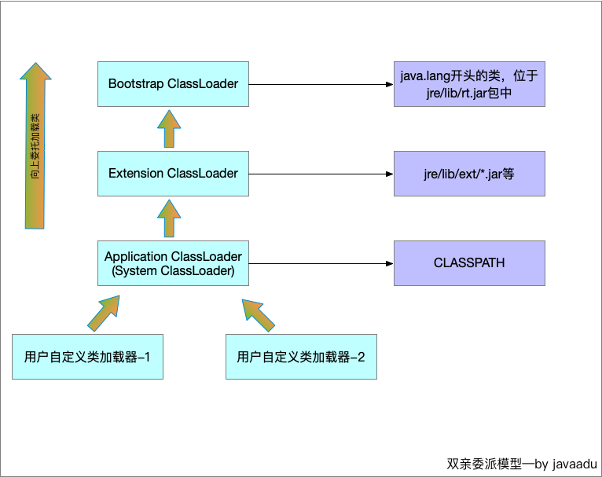
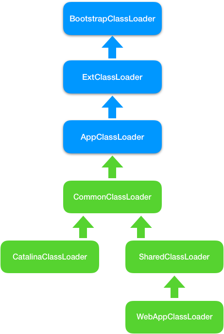

# 类加载机制

虚拟机把描述类的数据从Class文件加载到内存，并对数据进行校验、转换解析和初始化，最终形成可以被虚拟机直接使用的Java类型，这就是虚拟机的类加载机制。与在编译时进行链接的语言不同，以上过程Java中都是在程序运行期完成，这种策略增加性能开销的同时带来了高度的灵活性。Java天生可拓展的动态语言特性就依赖于动态加载和动态连接实现。

## 1. 加载时机


+ **类的生命周期**：

  + 加载、验证、准备、解析、初始化、使用、卸载；

  + 其中验证、准备、解析三个部分统称为连接。

  + 加载、验证、准备、初始化和卸载这5阶段**开始**顺序确定（执行和完成顺序不确定，可能在一个阶段过程中调用另一个阶段）

  + 解析阶段可能在初始化阶段之后开始，这是为了支持Java的**运行时绑定**。

  + 虚拟机规范没有强制约束加载的开始时间；

  + JVM规范严格规定了5种（对一个类进行**主动引用**）必须立即对类进行初始化（加载、验证、准备需要在此之前开始）：

    	1. 遇到`new`、`getstatic`、`putstatic`、`invokestatic`这4条指令时，如果类没有进行初始化需要先触发初始化。场景是：使用new关键字实例化对象、读取或设置一个类的静态字段（除final修饰的静态字段，它已经在编译期把结果放入常量池）、以及调用一个类的静态方法。
     2. 使用`java.lang.reflect`包的方法对类进行反射调用时，如果类没有进行过初始化，需要先触发其初始化。
     3. 初始化一个类时，如果发现其父类还未进行过初始化，需要先触发父类的初始化。
     4. 虚拟机启动时，用户指定的主类，虚拟机会先初始化这个类。
     5. 使用JDK动态语言支持时，如果一个`java.lang.invoke.MethodHandle`实例最后的解析结果是`REF_getStatic`、`REF_putStatic`、`REF_invokeStatic`的方法句柄，且这个方法句柄对应的类没有进行过初始化，则需要先触发。

    ```Java
    package jvm.ClassInit;
    
    public class SuperClass{
        static{
            System.out.println("父类初始化");
        }
        public static int value = 123;
    }
    public class SubClass extends SuperClass{
        static{
           System.out.println("子类初始化"); 
        }
    }
    public class ConstClass {
        static {
            System.out.println("常量类初始化");
        }
        public static final String HELLOWORLD = "Hello World";
    }
    ```

    ```Java
    public class Test{
        public static void main(String[] args){
            // T1
            System.out.println(SubClass.value);
            // T2
            SuperClass[] sca = new SuperClass[10];
            // T3
            System.out.println(ConstClass.HELLOWORLD);
        }
    }
    ```

    1. T1:通过子类引用父类静态字段只会触发父类初始化，可能会触发子类的加载和验证（取决于虚拟机实现）。
    2. T2: 没有触发`jvm.ClassInit.SuperClass`的初始化,触发了一个[`Ljvm.ClassInit.SuperClass`的初始化（虚拟机自动生成，由`newarray`触发，代表了`jvm.ClassInit.SuperClass`的一维数组）;
    3. T3: final修饰的字段在编译阶段常量传播优化被存储到了`Test`的常量池中，在编译成Class文件时，`Test`和`ConstClass`就没有关系了。
    4. 接口中不能使用`static{}`块来输出初始化信息，但编译期仍会为接口生成`<clint>()`类构造器，用于初始化接口中定义的成员变量。接口与类的真正区别是前面5种规范中的第3点，类在初始化时要求父类已经初始化过，接口初始化时并不要求父接口都完成初始化，**只有在真正用到父接口时才会初始化**（如引用父接口定义的变量）。

## 3. 类加载器

类加载阶段中“通过一个类的全限定名来获取描述此类的二进制字节流”这个动作放到JVM外部去实现，以便应用程序自己决定如何去获取所需要的类，实现这个动作的代码模块称为类加载器。

对于任意一个类，都需要由加载它的类加载器和这个类本身一同确定其在Java虚拟机中的唯一性，每一个类加载器都拥有一个独立的类名称空间。同一个Class文件由**不同类加载器**加载得到的两个类是**不相等**的，`equal()`， `isAssignableForm()`，`isInstance()` ，`instanceof`都会得到false。

### 3.1. 双亲委派模型

类加载器包括以下：

+ 类启动加载器(Bootstrap ClassLoader)

  C++ 实现，虚拟机自身的一部分，负责加载存放在`<JAVA_HOME>\lib`目录中，或被`-Xbootclasspath`参数执行的路径中，而且是虚拟机识别的类库（名字不符合的不会加载）,无法被Java程序直接引用，在编写自定义类加载器时，如需把请求委派给引导类加载器，那么直接使用null代替。

+ 拓展类加载器（Extension ClassLoader）

  Java实现，由`sun.misc.Launcher$ExtClassLoader`负责实现， 负责加载`<JAVA_HOME>\lib\ext`中，或者被`java.ext.dirs`系统变量所指定的路径中的所有类，开发者可直接使用。

+ 应用程序类加载器（Application ClassLoader）

  Java实现，由`sun.misc.Launcher$AppClassLoader`负责实现。由于是ClassLoader中的`getSystemClassLoader()`方法的返回值，也称为系统类加载器，负责加载用户类路径（ClassPath）上所指定的类库，开发者可直接使用这个加载器，如果应用程序没有自定义过自己的类加载器，默认使用这个加载器。



​	双亲委派模型要求除了顶层启动类加载器外，其余的类加载器都应当有自己的父类加载器（组合实现父子关系，而非继承）。

```Java
protected Class<?> loadClass(String name, boolean resolve) {
    synchronized (getClassLoadingLock(name)) {
    // 首先，检查该类是否已经被加载，如果从JVM缓存中找到该类，则直接返回
    Class<?> c = findLoadedClass(name);
    if (c == null) {
        try {
            if (parent != null) {// 如果有父加载器，则使用父加载器加载
                c = parent.loadClass(name, false);
            } else { // 没有父加载器，使用BootstrapClassLoader加载
                c = findBootstrapClassOrNull(name);
            }
        } catch (ClassNotFoundException e) {}
        if (c == null) {
            // 如果还未加载，尝试通过findClass方法去寻找
            // 自定义类加载器时，重写此方法。
           c = findClass(name);
        }
    }
    if (resolve) {
        resolveClass(c);
    }
    return c;
    }
}
```


**工作过程：**如果一个类加载器接受到了类加载的请求，首先不会自己去尝试加载这个类，而是把这个请求委派给父类加载器去完成，只有当父加载器反馈自己无法完成这个加载请求时，子加载器才会尝试自己去加载。

**优点**：Java类随它的类加载器一起具备了带有优先级的层次关系。例如类`java.lang.Object`存放在`rt.jar` 中，无论哪一个类加载器加载，最终都委派给启动类加载器，因此Object在程序的各种类加载器中都是同一个类。

**自定义：**通过继承`java.lang.classloader`实现自定义类加载器



### 3.2. ContextClassLoader

双亲委派模型并不能解决所有的类加载问题，比如，Java提供了许多服务提供者接口（`Service Provider Interface`, `SPI`）允许第三方为这些接口提供实现。

+ **SPI**

  常见的`SPI`有`JDBC`、`JNDI`、`JAXP`等，这些`SPI`的接口由核心类库提供，却由第三方实现.

  **带来的问题**：`SPI`接口是Java核心库的一部分，由`BootstrapClassLoader`加载；实现类一般是由`AppClassLoader`加载，`BootstrapClassLoader`无法找到`SPI`的实现类，因为它只能加载Java的核心库，它也不能代理给`AppClassLoader`，因为它是最顶层的类加载器，也就是说双亲委派模型并不能解决这个问题。

+ **`ContextClassLoader`**

  线程上线文加载器`ContextClassLoader`正好解决了这个问题，它并不是一种新的类加载器，仅仅是Thread类的一个变量而已，可以通过`Thread.currentThread().setContextClassLoader(ClassLoader cl)`和`Thread.currentThread().getContextClassLoader()`来设置和获取该对象。如果不做任何的设置，Java应用的线程的上下文类加载器默认就是`AppClassLoader`。在核心类库使用`SPI`接口时，传递的类加载器使用线程上下文类加载器，就可以成功的加载到`SPI`实现的类。线程上下文类加载器在很多`SPI`的实现中都会用到。

`DriverManager`静态模块将驱动注册，真正获取connect是调用Driver的实现类`NonRegisteringDriver`中的`connect`完成连接。

#### 3.2.1 jdbc原理

`Jdbc4.0`之前，采用`Class.forName("com.mysql.jdbc.Driver")`加载驱动，然后使用；之后就不需要这样做，现在只需要获取连接即可。class.forName 与类加载机制有关，会触发执行 com.mysql.jdbc.Driver 类中的静态方法，从而使主类加载数据库驱动.

mysql的jar包中，`META-INF\services\java.sql.Driver`中有`com.mysql.cj.jdbc.Driver`

``` 
String url = "jdbc:xxxx://xxxx:xxxx/xxxx";
Connection conn = DriverManager.getConnection(url,username,password);
```

`DriverManager`在`static`代码块执行了以下过程：

```java
String drivers;// 1. 从系统变量获取驱动定义
drivers = AccessController.doPrivileged(new PrivilegedAction<String>() {
  public String run() {
    return System.getProperty("jdbc.drivers");
  }
});
AccessController.doPrivileged(new PrivilegedAction<Void>() {
  public Void run() {//2. 使用SPI获取接口的实现
    ServiceLoader<Driver> loadedDrivers = ServiceLoader.load(Driver.class);
    //3. 遍历使用SPI获取到的具体实现，实例化各个实现类
    Iterator<Driver> driversIterator = loadedDrivers.iterator();
    while(driversIterator.hasNext()) {
      driversIterator.next();
    }
  }
});
// 4. 根据驱动列表实例化实现类
String[] driversList = drivers.split(":");
for (String aDriver : driversList) {
  Class.forName(aDriver, true, ClassLoader.getSystemClassLoader());
}
```

+ 第2步，只是封装了`contextClassLoader`和`service`

  ```java
  public static <S> ServiceLoader<S> load(Class<S> service) {
    ClassLoader cl = Thread.currentThread().getContextClassLoader();
    return ServiceLoader.load(service, cl);
  }
  ```

+ 在遍历的时候，首先调用`driversIterator.hasNext()`方法，这里会搜索classpath下以及jar包中所有的`META-INF/services`目录下的`java.sql.Driver`文件，并找到文件中的实现类的名字，此时并没有实例化具体的实现类

+ 然后是调用`driversIterator.next();`方法，此时就会根据驱动名字具体实例化各个实现类了。现在驱动就被找到并实例化了。

  这里也有调用`Class.forName`。第1、4两步是获取并加载系统配置的，2、3就是SPI机制。

### 3.3. 类加载器加载资源

  类加载器除了加载class外，还可以加载资源，它可以从jar包中读取任何资源文件，比如，`ClassLoader.getResources(String name)`方法就是用于读取jar包中的资源文件，其代码如下：

```java
public Enumeration<URL> getResources(String name) throws IOException {
    @SuppressWarnings("unchecked")
    Enumeration<URL>[] tmp = (Enumeration<URL>[]) new Enumeration<?>[2];
    if (parent != null) {
        tmp[0] = parent.getResources(name);
    } else {
        tmp[0] = getBootstrapResources(name);
    }
    tmp[1] = findResources(name);
    return new CompoundEnumeration<>(tmp);
}
```

逻辑和类加载的逻辑一样，符合双亲委派的模型，不同的类加载器负责扫描不同路径下的jar包，就如同加载class一样，最后会扫描所有的jar包，找到符合条件的资源文件。

类加载器的`findResources(name)`方法会遍历其负责加载的所有jar包，找到jar包中名称为name的资源文件，这里的资源可以是任何文件，甚至是`.class`文件，比如下面的示例，用于查找`Array.class`文件。

