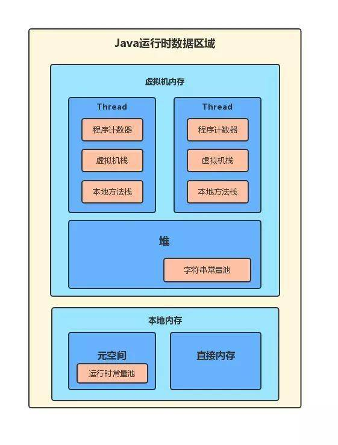
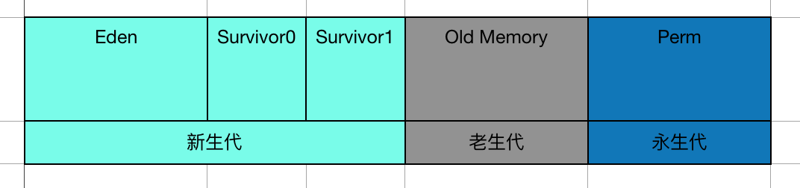
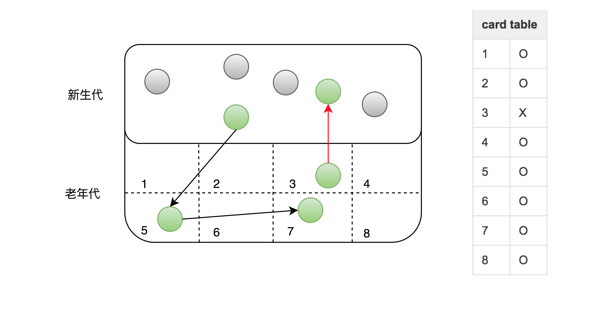
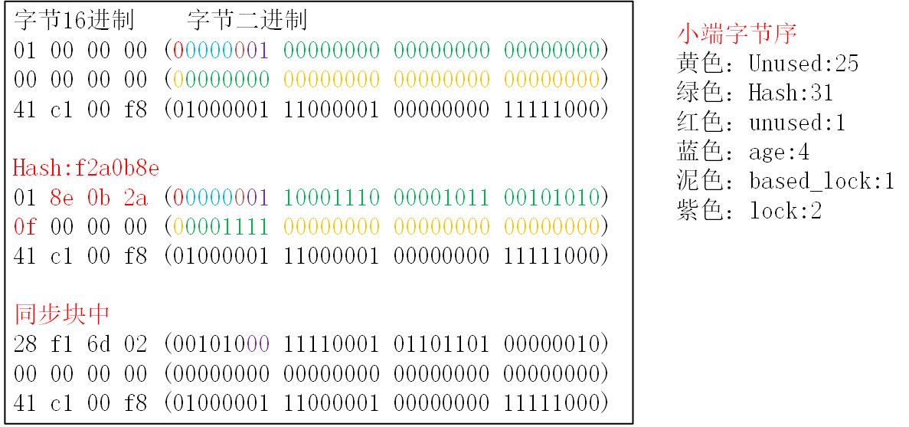

## 1. JVM运行时数据区和GC

### 1.1 内存分区



+ 程序计数器

  当前所执行的字节码的行号指示器。每个线程有一个私有的程序计数器，线程切换回来时从程序计数器位置继续执行。执行`Native`方法时计数器为`undefined`.
  
+ 主要变化：

  + JDK 1.6，字符串常量池位于永久代的运行时常量池中；
  + JDK 1.7，字符串常量池从永久代剥离，放入了堆中；
  + JDK 1.8，元空间取代了永久代，并且放入了本地内存（Native memory）中

+ 元空间（方法区）

  方法区用于存放已被加载的类信息、常量、静态变量、及编译器编译后的代码等。

  注意：方法区是JVM的规范，在JDK1.8之前方法区的实现是永久代，从1.8开始JVM移除了永久代，使用本地内存来存储元数据，并称为元空间。

+ 运行时常量池

  Class文件中的常量池会在类加载后被放入到这个区域

+ [字符串常量池](Java_basic.md)

+ 直接内存

  NIO相关。


### 1.2 垃圾回收算法

​	主要是对堆进行GC，metaSpace 的GC暂不讨论。

#### 1.2.1 对象存活判断

+ 引用计数法

  在堆中存储的对象，它会维护一个`counter`计数器，如果有一个引用指向它时，则`counter`计数器加一，如果一个引用关系失效，则`counter`计数器减一。当该对象的`counter`值变为0时，则说明该对象没有任何引用，处于可以回收的状态，可以被GC。

  未解决相互引用问题。

+ 可达性分析

  通过一系列的`GC` `Root`对象作为起点，从这些对象搜索引用的对象，形成多条引用链。如果一个对象到GC Root是不可达的，则说明这个对象不可用，则可以被回收了。可能的GC Root有:

  1. 虚拟机栈中引用的对象
  2. 方法区中类静态属性引用的对象
  3. 方法区中常量引用的对象
  4. 本地方法栈中JNI（Native方法）引用的对象。

  + finalize()

    即使在可达性分析算法中不可达的对象，也并非一定会被回收。对象真正被回收需要至少经历**两次被标记**的过程。

    可达性是一次标记，之后进行筛选，当对象没有复写finalize()方法，或者finalize()方法已经被调用过了，则对象会被回收。

    如果对象被判定为有必要执行finalize()方法，则该对象会被放置到一个名为F-Queue的队列中，然后虚拟机会建立一个低优先级的线程Finalizer去执行对象的finalize()方法。finalize()方法是对象逃脱被回收命运的最后的机会，因为Java虚拟机会在稍后对F-Queue队列中的对象进行**第二次标记**。

#### 1.2.2 垃圾回收算法

+ 标记-清除算法

  首先发生GC操作时，将可以被回收的对象进行标记处理。第二步是回收第一步中被清除的对象所占的空间。缺点是内存碎片化。

+ 复制算法

  将内存分为大小相等的两块，每次只使用其中的一块，当一块内存满了之后，将这块内存中还存活的对象复制到另外一块内存

+ 标记-整理算法

  首先将需要清除的对象进行标记，第二阶段略微不一样的是，在标记后并不是清除垃圾对象，而是将存活对象向内存的一端进行移动，移动完毕后，清除剩下的内存空间


+ 分代收集

  分代回收基于“对象声明周期不同，采用不同策略回收能够提高效率”这一事实。

  

  1. 新生代

     大量对象生命周期很短，每个周期存活的对象不多，采用复制算法花费性能较小的前提下实现较大面积的回收。

     分为一块较大的Eden和两块较小的Survivor空间，每次使用Eden和一块Survivor空间。回收时，将使用空间中存活的对象复制到未使用的Survivor空间中，然后将使用的空间清除；如果未使用的Survivor空间放不下，会放置这些对象到老生代。

  2. 老生代
  
     在新生代中经历了N次GC还存活的对象会放到老生代中。老生代采取标记整理算法。回收新生代和老生带的GC称为FULL GC，除了CMS之外，其他对老生代进行GC的都是FULL GC。
  
  3. 永久代(1.8中是元空间)
  
     存放元数据，如class信息，运行时常量池。

### 1.3 垃圾收集器

不同的垃圾回收器，适用于不同的场景。常用的垃圾回收器：

- 串行（Serial）回收器是单线程的一个回收器，简单、易实现、效率高。
- 并行（ParNew）回收器是Serial的多线程版，可以充分的利用CPU资源，减少回收的时间。
- 吞吐量优先（Parallel Scavenge）回收器，侧重于吞吐量的控制。
- 并发标记清除（CMS，Concurrent Mark Sweep）回收器是一种以获取最短回收停顿时间为目标的回收器，该回收器是基于“标记-清除”算法实现的。

### 1.4 GC策略和触发条件

主要的GC策略是MinorGC和Full GC，此外还有：

+ Old GC: 只收集old gen 的GC，只有CMS收集器的concurrent collection中有这个模式；
+ Mixed GC:收集整个young gen以及部分old gen 的GC，只有垃圾收集器G1有这个模式。

#### 1.4.1 Minor GC(Young GC)

+ 触发条件：

  > 当Eden空间耗尽，这时JVM出触发一次Minor GC来收集新生代的垃圾，存活的对象会送到Survivor区。

+ 过程

  > From和to指向两个Survivor分区，to指向空的那个。发生Minor GC时，Eden和form中存活对象（标记-复制算法）复制到to区，然后交换from和to指针。

+ Survivor区对象晋升老年代条件

  > JVM 会记录Survivor区中对象一共被来回复制了几次，如果被复制次数为15(-XX:+MacTenuringThreshold)，那么该对象被晋升到老年代。

  15是因为对象头中标记字段记录年龄，只分配了4bit，最多能记录15.

  > 另外如果单个Survivor区已经被占用了50%(-XX:+TargetSurvivorRatio)那么较高复制次数的对象也会被晋升到老年代。

  **过早提升(Premature Promotion)**：在Minor GC 过程中，to不足以容纳Eden+from中的存活对象，多余的对象被移到老年代。

  过早提升可能引发严重性能问题，如果导致老年代满了，就会进行Full GC，遍历整个堆，这就是**提升失败(Promotion Failure)**。

+ **卡表分析**

  Minor GC 存在一个问题：**老年代对象可能引用新生代对象**。在标记存活对象时，就需要扫描老年代的对象，如果该对象拥有对新生代的引用，那么这个引用也会作为GC Root。这就相当于做了**全堆扫描**。

  HotSpot 使用卡表技术，以空间换时间：

  

  将老年代的空间分成大小为 512B的若干张卡，并且维护一个字节数组，数组中的每个元素对应着一张卡，这个标识位代表对应的卡是否可能存有指向新生代对象的引用，如果可能存在，那么我们认为这张卡是脏卡。

  在进行Minor GC的时候，我们便可以不用扫描整个老年代，而是在卡表中寻找脏卡，并将脏卡中的老年代指向新生代的引用加入到 Minor GC的GC Roots里，当完成所有脏卡的扫描之后，Java 虚拟机便会将所有脏卡的标识位清零。

#### 1.4.2 Full GC(Major GC)

收集整个堆，包括新生代、老年代、永久代（1.8后永久代移除，换为metaspace）等收集所有部分的模式。

+ HotSpot VM 的serial GC的触发条件

  > 当准备要触发一次young GC时，如果统计数据显示之前young GC的平均晋升大小比目前的old gen剩余空间大（担保失败），则直接接触发full GC。因为HotSpot VM的GC里除了CMS的concurrent collection之外，其他能收集old gen的gc都会同时收集整个GC堆，所以不需要单独的young GC。

  > 如果有永久代，要在永久代分配空间，但是已经没有足够空间时，触发full GC

  > System.gc()，heap dump带GC,其默认都是触发 full GC.

  HotSpot VM 里其他非并发GC触发条件复杂一些，但大致原理类似。

  在`Parallel Scavenge`收集器下，默认是在要触发full GC前先执行一次young GC，并且两次GC之间能让应用程序稍微运行一下，以降低full GC的暂停时间。（young GC 会尽量清理young gen的死对象，减少full GC的工作量。）控制这个行为的VM参数是：`-XX:+ScavengeBeforeFullGC`。

  并发GC的触发条件就不一样，**以 CMS GC为例，它主要是定时去检查old gen的使用量，超过了触发比例就会启动一次 CMS GC，对old gen做并发收集**。

## 2. 对象创建过程

### 2.1 对象内存区域

内存地址从左往右，对于大端，高位字节存在左侧低地址；对于小端，低位字节存在左侧低地址。这里的lock是低字节。

+ **对象头**:

  

  + Mark Word

    下图是大端字节序下的对象头`markword`布局。

    

  + Klass Pointer

    64bit默认开启指针压缩，KlassPointer测试为32bit。

+ **实验**

  win10+amd64bit_cpu+openjdk8, 通过`jol`工具查看对象布局。

  ```
  ClassLayout.parseInstance(obj).toPrintable();
  ```

  对象头12byte，int占用4byte，boolean占用1字节，整个对象内存对齐为8byte的倍数。

  无锁状态，hashcode占32bit（第2-5byte），调用`hashcode()`方法前该位置为空。

  无锁是第一个字节的最低2bit为`01`，`synchronized`块内为`00`

  源码中，**markword在64bit下占64bit，klasspointer占32bit（指针压缩）与实验符合**
  
+ **数组对象**

  数组对象增加4字节记录数量。

  + **基本类型数组**

    基本类型数组对象的数据区直接存储数值，比如:

    ```java
    double [] arr1 = new double[4];
    // markWords 8byte+klassPointer 4byte+元素数量4byte+32byte的4个double空间
    ```

  + **对象数组**

    对象数组只存储对象的引用，也就是每个元素只有`4byte`

    ```java
    WBQ[] wbqs = new WBQ[4];
    // markWords 8byte+klassPointer 4byte+元素数量4byte+16byte的4个引用
    ```

### 2.2 引用

#### 2.2.1 StrongReference

程序代码中普遍存在的引用。只要对象有强引用关联，`jvm`就不会回收对象。显示的将引用设置为`null`，`jvm`在合适的时候回收该对象。

#### 2.2.2 SoftReference

描述有用但不必须的对象，`java.lang.ref.SoftReference`关联的对象，只有在内存不足时，`JVM`才会回收该对象。可用于网页缓存、图片缓存等。

#### 2.2.3 WeakReference

用来描述非必需对象的，当`JVM`进行垃圾回收时，无论内存是否充足，都会回收被弱引用关联的对象。在`java`中，用`java.lang.ref.WeakReference`类来表示

#### 2.2.4 PhantomReference

虚引用和前面的软引用、弱引用不同，它并不影响对象的生命周期。在`java`中用`java.lang.ref.PhantomReference`类表示。如果一个对象与虚引用关联，则跟没有引用与之关联一样，在任何时候都可能被垃圾回收器回收。

```java
// 以上三种引用都可使用referenceQueue，PhantomReference中是必须的
ReferenceQueue<String> queue = new ReferenceQueue<String>();
PhantomReference<String> pr = new PhantomReference<String>(new String("hello"), queue);
System.out.println(pr.get());
```


## 3. JVM调优和问题排查

[参考](https://www.cnblogs.com/operationhome/p/10537018.html)

### 3.1 JVM工具

+ jps

  查看当前机器上运行的JVM

+ jstack

  查看线程调用栈，用于分析线程问题，如死锁等。

+ jmap

  获得运行中的JVM的堆的快照，用于检查内存泄漏，影响性能的大对象等。

  ```
  # 打印heap概要信息
  jmap -heap ${PID}
  #查看堆内存中对象数目，大小统计直方图，live表示只统计活对象
  jmap -histo:live ${PID} | less
  # 生成内存dump文件
  jmap -dump:format=b,file=${fileName}.dump  ${PID}
  ```

  dump文件可以使用jhat查看，命令如下：

  ```
  jhat -port 9998 ${fileName}.dump
  ```

+ jstat

  用于查看gc回收情况：类的加载及卸载情况、查看新生代、老生代及持久代的GC情况。

  ```
  # jstat -<option> <vmid> <intervval> <count>
  # 类加载统计
  jstat -class ${PID}
  # 垃圾回收统计
  jstat -gc ${PID} 1000 10
  # 堆回收统计
  jstat -gccapacity ${PID}
  # 总结垃圾回收统计
  jstat -gcutil ${PID} 1000 10
  ```

  

### 3.2 CPU异常

```
# 查看已运行中的jvm
jps -lvm
# 查看进程中的线程状态，找到CPU占用多的线程
top -Hp ${PID}
# 线程ID转16进制
printf "%X" ${TID}
# 获取进程的线程信息
jstack -l ${PID}
# 然后从中找出TID的状态
```

着重关注线程状态：

+ 死锁：Deadlock（重点关注）
+ 执行中：Runnable
+ 等待资源：Waiting on condition（重点关注）
+ 等待获取监视器：Waiting on monitor entry（重点关注）
+ 暂停：Suspended
+ 对象等待中：Object.wait() 或 TIMED_WAITING
+ 阻塞：Blocked（重点关注）
+ 停止：Parked

### 3.3 内存异常

1. 检查内存回收

   ```
   # 查看当前的进程的 java 堆的分布情况
   jmap -heap ${PID}
   #jstat 查询GC 次数和Full Gc 次数
   jstat -gcutil  ${PID}  2000  10
   # 查看jvm默认参数
   java -XX:+PrintFlagsInitial
   ```

   适当的young gc 可以让清理一些不存活的对象，但是短时间大量的 young GC 是会导致 Full GC 的，那么Full gc 是尽量不要产生的，当一个应用，产生大量的full GC是不正常的, 过多的GC和Full GC是会占用很多的系统资源（主要是CPU），影响系统的吞吐量。

   导致young Gc 和 full GC 的原因有哪些：

   1. young 可用区 设置的太小 ，young gc 设置的太小就会导致 ，多次young gc，多次young gc 也就导致 oldGeneration 不断增大，最终导致full gc
   2. Old Generation 设置的太小， 当 Old Generation 太小的话就会导致 经常占满，然后会进行full GC 。
   3. **System.gc()被显示调用** , 垃圾回收不要手动触发，尽量依靠JVM自身的机制。
   4. Meta(元数据)区可用内存设置的太少。

   TODO 查看GC日志，优化参数配置。

   

2. 代码层面

   分析每个程序的内存分布情况，每个类的实例数，占用内存最大的类及它们的活动时长，是否有内存泄漏。

   内存泄漏：对象已死，却无法通过垃圾收集器进行自动回收，无法释放内存。

   内存溢出：程序申请内存时，没有足够多的内存空间供其使用。

   + 生成堆快照到文件。

       ```
       jmap  -dump:live,format=b,file=${file}   ${PID}
       ```

   + 利用eclipse+MAT或者idea+Jprofile分析