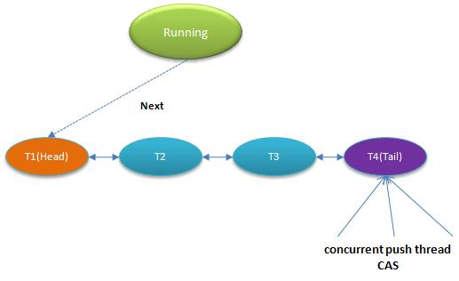

# Java 并发

## 0. 面试考点

1. [Java锁有哪些种类，及其区别](# 1.2.2. 锁)

1. [可重入锁与非可重入锁]:#可重入锁VS非可重入锁

1. [乐观锁与悲观锁]:#乐观锁VS悲观锁

4. [公平锁与非公平锁]:#公平锁VS非公平锁

5. [自旋锁 VS 适应性自旋锁]:#自旋锁VS适应性自旋锁

7. [volatile，如何保证内存可见性]:#Volatile

8. [Happen-Before]:#Happen-Before原则

9. [synchronized](Java_synchronized.md)

10. [CAS是什么，怎么实现的、CAS机制有什么问题](#2.6.2 CAS)

11. [AtomicInteger底层原理](#2.6.1 AtomicInteger)

12. [AQS](#2.0 AbstractQueuedSynchronizer)

13. [Lock的实现](#2.1.1. ReentrantLock)


12. [synchronized 和 Lock区别，使用场景]:#与Syschronized的区别

13. [死锁的危害和排查]:#死锁

15. ThreadLocal

16. Java最多能开多少线程

17. [线程池的原理与拒接策略](Java_thread.md)

    

## 1. 理论知识
  

### 1.1. 问题根源

+ **可见性**

  缓存导致可见性问题：所有线程共享主内存，每个线程有自己的工作内存。
  

+ **原子性**
  
  线程切换带来原子性问题。
  高级语言里一条语句包含多条CPU指令，操作系统做任务切换(线程切换)可以发生在任何一条CPU指令执行完。
  一个或多个操作在CPU执行的过程中不被中断的特性称为原子性。CPU能保证的原子操作是CPU指令级别，我们需要在高级语言从层面保证操作的原子性。

+ **有序性**
  
  编译优化带来有序性问题。

  ```Java
  public class Singleton {
    static Singleton instance;
    static Singleton getInstance(){
      if (instance == null) {
        synchronized(Singleton.class) {
          if (instance == null)
            instance = new Singleton();
          }
      }
      return instance;
    }
  }
  ```
  问题出在 new 操作上，我们以为的 new 操作应该是：分配一块内存 M；在内存 M 上初始化 Singleton 对象；然后 M 的地址赋值给 instance 变量。但是实际上优化后的执行路径却是这样的：分配一块内存 M；将 M 的地址赋值给 instance 变量；最后在内存 M 上初始化 Singleton 对象。

  优化后会导致什么问题呢？我们假设线程 A 先执行 getInstance() 方法，当执行完指令 2 时恰好发生了线程切换，切换到了线程 B 上；如果此时线程 B 也执行 getInstance() 方法，那么线程 B 在执行第一个判断时会发现 instance != null ，所以直接返回 instance，而此时的 instance 是没有初始化过的，如果我们这个时候访问 instance 的成员变量就可能触发空指针异常

### 1.2. 解决思路

  导致可见性的原因是缓存，导致有序性的原因是编译优化，那解决可见性、有序性最直接的办法就是禁用缓存和编译优化。
  合理的方案是按需禁用缓存以及编译优化。
  Java 内存模型是个很复杂的规范，可以从不同的视角来解读，站在程序员的视角，可以理解为，Java 内存模型规范了 JVM 如何提供按需禁用缓存和编译优化的方法。具体来说，这些方法包括 volatile、synchronized 和 final 三个关键字，以及六项 Happens-Before 规则，

#### 1.2.1. JMM

+ **Volatile**
  ----

  + 禁用缓存
  + 禁止指令重排序：不能将在对volatile变量访问的语句放在其后面执行，也不能把volatile变量后面的语句放到其前面执行
  
  ```Java
  // 以下代码来源于【参考1】
  class VolatileExample {
    int x = 0;
    volatile boolean v = false;
    public void writer() {
      x = 42;
      v = true;
    }
    public void reader() {
      if (v == true) {
        // 这里x会是多少呢？
      }
    }
}
  ```
线程 A 执行 writer() 方法，按照 volatile ，会把变量 “v=true” 写入内存；线程 B 执行 reader() 方法，同样按照 volatile 语义，线程 B 会从内存中读取变量 v，线程 B 看到 “v == true” 时，如果在低于 1.5 版本上运行，x 可能是 42，也有可能是 0；如果在 1.5 以上的版本上运行，x 就是等于 42。
  
  原因是1.5增加了hapen-before规则中的传递规则。
  
+ **Happen-Before原则**
  ----
  
  本质是：前面一个操作的结果对后续操作是可见的。
  Happens-Before 约束了编译器的优化行为，虽允许编译器优化，但是要求编译器优化后一定遵守 Happens-Before 规则。
  
  + 程序顺序规则：一个线程内按照控制流顺序，前面的操作Happens-Before于后面的操作。
  + 管程锁定规则：一个unlock操作Happens-Before于后面对同一个锁的lock操作。
  + volatile 变量规则：对一个volatile变量的写操作Happens-Before于对该变量的读操作。
  + 线程启动规则：Thread 对象的start方法Happens-Before于此线程的每一个动作。
  + 线程终止规则：线程中的所有操作都 Happens-Before于对该线程的终止检测，可通过Thread.join方法结束，或Thread.isAlive方法的返回值，检测到线程已经终止执行。
  + 线程中断规则：对线程interrupt方法的调用Happens-Before于被中断线程的代码检测到中断事件的发生。
  + 对象终结规则：一个对象的初始化完成Happens-Before于它的finalize方法的开始。
  + 传递性：如果操作 A Happens-Before于操作 B，操作 B Happens-Before于操作 C，那么操作 A 就Happens-Before于操作 C。

#### 1.2.2. 锁
+ **锁的分类**

  

  + 乐观锁VS悲观锁
    ----
  	悲观锁：
  	
	
  ​	假设一定会发生冲突，那么久加锁解决，常见的有`sychronized`，适合写操作多的场景。
  ​	乐观锁：
	​	
    ​	假设没有发生冲突，就可以进行操作，如果发生冲突才解决。常见的`CAS`就是乐观锁(遇到冲突就重试)，适合读操作多的场景。
  
+ 可重入锁VS非可重入锁
    ----
  
  可重入锁又名递归锁，是指在同一个线程在外层方法获取锁的时候，再进入该线程的内层方法会自动获取锁（前提锁对象得是同一个对象或者class），不会因为之前已经获取过还没释放而阻塞。Java中ReentrantLock和synchronized都是可重入锁，可重入锁的一个优点是可一定程度避免死锁。
  
  
  ```java
    public class Widget {
        public synchronized void doSomething() {
            System.out.println("方法1执行...");
            doOthers();
        }
        public synchronized void doOthers() {
            System.out.println("方法2执行...");
        }
    }
  ```

    `doSomething()`方法中调用`doOthers()`方法。因为内置锁是可重入的，所以同一个线程在调用`doOthers()`时可以直接获得当前对象的锁，进入`doOthers()`进行操作。如果是一个不可重入锁，那么当前线程在调用`doOthers()`之前需要将执行`doSomething()`时获取当前对象的锁释放掉，实际上该对象锁已被当前线程所持有，且无法释放。所以此时会出现死锁。

    

    可重入函数，指的是多个线程可以同时调用该函数，每个线程都能得到正确结果；同时在一个线程内支持线程切换，无论被切换多少次，结果都是正确的。线程安全。

  + 公平锁VS非公平锁
    ----

    ```Java
    //无参构造函数：默认非公平锁
    public ReentrantLock() {
    	sync = new NonfairSync();
    }
    //根据公平策略参数创建锁
    public ReentrantLock(boolean fair){
    	sync = fair ? new FairSync() : new NonfairSync();
    }
    ```

    公平锁，唤醒的策略就是谁等待的时间长，就唤醒谁，很公平；如果是非公平锁，则不提供这个公平保证，有可能等待时间短的线程反而先被唤醒。
    
  + 自旋锁VS适应性自旋锁
    ----

    让当前线程进行自旋，如果在自旋完成后前面锁定同步资源的线程已经释放了锁，那么当前线程就可以不必阻塞而是直接获取同步资源，从而避免切换线程的开销。这就是自旋锁。

    自旋虽然不用切换线程，但占用处理器时间，如果共享资源长时间不释放，自旋线程就会白白浪费处理器资源，所以自旋超过限度（默认10，可通过`-XX:PreBlockSpin`来更改）就会阻塞挂起。
    
    `AtomicInteger`中调用unsafe进行自增操作的源码中的do-while循环就是一个自旋操作。
    
    **自适应自旋：**意味着自旋次数不再固定，而是由前一次在同一个锁上的自旋时间及锁的拥有者的状态来决定。在同一个锁对象上，自旋等待刚刚成功获得过锁，并且持有锁的线程正在运行中，那么虚拟机就会认为这次自旋也是很有可能再次成功，进而允许自旋等待持续相对更长的时间。如果对于某个锁，自旋很少成功获得过，那在以后尝试获取这个锁时将可能省略掉自旋过程，直接阻塞线程，避免浪费处理器资源。
    
    

+ **锁和受保护资源的关系**

  受保护资源和锁之间合理的关联关系应该是 N:1 的关系。多把锁保护一个资源的不同操作，导致不同操作之间没有可见性。

  1. 资源之间无关联

     细粒度锁：不同的资源用不同的锁保护，各自管各自的。可以用一把锁管理所有资源，但是粒度太粗，性能低下。

  2. 资源之间有关联

     锁能覆盖所有受保护资源。

      ```Java
      class Account { private int balance; // 转账 
      void transfer(Account target, int amt){ 
      synchronized(Account.class) { 
        if (this.balance > amt) { 
          this.balance -= amt; 
          target.balance += amt; 
        } 
      } } }
      ```
  这里锁定对象为整个类，这样当发生转账时，target和source都被锁住。如果只锁定this，由于没有锁定target，如果有另外的线程同时在对target账户进行操作，仍然存在并发问题。
  
+ **死锁**
  ----

  使用细粒度锁可以提高并行度，是性能优化的一个重要手段，上述方案，并发粒度过大，同时只能执行一笔转账。修改成这样，每次只锁定发生转账关系的两个账户对象，而非整个类。

    ```Java
    class Account {
      private int balance;
      // 转账
      void transfer(Account target, int amt){
        // 锁定转出账户
        synchronized(this) {              
          // 锁定转入账户
          synchronized(target) {           
            if (this.balance > amt) {
              this.balance -= amt;
              target.balance += amt;
            }
          }
        }
      } 
    }
    ```
  上述方案会发生死锁。

+ **危害**

  + 进程无法向前执行，得不到正确结果；
  + 占有资源无法释放，资源利用率降低；
  + 占有资源无法释放，产生新的死锁

+ **成因**

  4个必要原因一起构成死锁，只要能破坏其中一个就能避免。

  

  1. 互斥：锁就是需要互斥，这个条件不能破坏

  2. 占有且等待：可以一次性申请所有的资源，这样就不存在等待了。
  
     下方第一个代码，对于这个实例，增加账本管理员，账本管理员一次性申请两个账户。
  
  3. 不可抢占
  
     占用部分资源的线程进一步申请其他资源时，如果申请不到，可以主动释放它占有的资源，这样不可抢占这个条件就破坏掉了。
     这一点 synchronized 是做不到的。原因是 synchronized 申请资源的时候，如果申请不到，线程直接进入阻塞状态了，释放不了线程已经占有的资源。java.util.concurrent 这个包下面提供的 Lock 可以解决这个问题。
  
  4. 循环等待
	
   可以靠按序申请资源来预防。所谓按序申请，是指资源是有线性顺序的，申请的时候可以先申请资源序号小的，再申请资源序号大的，这样线性化后自然就不存在循环了。
       
  
    ```Java
    class Allocator {
      private List<Object> als =
        new ArrayList<>();
      // 一次性申请所有资源
      synchronized boolean apply(
        Object from, Object to){
        if(als.contains(from) || als.contains(to)){
          return false;  
        } else {
          als.add(from);
          als.add(to);  
        }
        return true;
      }
      // 归还资源
      synchronized void free(
        Object from, Object to){
        als.remove(from);
        als.remove(to);
    }
    }
  
    class Account {
    // actr应该为单例
      private Allocator actr;
      private int balance;
      // 转账
      void transfer(Account target, int amt){
        // 一次性申请转出账户和转入账户，直到成功
        while(!actr.apply(this, target))
        try{
          // 锁定转出账户
          synchronized(this){              
            // 锁定转入账户
            synchronized(target){           
              if (this.balance > amt){
                this.balance -= amt;
                target.balance += amt;
              }
            }
          }
        } finally {
          actr.free(this, target)
        }
      } 
    }
    ```
    ```Java
    class Account {
      private int id;
      private int balance;
      // 转账
      void transfer(Account target, int amt){
        Account left = this        ①
        Account right = target;    ②
        if (this.id > target.id) { ③
          left = target;           ④
          right = this;            ⑤
        }                          ⑥
        // 锁定序号小的账户
        synchronized(left){
          // 锁定序号大的账户
          synchronized(right){ 
            if (this.balance > amt){
              this.balance -= amt;
              target.balance += amt;
            }
          }
        }
      } 
    }
    ```


+ **等待通知机制**

  一个完整的等待 - 通知机制：线程首先获取互斥锁，当线程要求的条件不满足时，释放互斥锁，进入等待状态；当要求的条件满足时，通知等待的线程，重新获取互斥锁.
  在 Java 语言里，等待 - 通知机制可以有多种实现方式，比如 Java 语言内置的 synchronized 配合 wait()、notify()、notifyAll() 这三个方法就能轻松实现。

  + 每个互斥锁都有自己独立的等待对列；
  + 当一个线程进入临界区后，由于某些条件不满足，需要进入等待状态，Java 对象的 wait() 方法就能够满足这种需求；调用 wait() 方法后，当前线程就会被阻塞，并且进入到；
  + 线程在进入等待队列的同时，会释放持有的互斥锁；
  + 线程释放锁后，其他线程就有机会获得锁，并进入临界区了。
  + 其他线程的操作使得条件满足，当条件满足时调用 notify()，会通知等待队列（互斥锁的等待队列）中的线程，告诉它条件曾经满足过。
  + 被通知的线程要想重新执行，需要获取到互斥锁

  尽量使用 notifyAll()：notify() 是会随机地通知等待队列中的一个线程，而 notifyAll() 会通知等待队列中的所有线程。notify风险在于可能导致某些线程永远不会被通知到。


#### 1.2.3. 管程

​		是Java SDK并发包的基础，各个语言都有支持。管程和信号量是等价的，所谓等价指的是用管程能够实现信号量，也能用信号量实现管程。管程，指的是管理共享变量以及对共享变量的操作过程，让他们支持并发。
并发编程领域，有两大核心问题：一个是互斥，即同一时刻只允许一个线程访问共享资源；另一个是同步，即线程之间如何通信、协作。这两大问题，管程都是能够解决的。

+ **语义模型**

  Hasen 模型、Hoare 模型和 MESA 模型的一个核心区别就是当条件满足后，如何通知相关线程。管程要求同一时刻只允许一个线程执行，那当线程 T2 的操作使线程 T1 等待的条件满足时，T1 和 T2 究竟谁可以执行呢？

  + Hasen 模型里面，要求 notify() 放在代码的最后，这样 T2 通知完 T1 后，T2 就结束了，然后 T1 再执行，这样就能保证同一时刻只有一个线程执行。

  + Hoare 模型里面，T2 通知完 T1 后，T2 阻塞，T1 马上执行；等 T1 执行完，再唤醒 T2，也能保证同一时刻只有一个线程执行。但是相比 Hasen 模型，T2 多了一次阻塞唤醒操作。

  + MESA 管程里面，T2 通知完 T1 后，T2 还是会接着执行，T1 并不立即执行，仅仅是从条件变量的等待队列进到入口等待队列里面。这样做的好处是 notify() 不用放到代码的最后，T2 也没有多余的阻塞唤醒操作。但是也有个副作用，就是当 T1 再次执行的时候，可能曾经满足的条件，现在已经不满足了，所以需要以循环方式检验条件变量。

    + 解决互斥问题
      

        将共享变量及其对共享变量的操作统一封装起来。

    + 解决同步问题
      

      管程里还引入了条件变量的概念，而且每个条件变量都对应有一个等待队列。条件变量和等待队列的作用其实就是解决线程同步问题。
      实现同步就就是之前等待通知机制的实现。
    + notify() VS notifyAll()

        慎重考虑之后，如果满足以下条件可以使用notify：

        + 所有等待线程拥有相同的等待条件；
        + 所有等待线程被唤醒后，执行相同的操作；
        + 只需要唤醒一个线程。


+ **条件变量**

  管程里还引入了条件变量的概念，而且每个条件变量都对应有一个等待队列。条件变量和等待队列的作用其实就是解决线程同步问题。实现同步就是之前等待通知机制的实现。

    ```Java
    public class BlockedQueue<T>{
      final Lock lock = new ReentrantLock();
      // 条件变量：队列不满  
      final Condition notFull =lock.newCondition();
      // 条件变量：队列不空  
      final Condition notEmpty =lock.newCondition();

      // 入队
      void enq(T x) {
        lock.lock();
        try {
          while (队列已满){
            // 等待队列不满 
            notFull.await();
          }  
          // 省略入队操作...
          //入队后,通知可出队
          notEmpty.signal();
        }finally {
          lock.unlock();
        }
      }
      // 出队
      void deq(){
        lock.lock();
        try {
          while (队列已空){
            // 等待队列不空
            notEmpty.await();
          }
          // 省略出队操作...
          //出队后，通知可入队
          notFull.signal();
        }finally {
          lock.unlock();
        }  
      }
    }
    ```

+ [**synchronized**](Java_synchronized.md)

### 1.3 [线程](Java_thread.md)

### 1.4. 结合OOP

+ **封装共享变量**

  将共享变量作为对象属性封装在内部，对所有公共方法制定并发访问策略。
  对于这些不会发生变化的共享变量，建议你用 final 关键字来修饰

+ **识别共享变量间的约束条件**

  这些约束条件，决定了并发访问策略。
  约束条件意味着有IF，也就可能发生静态条件。

### 1.5. 并发编程的另一个角度

#### 1.5.1. 安全性

线程安全其实本质上就是正确性，而正确性的含义就是程序按照我们期望的执行。
存在共享数据并且该数据会发生变化时，就需要考虑原子性问题、可见性问题和有序性问题。
数据竞争和竞态条件都可以使用互斥来解决。

+ **数据竞争(Data Race)**

  当多个线程同时访问同一数据，并且至少有一个线程会写这个数据的时候，如果我们不采取防护措施，那么就会导致并发 Bug。
  比如多个线程调用以下函数。

```Java
public class Test {
  private long count = 0;
  void add10K() {
    int idx = 0;
    while(idx++ < 10000) {
      count += 1;
    }
  }
}
```

+ **竞态条件**

```Java
public class Test {
  private long count = 0;
  synchronized long get(){
    return count；
  }
  synchronized void set(long v){
    count = v;
  } 
  void add10K() {
    int idx = 0;
    while(idx++ < 10000) {
      set(get()+1)      
    }
  }
}
```
​	程序的执行结果依赖线程执行的顺序。或者程序的执行依赖于某个状态变量（if）时。当某个线程发现状态变量满足执行条件后，开始执行操作；可是就在这个线程执行操作的时候，其他线程同时修改了状态变量，导致状态变量不满足执行条件了

#### 1.5.2. 活跃性

活跃性问题，指的是某个操作无法执行下去。

+ **死锁**

+ **活锁**

  有时线程虽然没有发生阻塞，但仍然会存在执行不下去的情况，这就是所谓的“活锁

  类比现实世界里的例子，路人甲从左手边出门，路人乙从右手边进门，两人为了不相撞，互相谦让，路人甲让路走右手边，路人乙也让路走左手边，结果是两人又相撞了。

  解决“活锁”的方案很简单，谦让时，尝试等待一个随机的时间就可以了。Raft 这样知名的分布式一致性算法中也用到了它。

+ **饥饿**

  线程因无法访问所需资源而无法执行下去的情况。

  + 举例：
    如果线程优先级“不均”，在 CPU 繁忙的情况下，优先级低的线程得到执行的机会很小，就可能发生线程“饥饿”；持有锁的线程，如果执行的时间过长，也可能导致“饥饿”问题。
  + 三种方案
    1. 保证资源充足，
    2. 公平地分配资源(eg.公平锁)
    3. 避免持有锁的线程长时间执行

#### 1.5.3. 性能

“锁”的过度使用可能导致串行化的范围过大，性能降低。
Java SDK 并发包里之所以有那么多东西，有很大一部分原因就是要提升在某个特定领域的性能。

+ **阿姆达尔（Amdahl）定律**

  S=1/((1−p)+p/n)

  n 理解为 CPU 的核数，p 理解为并行百分比，那（1-p）就是串行百分比了，我们假设 5%。我们再假设 CPU 的核数（也就是 n）无穷大，那加速比 S 的极限就是 20。也就是说，如果我们的串行率是 5%，那么我们无论采用什么技术，最高也就只能提高 20 倍的性能。

+ **无锁算法或数据结构**

  例如线程本地存储 (Thread Local Storage, TLS)、写入时复制 (Copy-on-write)、乐观锁等；Java 并发包里面的原子类也是一种无锁的数据结构；Disruptor 则是一个无锁的内存队列，性能都非常好

+ **减少持有锁的时间**
  + 细粒度锁
  + 分段锁:ConcurrentHashMap(JDK1.7)
  + 读写锁

+ 指标

  并发量，延迟，吞吐量

## 2. 并发工具

### 2.0 AbstractQueuedSynchronizer

抽象的队列式同步器，AQS定义了一套多线程访问共享资源的同步器框架，许多同步类实现都依赖于它，如`ReentrantLock`/`Semaphore`/`CountDownLatch`...。

​	


`AQS`将所有请求线程构成一个`CLH`队列，当一个线程执行完(lock.unlock())会激活自己的`next`节点，等待执行的线程全部处于阻塞状态。线程一开始加锁（`aquire`）失败后循环调用CAS加入到队列尾。

**CLH(Craig, Landin And Hagersten)**:各线程轮询各自关注的变量，以避免多线程对同一变量轮询，从CPU缓存一致性角度上减少系统的消耗。CLH轮询的是当前节点的**前驱节点**的变量，以判断前一个线程是否释放了锁。

+ **变量**

  1. `private volatile int state`

     同步状态，利用`volatile`的可见性和`cas`的原子性修改保证互斥。

     + `state>0`:表示有线程占用，如果占用线程为自己，`state++`表示**重入**.
     + `state=0`:可以调用`cas`修改`state`的，修改成功即占用成功，即可设置自己为占用线程。

  2. `private transient volatile Node head`

     队列头

  3. `private transient volatile Node tail`

     队列尾，Node用于包装线程，内部包装了各种线程状态：

     ```
     SIGNAL(-1) ：线程的后继线程正/已被阻塞，当该线程release或cancel时要重新这个后继线程(unpark)
     CANCELLED(1)：因为超时或中断，该线程已经被取消
     CONDITION(-2)：表明该线程被处于条件队列，就是因为调用了>- Condition.await而被阻塞
     PROPAGATE(-3)：传播共享锁
     ```

     

+ **加锁过程**

  1. `acquire()`

     ```java
     public final void acquire(int arg) {
         if (!tryAcquire(arg) && acquireQueued(addWaiter(Node.EXCLUSIVE), arg))
             //中断，parkAndCheckInterrupt调用interrupted检测是否中断的同时会移除中断标志
             selfInterrupt();
     }
     ```

  2. `compareAndSetState()`

     和原子类修改值一样，调用`unsafe.compareAndSwapInt`实现。

  3. `tryAcquire()`

     不提供实现，由子类具体实现，template method。

  4. `addWaiter()`

     ```java
     private Node addWaiter(Node mode) { // mode 表示是独占还是共享，默认null表示独占
         Node node = new Node(Thread.currentThread(), mode);  
         Node pred = tail;  
         if (pred != null) {  
             node.prev = pred;  // tail不为null调用cas将node加入队尾
             if (compareAndSetTail(pred, node)) {  
                 pred.next = node;  
                 return node;  
             }  
         }  
         enq(node);  // 队尾null调用enq处理
         return node;  
     }  
     ```

  5. `enq()`

     ```java
     private Node enq(final Node node) {
         for (;;) {// 通过循环最终将节点加入队尾，或队首
             Node t = tail;
             if (t == null) { // Must initialize
                 if (compareAndSetHead(new Node()))
                     tail = head;
             } else {
                 node.prev = t;
                 if (compareAndSetTail(t, node)) {
                     t.next = node;
                     return t;
                 }
             }}}
     ```

  6. `acquireQueued()`

     ```java
     final boolean acquireQueued(final Node node, int arg) {
         boolean failed = true;
         try {boolean interrupted = false;
             for (;;) {
                 final Node p = node.predecessor();// node前一个节点
                 if (p == head && tryAcquire(arg)) {// 前一个节点是head时再次尝试获取
                     setHead(node); // 获取成功当前节点放队首
                     p.next = null; // help GC
                     failed = false;
                     return interrupted;
                 }
                 // 满足条件，挂起
                 if (shouldParkAfterFailedAcquire(p, node) && parkAndCheckInterrupt())
                     interrupted = true;
             }
         } finally {
             if (failed) cancelAcquire(node);
         }
     }
     ```

     请求锁不成功会挂起在`acquireQueued`方法的`parkAndCheckInterrupt`那一行，之后的代码要等其他线程取消占用发起唤醒才能执行，进而继续循环，`tryAcquire`竞争。

     `p == head && tryAcquire(arg)`当前一个节点是即将运行的节点，允许抢占。

  7. `shouldParkAfterFailedAcquire` CLH思路的体现，每个线程关注前一个线程的变量。

     ```java
     private static boolean shouldParkAfterFailedAcquire(Node pred, Node node) {
         int ws = pred.waitStatus;
         if (ws == Node.SIGNAL)//规则1：前节点为SIGNAL，当前节点可以挂起
             return true;
         if (ws > 0) {//规则2：前节点为CANCELLED，前节点被放弃，往回找一个没被放弃的节点
             do {
                 node.prev = pred = pred.prev;
             } while (pred.waitStatus > 0);
             pred.next = node;//设置为该节点的后节点
         } else {//规则3：否则设置前节点为SIGNAL
             compareAndSetWaitStatus(pred, ws, Node.SIGNAL);
         }
         return false;
     }
     ```

+ **解锁过程**

  1. `release()`
  
     ```java
     public final boolean release(int arg) {
         if (tryRelease(arg)) {// AQS 不实现tryRelease，模板模式
             Node h = head;
             if (h != null && h.waitStatus != 0)
                 unparkSuccessor(h);//唤醒第一个线程
             return true;
         }
         return false;
     }
     ```
  
  2. `unparkSuccessor()`
  
     ```java
     private void unparkSuccessor(Node node) {  
         // 如果状态是否定则清除状态以预期发出信号
         int ws = node.waitStatus;  
         if (ws < 0) compareAndSetWaitStatus(node, ws, 0);   
      
         // 通常唤醒next
         Node s = node.next;  
         if (s == null || s.waitStatus > 0) {// next 为null或被CANCLED时
             s = null; // 从后往前找，用第一个可用的线程
             for (Node t = tail; t != null && t != node; t = t.prev)  
                 if (t.waitStatus <= 0)  s = t;  
         }  
         if (s != null)  
             LockSupport.unpark(s.thread);  
     }  
     ```
  
     

### 2.1. Lock&Condition

Java SDK 并发包通过 Lock 和 Condition 两个接口来实现管程，其中 Lock 用于解决互斥问题，Condition 用于解决同步问题。
#### 2.1.1. ReentrantLock

`ReentrantLock`把所有`Lock`接口的操作都委派到`Sync`类上，该类继承`AbstractQueuedSynchronizer`，为了支持公平锁和非公平锁，该类有两个子类`NofairSync`和`FairSync`。

+ **加锁过程**

```flow
st=>start: ReentrantLock.lock()
nfs_lock=>operation: NofairSync.lock()
aqs_casS=>condition: AQS.casState(0,1)
aqs_seot=>operation: AOS.setEOT(currThread)
aqs_aquire=>operation: AQS.aquire(1)
aqs_acqQ=>operation: AQS.acquireQueued()
aqs_addWaiter=>operation: AQS.addWaiter()
nfs_tryAqu=>operation: NofairSync.tryAcquire()
sync_nfTAqu=>operation: Sync.nonfairTryAcquire()
is_acq=>condition: NofairSync.tryAcquire()

st->nfs_lock->aqs_casS
aqs_casS(yes)->aqs_seot
aqs_casS(no)->aqs_aquire->nfs_tryAqu->sync_nfTAqu
sync_nfTAqu->is_acq
is_acq(no)->aqs_addWaiter->aqs_acqQ
```

​	从上图可以看出，加锁操作以非自旋方式的`cas`尝试修改`state`变量实现占用，成功则设置当前线程为占用线程，否则就`AQS.acquire`。`AQS.tryAcquire()`不做具体实现，最终调用到`Sync.nonfairTryAcquire()`

 1. nofairTryAcquire()`

    ```java
    final boolean nonfairTryAcquire(int acquires) {
        final Thread current = Thread.currentThread();
        int c = getState(); // 获取状态
        if (c == 0) { // 状态为0表示还未被占用，cas占用
            if (compareAndSetState(0, acquires)) {
                setExclusiveOwnerThread(current); // 设置占用线程为自己
                return true;
            }
        }
        // 状态不为0，如果占用线程是自己，表示再次进入
        else if (current == getExclusiveOwnerThread()) {
            int nextc = c + acquires;
            if (nextc < 0) throw new Error("Maximum lock count exceeded");
            setState(nextc); // 再次进入是增加state，没有并发，不用cas
            return true;
        }
        return false;
    }
    ```

    `AQS.tryAcquire()`没成功时，调用`AQS.addWaiter()`和`AQS.acquireQueued()`。

+ **解锁过程**

  `unlock`调用`sync.release`，`sync`没有自己实现，直接使用`AQS.release()`，`AQS.release()`调用`AQS.tryRelease()`，`AQS.tryRelease()`不做实现(模板模式)，交由`sync.tryRelease()`实现。

  1. `sync.tryRelease()`

     ```java
     protected final boolean tryRelease(int releases) {
         int c = getState() - releases;
         if (Thread.currentThread() != getExclusiveOwnerThread())
             throw new IllegalMonitorStateException();
         boolean free = false;
         if (c == 0) {// 每次调用释放只释放1，直到state为0才解除占用
             free = true;
             setExclusiveOwnerThread(null);
         }
         setState(c);
         return free;
     }
     ```

     

+ **与Syschronized的区别**
----

AbstractQueuedSynchronizer通过构造一个基于阻塞的CLH队列容纳所有的阻塞线程，而对该队列的操作均通过Lock-Free（CAS）操作，但对已经获得锁的线程而言，ReentrantLock实现了偏向锁的功能。

synchronized的底层也是一个基于CAS操作的等待队列，但JVM实现的更精细，把等待队列分为ContentionList和EntryList，目的是为了降低线程的出列速度；当然也实现了偏向锁，从数据结构来说二者设计没有本质区别。但synchronized还实现了自旋锁，并针对不同的系统和硬件体系进行了优化，而Lock则完全依靠系统阻塞挂起等待线程。

当然Lock比synchronized更适合在应用层扩展，可以继承AbstractQueuedSynchronizer定义各种实现，比如实现读写锁（ReadWriteLock），公平或不公平锁；同时，Lock对应的Condition也比wait/notify要方便的多、灵活的多。


+ **保证可见性**

利用了 volatile 相关的 Happens-Before 规则。Java SDK 里面的 ReentrantLock，内部持有一个 volatile 的成员变量 state，获取锁的时候，会读写 state 的值；解锁的时候，也会读写 state 的值。

```Java
class SampleLock {
  volatile int state;
  // 加锁
  lock() {
    // 省略代码无数
    state = 1;
  }
  // 解锁
  unlock() {
    // 省略代码无数
    state = 0;
  }
}
```

+ 顺序性规则：对于线程 T1，受保护操作 Happens-Before 释放锁的操作 unlock()；
+ volatile 变量规则：由于 state = 1 会先读取 state，所以线程 T1 的 unlock() 操作 Happens-Before 线程 T2 的 lock() 操作；
+ 传递性规则：线程 T1 的 受保护操作 Happens-Before 线程 T2 的 lock() 操作

+ **用锁经验**
  + 永远只在更新对象的成员变量时加锁
  + 永远只在访问可变的成员变量时加锁
  + 永远不在调用其他对象的方法时加锁

#### 2.1.2. Condition

Condition 实现了管程模型里面的条件变量。
Lock 和 Condition 实现的管程，线程等待和通知需要调用 await()、signal()、signalAll()，它们的语义和 wait()、notify()、notifyAll() 是相同的。但是不一样的是，Lock&Condition 实现的管程里只能使用前面的 await()、signal()、signalAll()，而后面的 wait()、notify()、notifyAll() 只有在 synchronized 实现的管程里才能使用。

+ **同步异步**

  调用方是否需要等待结果，如果需要等待结果，就是同步；如果不需要等待结果，就是异步。
  Java语言默认是同步的，要实现异步可以有两种思路。

  + 异步调用：调用方创建一个子线程，在子线程中执行方法调用；
  + 异步方法：方法实现的时候，创建一个新的线程执行主要逻辑，主线程直接 return。

+ **异步转同步（Dubbo RPC）**

  TCP 协议本身是异步的，RPC 调用时，在 TCP 协议层面，发送完 RPC 请求后，线程是不会等待 RPC 的响应结果的。Dubbo框架做了异步转同步的事情。

```Java
DemoService service = 初始化部分省略
String message = 
  service.sayHello("dubbo");
System.out.println(message);
```
这是一个同步方法，调用时线程会阻塞。
将线程dump出来可以发现：线程是阻塞在 DefaultFuture.get() 方法上，所以可以推断：Dubbo 异步转同步的功能应该是通过 DefaultFuture 这个类实现的。

```Java
public class DubboInvoker{
  Result doInvoke(Invocation inv){
    // 下面这行就是源码中108行
    // 为了便于展示，做了修改
    return currentClient 
      .request(inv, timeout)
      .get();
  }
}
```
request 发送rpc请求，get获取结果。
```Java
// 创建锁与条件变量
private final Lock lock 
    = new ReentrantLock();
private final Condition done 
    = lock.newCondition();

// 调用方通过该方法等待结果
Object get(int timeout){
  long start = System.nanoTime();
  lock.lock();
  try {
  while (!isDone()) {
    done.await(timeout);
      long cur=System.nanoTime();
    if (isDone() || 
          cur-start > timeout){
      break;
    }
  }
  } finally {
  lock.unlock();
  }
  if (!isDone()) {
  throw new TimeoutException();
  }
  return returnFromResponse();
}
// RPC结果是否已经返回
boolean isDone() {
  return response != null;
}
// RPC结果返回时调用该方法   
private void doReceived(Response res) {
  lock.lock();
  try {
    response = res;
    if (done != null) {
    // singnal 导致很多请求超时，后来改成了signalall。
      done.signal();
    }
  } finally {
    lock.unlock();
  }
}
```
当 RPC 返回结果之前，阻塞调用线程，让调用线程等待；当 RPC 返回结果后，唤醒调用线程，让调用线程重新执行.

 websocket 也是一个异步的通信协议

### 2.2. Semaphore

	+ 信号量模型

一个计数器，一个等待队列，三个方法。
只能通过三个方法操作计数器和等待对列。
1. init()：设置计数器的初始值。
1. down()：计数器的值减 1；如果此时计数器的值小于 0，则当前线程将被阻塞，否则当前线程可以继续执行。
1. up()：计数器的值加 1；如果此时计数器的值小于或者等于 0，则唤醒等待队列中的一个线程，并将其从等待队列中移除。
init()、down() 和 up() 三个方法都是原子性的，并且这个原子性是由信号量模型的实现方保证的。
《Unix环境编程》里有提及信号量。

```Java
class Semaphore{
  // 计数器
  int count;
  // 等待队列
  Queue queue;
  // 初始化操作
  Semaphore(int c){
    this.count=c;
  }
  // 
  void down(){
    this.count--;
    if(this.count<0){
      //将当前线程插入等待队列
      //阻塞当前线程
    }
  }
  void up(){
    this.count++;
    if(this.count<=0) {
      //移除等待队列中的某个线程T
      //唤醒线程T
    }
  }
}
```

	+ Java 信号量

在 Java SDK 里面，信号量模型是由 java.util.concurrent.Semaphore 实现的，Semaphore 这个类能够保证这三个方法都是原子操作。

```Java
static int count;
//初始化信号量
static final Semaphore s 
    = new Semaphore(1);
//用信号量保证互斥    
static void addOne() {
  s.acquire(); 
  try {
    count+=1;
  } finally {
    s.release();
  }
}
```
在第二个线程执行acquire时，由于计数器已经被第一个线程改为0，只能阻塞的等待。

	+ 实现限流器

信号量的计数器初始化为1时，就是一个互斥锁。除此之外，Semaphore 可以允许多个线程访问一个临界区（资源池化对的访问限制，比如连接池，线程池）。

```Java
class ObjPool<T, R> {
  final List<T> pool;
  // 用信号量实现限流器
  final Semaphore sem;
  // 构造函数
  ObjPool(int size, T t){
    pool = new Vector<T>(){};
    for(int i=0; i<size; i++){
      pool.add(t);
    }
    sem = new Semaphore(size);
  }
  // 利用对象池的对象，调用func
  R exec(Function<T,R> func) {
    T t = null;
    sem.acquire();
    try {
      t = pool.remove(0);
      return func.apply(t);
    } finally {
      pool.add(t);
      sem.release();
    }
  }
}
// 创建对象池
ObjPool<Long, String> pool = 
  new ObjPool<Long, String>(10, 2);
// 通过对象池获取t，之后执行  
pool.exec(t -> {
    System.out.println(t);
    return t.toString();
});
```

### 2.3. ReadWriteLock

+ 适用场景：读多写少；
+ 实例：缓存

	+ 原则

1. 允许多个线程同时读共享变量；
1. 只允许一个线程写共享变量；
1. 如果正在执行写操作，此时禁止读线程读共享变量。

	+ 注意事项

1. 读写锁不支持锁的升级，但支持锁的降级；
1. 读写锁类似于 ReentrantLock，也支持公平模式和非公平模式。读锁和写锁都实现了 java.util.concurrent.locks.Lock 接口
1. 只有写锁支持条件变量，读锁是不支持条件变量的，读锁调用 newCondition() 会抛出 UnsupportedOperationException 异常。

	+ 实例：缓存

+ 一次性加载:适用于数据量不大的场景
    ```Java
    class Cache<K,V> {
      final Map<K, V> m =
        new HashMap<>();
      final ReadWriteLock rwl =
        new ReentrantReadWriteLock();
      // 读锁
      final Lock r = rwl.readLock();
      // 写锁
      final Lock w = rwl.writeLock();
      // 读缓存
      V get(K key) {
        r.lock();
        try { return m.get(key); }
        finally { r.unlock(); }
      }
      // 写缓存
      V put(K key, V value) {
        w.lock();
        try { return m.put(key, v); }
        finally { w.unlock(); }
      }
    }
    ```
    这里采用泛型，类型参数 K 代表缓存里 key 的类型，V 代表缓存里 value 的类型。
+ 按需加载（懒加载）：数据量很大的场景
    ```Java
    class Cache<K,V> {
      final Map<K, V> m =
        new HashMap<>();
      final ReadWriteLock rwl = 
        new ReentrantReadWriteLock();
      final Lock r = rwl.readLock();
      final Lock w = rwl.writeLock();
     
      V get(K key) {
        V v = null;
        //读缓存
        r.lock();         ①
        try {
          v = m.get(key); ②
        } finally{
          r.unlock();     ③
        }
        //缓存中存在，返回
        if(v != null) {   ④
          return v;
        }  
        //缓存中不存在，查询数据库
        w.lock();         ⑤
        try {
          //再次验证
          //其他线程可能已经查询过数据库
          v = m.get(key); ⑥
          if(v == null){  ⑦
            //查询数据库
            v=省略代码无数
            m.put(key, v);
          }
        } finally{
          w.unlock();
        }
        return v; 
      }
    }
    ```
再次验证的方式，能够避免高并发场景下重复查询数据的问题.
以上代码比较冗余，可以使用下面的方式：
```Java
//读缓存
r.lock();         ①
try {
  v = m.get(key); ②
  if (v == null) {
    w.lock();
    try {
      //再次验证并更新缓存
      //省略详细代码
    } finally{
      w.unlock();
    }
  }
} finally{
  r.unlock();     ③
}
```
上述代码，先获取读锁，再获取写锁，由于readWriteLock不支持锁升级，会导致获取写锁的步骤永久等待。
读写锁不支持升级但支持降级：
```Java
void processCachedData() {
  // 获取读锁
  r.lock();
  if (!cacheValid) {
    // 释放读锁，因为不允许读锁的升级
    r.unlock();
    // 获取写锁
    w.lock();
    try {
      // 再次检查状态  
      if (!cacheValid) {
        data = ...
        cacheValid = true;
      }
      // 释放写锁前，降级为读锁
      // 降级是可以的
      r.lock(); ①
    } finally {
      // 释放写锁
      w.unlock(); 
    }
  }
  // 此处仍然持有读锁
  try {use(data);} 
  finally {r.unlock();}
}
```

以上缓存没有解决缓存数据与源头数据的同步问题，简单的方案就是超时机制，当缓存的数据超过时效，也就是超时之后，这条数据在缓存中就失效了。而访问缓存中失效的数据，会触发缓存重新从源头把数据加载进缓存。
也可以在源头数据发生变化时，快速反馈给缓存，例如 MySQL 作为数据源头，可以通过近实时地解析 binlog 来识别数据是否发生了变化，如果发生了变化就将最新的数据推送给缓存。另外，还有一些方案采取的是数据库和缓存的双写方案。

### 2.4. StampedLock

#### 原则

+ 支持写锁、悲观读锁和乐观读三种模式，
+ 写锁、悲观读锁的语义和 ReadWriteLock 的写锁、读锁的语义非常类似，允许多个线程同时获取悲观读锁，但是只允许一个线程获取写锁，写锁和悲观读锁是互斥的。
+ 不同的是：StampedLock 里的写锁和悲观读锁加锁成功之后，都会返回一个 stamp；然后解锁的时候，需要传入这个 stamp。
+ StampedLock 提供的乐观读，是允许一个线程获取写锁的，乐观读是无锁操作，这就是性能比读写锁好的原因。

#### 注意事项

1. 不支持重入；
1. StampedLock 的悲观读锁、写锁都不支持条件变量；
1. 线程阻塞在 StampedLock 的 readLock() 或者 writeLock() 上时，此时调用该阻塞线程的 interrupt() 方法，会导致 CPU 飙升。
1. 使用 StampedLock 一定不要调用中断操作，如果需要支持中断功能，一定使用可中断的悲观读锁 readLockInterruptibly() 和写锁 writeLockInterruptibly()。
1. 支持锁的升级和降级，但需要谨慎使用（升级之后用新的stamp解锁）

#### 实例

```Java
class Point {
  private int x, y;
  final StampedLock sl = 
    new StampedLock();
  //计算到原点的距离  
  int distanceFromOrigin() {
    // 乐观读
    long stamp = 
      sl.tryOptimisticRead();
    // 读入局部变量，
    // 读的过程数据可能被修改
    int curX = x, curY = y;
    //判断执行读操作期间，
    //是否存在写操作，如果存在，
    //则sl.validate返回false
    if (!sl.validate(stamp)){
      // 升级为悲观读锁
      stamp = sl.readLock();
      try {
        curX = x;
        curY = y;
      } finally {
        //释放悲观读锁
        sl.unlockRead(stamp);
      }
    }
    return Math.sqrt(
      curX * curX + curY * curY);
  }
}
```
```Java
long stamp = sl.writeLock();
try {
  // 写共享变量
  ......
} finally {
  sl.unlockWrite(stamp);
}
```
以上两段代码为读写的规范的示范。

```Java
final StampedLock lock
  = new StampedLock();
Thread T1 = new Thread(()->{
  // 获取写锁
  lock.writeLock();
  // 永远阻塞在此处，不释放写锁
  LockSupport.park();
});
T1.start();
// 保证T1获取写锁
Thread.sleep(100);
Thread T2 = new Thread(()->
  //阻塞在悲观读锁
  lock.readLock()
);
T2.start();
// 保证T2阻塞在读锁
Thread.sleep(100);
//中断线程T2
//会导致线程T2所在CPU飙升
T2.interrupt();
T2.join();
```

```Java
private double x, y;
final StampedLock sl = new StampedLock();
// 存在问题的方法
void moveIfAtOrigin(double newX, double newY){
 long stamp = sl.readLock();
 try {
  while(x == 0.0 && y == 0.0){
    long ws = sl.tryConvertToWriteLock(stamp);
    if (ws != 0L) {
      x = newX;
      y = newY;
      // 升级之后需要记录最新的stamp用于解锁。
      stamp=ws;
      break;
    } else {
      // 升级失败，解锁后加锁
      sl.unlockRead(stamp);
      stamp = sl.writeLock();
    }
  }
 } finally {
  sl.unlock(stamp);
}
```

### 2.5. CountDownLatch & CyclicBarrier

+ 实例需求
	首先查询订单，然后查询派送单，之后对比订单和派送单，将差异写入差异库.
+ 串行
	```Java
    while(存在未对账订单){
      // 查询未对账订单
      pos = getPOrders();
      // 查询派送单
      dos = getDOrders();
      // 执行对账操作
      diff = check(pos, dos);
      // 差异写入差异库
      save(diff);
    } 
  ```
+ 查询对账订单和查询派送订单并行
	```Java
    while(存在未对账订单){
      // 查询未对账订单
      Thread T1 = new Thread(()->{
        pos = getPOrders();
      });
      T1.start();
      // 查询派送单
      Thread T2 = new Thread(()->{
        dos = getDOrders();
      });
      T2.start();
      // 等待T1、T2结束
      T1.join();
      T2.join();
      // 执行对账操作
      diff = check(pos, dos);
      // 差异写入差异库
      save(diff);
    } 
  ```
    上述代码while 循环里面每次都会创建新的线程，而创建线程可是个耗时的操作。所以最好是创建出来的线程能够循环利用.
+ 

#### CountDownLatch

+ 场景：解决一个线程等待多个线程。
+ 计数器是不能循环利用的。一旦计数器减到 0，再有线程调用 await()，该线程会直接通过。

使用线程池之后，线程不会结束，因此使用join来等待线程（同步）结束的方案失效；可以自行利用管程实现计数器；但是有现成的CountDownLatch。

```Java
// 创建2个线程的线程池
Executor executor = Executors.newFixedThreadPool(2);
while(存在未对账订单){
  // 计数器初始化为2
  CountDownLatch latch = 
    new CountDownLatch(2);
  // 查询未对账订单
  executor.execute(()-> {
    pos = getPOrders();
    latch.countDown();
  });
  // 查询派送单
  executor.execute(()-> {
    dos = getDOrders();
    latch.countDown();
  });
  
  // 等待两个查询操作结束
  latch.await();
  
  // 执行对账操作
  diff = check(pos, dos);
  // 差异写入差异库
  save(diff);
}
```

#### CyclicBarrier

+ 场景：一组线程之间互相等待。
+ 计数器可循环，并且计数器减到0自动重置。
+ 可以设置回调函数。

利用CountDownLatch 实现了将 getPOrders() 和 getDOrders() 这两个查询操作并行了，但这两个查询操作和对账操作 check()、save() 之间还是串行的。更好的办法是在check()、save()时同时执行下一组的getPOrders() 和 getDOrders()。
两次查询操作能够和上一组的对账操作并行，对账操作还依赖查询操作的结果。
要实现上述思路，有两个难点：一个是线程 T1 和 T2 要做到步调一致，另一个是要能够通知到线程 T3。

+ 生产者和消费者模式
	生产者 - 消费者模型，那就需要有个队列，来保存生产者生产的数据，而消费者则从这个队列消费数据。
    这里有两个生产者，用两个对列保存，消费者需要取两个对列的对应位置的数据。因此限定消费者线程为1个，否则需要额外的并发控制。

```Java
// 订单队列
Vector<P> pos;
// 派送单队列
Vector<D> dos;
// 执行回调的线程池 
Executor executor = Executors.newFixedThreadPool(1);
final CyclicBarrier barrier = new CyclicBarrier(2, ()->{
    executor.execute(()->check());
  });
  
void check(){
  P p = pos.remove(0);
  D d = dos.remove(0);
  // 执行对账操作
  diff = check(p, d);
  // 差异写入差异库
  save(diff);
}
  
void checkAll(){
  // 循环查询订单库
  Thread T1 = new Thread(()->{
    while(存在未对账订单){
      // 查询订单库
      pos.add(getPOrders());
      // 等待
      barrier.await();
    }
  });
  T1.start();  
  // 循环查询运单库
  Thread T2 = new Thread(()->{
    while(存在未对账订单){
      // 查询运单库
      dos.add(getDOrders());
      // 等待
      barrier.await();
    }
  });
  T2.start();
}
```
这里使用一个线程来执行check，而不是直接用主线程执行check：CyclicBarrier在最后一个wait时调用回调函数，在回调函数执行结束之后才开启下一轮。如果使用主函数执行，那么需要等待执行完才能开启下一轮，没有起到优化的作用，使用新线程来执行，回调函数就可以立即返回，开启下一轮
    

### 2.6. 原子类

对于简单的原子性问题，可以使用无锁方案。如果你需要解决多个变量的原子性问题，建议还是使用互斥锁方案。原子类虽好，但使用要慎之又慎。相比于互斥方案，最大的好处就是性能：没有加解锁，没有阻塞，没有阻塞导致的线程切换。

#### 2.6.1 AtomicInteger

以 `AtomicInteger`的 getAndIncrement 为例，查看Java如何利用`CAS`实现原子化的：
```Java
public final int getAndIncrement() {
    return unsafe.getAndAddInt(this, valueOffset, 1);
}
```
```java
private static final long valueOffset;
static {
    try {
        valueOffset = unsafe.objectFieldOffset
        (AtomicInteger.class.getDeclaredField("value"));
    } catch (Exception ex) { throw new Error(ex); }
}
```

`static`块在类加载的时候是最先初始化的，这时调用`unsafe`的`objectFiledOffset`从`AtomicInteger`类中获取`value`的偏移量，保存到`valueOffset`，类实例化成对象时，就可通过对象`this`+`valueOffset`得到`value`的内存位置。

```java
public final int getAndAddInt(Object o, long offset, int delta) {
    int v;
    do {
        // 读取内存中的值
        v = getIntVolatile(o, offset);
        // 失败则自旋
    } while (!compareAndSwapInt(o, offset, v, v + delta));
    return v;
}
```
```java
//原子性地将变量更新为x，条件是内存中的值等于expected，更新成功则返回true
public final native boolean compareAndSwapInt(Object o, long offset,int expected,int x);
```

#### 2.6.2 CAS

原子类的实现基于CAS，CAS底层依赖于硬件的支持。

+ CAS指令
  Compare And Swap，CAS 指令包含 3 个参数：共享变量的内存地址 A、用于比较的值 B 和共享变量的新值 C；并且只有当内存中地址 A 处的值等于 B 时，才能将内存中地址 A 处的值更新为新值 C。

  + CPU指令本身具有原子性。
  + 自旋:使用 CAS 来解决并发问题，一般都会伴随着自旋，而所谓自旋，其实就是循环尝试.

+ java CAS实现

  CAS底层使用`JNI`调用C代码实现，进而通过cpu的`cmpxchg`指令实现。

+ 存在的问题

  1. **ABA问题**：

     CAS在操作值的时候检查内存值没有发生变化才会更新内存值。但是如果内存值原来是A，后来变成了B，然后又变成了A，那么CAS进行检查时会发现值没有发生变化，但是实际上是有变化的。ABA问题的解决思路就是在变量前面添加版本号，每次变量更新的时候都把版本号加一，这样变化过程就从`A－B－A`变成了`1A－2B－3A`。

     JDK从1.5开始提供了`AtomicStampedReference`类来解决ABA问题，具体操作封装在`compareAndSet()`中，首先检查当前引用和当前标志与预期引用和预期标志是否相等，如果都相等，则以原子方式将引用值和标志的值设置为给定的更新值。

  2. **循环时间长开销大**。CAS操作如果长时间不成功，会导致其一直自旋，给CPU带来非常大的开销。

  3. **只能保证一个共享变量的原子操作**：

     Java从1.5开始JDK提供了AtomicReference类来保证引用对象之间的原子性，可以把多个变量放在一个对象里来进行CAS操作。

#### 2.6.3 其他原子类

+ **基本数据类型**

  实现有 AtomicBoolean、AtomicInteger 和 AtomicLong，提供的方法主要有以下这些：

    ```Java
    getAndIncrement() //原子化i++
    getAndDecrement() //原子化的i--
    incrementAndGet() //原子化的++i
    decrementAndGet() //原子化的--i
    //当前值+=delta，返回+=前的值
    getAndAdd(delta) 
    //当前值+=delta，返回+=后的值
    addAndGet(delta)
    //CAS操作，返回是否成功
    compareAndSet(expect, update)
    //以下四个方法
    //新值可以通过传入func函数来计算
    getAndUpdate(func)
    updateAndGet(func)
    getAndAccumulate(x,func)
    accumulateAndGet(x,func)
    ```

+ **引用类型**

  实现有 AtomicReference、AtomicStampedReference 和 AtomicMarkableReference，利用它们可以实现对象引用的原子化更新。AtomicReference 提供的方法和原子化的基本数据类型差不多.
  对象引用的更新需要重点关注 ABA 问题，AtomicStampedReference 和 AtomicMarkableReference 这两个原子类可以解决 ABA 问题(解决 ABA 问题的思路其实很简单，增加一个版本号维度)。

    ```Java
    boolean compareAndSet(
      V expectedReference,
      V newReference,
      int expectedStamp,
      int newStamp) 
    ```

    ```Java
    boolean compareAndSet(
      V expectedReference,
      V newReference,
      boolean expectedMark,
      boolean newMark)
	  ```

+ **数组**

  实现有` AtomicIntegerArray`、`AtomicLongArray `和 `AtomicReferenceArray`，利用这些原子类，我们可以原子化地更新数组里面的每一个元素。这些类提供的方法和原子化的基本数据类型的区别仅仅是：每个方法多了一个数组的索引参数.

+ **对象属性类型**

  实现有 `AtomicIntegerFieldUpdater`、`AtomicLongFieldUpdater `和 `AtomicReferenceFieldUpdater`，利用它们可以原子化地更新对象的属性，这三个方法都是利用反射机制实现的.

    ```Java
    // 创建更新器
    public static <U>
    AtomicXXXFieldUpdater<U> 
    newUpdater(Class<U> tclass, 
      String fieldName)
    boolean compareAndSet(T obj, int expect, int update)
    ```
    对象属性必须是 volatile 类型的，只有这样才能保证可见性；如果对象属性不是 volatile 类型的，`newUpdater() `方法会抛出 `IllegalArgumentException` 这个运行时异常。

+ **累加器**

  `DoubleAccumulator`、`DoubleAdder`、`LongAccumulator` 和 `LongAdder`，这四个类仅仅用来执行累加操作，相比原子化的基本数据类型，速度更快，但是不支持 `compareAndSet() `方法。如果你仅仅需要累加操作，使用原子化的累加器性能会更好。
  
  在LongAdder的底层实现中，首先有一个base值，刚开始多线程来不停的累加数值，都是对base进行累加的，比如刚开始累加成了base = 5。接着如果发现并发更新的线程数量过多，就会开始施行分段CAS的机制，也就是内部会搞一个Cell数组，每个数组是一个数值分段。这时，让大量的线程分别去对不同Cell内部的value值进行CAS累加操作，这样就把CAS计算压力分散到了不同的Cell分段数值中了！

### 2.7. [线程池](Java_thread.md)


### 2.8. CompletableFuture:异步

Java 在 1.8 版本提供了 CompletableFuture 来支持异步编程。
+ 优点：
	1. 无需手工维护线程，没有繁琐的手工维护线程的工作，给任务分配线程的工作也不需要我们关注；
    1. 语义更清晰，例如 f3 = f1.thenCombine(f2, ()->{}) 能够清晰地表述“任务 3 要等待任务 1 和任务 2 都完成后才能开始”；
    1. 代码更简练并且专注于业务逻，几乎所有代码都是业务逻辑相关的。
+ 实例
	```Java
    //任务1：洗水壶->烧开水
    CompletableFuture<Void> f1 = 
      CompletableFuture.runAsync(()->{
      System.out.println("T1:洗水壶...");
      sleep(1, TimeUnit.SECONDS);
    
      System.out.println("T1:烧开水...");
      sleep(15, TimeUnit.SECONDS);
    });
    //任务2：洗茶壶->洗茶杯->拿茶叶
    CompletableFuture<String> f2 = 
      CompletableFuture.supplyAsync(()->{
      System.out.println("T2:洗茶壶...");
      sleep(1, TimeUnit.SECONDS);
    
      System.out.println("T2:洗茶杯...");
      sleep(2, TimeUnit.SECONDS);
    
      System.out.println("T2:拿茶叶...");
      sleep(1, TimeUnit.SECONDS);
      return "龙井";
    });
    //任务3：任务1和任务2完成后执行：泡茶
    CompletableFuture<String> f3 = 
      f1.thenCombine(f2, (__, tf)->{
        System.out.println("T1:拿到茶叶:" + tf);
        System.out.println("T1:泡茶...");
        return "上茶:" + tf;
      });
    //等待任务3执行结果
    System.out.println(f3.join());
    
    void sleep(int t, TimeUnit u) {
      try {
        u.sleep(t);
      }catch(InterruptedException e){}
    }
  ```

#### 创建CompletableFuture对象

```Java
//使用默认线程池
static CompletableFuture<Void> runAsync(Runnable runnable)
static <U> CompletableFuture<U> supplyAsync(Supplier<U> supplier)
//可以指定线程池  
static CompletableFuture<Void> runAsync(Runnable runnable, Executor executor)
static <U> CompletableFuture<U> supplyAsync(Supplier<U> supplier, Executor executor)  
```
+ Runnable 接口的 run() 方法没有返回值，而 Supplier 接口的 get() 方法是有返回值的。
+ 前两个方法和后两个方法的区别在于：后两个方法可以指定线程池参数.
+ 默认情况下 CompletableFuture 会使用公共的 ForkJoinPool 线程池，这个线程池默认创建的线程数是 CPU 的核数.如果所有 CompletableFuture 共享一个线程池，那么一旦有任务执行一些很慢的 I/O 操作，就会导致线程池中所有线程都阻塞在 I/O 操作上，从而造成线程饥饿，进而影响整个系统的性能。所以，强烈建议你要根据不同的业务类型创建不同的线程池，以避免互相干扰。

#### 创建之后：CompletionStage 

+ 创建完 CompletableFuture 对象之后，会自动地异步执行 runnable.run() 方法或者 supplier.get() 方法。
+ 异步操作，需要关注两个问题：异步操作结束时间，如何获取异步操作的执行结果。CompletableFuture 类实现了 Future 接口，这两个问题都可以通过 Future 接口来解决。
+ 并行编程中工作流的有三种关系：串行关系、并行关系、汇聚关系。CompletableFuture 类实现了 CompletionStage 接口，用以实现串行关系和汇聚关系。

##### 串行

```Java
CompletionStage<R> thenApply(fn);
CompletionStage<R> thenApplyAsync(fn);
CompletionStage<Void> thenAccept(consumer);
CompletionStage<Void> thenAcceptAsync(consumer);
CompletionStage<Void> thenRun(action);
CompletionStage<Void> thenRunAsync(action);
CompletionStage<R> thenCompose(fn);
CompletionStage<R> thenComposeAsync(fn);
```
+ thenApply 系列函数里参数 fn 的类型是接口 Function<T, R>，这个接口里与 CompletionStage 相关的方法是 R apply(T t)，这个方法既能接收参数也支持返回值，所以 thenApply 系列方法返回的是CompletionStage<R>。
+ thenAccept 系列方法里参数 consumer 的类型是接口Consumer<T>，这个接口里与 CompletionStage 相关的方法是 void accept(T t)，这个方法虽然支持参数，但却不支持回值，所以 thenAccept 系列方法返回的是CompletionStage<Void>。
+ thenRun 系列方法里 action 的参数是 Runnable，所以 action 既不能接收参数也不支持返回值，所以 thenRun 系列方法返回的也是CompletionStage<Void>。
+ 这些方法里面 Async 代表的是异步执行 fn、consumer 或者 action。
+ 需要注意的是 thenCompose 系列方法会新创建出一个子流程，最终结果和 thenApply 系列是相同的。

##### AND聚合

所有依赖任务都完成才执行当前任务
```Java
CompletionStage<R> thenCombine(other, fn);
CompletionStage<R> thenCombineAsync(other, fn);
CompletionStage<Void> thenAcceptBoth(other, consumer);
CompletionStage<Void> thenAcceptBothAsync(other, consumer);
CompletionStage<Void> runAfterBoth(other, action);
CompletionStage<Void> runAfterBothAsync(other, action);
```

##### OR聚合

依赖的任务只要有一个完成就可以执行当前任务。
```Java
CompletionStage applyToEither(other, fn);
CompletionStage applyToEitherAsync(other, fn);
CompletionStage acceptEither(other, consumer);
CompletionStage acceptEitherAsync(other, consumer);
CompletionStage runAfterEither(other, action);
CompletionStage runAfterEitherAsync(other, action);
```

##### 异常处理

这些方法进行异常处理和串行操作是一样的，都支持链式编程方式。
```Java
// 类似于 try{}catch{}中的 catch{}
CompletionStage exceptionally(fn);
// 类似 finally{}，不支持返回结果
CompletionStage<R> whenComplete(consumer);
CompletionStage<R> whenCompleteAsync(consumer);
// 类似finally{}，支持返回结果
CompletionStage<R> handle(fn);
CompletionStage<R> handleAsync(fn);
```

### 2.9. CompletionService：批量提交异步任务

+ 场景：需要批量提交异步任务的时候。CompletionService 将线程池 Executor 和阻塞队列 BlockingQueue 的功能融合在了一起，能够让批量异步任务的管理更简单。除此之外，CompletionService 能够让异步任务的执行结果有序化，先执行完的先进入阻塞队列，利用这个特性，你可以轻松实现后续处理的有序性，避免无谓的等待。
```Java
// 创建线程池
ExecutorService executor = Executors.newFixedThreadPool(3);
// 异步向电商S1询价
Future<Integer> f1 = executor.submit(()->getPriceByS1());
// 异步向电商S2询价
Future<Integer> f2 = executor.submit(()->getPriceByS2());
// 异步向电商S3询价
Future<Integer> f3 = executor.submit(()->getPriceByS3()); 
// 获取电商S1报价并保存
r=f1.get();
executor.execute(()->save(r));
// 获取电商S2报价并保存
r=f2.get();
executor.execute(()->save(r));
// 获取电商S3报价并保存  
r=f3.get();
executor.execute(()->save(r));
```
上述代码存在的问题是：如果获取电商 S1 报价的耗时很长，那么即便获取电商 S2 报价的耗时很短，也无法让保存 S2 报价的操作先执行，因为这个主线程都阻塞在了 f1.get() 操作上。
解决方案是：增加一个阻塞队列，获取到 S1、S2、S3 的报价都进入阻塞队列，然后在主线程中消费阻塞队列。
```Java
// 创建阻塞队列
BlockingQueue<Integer> bq =
  new LinkedBlockingQueue<>();
//电商S1报价异步进入阻塞队列  
executor.execute(()->
  bq.put(f1.get()));
//电商S2报价异步进入阻塞队列  
executor.execute(()->
  bq.put(f2.get()));
//电商S3报价异步进入阻塞队列  
executor.execute(()->
  bq.put(f3.get()));
//异步保存所有报价  
for (int i=0; i<3; i++) {
  Integer r = bq.take();
  executor.execute(()->save(r));
}  
```
CompletionService 的实现原理也是内部维护了一个阻塞队列，当任务执行结束就把任务的执行结果加入到阻塞队列中，不同的是 CompletionService 是把任务执行结果的 Future 对象加入到阻塞队列中，而上面的示例代码是把任务最终的执行结果放入了阻塞队列中。

#### 实例

```Java
// 创建线程池
ExecutorService executor =  Executors.newFixedThreadPool(3);
// 创建CompletionService
CompletionService<Integer> cs = new ExecutorCompletionService<>(executor);
// 异步向电商S1询价
cs.submit(()->getPriceByS1());
// 异步向电商S2询价
cs.submit(()->getPriceByS2());
// 异步向电商S3询价
cs.submit(()->getPriceByS3());
// 将询价结果异步保存到数据库
for (int i=0; i<3; i++) {
  Integer r = cs.take().get();
  executor.execute(()->save(r));
}
```

#### 创建

```Java
ExecutorCompletionService(Executor executor)；ExecutorCompletionService(Executor executor, BlockingQueue<Future<V>> completionQueue)。
```
这两个构造方法都需要传入一个线程池，如果不指定 completionQueue，那么默认会使用无界的 LinkedBlockingQueue。任务执行结果的 Future 对象就是加入到 completionQueue 中。

#### 接口

```Java
Future<V> submit(Callable<V> task);
Future<V> submit(Runnable task, V result);

// 从阻塞对列中获取并移除一个元素(Future),队列为空时方法阻塞。
Future<V> take()  throws InterruptedException;

// 从阻塞对列中获取并移除一个元素(Future),队列为空时返回null。
Future<V> poll();

// 支持以超时的方式获取并移除阻塞队列头部的一个元素,到达时间队列还为空时返回null
Future<V> poll(long timeout, TimeUnit unit) throws InterruptedException;
```

#### dubbo fork cluster 模拟

并行的调用多个服务，只要有一个返回就调用成功。
```Java
// 创建线程池
ExecutorService executor =  Executors.newFixedThreadPool(3);
// 创建CompletionService
CompletionService<Integer> cs =
  new ExecutorCompletionService<>(executor);
// 用于保存Future对象（不在外面保存有什么区别？？）
List<Future<Integer>> futures =
  new ArrayList<>(3);
//提交异步任务，并保存future到futures 
futures.add(cs.submit(()->geocoderByS1()));
futures.add(cs.submit(()->geocoderByS2()));
futures.add(cs.submit(()->geocoderByS3()));
// 获取最快返回的任务执行结果
Integer r = 0;
try {
  // 只要有一个成功返回，则break
  for (int i = 0; i < 3; ++i) {
    r = cs.take().get();
    //简单地通过判空来检查是否成功返回
    if (r != null) {
      break;
    }
  }
} finally {
  //取消所有任务
  for(Future<Integer> f : futures)
    f.cancel(true);
}
// 返回结果
return r;
```

### 2.10. Fork/Join

对于简单的并行任务，你可以通过“线程池 +Future”的方案来解决；如果任务之间有聚合关系，无论是 AND 聚合还是 OR 聚合，都可以通过 CompletableFuture 来解决；而批量的并行任务，则可以通过 CompletionService 来解决。
还有一种分治的任务模型没有解决方案，分治任务模型可分为两个阶段：一个阶段是任务分解，也就是将任务迭代地分解为子任务，直至子任务可以直接计算出结果；另一个阶段是结果合并，即逐层合并子任务的执行结果，直至获得最终结果。
在这个分治任务模型里，任务和分解后的子任务具有相似性，这种相似性往往体现在任务和子任务的算法是相同的，但是计算的数据规模是不同的。
Fork/Join 用来支持分治任务模型的，Fork 对应的是分治任务模型里的任务分解，Join 对应的是结果合并。


#### ForkJoinPool

ForkJoinPool 本质上也是一个生产者 - 消费者的实现。
内部有多个任务队列，当我们通过 ForkJoinPool 的 invoke() 或者 submit() 方法提交任务时，ForkJoinPool 根据一定的路由规则把任务提交到一个任务队列中。
如果任务在执行过程中会创建出子任务，那么子任务会提交到工作线程对应的任务队列中。
工作线程对应的任务队列空了，可以“窃取”其他工作任务队列里的任务。
任务队列采用的是双端队列，工作线程正常获取任务和“窃取任务”分别是从任务队列不同的端消费，这样能避免很多不必要的数据竞争。
Java 1.8 提供的 Stream API 里面并行流也是以 ForkJoinPool 为基础的。不过需要你注意的是，默认情况下所有的并行流计算都共享一个 ForkJoinPool，这个共享的 ForkJoinPool 默认的线程数是 CPU 的核数。


#### ForkJoinTask

+ 是一个抽象类；

##### 核心方法

###### fork()

异步地执行一个子任务

###### join()

阻塞当前线程来等待子任务的执行结果。

##### 两个子类

###### RecursiveAction

抽象类；
递归处理分分治任务，定义了抽象方法compute();
没有返回结果

###### RecursiveTask

抽象类；
递归处理分分治任务，定义了抽象方法compute();
有返回结果。

##### 实例

```Java
static void main(String[] args){
  //创建分治任务线程池  
  ForkJoinPool fjp = 
    new ForkJoinPool(4);
  //创建分治任务
  Fibonacci fib = 
    new Fibonacci(30);   
  //启动分治任务  
  Integer result = 
    fjp.invoke(fib);
  //输出结果  
  System.out.println(result);
}
//递归任务
static class Fibonacci extends 
    RecursiveTask<Integer>{
  final int n;
  Fibonacci(int n){this.n = n;}
  protected Integer compute(){
    if (n <= 1)
      return n;
    Fibonacci f1 = 
      new Fibonacci(n - 1);
    //f1异步zhixing  
    f1.fork();
    Fibonacci f2 = 
      new Fibonacci(n - 2);
    //等待子任务结果，并合并结果  
    return f2.compute() + f1.join();
  }
}
```

## 3. 并发容器

只要把非线程安全的容器封装在对象内部，然后控制好访问路径就可以使容器变得安全。
```Java
SafeArrayList<T>{
  //封装ArrayList
  List<T> c = new ArrayList<>();
  //控制访问路径
  synchronized
  T get(int idx){
    return c.get(idx);
  }
  synchronized
  void add(int idx, T t) {
    c.add(idx, t);
  }
  // 组合操作需要注意竞态条件问题
  synchronized
  boolean addIfNotExist(T t){
    if(!c.contains(t)) {
      c.add(t);
      return true;
    }
    return false;
  }
}
```

### 3.1. 同步容器

基于以上思路，Java SDK 提供了一套完备的包装类：
```Java

List list = Collections.synchronizedList(new ArrayList());
// 组合操作需要注意竞态条件问题
synchronized (list) {  
  Iterator i = list.iterator(); 
  while (i.hasNext())
    foo(i.next());
}    
```
同步容器是安全的，但是串行化程度高，性能低。

### 3.2. Fail-Fast 快速失败机制

### 3.3. List

#### CopyOnWriteArrayList

写的时候会将共享变量新复制一份出来，读操作完全无锁。读写是可以并行的，遍历操作一直都是基于原 array 执行，而写操作则是基于新 array 进行，写完之后将指针指向新的array；
+ 注意
	1. 仅仅适用于写操作较少的场景，且能够容忍读写的短暂不一致。
    1. 迭代器是只读的，不支持增删改。因为迭代器遍历的仅仅是一个快照，而对快照进行增删改是没有意义的。

### 3.4. Map

Concu

的，而 ConcurrentSkipListMap 的 key 是有序的。
它们的 key 和 value 都不能为空，否则会抛出NullPointerException这个运行时异常。

|集合类|key|value|线程安全|
|-|-|-|-|
|HashMap|允许null|允许null|否|
|TreeMap|不允许null|允许null|否|
|Hashtable|不允许null|不允许null|是|
|ConcurrentHashMap|不允许null|不允许null|是|
|ConcurrentSkipListMap|不允许null|不允许null|是|

Java 1.8之前并发执行HashMap.put可能导致CPU飙升到100%。原因是：
Java7中的HashMap在执行put操作时会涉及到扩容，由于扩容时链表并发操作会造成链表成环，所以可能导致cpu飙升100%。

#### ConcurrentHashMap

key是无序的

#### ConcurrentSkipListMap

ConcurrentSkipListMap 里面的跳表插入、删除、查询操作平均的时间复杂度是 O(log n)理论上和并发线程数没有关系，所以在并发度非常高的情况下，若你对 ConcurrentHashMap 的性能还不满意，可以尝试一下 ConcurrentSkipListMap。

如果key冲突比较大，hashmap还是要靠链表或者tree来解决冲突的，所以O(1)是理想值。同时增删改操作很多也影响hashmap性能。这个也是要看冲突情况。也就是说hashmap的稳定性差，如果很不幸正好偶遇它的稳定性问题，同时又接受不了，就可以尝试skiplistmap，它能保证稳定性，无论你的并发量是多大，也没有key冲突的问题

### 3.5. Set

#### CopyOnWriteArraySet 

原理和使用场景与CopyOnWriteArrayList 类似。

#### ConcurrentSkipListSet

原理和使用场景与ConcurrentSkipListMap类似。

### 3.6. Queue

+ 划分维度
	1. 阻塞与非阻塞：阻塞指的是当队列已满时，入队操作阻塞；当队列已空时，出队操作阻塞。用Blocking 关键字标识。
    1. 单端与双端：单端指的是只能队尾入队，队首出队；而双端指的是队首队尾皆可入队出队。单端队列使用 Queue 标识，双端队列使用 Deque 标识。

#### 3.6.1. 单端阻塞

##### ArrayBlockingQueue

内部持有一个数组作为队列。数组

##### LinkedBlockingQueue

内部持有一个链表作为队列。

##### SynchronousQueue

内部不持有队列，此时生产者线程的入队操作必须等待消费者线程的出队操作。

##### LinkedTransferQueue

融合 LinkedBlockingQueue 和 SynchronousQueue 的功能，性能比 LinkedBlockingQueue 更好。

##### PriorityBlockingQueue 

支持按照优先级出队

##### DelayQueue

支持延时出队。

#### 3.6.2. 双端阻塞：LinkedBlockingDeque

#### 3.6.3. 单端非阻塞：ConcurrentLinkedQueue

#### 3.6.4. 双端非阻塞：ConcurrentLinkedDeque

## 4. 并发设计模式

### 4.1. 两阶段终止模式

在一个线程 T1 中，终止线程 T2；这里所谓的“优雅”，指的是给 T2 一个机会料理后事，而不是被一剑封喉。
stop方法就是直接杀死，不优雅。
第一个阶段主要是线程 T1 向线程 T2发送终止指令，而第二阶段则是线程 T2响应终止指令。

#### 线程中断

1. 设置一个标志位；
1. 修改标志位（第一阶段），interrupt() 方法，它可以将休眠状态的线程转换到 RUNNABLE 状态；
1. 将线程进入 RUNNABLE 状态（第一阶段）；
1. 目标线程检查标志位，如果符合则退出run方法（第二阶段）。

```Java
class Proxy {
  boolean started = false;
  //采集线程
  Thread rptThread;
  //启动采集功能
  synchronized void start(){
    //不允许同时启动多个采集线程
    if (started) {
      return;
    }
    started = true;
    rptThread = new Thread(()->{
      while (!Thread.currentThread().isInterrupted()){
        //省略采集、回传实现
        report();
        //每隔两秒钟采集、回传一次数据
        try {
          Thread.sleep(2000);
        } catch (InterruptedException e){
          //重新设置线程中断状态
          Thread.currentThread().interrupt();
        }
      }
      //执行到此处说明线程马上终止
      started = false;
    });
    rptThread.start();
  }
  //终止采集功能
  synchronized void stop(){
    rptThread.interrupt();
  }
}
```
标志位是线程的中断状态：Thread.currentThread().isInterrupted() ，需要注意的是，我们在捕获 Thread.sleep() 的中断异常之后，通过 Thread.currentThread().interrupt() 重新设置了线程的中断状态，因为 JVM 的异常处理会清除线程的中断状态。
即使这样也有问题：很可能在线程的 run() 方法中调用第三方类库提供的方法，而我们没有办法保证第三方类库正确处理了线程的中断异常，例如第三方类库在捕获到 Thread.sleep() 方法抛出的中断异常后，没有重新设置线程的中断状态，那么就会导致线程不能够正常终止。最好是设置自己的线程终止标志位。

```Java
class Proxy {
  //线程终止标志位
  volatile boolean terminated = false;
  boolean started = false;
  //采集线程
  Thread rptThread;
  //启动采集功能
  synchronized void start(){
    //不允许同时启动多个采集线程
    if (started) {
      return;
    }
    started = true;
    terminated = false;
    rptThread = new Thread(()->{
      while (!terminated){
        //省略采集、回传实现
        report();
        //每隔两秒钟采集、回传一次数据
        try {
          Thread.sleep(2000);
        } catch (InterruptedException e){
          //重新设置线程中断状态
          Thread.currentThread().interrupt();
        }
      }
      //执行到此处说明线程马上终止
      started = false;
    });
    rptThread.start();
  }
  //终止采集功能
  synchronized void stop(){
    //设置中断标志位
    terminated = true;
    //中断线程rptThread
    rptThread.interrupt();
  }
}
```

#### 线程池中断

##### shutdown()

线程池执行 `shutdown()` 后，就会拒绝接收新的任务，但是会等待线程池中正在执行的任务和已经进入阻塞队列的任务都执行完之后才最终关闭线程池。

##### shutdownNow()

拒绝接收新的任务，同时还会中断线程池中正在执行的任务，已经进入阻塞队列的任务也被剥夺了执行的机会，不过这些被剥夺执行机会的任务会作为` shutdownNow()` 方法的返回值返回.
如果提交到线程池的任务不允许取消，那就不能使用 `shutdownNow()` 方法终止线程池。不过，如果提交到线程池的任务允许后续以补偿的方式重新执行，也是可以使用.

### 4.2. 避免共享

#### 4.2.1. Immutability

解决并发问题，最简单的办法就是让共享变量只有读操作，而没有写操作

##### 具备不可变性的类

将一个类所有的属性都设置成 final 的，并且只允许存在只读方法，那么这个类基本上就具备不可变性了。更严格的做法是这个类本身也是 final 的，也就是不允许继承。
+ 不可变对象提供修改功能
	创建一个新的对象，而不是修改自己的属性。
    ```Java
    public String replace(char oldChar, char newChar) {
        if (oldChar != newChar) {
            int len = value.length;
            int i = -1;
            char[] val = value; 
            while (++i < len) {
                if (val[i] == oldChar) {
                    break;
                }
            }
            if (i < len) {
                char buf[] = new char[len];
                for (int j = 0; j < i; j++) {
                    buf[j] = val[j];
                }
                while (i < len) {
                    char c = val[i];
                    buf[i] = (c == oldChar) ? newChar : c;
                    i++;
                }
                return new String(buf, true);
            }
        }
        return this;
    }
    ```

##### 享元模式与Java对象池技术

享元模式本质上其实就是一个对象池，利用享元模式创建对象的逻辑也很简单：创建之前，首先去对象池里看看是不是存在；如果已经存在，就利用对象池里的对象；如果不存在，就会新创建一个对象，并且把这个新创建出来的对象放进对象池里。

Java 语言里面 Long、Integer、Short、Byte 等这些基本数据类型的包装类都用到了享元模式。


基本上所有的基础类型的包装类都不适合做锁，因为它们内部用到了享元模式，这会导致看上去私有的锁，其实是共有的。

Long 这个类并没有照搬享元模式，Long 内部维护了一个静态的对象池，仅缓存了 [-128,127] 之间的数字，这个对象池在 JVM 启动的时候就创建好了，而且这个对象池一直都不会变化，也就是说它是静态的。之所以采用这样的设计，是因为 Long 这个对象的状态共有 264种，实在太多，不宜全部缓存，而 [-128,127] 之间的数字利用率最高。下面的示例代码出自 Java 1.8，valueOf() 方法就用到了 LongCache 这个缓存.
```Java
Long valueOf(long l) {
  final int offset = 128;
  // [-128,127]直接的数字做了缓存
  if (l >= -128 && l <= 127) { 
    return LongCache
      .cache[(int)l + offset];
  }
  return new Long(l);
}
//缓存，等价于对象池
//仅缓存[-128,127]直接的数字
static class LongCache {
  static final Long cache[] 
    = new Long[-(-128) + 127 + 1];

  static {
    for(int i=0; i<cache.length; i++)
      cache[i] = new Long(i-128);
  }
}
```

##### 注意事项

1. 对象的所有属性都是 final 的，并不能保证不可变性；
1. 不可变对象也需要正确发布。

	final 修饰的属性一旦被赋值，就不可以再修改，但是如果属性的类型是普通对象，那么这个普通对象的属性是可以被修改的.在使用 Immutability 模式的时候一定要确认保持不变性的边界在哪里，是否要求属性对象也具备不可变性。
	```Java
	class Foo{
	  int age=0;
	  int name="abc";
	}
	final class Bar {
	  // 对象属性可修改
	  final Foo foo;
	  void setAge(int a){
	    foo.age=a;
	  }
	}
	```
	```Java
	//Foo线程安全
	final class Foo{
	  final int age=0;
	  final int name="abc";
	}
	//Bar线程不安全
	class Bar {
	  // 不正确的发布
	  Foo foo;
	  void setFoo(Foo f){
	    this.foo=f;
	  }
	}
	```

#### 4.2.2. Copy-on-Write

延时策略，只有在真正需要复制的时候才复制，而不是提前复制好。

##### 应用领域

1. 操作系统进程

	vfork：延时策略，只有在真正需要复制的时候才复制，而不是提前复制好
1. Java集合

	CopyOnWriteArrayList 和 CopyOnWriteArraySet：在修改的同时会复制整个容器，提升读的性能。
	适合修改非常少、数组数量也不大，并且对读性能要求苛刻的场景。
1. 文件系统
     Btrfs (B-Tree File System)、aufs（advanced multi-layered unification filesystem）
1. 其他

	Docker容器镜像；Git
1. 函数式编程

	函数式编程的基础是不可变性（Immutability），所以函数式编程里面所有的修改操作都需要 Copy-on-Write。函数式编程是按需复制。

#### 4.2.3. 线程本地存储模式

局部变量可以做到避免共享，java提供ThreadLocal实现线程本地存储。
局部变量方案的缺点是在高并发场景下会频繁创建对象，而线程本地存储方案，每个线程只需要创建一个工具类的实例。
Spring 使用 ThreadLocal 来传递事务信息，异步场景中（多线程），不能使用 Spring 的事务管理器

##### 实例

```Java
static class ThreadId {
  static final AtomicLong 
  nextId=new AtomicLong(0);
  //定义ThreadLocal变量
  static final ThreadLocal<Long> 
  tl=ThreadLocal.withInitial(
    ()->nextId.getAndIncrement());
  //此方法会为每个线程分配一个唯一的Id
  static long get(){
    return tl.get();
  }
}
```
如果一个线程前后两次调用 ThreadId 的 get() 方法，两次 get() 方法的返回值是相同的。但如果是两个线程分别调用 ThreadId 的 get() 方法，那么两个线程看到的 get() 方法的返回值是不同的。

##### 原理

`Thread` 类有一个私有属性，类型是 `ThreadLocalMap`，`ThreadLocalMap` 的 `Key` 是 `ThreadLocal`。
在上面实例调用`get`时，会取得调用线程私有的`ThreadLocalMap`，然后以`ThreadLocal`对象为`key`从这个`map`里获取对应的值。由于`map`不同，即使`key`相同，不同线程获取的结果也就不同，同一个线程获取的结果就相同。

```Java
class Thread {
  //内部持有ThreadLocalMap
  ThreadLocal.ThreadLocalMap 
    threadLocals;
}
class ThreadLocal<T>{
  public T get() {
    //首先获取线程持有的
    //ThreadLocalMap
    ThreadLocalMap map =
      Thread.currentThread()
        .threadLocals;
    //在ThreadLocalMap中
    //查找变量
    Entry e = 
      map.getEntry(this);
    return e.value;  
  }
  static class ThreadLocalMap{
    //内部是数组而不是Map
    Entry[] table;
    //根据ThreadLocal查找Entry
    Entry getEntry(ThreadLocal key){
      //省略查找逻辑
    }
    //Entry定义
    static class Entry extends
    WeakReference<ThreadLocal>{
      Object value;
    }
  }
}
```

##### 内存泄漏问题

Java 的实现中 Thread 持有 ThreadLocalMap，而且 ThreadLocalMap 里对 ThreadLocal 的引用还是弱引用（WeakReference），所以只要 Thread 对象可以被回收，那么 ThreadLocalMap 就能被回收。这样更安全。
线程池中线程的存活时间长，往往和程序同生共死的，意味着 Thread 持有的 ThreadLocalMap 一直都不会被回收，再加上 ThreadLocalMap 中的 Entry 对 ThreadLocal 是弱引用（WeakReference），所以只要 ThreadLocal 结束了自己的生命周期是可以被回收（Key没有了）。但 Entry 中的 Value 却是被 Entry 强引用的，所以即便 Value 的生命周期结束了，Value 也是无法被回收的，从而导致内存泄露。（线程结束时是否会将整个threadLocalMap存储的value回收？）
 JVM 不能做到自动释放对 Value 的强引用，那我们手动释放就可以了。
```Java
ExecutorService es;
ThreadLocal tl;
es.execute(()->{
  //ThreadLocal增加变量
  tl.set(obj);
  try {
    // 省略业务逻辑代码
  }finally {
    //手动清理ThreadLocal 
    tl.remove();
  }
});
```

##### 继承性

通过 ThreadLocal 创建的线程变量，其子线程是无法继承的。

###### InheritableThreadLocal

不建议你在线程池中使用 InheritableThreadLocal，不仅仅是因为它具有 ThreadLocal 相同的缺点——可能导致内存泄露，更重要的原因是：线程池中线程的创建是动态的，很容易导致继承关系错乱

### 4.3. 多线程版本IF

#### 4.3.1. Guarded Suspension

##### 规范实现

GuardedObject 的内部实现非常简单，是管程的一个经典用法，你可以参考下面的示例代码，核心是：get(Predicate<T> p) 方法通过条件变量的 await() 方法实现等待，onChanged(T obj) 方法通过条件变量的 signalAll() 方法实现唤醒功能。
参数 p 就是用来描述这个前提条件的，onChanged() 方法可以 fire 一个事件，而这个事件往往能改变前提条件 p 的计算结果。
基本的模式是否只能用于GuardedObject的实例化对象能够传递给状态改变者？

```Java
class GuardedObject<T>{
  //受保护的对象
  T obj;
  final Lock lock = 
    new ReentrantLock();
  final Condition done =
    lock.newCondition();
  final int timeout=1;
  //获取受保护对象  
  T get(Predicate<T> p) {
    lock.lock();
    try {
      //MESA管程推荐写法
      while(!p.test(obj)){
        done.await(timeout, 
          TimeUnit.SECONDS);
      }
    }catch(InterruptedException e){
      throw new RuntimeException(e);
    }finally{
      lock.unlock();
    }
    //返回非空的受保护对象
    return obj;
  }
  //事件通知方法
  void onChanged(T obj) {
    lock.lock();
    try {
      this.obj = obj;
      done.signalAll();
    } finally {
      lock.unlock();
    }
  }
}
```

##### 拓展实现

增加类变量Map<Object, GuardedObject>用于存储key和GuardedObject的实例对象的映射，这样无法传递实例对象给状态改变者时，传递key给状态改变者，状态改变者能够根据key改变对应实例对象的状态。
```Java
class GuardedObject<T>{
  //受保护的对象
  T obj;
  final Lock lock = 
    new ReentrantLock();
  final Condition done =
    lock.newCondition();
  final int timeout=2;
  //保存所有GuardedObject
  final static Map<Object, GuardedObject> 
  gos=new ConcurrentHashMap<>();
  //静态方法创建GuardedObject
  static <K> GuardedObject 
      create(K key){
    GuardedObject go=new GuardedObject();
    gos.put(key, go);
    return go;
  }
  static <K, T> void 
      fireEvent(K key, T obj){
    GuardedObject go=gos.remove(key);
    if (go != null){
      go.onChanged(obj);
    }
  }
  //获取受保护对象  
  T get(Predicate<T> p) {
    lock.lock();
    try {
      //MESA管程推荐写法
      while(!p.test(obj)){
        done.await(timeout, 
          TimeUnit.SECONDS);
      }
    }catch(InterruptedException e){
      throw new RuntimeException(e);
    }finally{
      lock.unlock();
    }
    //返回非空的受保护对象
    return obj;
  }
  //事件通知方法
  void onChanged(T obj) {
    lock.lock();
    try {
      this.obj = obj;
      done.signalAll();
    } finally {
      lock.unlock();
    }
  }
}
```

###### 应用实例

```Java
//处理浏览器发来的请求
Respond handleWebReq(){
  int id=序号生成器.get();
  //创建一消息
  Message msg1 = new 
    Message(id,"{...}");
  //创建GuardedObject实例
  GuardedObject<Message> go=
    GuardedObject.create(id);  
  //发送消息
  send(msg1);
  //等待MQ消息
  Message r = go.get(
    t->t != null);  
}
void onMessage(Message msg){
  //唤醒等待的线程
  GuardedObject.fireEvent(
    msg.id, msg);
}
```
这个场景下，服务提供方无法获得GuardedObject的实例对象，只有通过拓展的实现，才能根据msg的id修改对应对的实例对象的状态。
Dubbo中DefaultFuture也是采用这种方式实现。

#### 4.3.2. Balking模式

GuardedObject参与者是一个拥有被警戒的方法(guardedMethod)的类。当线程执行guardedMethod时，只有满足警戒条件时，才会继续执行，否则会立即返回。警戒条件的成立与否，会随着GuardedObject参与者的状态而变化。
Balking 模式本质上是一种规范化地解决“多线程版本的 if”的方案。
Balking 模式的经典实现是使用互斥锁，可以使用 Java 语言内置 synchronized，也可以使用 SDK 提供 Lock；如果对互斥锁的性能不满意，可以尝试采用 volatile 方案，不过使用 volatile 方案需要你更加谨慎。

##### 实例

```Java
boolean changed=false;
//自动存盘操作
void autoSave(){
  synchronized(this){
    if (!changed) {
      return;
    }
    changed = false;
  }
  //执行存盘操作
  //省略且实现
  this.execSave();
}
//编辑操作
void edit(){
  //省略编辑逻辑
  ......
  change();
}
//改变状态
void change(){
  synchronized(this){
    changed = true;
  }
}
```
`change()`对应`stateChangeMethod`,`autosave()`对应`guardedMethod`.

##### 用 volatile 实现 Balking 模式

用 synchronized 实现Balking 模式，最为稳妥，建议实际工作中也使用这个方案。不过在某些特定场景下，也可以使用 volatile 来实现，前提是对原子性没有要求。
```Java
//路由表信息
public class RouterTable {
  //Key:接口名
  //Value:路由集合
  ConcurrentHashMap<String, CopyOnWriteArraySet<Router>> 
    rt = new ConcurrentHashMap<>();    
  //路由表是否发生变化
  volatile boolean changed;
  //将路由表写入本地文件的线程池
  ScheduledExecutorService ses=
    Executors.newSingleThreadScheduledExecutor();
  //启动定时任务
  //将变更后的路由表写入本地文件
  public void startLocalSaver(){
    ses.scheduleWithFixedDelay(()->{
      autoSave();
    }, 1, 1, MINUTES);
  }
  //保存路由表到本地文件
  void autoSave() {
    if (!changed) {
      return;
    }
    changed = false;
    //将路由表写入本地文件
    //省略其方法实现
    this.save2Local();
  }
  //删除路由
  public void remove(Router router) {
    Set<Router> set=rt.get(router.iface);
    if (set != null) {
      set.remove(router);
      //路由表已发生变化
      changed = true;
    }
  }
  //增加路由
  public void add(Router router) {
    Set<Router> set = rt.computeIfAbsent(
      route.iface, r -> 
        new CopyOnWriteArraySet<>());
    set.add(router);
    //路由表已发生变化
    changed = true;
  }
}
```
对共享变量 changed 和 rt 的写操作不存在原子性的要求，而且采用 scheduleWithFixedDelay() 这种调度方式能保证同一时刻只有一个线程执行 autoSave() .

##### 单次初始化场景

###### 互斥锁

```Java
class Singleton{
  private static
    Singleton singleton;
  //构造方法私有化  
  private Singleton(){}
  //获取实例（单例）
  public synchronized static 
  Singleton getInstance(){
    if(singleton == null){
      singleton=new Singleton();
    }
    return singleton;
  }
}
```

###### 双重检查

使用双重检查方案来优化性能，双重检查中的第一次检查，完全是出于对性能的考量：避免执行加锁操作，因为加锁操作很耗时。而加锁之后的二次检查，则是出于对安全性负责。
```Java
class Singleton{
  // 这里没有volatile会不安全
  private static volatile 
    Singleton singleton;
  //构造方法私有化  
  private Singleton() {}
  //获取实例（单例）
  public static Singleton 
  getInstance() {
    //第一次检查
    if(singleton==null){
      synchronize{Singleton.class){
        //获取锁后二次检查
        if(singleton==null){
          singleton=new Singleton();
        }
      }
    }
    return singleton;
  }
}
```

### 4.4. 分工

#### 4.4.1. Thread-Per-Message

解决分工问题也有一系列的设计模式，比较常用的主要有 Thread-Per-Message 模式、Worker Thread 模式、生产者 - 消费者模式等等。
Thread-Per-Message 模式，简言之就是为每个任务分配一个独立的线程。

##### 实例

```Java
final ServerSocketChannel ssc = 
  ServerSocketChannel.open().bind(
    new InetSocketAddress(8080));
//处理请求    
try {
  while (true) {
    // 接收请求
    SocketChannel sc = ssc.accept();
    // 每个请求都创建一个线程
    new Thread(()->{
      try {
        // 读Socket
        ByteBuffer rb = ByteBuffer
          .allocateDirect(1024);
        sc.read(rb);
        //模拟处理请求
        Thread.sleep(2000);
        // 写Socket
        ByteBuffer wb = 
          (ByteBuffer)rb.flip();
        sc.write(wb);
        // 关闭Socket
        sc.close();
      }catch(Exception e){
        throw new UncheckedIOException(e);
      }
    }).start();
  }
} finally {
  ssc.close();
}   
```
Java中每个线程对应操作系统的一个线程，因此为每一个信息创建一个线程成本太高。
可以使用线程池或者OPEN-JDK的Loom 项目提供对的轻量级线程实现此模型，性能可以得到大幅度提升。

#### 4.4.2.  Worker Thread模式

用阻塞队列做任务池，然后创建固定数量的线程消费阻塞队列中的任务,就是 Java 语言提供的线程池.

##### 实例

```Java
ExecutorService es = new ThreadPoolExecutor(
  50, 500,
  60L, TimeUnit.SECONDS,
  //注意要创建有界队列
  new LinkedBlockingQueue<Runnable>(2000),
  //建议根据业务需求实现ThreadFactory
  r->{
    return new Thread(r, "echo-"+ r.hashCode());
  },
  //建议根据业务需求实现RejectedExecutionHandler
  new ThreadPoolExecutor.CallerRunsPolicy());

final ServerSocketChannel ssc = 
  ServerSocketChannel.open().bind(
    new InetSocketAddress(8080));
//处理请求    
try {
  while (true) {
    // 接收请求
    SocketChannel sc = ssc.accept();
    // 将请求处理任务提交给线程池
    es.execute(()->{
      try {
        // 读Socket
        ByteBuffer rb = ByteBuffer
          .allocateDirect(1024);
        sc.read(rb);
        //模拟处理请求
        Thread.sleep(2000);
        // 写Socket
        ByteBuffer wb = 
          (ByteBuffer)rb.flip();
        sc.write(wb);
        // 关闭Socket
        sc.close();
      }catch(Exception e){
        throw new UncheckedIOException(e);
      }
    });
  }
} finally {
  ssc.close();
  es.shutdown();
}   
```

##### 正确使用线程池

既能够避免无限制地创建线程导致 OOM，也能避免无限制地接收任务导致 OOM。只不过后者经常容易被我们忽略。
+ 用有界的队列来接收任务；
+ 当请求量大于有界队列的容量时，即便线程池默认的拒绝策略能够满足需求，也同样建议在创建线程池时，清晰地指明拒绝策略。
+ 任务之间有依赖关系时，容易产生死锁（所有线程都去执行等待返回结果的线程，没有线程去执行被依赖的线程）：
	1. 确定任务数量不多时调大线程数量。
    1. 更好的方案是为不同的任务创建不同的线程池。
+ 问题诊断方法：查看线程栈。

```Java
//L1、L2阶段共用的线程池
ExecutorService es = Executors.
  newFixedThreadPool(2);
//L1阶段的闭锁    
CountDownLatch l1=new CountDownLatch(2);
for (int i=0; i<2; i++){
  System.out.println("L1");
  //执行L1阶段任务
  es.execute(()->{
    //L2阶段的闭锁 
    CountDownLatch l2=new CountDownLatch(2);
    //执行L2阶段子任务
    for (int j=0; j<2; j++){
      es.execute(()->{
        System.out.println("L2");
        l2.countDown();
      });
    }
    //等待L2阶段任务执行完
    l2.await();
    l1.countDown();
  });
}
//等着L1阶段任务执行完
l1.await();
System.out.println("end");
```

#### 4.4.3. 生产者消费者模式

+ 使用
	1. Java 线程池；
    1. Log4j2 中异步 Appender；
+ 优点
	1. 解耦，解耦的一个关键就是组件之间的依赖关系和通信方式必须受限。
    1. 支持异步，并且能够平衡生产者和消费者的速度差异。
    1. 批量执行：可以将任务累积到队列，然后批量从队列中消费。
+ 分布式场景下:
	可以借助分布式消息队列（MQ）来实现生产者 - 消费者模式。MQ 一般都会支持两种消息模型，一种是点对点模型，一种是发布订阅模型

+ 实例
	```Java
    //任务队列
    BlockingQueue<Task> bq=new
      LinkedBlockingQueue<>(2000);
    //启动5个消费者线程
    //执行批量任务  
    void start() {
      ExecutorService es=executors
        .newFixedThreadPool(5);
      for (int i=0; i<5; i++) {
        es.execute(()->{
          try {
            while (true) {
              //获取批量任务
              List<Task> ts=pollTasks();
              //执行批量任务
              execTasks(ts);
            }
          } catch (Exception e) {
            e.printStackTrace();
          }
        });
      }
    }
    //从任务队列中获取批量任务
    List<Task> pollTasks() 
        throws InterruptedException{
      List<Task> ts=new LinkedList<>();
      //阻塞式获取一条任务
      Task t = bq.take();
      while (t != null) {
        ts.add(t);
        //非阻塞式获取一条任务
        t = bq.poll();
      }
      return ts;
    }
    //批量执行任务
    execTasks(List<Task> ts) {
      //省略具体代码无数
    }
  ```
    首先采用阻塞方式，是因为如果任务队列中没有任务，这样的方式能够避免无谓的循环

##### 毒丸对象

毒丸”对象是生产者生产的一条特殊任务，然后当消费者线程读到“毒丸”对象时，会立即终止自身的执行。
```Java
class Logger {
  //用于终止日志执行的“毒丸”
  final LogMsg poisonPill = 
    new LogMsg(LEVEL.ERROR, "");
  //任务队列  
  final BlockingQueue<LogMsg> bq
    = new BlockingQueue<>();
  //只需要一个线程写日志
  ExecutorService es = 
    Executors.newFixedThreadPool(1);
  //启动写日志线程
  void start(){
    File file=File.createTempFile(
      "foo", ".log");
    final FileWriter writer=
      new FileWriter(file);
    this.es.execute(()->{
      try {
        while (true) {
          LogMsg log = bq.poll(
            5, TimeUnit.SECONDS);
          //如果是“毒丸”，终止执行  
          if(poisonPill.equals(logMsg)){
            break;
          }  
          //省略执行逻辑
        }
      } catch(Exception e){
      } finally {
        try {
          writer.flush();
          writer.close();
        }catch(IOException e){}
      }
    });  
  }
  //终止写日志线程
  public void stop() {
    //将“毒丸”对象加入阻塞队列
    bq.add(poisonPill);
    es.shutdown();
  }
}
```

## 5. 案例

### 5.1. 高性能限流器Guava RateLimiter

#### 限流器算法

##### 令牌桶算法

核心是要想通过限流器，必须拿到令牌。
+ 规则
	1. 令牌以固定的速率添加到令牌桶中，假设限流的速率是 r/ 秒，则令牌每 1/r 秒会添加一个；
    1. 假设令牌桶的容量是 b ，如果令牌桶已满，则新的令牌会被丢弃；
    1. 请求能够通过限流器的前提是令牌桶中有令牌。
  
      b 其实是 burst 的简写，意义是限流器允许的最大突发流量。
+ 错误的思路
	生产者 - 消费者模式：一个生产者线程定时向阻塞队列中添加令牌，而试图通过限流器的线程则作为消费者线程，只有从阻塞队列中获取到令牌，才允许通过限流器。
    在高并发场景下，当系统压力已经临近极限的时候，定时器的精度误差会非常大，同时定时器本身会创建调度线程，也会对系统的性能产生影响。

##### 漏桶算法

#### Guava实现令牌桶

记录并动态计算下一令牌发放的时间，并动态更新它。guava 还支持预热功能：在初始阶段，限制的流速 r 很小，但是动态增长的。
+ 思路（假设桶容量是1）：
	1. next记录下一个令牌发放的时间，如果在next之前申请，则需要等待到next，next加一个interval；
    1. 请求时间>next，直接获取到令牌，next设置为当前时间。
    ```Java
    class SimpleLimiter {
      //下一令牌产生时间
      long next = System.nanoTime();
      //发放令牌间隔：纳秒
      long interval = 1000_000_000;
      //预占令牌，返回能够获取令牌的时间
      synchronized long reserve(long now){
        //请求时间在下一令牌产生时间之后
        //重新计算下一令牌产生时间
        if (now > next){
          //将下一令牌产生时间重置为当前时间
          next = now;
        }
        //能够获取令牌的时间
        long at=next;
        //设置下一令牌产生时间
        next += interval;
        //返回线程需要等待的时间
        return Math.max(at, 0L);
      }
      //申请令牌
      void acquire() {
        //申请令牌时的时间
        long now = System.nanoTime();
        //预占令牌
        long at=reserve(now);
        long waitTime=max(at-now, 0);
        //按照条件等待
        if(waitTime > 0) {
          try {
            TimeUnit.NANOSECONDS
              .sleep(waitTime);
          }catch(InterruptedException e){
            e.printStackTrace();
          }
        }
      }
    }
    ```
+ 桶容量>1:
	```Java
    class SimpleLimiter {
      //当前令牌桶中的令牌数量
      long storedPermits = 0;
      //令牌桶的容量
      long maxPermits = 3;
      //下一令牌产生时间
      long next = System.nanoTime();
      //发放令牌间隔：纳秒
      long interval = 1000_000_000;
      
      //请求时间在下一令牌产生时间之后,则
      // 1.重新计算令牌桶中的令牌数
      // 2.将下一个令牌发放时间重置为当前时间
      void resync(long now) {
        if (now > next) {
          //新产生的令牌数
          long newPermits=(now-next)/interval;
          //新令牌增加到令牌桶
          storedPermits=min(maxPermits, 
            storedPermits + newPermits);
          //将下一个令牌发放时间重置为当前时间
          next = now;
        }
      }
      //预占令牌，返回能够获取令牌的时间
      synchronized long reserve(long now){
        resync(now);
        //能够获取令牌的时间
        long at = next;
        //令牌桶中能提供的令牌
        long fb=min(1, storedPermits);
        //令牌净需求：首先减掉令牌桶中的令牌
        long nr = 1 - fb;
        //重新计算下一令牌产生时间
        next = next + nr*interval;
        //重新计算令牌桶中的令牌
        this.storedPermits -= fb;
        return at;
      }
      //申请令牌
      void acquire() {
        //申请令牌时的时间
        long now = System.nanoTime();
        //预占令牌
        long at=reserve(now);
        long waitTime=max(at-now, 0);
        //按照条件等待
        if(waitTime > 0) {
          try {
            TimeUnit.NANOSECONDS
              .sleep(waitTime);
          }catch(InterruptedException e){
            e.printStackTrace();
          }
        }
      }
    }
  ```

### 5.2. 高性能网络应用框架Netty

BIO：read() 和 write()都会阻塞线程，使用BIO模式都会为每个socket分配一个独立的线程。
BIO无法解决百万连接的问题。互联网场景中，虽然连接多，但是每个连接上的请求并不频繁，所以线程大部分时间都在等待 I/O 就绪，也就是说线程的大部分时间由于阻塞而浪费。
NIO：Java提供非阻塞IO的API，利用NIO就能实现一个线程处理多个连接，现在普遍采用的是Reactor模式，包括Netty的实现。

#### Reactor模式

+ Handle
	I/O句柄，在Java网络编程里实质是一个网络连接。
+ Event Handler
	实践处理器，其中handle_event()方法处理I/O事件，get_handle()返回这个I/O的handle。
+ Synchronous Event Demultiplexer
	操作系统提供的I/O多路复用API，比如POSIX中的select()以及Linux中的epoll()
+ Reactor
	register_handler()和remove_handler()可以注册和删除一个处理器。handle_event()方法是核心，逻辑是：通过同步事件多路选择器提供的select()方法监听网络事件，当有无网络就绪后，就遍历事件处理器来处理该网络事件，以上逻辑在while(true)中执行。
```Java
void Reactor::handle_events(){
  //通过同步事件多路选择器提供的
  //select()方法监听网络事件
  select(handlers);
  //处理网络事件
  for(h in handlers){
    h.handle_event();
  }
}
// 在主程序中启动事件循环
while (true) {
  handle_events();
```

#### Netty线程模型

参考了 Reactor 模式，但是并没有完全照搬。
+ EventLoop：事件循环是Netty 中最核心的概念，其实也就是 Reactor 模式中的 Reactor，负责监听网络事件并调用事件处理器进行处理。

	网络连接和 EventLoop 是稳定的多对 1 关系，而 EventLoop 和 Java 线程是 1 对 1 关系，一个网络连接只会对应唯一的一个 EventLoop，而一个 EventLoop 也只会对应到一个 Java 线程，所以一个网络连接只会对应到一个 Java 线程。

+ EventLoopGroup： 由一组 EventLoop 组成。实际使用中，一般都会创建两个 EventLoopGroup，一个称为 bossGroup，一个称为 workerGroup。

	socket 处理 TCP 网络连接请求，是在一个独立的 socket 中，每当有一个 TCP 连接成功建立，都会创建一个新的 socket，之后对 TCP 连接的读写都是由新创建处理的 socket 完成的。也就是说处理 TCP 连接请求和读写请求是通过两个不同的 socket 完成的。
    bossGroup 处理完连接请求后，会将这个连接提交给 workerGroup 来处理。 workerGroup 里面有多个 EventLoop，这就需要一个负载均衡算法以决定新的连接交给哪个eventLoop处理，目前使用的是轮询算法。

##### 使用实例

```Java
//事件处理器
final EchoServerHandler serverHandler 
  = new EchoServerHandler();
//boss线程组  
EventLoopGroup bossGroup 
  = new NioEventLoopGroup(1); 
//worker线程组  
EventLoopGroup workerGroup 
  = new NioEventLoopGroup();
try {
  ServerBootstrap b = new ServerBootstrap();
  b.group(bossGroup, workerGroup)
   .channel(NioServerSocketChannel.class)
   .childHandler(new ChannelInitializer<SocketChannel>() {
     @Override
     public void initChannel(SocketChannel ch){
       ch.pipeline().addLast(serverHandler);
     }
    });
  //bind服务端端口  
  ChannelFuture f = b.bind(9090).sync();
  f.channel().closeFuture().sync();
} finally {
  //终止工作线程组
  workerGroup.shutdownGracefully();
  //终止boss线程组
  bossGroup.shutdownGracefully();
}

//socket连接处理器
class EchoServerHandler extends 
    ChannelInboundHandlerAdapter {
  //处理读事件  
  @Override
  public void channelRead(
    ChannelHandlerContext ctx, Object msg){
      ctx.write(msg);
  }
  //处理读完成事件
  @Override
  public void channelReadComplete(
    ChannelHandlerContext ctx){
      ctx.flush();
  }
  //处理异常事件
  @Override
  public void exceptionCaught(
    ChannelHandlerContext ctx,  Throwable cause) {
      cause.printStackTrace();
      ctx.close();
  }
}
```

##### 注意

1. 如果 NettybossGroup 只监听一个端口，那 bossGroup 只需要 1 个 EventLoop 就可以了，多了纯属浪费。
1. 默认情况下，Netty 会创建“2*CPU 核数” 个 EventLoop，由于网络连接与 EventLoop 有稳定的关系，所以事件处理器在处理网络事件的时候是不能有阻塞操作的，否则很容易导致请求大面积超时。如果实在无法避免使用阻塞操作，那可以通过线程池来异步处理。

### 5.3. 高性能队列Disruptor

#### 应用

Log4J、Spring Messaging、HBase、Storm

#### 示例

```Java
//自定义Event
class LongEvent {
  private long value;
  public void set(long value) {
    this.value = value;
  }
}
//指定RingBuffer大小,
//必须是2的N次方
int bufferSize = 1024;

//构建Disruptor
Disruptor<LongEvent> disruptor 
  = new Disruptor<>(
    LongEvent::new,
    bufferSize,
    DaemonThreadFactory.INSTANCE);

//注册事件处理器
disruptor.handleEventsWith(
  (event, sequence, endOfBatch) ->
    System.out.println("E: "+event));

//启动Disruptor
disruptor.start();

//获取RingBuffer
RingBuffer<LongEvent> ringBuffer 
  = disruptor.getRingBuffer();
//生产Event
ByteBuffer bb = ByteBuffer.allocate(8);
for (long l = 0; true; l++){
  bb.putLong(0, l);
  //生产者生产消息
  ringBuffer.publishEvent(
    (event, sequence, buffer) -> 
      event.set(buffer.getLong(0)), bb);
  Thread.sleep(1000);
}
```

#### 高性能原因

##### 内存分配更合理

内存分配更加合理，使用 RingBuffer 数据结构，数组元素在初始化时一次性全部创建，提升缓存命中率；对象循环利用，避免频繁 GC

###### 程序局部性原理

时间局部性指的是程序中的某条指令一旦被执行，不久之后这条指令很可能再次被执行；如果某条数据被访问，不久之后这条数据很可能再次被访问。
而空间局部性是指某块内存一旦被访问，不久之后这块内存附近的内存也很可能被访问。

###### CPU缓存

CPU缓存利用了程序局部性原理，CPU从内存中加载数据X时，会将数据X缓存到高速缓存Cache中，在这同时，还缓存了X周围的数据。
如果程序能够很好地体现局部性原理，也就能更好的利用CPU的缓存。

###### ArrayBlockingQueue内部结构

元素都是由生产者线程创建的，由于创建这些元素的时间基本上是离散的，所以这些元素的内存地址大概率也不是连续的

###### disruptor内部结构

RingBuffer也是数组实现，但数组中所有元素在从初始化时一次性全部创建，元素的内存地址大概率是连续的。
消费者线程在消费的时候，是遵循空间局部性原理的。
生产者线程通过 publishEvent() 发布 Event 的时候，并不是创建一个新的 Event，而是通过 event.set() 方法修改 Event， 也就是说 RingBuffer 创建的 Event 是可以循环利用的，这样还能避免频繁创建、删除 Event 导致的频繁 GC 问题。

##### 避免伪共享

能够避免伪共享，提升缓存利用率

###### 缓存行

Cache 内部是按照缓存行（Cache Line）管理的，缓存行的大小通常是 64 个字节；CPU 从内存中加载数据 X，会同时加载 X 后面（64-size(X)）个字节的数据。

###### 伪共享

伪共享指的是由于共享缓存行导致缓存无效的场景。
假设线程 A 运行在 CPU-1 上，执行入队操作，入队操作会修改 putIndex，而修改 putIndex 会导致其所在的所有核上的缓存行均失效；此时假设运行在 CPU-2 上的线程执行出队操作，出队操作需要读取 takeIndex，由于 takeIndex 所在的缓存行已经失效，所以 CPU-2 必须从内存中重新读取。
 Java 8 中，提供了避免伪共享的注解：@sun.misc.Contended.

###### 缓存行填充

RingBuffer 内部的数组都用到了这种填充技术来避免伪共享。
```Java
//前：填充56字节
class LhsPadding{
    long p1, p2, p3, p4, p5, p6, p7;
}
class Value extends LhsPadding{
    volatile long value;
}
//后：填充56字节
class RhsPadding extends Value{
    long p9, p10, p11, p12, p13, p14, p15;
}
class Sequence extends RhsPadding{
  //省略实现
}
```

##### 无锁算法

Disruptor 中的 RingBuffer 维护了入队索引，但是并没有维护出队索引;由于支持多个消费者同时消费，每个消费者都有一个出队索引，RingBuffer的出队索引是所有消费者里面最小的那一个。
如果没有足够的空余位置，就出让 CPU 使用权，然后重新计算；反之则用 CAS 设置入队索引.
```Java
//生产者获取n个写入位置
do {
  //cursor类似于入队索引，指的是上次生产到这里
  current = cursor.get();
  //目标是在生产n个
  next = current + n;
  //减掉一个循环
  long wrapPoint = next - bufferSize;
  //获取上一次的最小消费位置
  long cachedGatingSequence = gatingSequenceCache.get();
  //没有足够的空余位置
  if (wrapPoint>cachedGatingSequence || cachedGatingSequence>current){
    //重新计算所有消费者里面的最小值位置
    long gatingSequence = Util.getMinimumSequence(
        gatingSequences, current);
    //仍然没有足够的空余位置，出让CPU使用权，重新执行下一循环
    if (wrapPoint > gatingSequence){
      LockSupport.parkNanos(1);
      continue;
    }
    //从新设置上一次的最小消费位置
    gatingSequenceCache.set(gatingSequence);
  } else if (cursor.compareAndSet(current, next)){
    //获取写入位置成功，跳出循环
    break;
  }
} while (true);
```

##### 支持批量消费

支持批量消费，消费者可以无锁方式消费多个消息。

### 5.4. 高性能数据库连接池HiKariCP

#### 数据库连接池

服务端会在运行期持有一定数量的数据库连接，当需要执行 SQL 时，并不是直接创建一个数据库连接，而是从连接池中获取一个；当 SQL 执行完，也并不是将数据库连接真的关掉，而是将其归还到连接池中。


#### 1. 字节码优化

#### 2. 自定义FastList

为了防止关闭Connection而忘了关闭ResultSet和Statement的情况引起异常，Connection需要跟踪创建的Statement（用数组保存），以实现关闭Connection时自动依次关闭Statement。
1. 关闭Statement的顺序和创建顺序应该相反，ArrayList中remove是顺序遍历查找，这个场景下效率低，FastList中remove改为了逆序查找。
1. FastList中get(int index)方法没有对index进行越界检查，HIKariCP保证不越界。

#### 3. 自定义ConcurrentBag

窃取：sharedlist和其他线程的threadlocal里有可能都有同一个连接，从前者取到连接，就相当于窃取了后者。

##### 主要变量

```Java
//用于存储所有的数据库连接
CopyOnWriteArrayList<T> sharedList;
//线程本地存储中的数据库连接
ThreadLocal<List<Object>> threadList;
//等待数据库连接的线程数
AtomicInteger waiters;
//分配数据库连接的工具
SynchronousQueue<T> handoffQueue;
```

##### 加入连接

```Java
//将空闲连接添加到队列
void add(final T bagEntry){
  //加入共享队列
  sharedList.add(bagEntry);
  //如果有等待连接的线程，
  //则通过handoffQueue直接分配给等待的线程
  while (waiters.get() > 0 
    && bagEntry.getState() == STATE_NOT_IN_USE 
    && !handoffQueue.offer(bagEntry)) {
      yield();
  }
}
```

##### 获取连接

```Java
T borrow(long timeout, final TimeUnit timeUnit){
  // 先查看线程本地存储是否有空闲连接
  final List<Object> list = threadList.get();
  for (int i = list.size() - 1; i >= 0; i--) {
    final Object entry = list.remove(i);
    final T bagEntry = weakThreadLocals 
      ? ((WeakReference<T>) entry).get() 
      : (T) entry;
    //线程本地存储中的连接也可以被窃取，
    //所以需要用CAS方法防止重复分配
    if (bagEntry != null 
      && bagEntry.compareAndSet(STATE_NOT_IN_USE, STATE_IN_USE)) {
      return bagEntry;
    }
  }

  // 线程本地存储中无空闲连接，则从共享队列中获取
  final int waiting = waiters.incrementAndGet();
  try {
    for (T bagEntry : sharedList) {
      //如果共享队列中有空闲连接，则返回
      if (bagEntry.compareAndSet(STATE_NOT_IN_USE, STATE_IN_USE)) {
        return bagEntry;
      }
    }
    //共享队列中没有连接，则需要等待
    timeout = timeUnit.toNanos(timeout);
    do {
      final long start = currentTime();
      final T bagEntry = handoffQueue.poll(timeout, NANOSECONDS);
      if (bagEntry == null 
        || bagEntry.compareAndSet(STATE_NOT_IN_USE, STATE_IN_USE)) {
          return bagEntry;
      }
      //重新计算等待时间
      timeout -= elapsedNanos(start);
    } while (timeout > 10_000);
    //超时没有获取到连接，返回null
    return null;
  } finally {
    waiters.decrementAndGet();
  }
}
```

##### 释放连接

```Java
//释放连接
void requite(final T bagEntry){
  //更新连接状态
  bagEntry.setState(STATE_NOT_IN_USE);
  //如果有等待的线程，则直接分配给线程，无需进入任何队列
  for (int i = 0; waiters.get() > 0; i++) {
    if (bagEntry.getState() != STATE_NOT_IN_USE 
      || handoffQueue.offer(bagEntry)) {
        return;
    } else if ((i & 0xff) == 0xff) {
      parkNanos(MICROSECONDS.toNanos(10));
    } else {
      yield();
    }
  }
  //如果没有等待的线程，则进入线程本地存储
  final List<Object> threadLocalList = threadList.get();
  if (threadLocalList.size() < 50) {
    threadLocalList.add(weakThreadLocals 
      ? new WeakReference<>(bagEntry) 
      : bagEntry);
  }
}
```

## 6. 其他并发模型

### 6.1. Actor模型：面向对象原生的并发模型

1. 在Actor模型中，基本的计算单元称为Actor，所有计算都在Actor中执行，Actor之间相互隔离，不共享变量。
1. 支持java的Actor模型实现是Akaka，用于Spark和Flink中。

#### 通讯

+ 面向对象中，对象之间通信依靠的是1对象的方法；同步机制；需要持有对象引用，所有对象必须在同一进程。
+ Actor模型中依靠消息进行传递；每个Actor内部有一个邮箱，发送消息仅仅是发出去而已，新收到的消息可能不会马上得到处理；异步机制；Actor可以不在同一进程，也可以不在同一台机器上

#### 定义

Actor作为基础计算单元，具有以下能力：
1. 处理接收到消息；
1. 存储内部状态，actor之间状态隔离；
1. 可以和其他Actor通信；
Actor接收到消息可以三种方式处理：
1. 创建更多Actor；
1. 发消息给其他Actor；
1. 确定如何处理下一条消息（当前状态影响下一条处理）；


#### 实例

```Java
//累加器
static class CounterActor extends UntypedActor {
  private int counter = 0;
  @Override
  public void onReceive(Object message){
    //如果接收到的消息是数字类型，执行累加操作，
    //否则打印counter的值
    if (message instanceof Number) {
      counter += ((Number) message).intValue();
    } else {
      System.out.println(counter);
    }
  }
}
public static void main(String[] args) throws InterruptedException {
  //创建Actor系统
  ActorSystem system = ActorSystem.create("HelloSystem");
  //4个线程生产消息
  ExecutorService es = Executors.newFixedThreadPool(4);
  //创建CounterActor 
  ActorRef counterActor = 
    system.actorOf(Props.create(CounterActor.class));
  //生产4*100000个消息 
  for (int i=0; i<4; i++) {
    es.execute(()->{
      for (int j=0; j<100000; j++) {
        counterActor.tell(1, ActorRef.noSender());
      }
    });
  }
  //关闭线程池
  es.shutdown();
  //等待CounterActor处理完所有消息
  Thread.sleep(1000);
  //打印结果
  counterActor.tell("", ActorRef.noSender());
  //关闭Actor系统
  system.shutdown();
}
```

### 6.2. 软件事务内存：借鉴数据库的并发经验

STM借鉴数据库的经验，编程语言除了有共享变量之外还有各种IO操作，因此STM不是万能的。
目前支持STM的主要是函数式语言，其数据天生具有不可变性，利用这种特性实现STM相对简单。

#### Multiverse 使用示例

```Java
class Account{
  //余额
  private TxnLong balance;
  //构造函数
  public Account(long balance){
    this.balance = StmUtils.newTxnLong(balance);
  }
  //转账
  public void transfer(Account to, int amt){
    //原子化操作
    atomic(()->{
      if (this.balance.get() > amt) {
        this.balance.decrement(amt);
        to.balance.increment(amt);
      }
    });
  }
}
```

#### MVCC

事务开启时，给数据库打一个快照，以后的读写都基于此快照。提交事务时，如果所有读写过的数据在该事务执行期间没有发生过变化，那么就可以提交；如果发生了变化，说明该事务和其他事务读写的数据冲突了，这个时候是不可以提交的。为了记录数据是否发生了变化，可以给每条数据增加一个版本号，每次成功修改数据都会增加版本号的值。

#### STM实现

```Java
//带版本号的对象引用
public final class VersionedRef<T> {
  final T value;
  final long version;
  //构造方法
  public VersionedRef(T value, long version) {
    this.value = value;
    this.version = version;
  }
}
//支持事务的引用
public class TxnRef<T> {
  //当前数据，带版本号
  volatile VersionedRef curRef;
  //构造方法
  public TxnRef(T value) {
    this.curRef = new VersionedRef(value, 0L);
  }
  //获取当前事务中的数据
  public T getValue(Txn txn) {
    return txn.get(this);
  }
  //在当前事务中设置数据
  public void setValue(T value, Txn txn) {
    txn.set(this, value);
  }
}
```

```Java

//事务接口
public interface Txn {
  <T> T get(TxnRef<T> ref);
  <T> void set(TxnRef<T> ref, T value);
}
//STM事务实现类
public final class STMTxn implements Txn {
  //事务ID生成器
  private static AtomicLong txnSeq = new AtomicLong(0);
  
  //当前事务所有的相关数据
  private Map<TxnRef, VersionedRef> inTxnMap = new HashMap<>();
  //当前事务所有需要修改的数据
  private Map<TxnRef, Object> writeMap = new HashMap<>();
  //当前事务ID
  private long txnId;
  //构造函数，自动生成当前事务ID
  STMTxn() {
    txnId = txnSeq.incrementAndGet();
  }

  //获取当前事务中的数据
  @Override
  public <T> T get(TxnRef<T> ref) {
    //将需要读取的数据，加入inTxnMap
    if (!inTxnMap.containsKey(ref)) {
      inTxnMap.put(ref, ref.curRef);
    }
    return (T) inTxnMap.get(ref).value;
  }
  //在当前事务中修改数据
  @Override
  public <T> void set(TxnRef<T> ref, T value) {
    //将需要修改的数据，加入inTxnMap
    if (!inTxnMap.containsKey(ref)) {
      inTxnMap.put(ref, ref.curRef);
    }
    writeMap.put(ref, value);
  }
  //提交事务
  boolean commit() {
    synchronized (STM.commitLock) {
    //是否校验通过
    boolean isValid = true;
    //校验所有读过的数据是否发生过变化
    for(Map.Entry<TxnRef, VersionedRef> entry : inTxnMap.entrySet()){
      VersionedRef curRef = entry.getKey().curRef;
      VersionedRef readRef = entry.getValue();
      //通过版本号来验证数据是否发生过变化
      if (curRef.version != readRef.version) {
        isValid = false;
        break;
      }
    }
    //如果校验通过，则所有更改生效
    if (isValid) {
      writeMap.forEach((k, v) -> {
        k.curRef = new VersionedRef(v, txnId);
      });
    }
    return isValid;
  }
}
```

```Java
@FunctionalInterface
public interface TxnRunnable {
  void run(Txn txn);
}
//STM
public final class STM {
  //私有化构造方法
  private STM() {
  //提交数据需要用到的全局锁  
  static final Object commitLock = new Object();
  //原子化提交方法
  public static void atomic(TxnRunnable action) {
    boolean committed = false;
    //如果没有提交成功，则一直重试
    while (!committed) {
      //创建新的事务
      STMTxn txn = new STMTxn();
      //执行业务逻辑
      action.run(txn);
      //提交事务
      committed = txn.commit();
    }
  }
}}
```

```Java
class Account {
  //余额
  private TxnRef<Integer> balance;
  //构造方法
  public Account(int balance) {
    this.balance = new TxnRef<Integer>(balance);
  }
  //转账操作
  public void transfer(Account target, int amt){
    STM.atomic((txn)->{
      Integer from = balance.getValue(txn);
      balance.setValue(from-amt, txn);
      Integer to = target.balance.getValue(txn);
      target.balance.setValue(to+amt, txn);
    });
  }
}
```

### 6.3. 协程：更轻量级的线程

1. 从操作系统的角度来看，线程是在内核态中调度的，而协程是在用户态调度的.
1. Golang、Python、Lua、Kotlin等语言支持协程。
1. Java OpenSDK 中 Loom 项目的目标就是支持协程。


#### Thread-pear-message 模式

Thread-Per-Message 模式，为每个成功建立连接的 socket 分配一个协程.
```go
import (
  "log"
  "net"
)

func main() {
    //监听本地9090端口
  socket, err := net.Listen("tcp", "127.0.0.1:9090")
  if err != nil {
    log.Panicln(err)
  }
  defer socket.Close()
  for {
        //处理连接请求  
    conn, err := socket.Accept()
    if err != nil {
      log.Panicln(err)
    }
        //处理已经成功建立连接的请求
    go handleRequest(conn)
  }
}
//处理已经成功建立连接的请求
func handleRequest(conn net.Conn) {
  defer conn.Close()
  for {
    buf := make([]byte, 1024)
        //读取请求数据
    size, err := conn.Read(buf)
    if err != nil {
      return
    }
        //回写相应数据  
    conn.Write(buf[:size])
  }
}
```

#### 同步非阻塞

OpenResty 里实现的 cosocket 就是一种同步非阻塞方案，借助 cosocket 我们可以用线性的思维模式来编写非阻塞的程序。
```lua
-- 创建socket
local sock = ngx.socket.tcp()
-- 设置socket超时时间
sock:settimeouts(connect_timeout, send_timeout, read_timeout)
-- 连接到目标地址
local ok, err = sock:connect(host, port)
if not ok then
-  -- 省略异常处理
end
-- 发送请求
local bytes, err = sock:send(request_data)
if not bytes then
  -- 省略异常处理
end
-- 读取响应
local line, err = sock:receive()
if err then
  -- 省略异常处理
end
-- 关闭socket
sock:close()   
-- 处理读取到的数据line
handle(line)
```

### 6.4. CSP模型：Golang的主力队员

协程之间协作，golong提供两种方式：
1. 协程之间以共享内存的方式通信，Golang 提供了管程和原子类来对协程进行同步控制，这个方案与 Java 语言类似；
1. 消息传递（Message-Passing）的方式通信，本质上是要避免共享。这个方案是基于 CSP（Communicating Sequential Processes）模型实现。


#### 实例

```go
import (
  "fmt"
  "time"
)

func main() {
    // 变量声明
  var result, i uint64
    // 单个协程执行累加操作
  start := time.Now()
  for i = 1; i <= 10000000000; i++ {
    result += i
  }
  // 统计计算耗时
  elapsed := time.Since(start)
  fmt.Printf("执行消耗的时间为:", elapsed)
  fmt.Println(", result:", result)

    // 4个协程共同执行累加操作
  start = time.Now()
  ch1 := calc(1, 2500000000)
  ch2 := calc(2500000001, 5000000000)
  ch3 := calc(5000000001, 7500000000)
  ch4 := calc(7500000001, 10000000000)
    // 汇总4个协程的累加结果
  result = <-ch1 + <-ch2 + <-ch3 + <-ch4
  // 统计计算耗时
  elapsed = time.Since(start)
  fmt.Printf("执行消耗的时间为:", elapsed)
  fmt.Println(", result:", result)
}
// 在协程中异步执行累加操作，累加结果通过channel传递
func calc(from uint64, to uint64) <-chan uint64 {
    // channel用于协程间的通信
  ch := make(chan uint64)
    // 在协程中执行累加操作
  go func() {
    result := from
    for i := from + 1; i <= to; i++ {
      result += i
    }
        // 将结果写入channel
    ch <- result
  }()
    // 返回结果是用于通信的channel
  return ch
}
```

#### channel

Golang 中协程之间通信推荐的是使用 channel，channel 你可以形象地理解为现实世界里的管道.
把 Golang 实现的 CSP 模型类比为生产者 - 消费者模式，而 channel 可以类比为生产者 - 消费者模式中的阻塞队列。不过，容量可以是 0，称为无缓冲的 channel，容量大于 0 的则被称为有缓冲的 channel。
Golang 中的 channel 是支持双向传输的.

#### CSP与Actor区别

+ Actor模型没有channel：
	mailbox 对于程序员来说是“透明”的，mailbox 明确归属于一个特定的 Actor，是 Actor 模型中的内部机制；而且 Actor 之间是可以直接通信的，不需要通信中介。但 CSP 模型中的 channel 就不一样了，它对于程序员来说是“可见”的，是通信的中介，传递的消息都是直接发送到 channel 中的。

+ Actor 模型中发送消息是非阻塞的，而 CSP 模型中是阻塞的。
	当阻塞队列已满的时候，向 channel 中发送数据，会导致发送消息的协程阻塞。

+ Actor 模型理论上不保证消息百分百送达，而在 Golang 实现的 CSP 模型中，是能保证消息百分百送达的。
	不过这种百分百送达也是有代价的，那就是有可能会导致死锁。
