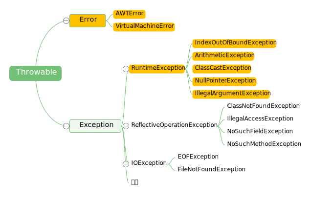

## 1. 语言基础

### 1.1 泛型

1. 泛型

   泛型是 Java SE 1.5 的新特性，泛型的本质是参数化类型，这种参数类型可以用在类、接口和方法的创建中，分别称为泛型类、泛型接口、泛型方法。

   在 Java SE 1.5 之前没有泛型的情况的下只能通过对类型 Object 的引用来实现参数的任意化，其带来的缺点是要做显式强制类型转换，而这种强制转换编译期是不做检查的，容易把问题留到运行时。

   - 优点：

     - 类型安全，提供编译期间的类型检测，避免在运行时出现 ClassCastException。
     - 前后兼容
     - 泛化代码,代码可以更多的重复利用，所有的强制转换都是自动和隐式的。
     - 性能较高，用泛型JAVA编写的代码可以为java编译器和虚拟机带来更多的类型信息，这些信息对java程序做进一步优化提供条件。

   - Java 泛型是如何工作的？什么是类型擦除？

     ​	泛型是通过类型擦除来实现的，编译器在编译时擦除了所有泛型类型相关的信息，所以在运行时不存在任何泛型类型相关的信息，譬如 List\<Integer\> 在运行时仅用一个 List 来表示，这样做的目的是为了和 Java 1.5 之前版本进行兼容。泛型擦除具体来说就是在编译成字节码时首先进行类型检查，接着进行类型擦除（即所有类型参数都用他们的限定类型替换，包括类、变量和方法），接着如果类型擦除和多态性发生冲突时就在子类中生成桥方法解决，接着如果调用泛型方法的返回类型被擦除则在调用该方法时插入强制类型转换。

   - Java 泛型类、泛型接口、泛型方法有什么区别？

     泛型类是在实例化类的对象时才能确定的类型，其定义譬如 class Test<T> {}，在实例化该类时必须指明泛型 T 的具体类型。

     泛型接口与泛型类一样，其定义譬如 interface Generator<E> { E dunc(E e); }。

     泛型方法所在的类可以是泛型类也可以是非泛型类，是否拥有泛型方法与所在的类无关，所以在我们应用中应该尽可能使用泛型方法，不要放大作用空间，尤其是在 static 方法时 static 方法无法访问泛型类的类型参数，所以更应该使用泛型的 static 方法（声明泛型一定要写在 static 后返回值类型前）。泛型方法的定义譬如 <T> void func(T val) {}。

   - 泛型边界

     - 在Java泛型定义时:

       用<T>等大写字母标识泛型类型，用于表示未知类型。
       用<T extends ClassA & InterfaceB …>等标识有界泛型类型，用于表示有边界的未知类型。

     - 在Java泛型实例化时:

       用<?>标识通配符，用于表示实例化时的未知类型。
       用<? extends 父类型>标识上边界通配符，用于表示实例化时可以确定父类型的未知类型。
       用<? super 子类型>标识下边界通配符，用于表示实例化时可以确定子类型的未知类型。

   - List\<Object\>和原始类型List之间的区别

     在编译时编译器不会对原始类型进行类型安全检查，却会对带参数的类型进行检查，通过使用Object作为类型，可以告知编译器该方法可以接受任何类型的对象，比如String或Integer。

     它们之间的第二点区别是，你可以把任何带参数的类型传递给原始类型List，但却不能把List\<String\>传递给接受 List\<Object\>的方法，会产生编译错误。

   - 编写一段泛型程序来实现LRU缓存

     可借助 `LinkedHashMap`，`LinkedHashMap`提供了一个称为`removeEldestEntry()`的方法，该方法会被`put()` 和`putAll()`调用来删除最老的键值对。

   - Array 中可以使用泛型吗

     Array事实上并不支持泛型，这也是为什么Joshua Bloch在Effective Java一书中建议使用List来代替Array，因为List可以提供编译期的类型安全保证，而Array却不能。

   - `@SuppressWarnings(“unchecked”)` 可屏蔽类型未检查警告

   - Java 中的泛型和 C++ 中的模板

     - C++ 中模板的实例化会为每一种类型都产生一套不同的代码，这就是所谓的代码膨胀。

     - Java 中并不会产生这个问题。虚拟机中并没有泛型类型对象，所有的对象都是普通类。

       当编译器对带有泛型的java代码进行编译时，它会去执行**类型检查**和**类型推断**，然后生成普通的不带泛型的字节码，这种普通的字节码可以被一般的 Java 虚拟机接收并执行，这在就叫做 **类型擦除**

   - 泛型的规则

     - 泛型的参数类型只能是类（包括自定义类），不能是简单类型。
  - 同一种泛型可以对应多个版本（因为参数类型是不确定的），不同版本的泛型类实例是不兼容的。
     - 泛型的类型参数可以有多个
  - 泛型的参数类型可以使用 extends 语句，习惯上称为“有界类型”
     - 泛型的参数类型还可以是通配符类型，例如 Class

### 1.2 异常



Java把异常当作对象来处理，并定义一个基类`java.lang.Throwable`作为所有异常的超类。

+ 分类：

  + `Error`：JAVA 程序运行时系统的内部错误，通常比较严重，除了通知用户和尽力使应用程序安全地终止之外，无能为力，应用程序不应该尝试去捕获这种异常。通常为一些虚拟机异常，如 `StackOverflowError`、`OutOfMemoryError` 等。
  + `RuntimeException`：通常为程序逻辑引起的异常，如`ArithmeticException`，`ArrayIndexOutOfBoundException`。
  + `其他Exception`：通常是程序本身没有问题，由于像 I/O 错误等问题导致的异常

+ 分类二

  + `受查异常`：受查异常会在编译时被检测。如果一个方法中的代码会抛出受查异常，则该方法必须包含异常处理，即 try-catch 代码块，或在方法签名中用 throws 关键字声明该方法可能会抛出的受查异常，否则编译无法通过。如果一个方法可能抛出多个受查异常类型，就必须在方法的签名处列出所有的异常类。
  + `非受查异常`：非受查异常不会在编译时被检测。JAVA 中 Error 和 RuntimeException 类的子类属于非受查异常，除此之外继承自 Exception 的类型为受查异常。

+ 关键字

  + `try`：将要被监听的代码(可能抛出异常的代码)放在try语句块之内，当try语句块内发生异常时，异常就被抛出；
  + `catch`：用来捕获try语句块中发生的异常；
  + `finally`：此语句块总是会被执行。主要用于回收在try块里打开的物理资源(如数据库连接、网络连接、磁盘文件)。**注意：**只有`finally`块，执行完成之后，才会回来执行`try`或者`catch`块中的`return`或者`throw`语句，如果`finally`中使用了`return`或者`throw`等终止方法的语句，则就不会跳回执行，直接停止。
  + `throw`：抛出异常；
  + `throws`：用在方法签名中，声明该方法可能抛出的异常。

+ JVM 如何处理异常

  在一个方法中如果发生异常，这个方法会创建一个异常对象，并转交给 JVM，该异常对象包含异常名称，异常描述以及异常发生时应用程序的状态。创建异常对象并转交给 JVM 的过程称为抛出异常。可能有一系列的方法调用，最终才进入抛出异常的方法，这一系列方法调用的有序列表叫做调用栈。

  JVM 会顺着调用栈去查找看是否有可以处理异常的代码，如果有，则调用异常处理代码。当 JVM 发现可以处理异常的代码时，会把发生的异常传递给它。如果 JVM 没有找到可以处理该异常的代码块，JVM 就会将该异常转交给默认的异常处理器（默认处理器为 JVM 的一部分），默认异常处理器打印出异常信息并终止应用程序。

  [线程的异常处理](Java_thread.md)

+ `NoClassDefFoundError` 和 `ClassNotFoundException` 区别？

  `NoClassDefFoundError` 是一个 Error 类型的异常，是由 JVM 引起的，不应该尝试捕获这个异常。引起该异常的原因是` JVM` 或 `ClassLoader` 尝试加载某类时在内存中找不到该类的定义，该动作发生在运行期间，即编译时该类存在，但是在运行时却找不到了，可能是编译后被删除了等原因导致；

  `ClassNotFoundException` 是一个受查异常，需要显式地使用 try-catch 对其进行捕获和处理，或在方法签名中用 `throws` 关键字进行声明。当使用 `Class.forName`,` ClassLoader.loadClass` 或 `ClassLoader.findSystemClass` 动态加载类到内存的时候，通过传入的类路径参数没有找到该类，就会抛出该异常；另一种抛出该异常的可能原因是某个类已经由一个类加载器加载至内存中，另一个加载器又尝试去加载它。

### 1.3 接口&抽象类

1. 抽象类与接口类区别

   - **抽象类**：抽象类是对根源的抽象（eg. 男人，女人 --人）。如果一个类含有抽象方法，则称这个类为抽象类，抽象类必须在类前用abstract关键字修饰。因为抽象类中含有无具体实现的方法，所以不能用抽象类创建对象。
   
   - **接口**：接口是对行为的抽象（eg. 吃饭，睡觉），一堆抽象方法的集合。也不能实例化。
   
   - 区别
     - 抽象类可以提供成员方法的实现细节，而接口中只能存在`public` `abstract` 方法；
     - 抽象类中的成员变量可以是各种类型的，而接口中的成员变量只能是`public` `static` `final`类型的；
     - 接口中不能含有静态代码块以及静态方法，而抽象类可以有静态代码块和静态方法；
     - 一个类只能继承一个抽象类，而一个类却可以实现多个接口。
     
   - 为什么要有抽象类
   
     类似模板方法，提供一些实现，预留一些方法，但是继承者必须实现抽象方法。
   
   - 为什么要有接口
   

### 1.4 Object 中的方法

#### 1.4.1 `equal(Object)`

1. == 和 equals 的区别是什么

   + 基本数据类型：byte,short,char,int,long,float,double,boolean
     他们之间的比较，应用双等号（==）,比较的是他们的值。

   + 复合数据类型(类)
     当他们用（==）进行比较的时候，比较的是他们在内存中的存放地址，所以，除非是同一个new出来的对象，他们的比较后的结果为true，否则比较后结果为false。 

     JAVA中所有类都是继承于Object这个基类的，在Object中定义了一个equals的方法，这个方法的初始行为是比较对象的内存地址，但在一些类库当中这个方法被覆盖掉了，如String,Integer,Date在这些类当中equals有其自身的实现，而不再是比较类在堆内存中的存放地址。

     注意：在使用了对象池技术的类比如String中，有时“==”可以返回True，这是因为共享了对象池中的对象。

#### 1.1.2 `hashCode()`

1. 重写`equals`方法为什么要重写`hashcode`方法

   `JavaAPI`文档规定，如果两个对象调用`equals`方法返回是相等的，那么`hashcode`方法返回值必须相等。

   `Object`的默认实现的`equals`方式是调用`==`，也就是比较引用，默认实现的`hashcode`方法也是根据引用导出的。`String`类重载`hashcode`方法，利用内容导出`hashcode`，因此即使不是同一个`String`对象，但是内容相同，`equals`方法判断会相同，`hashcode`返回会相同，`hashMap`调用`hashcode`实现`get`和`put`，值相同的`String`才能对应到同一个`bin`。

   如果自定义类重写`equals`方法，不重写`hashcode`方法，那么`equal`的对象，在`map`中不能对应到同一个`bin`。

   

#### 1.1.3 `clone()`

+ 满足条件

  + `x.clone()!=x`，克隆对象与原对象不是同一个对象；
  + `x.clone().getCLass()==x.getClass()`，克隆对象与原对象类型相同；
  + `x.clone().equals(x)`

+ 使用

  子类实现`Cloneable`接口，覆盖父类`clone()`方法，并在`clone()`中调用`super.clone()`。

  `Cloneable`接口未定义任何方法，只是可克隆的标记。子类不实现`clone()`方法时，调用父类的，如果没有父类，则调用`Object.clone()`，此方法是`native`（浅拷贝）。

  ```java
  class Student implements Cloneable{    
      String name;    
      int age;    
      Student(String name,int age) {    
          this.name=name;    
          this.age=age;    
      }    
      public Object clone() {    
          Object o=null;    
          try {    
              o=(Student)super.clone();//Object 中的clone()识别出你要复制的是哪一个对象。    
          } catch(CloneNotSupportedException e) {    
               System.out.println(e.toString());    
          }    
          return o;    
      }    
  } 
  ```

  这种复制是浅拷贝，必须将其他涉及对象显示`clone`一遍。

1. 深拷贝和浅拷贝

   + **浅拷贝**

     复制对象与原对象变量中的基本数据类型相同，变量中对其他对象的**引用依然指向相同的对象**，修改引用对象会相互影响。

     `clone()`实现的是浅拷贝。

   + **深拷贝**

     复制对象与原对象变量中的基本数据类型相同，变量中对其他对象的**引用替换为对新对象的引用**，修改引用对象会不会相互影响。

     将对象序列化然后反序列化，可实现深拷贝。

   + 第三方工具

     + `json`序列化+反序列化可实现深拷贝
     + `Dozer`利用反射实现深拷贝
     + `Apache.BeanUtils`实现浅拷贝。

#### 1.4.4 `finalize()`

Java 技术允许使用 `finalize() `方法在垃圾收集器将对象从内存中清除出去之前做必要的清理工作。这个方法是由垃圾收集器在确定这个对象没有被引用时对这个对象进行调用。在垃圾收集器删除对象之前对这个对象调用` finalize()` 方法以整理系统资源或者执行其他清理操作。

通常，`finalize`用于一些不容易控制、并且非常重要资源的释放，例如一些I/O的操作，数据的连接，这些资源的释放对整个应用程序是非常关键的。

#### 1.4.5 `wait()`

[见sleep](Java_thread.md)

#### 1.4.6 `notify()`

notify() 是会随机地通知等待队列中的一个线程，notify风险在于可能导致某些线程永远不会被通知到。

#### 1.4.7 `notifyAll()`

 `notifyAll()` 会通知等待队列中的所有线程。

#### 1.4.8 `getClass()`


### 1.5 Java 1.8 新特性

[【译】Java 8的新特性—终极版](https://www.jianshu.com/p/5b800057f2d8)

#### 1.5.1 语言

+ **Lambda**

  **函数接口**：只有一个函数的接口，此接口可隐式转换为`Lambda`表达式；`java.lang.Runnable`和`java.util.concurrent.Callable`是函数接口的例子。默认的函数接口很脆弱，多余1个方法则编译失败(默认方法和静态方法不破坏)，因此`@FunctionalInterface`显式说明接口是函数接口。

  ```java
  Arrays.asList( "a", "b", "d" ).forEach( e -> System.out.println( e ) );
  # 多个参数由括号包裹，逗号分隔
  Arrays.asList( "a", "b", "d" ).sort( ( e1, e2 ) -> e1.compareTo( e2 ) );
  # Lambda有返回值，语句块只有一行则不用return，返回值类型由编译器推理
  Arrays.asList( "a", "b", "d" ).sort( ( e1, e2 ) -> {
      int result = e1.compareTo( e2 );
      return result;
  } );
  ```

  上述`forEach`内封装循环，`java.util.function.Consumer`函数接口表示单参数(`e`)的语句块。

+ **接口的默认方法和静态方法**

  优点：不强制实现了该接口的类也同时实现新加的方法，官方的应用：给`java.util.Collection`中添加新方法，`stream()`、`parallelStream()`、`forEach`、`removeIf`。

  

+ **方法引用**

  方法引用使得开发者可以直接引用现存的方法、Java类的构造方法或者实例对象。

  ```java
  public static class Car {
      public static Car create( final Supplier< Car > supplier ) {
          return supplier.get();
      }              
      public static void collide( final Car car ) {
          System.out.println( "Collided " + car.toString() );
      }
      public void follow( final Car another ) {
          System.out.println( "Following the " + another.toString() );
      }
      public void repair() {   
          System.out.println( "Repaired " + this.toString() );
      }
  }
  ```

  方法引用和Lambda表达式配合使用，使得java类的构造方法看起来紧凑而简洁，没有很多复杂的模板代码。

  ```java
  // 构造器引用Class::new 
  final Car car = Car.create( Car::new );
  final List< Car > cars = Arrays.asList( car );
  // 静态方法引用
  cars.forEach( Car::collide );
  // 类的方法引用
  cars.forEach( Car::repair );
  // 对象的方法引用
  final Car police = Car.create( Car::new );
  cars.forEach( police::follow );
  ```

+ 重复注解

  允许在同一个地方多次使用同一个注解，在Java 8中使用**@Repeatable**注解定义重复注解

  ```java
  import java.lang.annotation.ElementType;
  import java.lang.annotation.Repeatable;
  import java.lang.annotation.Retention;
  import java.lang.annotation.RetentionPolicy;
  import java.lang.annotation.Target;
  
  public class RepeatingAnnotations {
      @Target( ElementType.TYPE )
      @Retention( RetentionPolicy.RUNTIME )
      public @interface Filters {
          Filter[] value();
      }
      
      @Target( ElementType.TYPE )
      @Retention( RetentionPolicy.RUNTIME )
      @Repeatable( Filters.class )
      public @interface Filter {
          String value();
      };
      
      @Filter( "filter1" )
      @Filter( "filter2" )
      public interface Filterable {        
      }
      
      public static void main(String[] args) {
          for( Filter filter: Filterable.class.getAnnotationsByType( Filter.class ) ) {
              System.out.println( filter.value() );
          }
      }
  }
  ```

  

+ 更好的类型推断

+ 拓宽注解应用场景

  现在，注解几乎可以使用在任何元素上：局部变量、接口类型、超类和接口实现类，甚至可以用在函数的异常定义上。

  ```java
  @Retention( RetentionPolicy.RUNTIME )
  @Target( { ElementType.TYPE_USE, ElementType.TYPE_PARAMETER } )
  public @interface NonEmpty {        
  }
  public static class Holder< @NonEmpty T > extends @NonEmpty Object {
      public void method() throws @NonEmpty Exception {           
      }
  }
  @SuppressWarnings( "unused" )
  public static void main(String[] args) {
      final Holder< String > holder = new @NonEmpty Holder< String >();       
      @NonEmpty Collection< @NonEmpty String > strings = new ArrayList<>();       
  }
  ```

  **`ElementType.TYPE_USER`**和**`ElementType.TYPE_PARAMETER`**是Java 8新增的两个注解，用于描述注解的使用场景。Java 语言也做了对应的改变，以识别这些新增的注解。

#### 1.5.2 编译器

为了在运行时获得Java程序中方法的参数名称，Java 8终于将这个特性规范化，在语言层面（使用反射API和**Parameter.getName()方法**）和字节码层面（使用新的**javac**编译器以及**-parameters**参数）提供支持。

```java
import java.lang.reflect.Method;
import java.lang.reflect.Parameter;

public class ParameterNames {
    public static void main(String[] args) throws Exception {
        Method method = ParameterNames.class.getMethod( "main", String[].class );
        for( final Parameter parameter: method.getParameters() ) {
            System.out.println( "Parameter: " + parameter.getName() );
        }
    }
}
```

以上代码需要在编译时加上参数`-parameters`才有效，或者在`maven`中加入配置：

```xml
<plugin>
    <groupId>org.apache.maven.plugins</groupId>
    <artifactId>maven-compiler-plugin</artifactId>
    <version>3.1</version>
    <configuration>
        <compilerArgument>-parameters</compilerArgument>
        <source>1.8</source>
        <target>1.8</target>
    </configuration>
</plugin>
```

#### 1.5.3 库

Java 8增加了很多新的工具类（date/time类），并扩展了现存的工具类，以支持现代的并发编程、函数式编程等.

+ **Optional** 

  `java.util.Optional`避免源代码被空值检查污染

  ```java
  Optional<String> firstName = Optional.of( "Tom" );
  // 判断是否!=null
  System.out.println( "First Name is set? " + firstName.isPresent() );
  // ==null 时返回lambda的值
  System.out.println( "First Name: " + firstName.orElseGet( () -> "[none]" ) );
  // ==null时返回值
  System.out.println( firstName.map( s -> "Hey " + s + "!" ).orElse( "Hey Stranger!" ) );
  ```

+ **Streams**

  `java.util.stream`将生成环境的函数式编程引入到Java库中，能简化集合操作：

  ```java
  final Collection< Task > tasks = Arrays.asList(
          new Task( Status.OPEN, 5 ),
          new Task( Status.OPEN, 13 ),
          new Task( Status.CLOSED, 8 )
  );
  // Calculate total points of all active tasks using sum()
  final long totalPointsOfOpenTasks = tasks
          .stream()// 转换为stream表示
          // filter掉CLOSED的元素
          .filter( task -> task.getStatus() == Status.OPEN )
          // 将每个元素映射成对应的point
          .mapToInt( Task::getPoints )
          .sum();// 求和
  ```

  **中间操作**会返回一个新的steam——执行一个中间操作（例如**filter**）并不会执行实际的过滤操作，而是创建一个新的steam，并将原steam中符合条件的元素放入新创建的steam。

  **晚期操作**（例如**`forEach`**或者**`sum`**），会遍历steam并得出结果或者附带结果；在执行晚期操作之后，steam处理线已经处理完毕，就不能使用了。在几乎所有情况下，晚期操作都是立刻对steam进行遍历。

  ```java
  // 并行计算
  final double totalPoints = tasks
          .stream()
          .parallel()
          .map(Task::getPoints)
          .reduce( 0, Integer::sum );
  ```

  ```java
  // 分类汇总
  final Map< Status, List< Task >> map = tasks
          .stream()
          .collect( Collectors.groupingBy( Task::getStatus ) );
  ```

  ```java
  // 求百分比
  final Collection< String > result = tasks
          .stream()                                        // Stream< String >
          .mapToInt( Task::getPoints )                     // IntStream
          .asLongStream()                                  // LongStream
          .mapToDouble( points -> points / totalPoints )   // DoubleStream
          .boxed()                                         // Stream< Double >
          .mapToLong( weight -> ( long )( weight * 100 ) ) // LongStream
          .mapToObj( percentage -> percentage + "%" )      // Stream< String>
          .collect( Collectors.toList() );                 // List< String >
  ```

  ```java
  // 文件读取
  final Path path = new File( filename ).toPath();
  try( Stream< String > lines = Files.lines( path, StandardCharsets.UTF_8 ) ) {
      lines.onClose( () -> System.out.println("Done!") ).forEach( System.out::println );
  }
  ```

+ **Date/Time API**

  新的java.time包包含了所有关于日期、时间、时区、Instant（跟日期类似但是精确到纳秒）、duration（持续时间）和时钟操作的类。新设计的API认真考虑了这些类的不变性（从java.util.Calendar吸取的教训），如果某个实例需要修改，则返回一个新的对象。

  

+ `Nashorn` `JavaScript` 引擎

  可以在JVM上开发和运行JS应用，允许Java和JavaScript交互使用。

  ```java
  ScriptEngineManager manager = new ScriptEngineManager();
  ScriptEngine engine = manager.getEngineByName( "JavaScript" );
          
  System.out.println( engine.getClass().getName() );
  System.out.println( "Result:" + engine.eval( "function f() { return 1; }; f() + 1;" ) );
  ```

  

+ `Base64`

  ```java
  public class Base64s {
      public static void main(String[] args) {
          final String text = "Base64 finally in Java 8!";
          
          final String encoded = Base64
              .getEncoder()
              .encodeToString( text.getBytes( StandardCharsets.UTF_8 ) );
          System.out.println( encoded );
          
          final String decoded = new String( 
              Base64.getDecoder().decode( encoded ),
              StandardCharsets.UTF_8 );
          System.out.println( decoded );
      }
  }
  ```

+ 并行数组

  新增了很多新的方法，用于支持并行数组处理。最重要的方法是**parallelSort()**，可以显著加快多核机器上的数组排序。下面的例子论证了**parallexXxx**系列的方法

  ```java
  import java.util.Arrays;
  import java.util.concurrent.ThreadLocalRandom;
  
  public class ParallelArrays {
      public static void main( String[] args ) {
          long[] arrayOfLong = new long [ 20000 ];        
          // 并行生成随机数
          Arrays.parallelSetAll( arrayOfLong, 
              index -> ThreadLocalRandom.current().nextInt( 1000000 ) );
          Arrays.stream( arrayOfLong ).limit( 10 ).forEach( 
              i -> System.out.print( i + " " ) );
          // 并行排序
          Arrays.parallelSort( arrayOfLong );     
          Arrays.stream( arrayOfLong ).limit( 10 ).forEach( 
              i -> System.out.print( i + " " ) );
      }
  }
  ```

  

+ 并发性

  基于新增的lambda表达式和steam特性，为Java 8中为**java.util.concurrent.ConcurrentHashMap**类添加了新的方法来支持聚焦操作；另外，也为**java.util.concurrentForkJoinPool**类添加了新的方法来支持通用线程池操作。

  Java 8还添加了新的**java.util.concurrent.locks.StampedLock**类，用于支持基于容量的锁——该锁有三个模型用于支持读写操作（可以把这个锁当做是**java.util.concurrent.locks.ReadWriteLock**的替代者）。

  在**java.util.concurrent.atomic**包中也新增了不少工具类，列举如下：

  - DoubleAccumulator
  - DoubleAdder
  - LongAccumulator
  - LongAdder。

#### 1.5.4 工具

+ **`jjs`** 

  一个基于标准`Nashorn`引擎的命令行工具，可以接受`js`源码并执行。

+ **`jdeps`**

  一个相当棒的命令行工具，它可以展示包层级和类层级的Java类依赖关系，它以**.class**文件、目录或者Jar文件为输入，然后会把依赖关系输出到控制台。

#### 1.5.5 运行时

​		使用`Metaspace`代替永久代。

### 1.6 修饰符


#### 1.6.1`final` 

+ 修饰变量：变量一旦被初始化便不可改变，对基本类型来说是其值不可改变，而对于对象变量来说其引用不可再变。

+ 修饰方法：自己认为方法功能足够，可以继承，不能覆盖。允许编译器将所有对此方法的调用转化为inline(行内)调用的机制，直接将方法主体插入到调用处，而不是进行例行的方法调用。

+ 修饰类：自己认为此类设计完美，无法被任何人继承的，`final` 类的方法自然是`final`类型。

+ `final`不能用于修饰构造方法。

+ 其他不可修改：

  类变量为基本类型，且申明为`private`，并且不提供`setter`，`getter`方法不泄漏变量的引用。

#### 1.6.2`static` 

 + `static`方法

   可以不实例化，通过类进行访问；`main`方法必须是`static`因为虚拟机运行程序之前不实例化任何类，只能通过类名进行访问。

+ `static`变量

  可以不实例化，通过类进行访问；被所有对象共享，内存中只有一份，仅在类初次加载时初始化，`static`变量的初始化顺序按照定义顺序初始化。

+ `static`代码块

  可以在类的任何地方，一个类可以有多个`static`代码块，在类初次加载时会按照定义顺序执行，且只执行一次。由于只运行一次，可用于优化性能。

+ 注意

  1. `static`不影响访问权限；

  2. 不允许修饰局部变量(局部变量有生命周期，`static`修饰该无法回收)；

  3. 静态方法和静态变量可以通过对象`this`访问。

  4. 构造函数不能用`static`修饰，也不是静态方法

     + `invokestatic`调用类方法(`static`);
     + `invokespecial`调用特殊实例方法：`super`、`private`、构造方法;
     + `invokevirtual`调用一般实例方法，包括`final`的非`private`方法;
     + `invokeinterface`调用接口方法;

     前两个指令调用目标不参与子类型多态，可以**静态绑定**，后两者一般需要做**运行时绑定**，VM实现可以有选择的根据final或实际运行时类层次或类型反馈等信息试图进行静态绑定。

     构造方法不参与多态、无法被隐藏和覆盖，能进行静态绑定；但是其带有隐式参数`this`，可以访问对象的所有变量；另外，构造函数只能被`new`表达式(或其他构造函数)调用，不能通过方法调用表达式调用；构造函数实际只负责对象的初始化，`new`将对象创建和初始化封装在一起，自己`创建对象`，然后使用构造函数进行初始化。

  5. 加载父类(父类`static`块)，加载子类(子类`static`块)、父类实例化(先实例化变量、再执行构造方法)、子类实例化(先实例化变量、再执行构造方法)

     ```java
     public class ExeOrder extends Base {
         static {//2
             System.out.println("test static");
         }
         public ExeOrder() {//5
             System.out.println("test constructor");
         }
         public static void main(String[] args) {
             //3
             System.out.println("main method");
             new ExeOrder();
         }
     }
     class Base {
         static {//1
             System.out.println("base static");
         }
         public Base() {//4
             System.out.println("base constructor");
         }
     }
     ```

     ```java
     public class ExeOrder2 {
         // 3
         Person person = new Person("Test");
         static{//1
             System.out.println("test static");
         }
         public ExeOrder2() {//4
             System.out.println("test constructor");
         }
         // 入口
         public static void main(String[] args) {
             new MyClass();
         }
     }
     class Person{
         static{//3-1
             System.out.println("person static");
         }
         public Person(String str) {//3-2, 5-1
             System.out.println("person "+str);
         }
     }
     class MyClass extends ExeOrder2 {
         // 5
         Person person = new Person("MyClass");
         static{//2
             System.out.println("myclass static");
         }
         public MyClass() {//6
             System.out.println("myclass constructor");
         }
     }
     ```

     

### 1.7 String

1. `String` 、`stringbuffer`、`stringbuilder`

+ 都是`final`类，都不允许被继承；
+ `String`是不可变对象，每次改变就会创建新的`String`对象，然后将指针指向新的对象；
  + 字符数组是`final`，无法创建更大的数组并修改引用；
  + String类型无长度限制，`StringBuilder`有长度限制`MAX_ARRAY_SIZE = Integer.MAX_VALUE - 8`
+ `StringBuffer`和`StringBuilder`类长度是可以改变的；
+ `StringBuffer`线程安全，`StringBuilder`非线程安全，但性能略高，适合单线程使用；
  + `StringBuffer`的操作方法由`synchronized`修饰，线程安全的同时，消耗适当性能。

#### 1.7.1 字符串常量池

讨论版本为1.8，从1.7开始字符串常量池在堆区，之前在`perm`。参考[美团技术团队](https://tech.meituan.com/2014/03/06/in-depth-understanding-string-intern.html) 可能`如果常量池中存在当前字符串, 就会直接返回当前字符串` 一小句描述不准确，容易引起歧义。

+ 字符串常量池为什么在堆中：

  perm区比较小，默认只有4M，频繁调用`intern()`方法会导致`outofMemory`，再者在堆区，新对象`intern`到常量池采用直接存储引用，不用再复制对象，性能更好。

+ 几个相关操作

  1. `=`创建字符串

     从常量池取，没有则直接存储到常量池。

  2. `new String("str")`创建

     将`"str"`字符串放入常量池，然后在堆区新建一个对象，两个对象不同。

  3. `String b= a.intern()`

     字符串对象`a`如果已经存在常量池，返回的`b`是常量池中对应的字符串(可查看源码注释)；

     ```java
     // 创建两个对象，一个在常量池，一个是堆区，堆区中的给a
     String a=new String("1");;
     System.out.println("a: "+System.identityHashCode(a));
     // intern时常量池已经存在，返回常量池中的给b，b!=a
     String b=a.intern();
     System.out.println("b: "+System.identityHashCode(b));
     // 从常量池取
     String c="1";
     System.out.println("c: "+System.identityHashCode(c));
     ```

     如果没有，则将a对象的引用存入常量池，然后返回的b是a的引用(因为都在堆区，1.7之前就是复制到常量池)。

     ```java
     String s3 = new String("1") + new String("1");
     System.out.println("s3: "+System.identityHashCode(s3));
     // 将堆区11对象放入常量池，1.7+直接放引用
     s3.intern();
     // 从常量池取，s4==s3。
     String s4 = "11";
     System.out.println("s4: "+System.identityHashCode(s4));
     ```

### 1.8 其他

1. 静态绑定和动态绑定

   + **静态绑定**：也叫前期绑定或编译时绑定，在编译时期JVM就能确定调用谁的方法，以下三个关键字修饰的方法就是静态绑定。

     + `private`：此方法只能被本类调用；

     + `static`：正常使用通过`class.fun()`进行调用

       ```java
       public class Test {
           public static void main(String[] args) {
               // SuperClass和SubClass都有sayHello方法，但是执行的是superclass的方法
               //通过实例调用静态方法不推荐，但是能够执行，且不执行动态绑定
               SuperClass superClass = new SubClass();
               superClass.sayHello();
           }
       }
       ```

       编译后的字节码如下，依然是静态绑定

       ```java
       SuperClass.sayHello();
       ```

     + `final`：方法不能被重写，可以编译期确定属于哪个类

   + **动态绑定**：也叫后期绑定或运行期绑定，在运行时根据具体的对象类型进行绑定。

     + 虚拟机提取对象的实际类型(等号右边)的方法表；
     + 虚拟机搜索方法签名；
     + 调用方法。

2. 重写和重载区别

   - **重载**：同一个类中，相同方法名，不同参数类型、参数个数的多个方法。返回值类型可以相同也可以不相同。无法以返回型别作为重载函数的区分标准。调用方法时通过传递给它们的不同参数个数和参数类型来决定具体使用哪个方法, 这就是多态性。
   - **重写**：父类与子类之间的多态性，对父类的函数进行重新定义。如果在子类中定义某方法与其父类有相同的名称和参数，我们说该方法被重写 (Overriding)。如需父类中原有的方法，可使用super关键字，该关键字引用了当前类的父类。

3. 多态的体现

   通过动态绑定机制实现。

   + 同一个类中的重载方法，根据具体参数决定调用哪个函数；
   + 父子类中重写方法，根据实现类决定调用哪个类的方法；
   + 接口和实现类，根据具体实现类决定调用哪个类的方法。

4. `integer`与`int`区别

   + `Integer`是`int`的包装类，`int`则是`java`的一种基本数据类型;
   + `Integer`变量必须实例化后才能使用，而`int`变量不需要;
   + `Integer`实际是对象的引用，当`new`一个`Integer`时，实际上是生成一个指针指向此对象；而`int`则是直接存储数据值;
   + `Integer`的默认值是`null`，`int`的默认值是0;


##  2. [JCF](http://kh.codeyourlife.cn/#/view/1022)

### 2.1. `HashMap`、`HashTable`、`ConcurrentHashMap`

+ [**HashMap**](http://codeyourlife.cn/detail/14)

  + 特点

    + 非线程安全
    + key和value可为空

  + 线程不安全原因

    + put操作不互斥，多线程时会导致数据不一致

    + jdk1.7 两个线程同时resize，可能构造出环，然后get带环的bin就会触发死循环。（1.8中采用尾插法使得顺序保证，不会形成环）

      e和next指向3和7，另一个线程执行完成resize将7的next设置为3，恢复执行当前线程

      

+ **HashTable**

  + 使用synchronized实现线程安全，锁定整个对象，粒度较大，在迭代时锁定时间长导致效率低下。
  + key和value都不能为null；

+ **ConcurrentHashMap**

  + Java1.7基于segment实现，只对segment加锁，而不是整个对象

  + java1.8基于CAS实现，f = tabAt(tab, i = (n - 1) & hash

    + put：key对应数组元素null则通过CAS设置为当前值，如果对应元素不为null，则对该元素使用synchronized锁定，然后进行操作；

    + read：数组用volatile修饰，保证可见性；每个元素Node的key、hash由final修饰，val、next由volatile修饰，可见性有保障

      ```java
      static class Node<K,V> implements Map.Entry<K,V> {
        final int hash;
        final K key;
        volatile V val;
        volatile Node<K,V> next;
      }
      ```

      key对应的数组元素的可见性，由Unsafe的`getObjectVolatile`方法保证：

      ```java
      static final <K,V> Node<K,V> tabAt(Node<K,V>[] tab, int i) {
        return (Node<K,V>)U.getObjectVolatile(tab, ((long)i << ASHIFT) + ABASE);
      }
      ```

  + HashMap不允许通过Iterator遍历的同时通过HashMap修改，而ConcurrentHashMap允许该行为，并且该更新对后续的遍历可见

  + key和value都不能为null；

### 2.2. [`linkedlist`、`arraylist`](http://codeyourlife.cn/detail/35)

### 2.3 TreeSet HashSet

TreeSet使用TreeMap的方法，通过`compareTo`判断元素是否相等

HashSet使用HashMap的方法，通过`equal`判断是否相等

## 3. 包装类

### 3.1 Integer

`hashCode`方法直接返回值

```java
public static int hashCode(int value) {
  return value;
}
```

### 3.2 Long 

前4字节与后4字节亦或

```java
public static int hashCode(long value) {
  return (int)(value ^ (value >>> 32));
}
```

### 3.3 String

```java
public int hashCode() {
  int h = hash;
  if (h == 0 && value.length > 0) {
    char val[] = value;
    for (int i = 0; i < value.length; i++) {
      h = 31 * h + val[i];
    }
    hash = h;
  }
  return h;
}
```


## 3. 其他

### 3.1 反射

1. 获取class对象的方法：
   + [`obj.getClass`](#1.4.8 `getClass()`) 来自Object基类的方法；
   + `Obj.class` 类的属性；
   + `Class.forName("Obj")` 反射；

反射就是让你可以通过名称来得到对象的信息(如类，属性，方法等) 的技术.

#### 3.1.1 功能

反射机制是`Java`语言被视为“准动态”语言的关键性质。核心就是允许在运行时通过`Java` `Reflection` `APIs`来取得已知名字的`class`类的内部信息(包括其`modifiers`(诸如`public`, `static`等等)、`superclass`(例如`Object`)、实现`interfaces`(例如Serializable)，也包括fields和methods的所有信息)，动态地生成此类，并调用其方法或修改其域（甚至是本身声明为private的域或方法）

+ 判断一个对象所属类

+ 构造任意一个类的对象

  ```java
  class1 = Class.forName("net.xsoftlab.baike.User");
  // 第一种方法，实例化默认构造方法，调用set赋值
  User user = (User) class1.newInstance();
  user.setAge(20);
  ```

  也可以获取了构造方法，调用特定构造方法：

  ```java
  Constructor<?> cons[] = class1.getConstructors();
  ```

+ 判断一个类具有的成员变量和方法

+ 调用对象的方法

+ 生成动态代理。

#### 3.1.2 原理


### 3.2 [序列化](http://codeyourlife.cn/detail/48)
