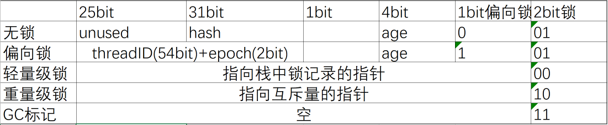
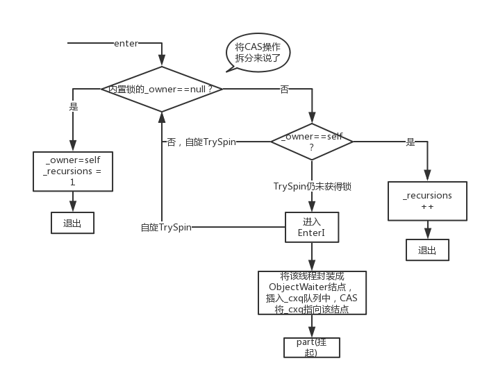
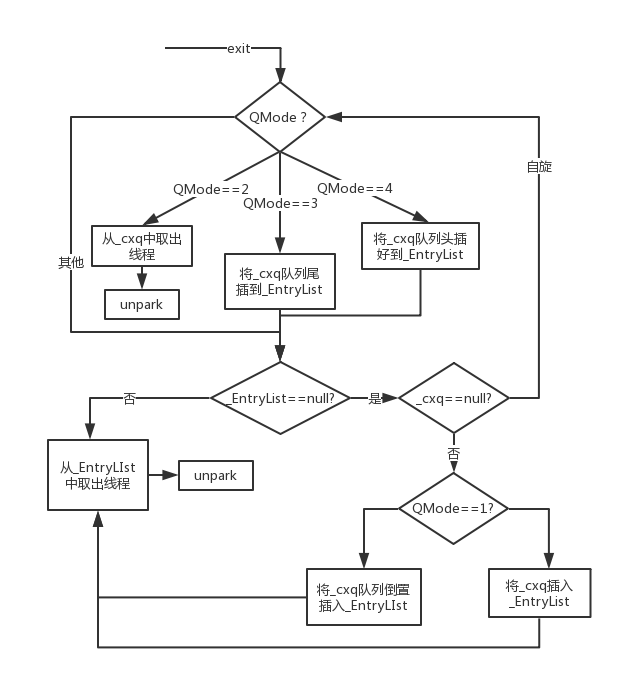

# Synchronized 

## 1. 使用

可以用来修饰方法，也可以用来修饰代码块。Java 编译器会在 synchronized 修饰的方法或代码块前后自动加上加锁和解锁。

当修饰静态方法的时候，锁定的是当前类的 Class 对象，在上面的例子中就是 Class X；当修饰非静态方法的时候，锁定的是当前实例对象 this。加锁的操作不仅能保证代码块的原子性，也能保证可见性（hapen-before 中的 管程中锁的规则）

## 2. 原理

`synchronized` 修饰代码块，编译器通过在代码块前后加入`monitorenter`和`monitorexit`实现；同步方法加入`ACC_SYNCHRONIZED`标记符。

### 2.1 对象头

`ReenTrantLock`通过改变`state`表示是否上锁，`synchronized` 通过改变对象头表示是否上锁。对象头由`MarkWord`+`Klass Pointer`组成，下图是64bit下`MarkWord`的布局：

### 2.2 偏向锁

在大多数情况下，锁总是由同一线程多次获得，不存在多线程竞争，所以出现了偏向锁。其目标就是在只有一个线程执行同步代码块时能够提高性能。

当一个线程访问同步代码块并获取锁时，在Mark Word里存储锁偏向的线程ID。在线程进入和退出同步块时检测Mark Word里是否存储着指向当前线程的偏向锁。

引入偏向锁是为了在无多线程竞争的情况下尽量减少不必要的轻量级锁执行路径，因为轻量级锁的获取及释放依赖多次CAS原子指令，而偏向锁只需要在置换ThreadID的时候依赖一次CAS原子指令即可。

偏向锁只有遇到其他线程尝试竞争偏向锁时，持有偏向锁的线程才会释放锁。偏向锁的撤销，需要等待全局安全点（在这个时间点上没有字节码正在执行），它会首先暂停拥有偏向锁的线程，判断锁对象是否处于被锁定状态。撤销偏向锁后恢复到无锁（标志位为“01”）或轻量级锁（标志位为“00”）的状态。

偏向锁在JDK 6及以后的JVM里是默认启用的。可以通过JVM参数关闭偏向锁：-XX:-UseBiasedLocking=false，关闭之后程序默认会进入轻量级锁状态

### 2.3 轻量级锁

当锁是偏向锁的时候，被另外的线程所访问，偏向锁就会升级为轻量级锁，其他线程会通过自旋的形式尝试获取锁，不会阻塞，从而提高性能。

在代码进入同步块的时候，如果同步对象锁状态为无锁状态（锁标志位为“01”状态，是否为偏向锁为“0”），虚拟机首先将在当前线程的栈帧中建立一个名为锁记录（Lock Record）的空间，用于存储锁对象目前的Mark Word的拷贝，然后拷贝对象头中的Mark Word复制到锁记录中。

拷贝成功后，虚拟机将使用CAS操作尝试将对象的Mark Word更新为指向Lock Record的指针，并将Lock Record里的owner指针指向对象的Mark Word。

如果这个更新动作成功了，那么这个线程就拥有了该对象的锁，并且对象Mark Word的锁标志位设置为“00”，表示此对象处于轻量级锁定状态。

如果轻量级锁的更新操作失败了，虚拟机首先会检查对象的Mark Word是否指向当前线程的栈帧，如果是就说明当前线程已经拥有了这个对象的锁，那就可以直接进入同步块继续执行，否则说明多个线程竞争锁。

若当前只有一个等待线程，则该线程通过自旋进行等待。

### 2.4 重量级锁-Moniter

但是当自旋超过一定的次数，或者一个线程在持有锁，一个在自旋，又有第三个来访时，轻量级锁升级为重量级锁。升级为重量级锁时，锁标志的状态值变为“10”，此时Mark Word中存储的是指向重量级锁的指针，此时等待锁的线程都会进入阻塞状态。

+ **java 管程模型**

    Java 参考了 MESA 模型，语言内置的管程（synchronized）对 MESA 模型进行了精简。MESA 模型中，条件变量可以有多个，Java 语言内置的管程里只有一个条件变量。

  

  + Contention List(_cxq队列)：所有请求锁的线程将被首先放置到该竞争队列

  + Entry List：Contention List中那些有资格成为候选人的线程被移到Entry List

  + Wait Set：那些调用wait方法被阻塞的线程被放置到Wait Set

  + OnDeck：任何时刻最多只能有一个线程正在竞争锁，该线程称为OnDeck

  + Owner：获得锁的线程称为Owner

  + !Owner：释放锁的线程

    线程在进入等待队列时首先进行自旋尝试获得锁，如果不成功再进入等待队列。这对那些已经在等待队列中的线程来说，稍微显得不公平。还有一个不公平的地方是自旋线程可能会抢占了Ready线程的锁。

    新请求锁的线程将首先被加入到ConetentionList中，Owner线程在unlock时会从ContentionList中迁移线程到EntryList，并会指定EntryList中的某个线程（一般为Head）为Ready（OnDeck）线程。Owner线程并不是把锁传递给OnDeck线程，只是把竞争锁的权利交给OnDeck，OnDeck线程需要重新竞争锁。

