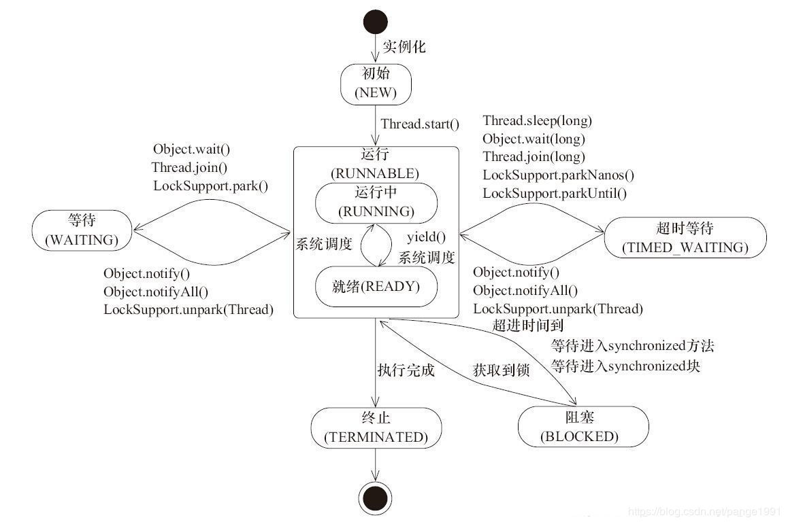

## 1. 线程

### 1.1. 生命周期

+ **通用线程状态-五态模型**


1. 初始状态，指的是线程已经被创建，但是还不允许分配 CPU 执行。这个状态属于编程语言特有，仅在编程语言层面被创建，而在操作系统层还没有创建。
1. 可运行状态，真正的操作系统线程已经被成功创建了。线程可以分配 CPU 执行。
1. 运行状态：获得了CPU的线程。
1. 运行状态的线程如果调用一个阻塞的 API（例如以阻塞方式读文件）或者等待某个事件（例如条件变量），那么线程的状态就会转换到休眠状态，同时释放 CPU 使用权，休眠状态的线程永远没有机会获得 CPU 使用权。当等待的事件出现了，线程就会从休眠状态转换到可运行状态。
1. 终止状态：线程执行完或者出现异常。

+ **Java 线程状态**


Java 语言合并了可运行状态和运行状态；细化了休眠状态。

+ NEW（初始化状态）
+ RUNNABLE（可运行 / 运行状态）
+ BLOCKED（阻塞状态）
+ WAITING（无时限等待）
+ TIMED_WAITING（有时限等待）
+ TERMINATED（终止状态

jstack 命令或者Java VisualVM这个可视化工具将 JVM 所有的线程栈信息导出来。

I/O阻塞在Java中是可运行状态，并发包中的lock是等待状态。

+ **各状态之间的转换条件**

见另一篇博客

+ stop() 方法会真的杀死线程，不给线程喘息的机会，如果线程持有 ReentrantLock 锁，被 stop() 的线程并不会自动调用 ReentrantLock 的 unlock() 去释放锁（线程持有 synchronized 隐式锁会释放），那其他线程就再也没机会获得 ReentrantLock 锁，这实在是太危险了。该方法就不建议使用，类似的方法还有 suspend() 和 resume() 方法，这两个方法同样也都不建议使用。

+ interrupt() 方法仅仅是通知线程，线程有机会执行一些后续操作，同时也可以无视这个通知。被 interrupt 的线程，是怎么收到通知的呢？

  1. 异常：
     当线程 A 处于 WAITING、TIMED_WAITING 状态时，如果其他线程调用线程 A 的 interrupt() 方法，会使线程 A 返回到 RUNNABLE 状态，同时线程 A 的代码会触发 InterruptedException 异常。上面我们提到转换到 WAITING、TIMED_WAITING 状态的触发条件，都是调用了类似 wait()、join()、sleep() 这样的方法，我们看这些方法的签名，发现都会 throws InterruptedException 这个异常。这个异常的触发条件就是：其他线程调用了该线程的 interrupt() 方法。
      当线程 A 处于 RUNNABLE 状态时，并且阻塞在 java.nio.channels.InterruptibleChannel 上时，如果其他线程调用线程 A 的 interrupt() 方法，线程 A 会触发 java.nio.channels.ClosedByInterruptException 这个异常；而阻塞在 java.nio.channels.Selector 上时，如果其他线程调用线程 A 的 interrupt() 方法，线程 A 的 java.nio.channels.Selector 会立即返回。
    1. 主动检测。

      	如果线程处于 RUNNABLE 状态，并且没有阻塞在某个 I/O 操作上，例如中断计算圆周率的线程 A，这时就得依赖线程 A 主动检测中断状态了。如果其他线程调用线程 A 的 interrupt() 方法，那么线程 A 可以通过 isInterrupted() 方法，检测是不是自己被中断了。

### 1.2. 合适的线程数量

​	如果 CPU 和 I/O 设备的利用率都很低，那么可以尝试通过增加线程来提高吞吐量

+ **CPU密集型**

  对于 CPU 密集型的计算场景，理论上“线程的数量 =CPU 核数”就是最合适的。不过在工程上，线程的数量一般会设置为“CPU 核数 +1”，这样的话，当线程因为偶尔的内存页失效或其他原因导致阻塞时，这个额外的线程可以顶上，从而保证 CPU 的利用率。

+ **IO密集型**

  最佳线程数 =CPU 核数 * [ 1 +（I/O 耗时 / CPU 耗时）]
  耗时不好得到，可使用经验值2 * CPU 的核数 + 1 作为初始值

### 1.3. 方法

#### 1.3.1 `sleep`

| sleep                      | wait                                                         |
| -------------------------- | ------------------------------------------------------------ |
| native                     | native                                                       |
| Thread类的方法             | Object顶级类的方法                                           |
| 线程休眠，定时结束继续执行 | 需要唤醒才能执行                                             |
| 可在任何地方使用           | 只能在同步方法或者同步块中使用                               |
| 暂停、出让cpu，不释放锁    | 暂停、出让cpu、放弃所有锁；<br />需要notify/notifyAll后重新获取到对象锁资源后才能继续执行<br />也可以有倒计时 |
| 需要捕获或抛出异常         | 不需要处理异常                                               |

### 1.4 守护线程

守护线程是指为其他线程服务的线程，在JVM中，所有非守护线程都执行完毕后，无论有没有守护线程虚拟机都会自动推出。

**注意**：在守护线程中不能持有任何需要关闭的资源，eg.打开文件等，因为虚拟机退出时，守护线程没有任何机会来关闭文件，这会导致数据丢失。

+ 创建

  ```java
  Thread t = new MyThread();
  t.setDaemon(true);
  t.start();
  ```

## 2.线程池

创建对象，仅仅是在 JVM 的堆里分配一块内存而已；而创建一个线程，却需要调用操作系统内核的 API，然后操作系统要为线程分配一系列的资源，这个成本就很高了，所以线程是一个重量级的对象，应该避免频繁创建和销毁。
**原理**：以阻塞队列连接的生产者-消费者模式。线程池的使用方是生产者，线程池本身是消费者。

以下代码实现了一个简单的线程池，可以用来了解线程池的原理，当然java的线程池功能比这个丰富。

```Java
//简化的线程池，仅用来说明工作原理
class MyThreadPool{
  //利用阻塞队列实现生产者-消费者模式
  BlockingQueue<Runnable> workQueue;
  //保存内部工作线程
  List<WorkerThread> threads = new ArrayList<>();
  // 构造方法
  MyThreadPool(int poolSize, BlockingQueue<Runnable> workQueue){
    this.workQueue = workQueue;
    // 创建工作线程
    for(int idx=0; idx<poolSize; idx++){
      WorkerThread work = new WorkerThread();
      work.start();
      threads.add(work);
    }
  }
  // 提交任务
  void execute(Runnable command){
    workQueue.put(command);
  }
  // 工作线程负责消费任务，并执行任务
  class WorkerThread extends Thread{
    public void run() {
      //循环取任务并执行
      while(true){ ①
        Runnable task = workQueue.take();
        task.run();
      } 
    }
  }  
}

/** 下面是使用示例 **/
// 创建有界阻塞队列
BlockingQueue<Runnable> workQueue = new LinkedBlockingQueue<>(2);
// 创建线程池  
MyThreadPool pool = new MyThreadPool(10, workQueue);
// 提交任务  
pool.execute(()->{
    System.out.println("hello");
});
```

### 2.1 `ThreadPoolExecutor`

+ 参数：

  1. `corePoolSize`：线程池保有的最小线程数；
    1. `maximPoolSize`：线程池创建的最大线程数；
    1. `keepAliveTime` & `unit`：如果一个线程空闲了`keepAliveTime` & `unit`这么久，而且线程池的线程数大于 `corePoolSize` ，那么这个空闲的线程就要被回收了；
    1. `workQueue`：工作队列；
    1. `threadFactory`：自定义工厂，可以实现给线程指定一个有意义的名字等操作。
    1. `handler`：自定义**任务拒绝策略**。如果线程池中所有的线程都在忙碌，并且工作队列也满了（前提是工作队列是有界队列），此时提交任务，线程池就会拒绝接收。`ThreadPoolExecutor`定义了：
       + `CallerRunsPolicy`：提交任务的线程自己去执行该任务。
       + `AbortPolicy`：默认的拒绝策略，会 `throws RejectedExecutionException`。
       + `DiscardPolicy`：直接丢弃任务，没有任何异常抛出。
       + `DiscardOldestPolicy`：把最早进入工作队列的任务丢弃，然后把新任务加入到工作队列。

+ 静态工厂类`Executors`
  利用 `Executors` 可以快速创建线程池，但不建议使用 。其提供的很多方法默认使用的都是无界的 `LinkedBlockingQueue`，高负载情境下，无界队列很容易导致 OOM，而 OOM 会导致所有请求都无法处理，强烈建议使用有界队列。

  + `newFixedThreadPool` 线程数量固定，多余任务等待；
  + `newSingleThreadExecutor`永远只有一个线程工作；
  + `newCachedThreadPool`传入的队列是`SynchronousQueue`，一个没有容量的同步队列，新任务到达时，线程池没有线程则创建线程处理，处理完成后该线程缓存60秒，过期后回收，线程过期前有新任务到达时，则使用缓存的线程来处理。
  + `newScheduledThreadPool`使用了`ScheduledThreadPoolExecutor`，执行任务可指定延迟多少时间执行，或周期性执行。
  + `newWorkStealingPool:`基于`ForkJoinPool`实现，创建一个含有足够多线程的线程池，来维持相应的并行级别，它会通过工作窃取的方式，使得多核的 CPU 不会闲置，总会有活着的线程让 CPU 去运行。
  
+ **拒绝策略**
  使用有界队列，当任务过多时，线程池会触发执行拒绝策略，线程池默认的拒绝策略会 `throw ` `RejectedExecutionException` 这是个运行时异常，对于运行时异常编译器并不强制 catch 它，所以开发人员很容易忽略。因此默认拒绝策略要慎重使用。如果线程池处理的任务非常重要，建议自定义自己的拒绝策略；

  在实际工作中，自定义的拒绝策略往往和降级策略(例如将任务信息插入数据库或者消息队列，启用一个专门用作补偿的线程池去进行补偿)配合使用。

  

+ 线程设置前缀名称

  Spring中给线程池设置名称前缀

  ```Java
  ThreadPoolTaskExecutor threadPoolTaskExecutor = new ThreadPoolTaskExecutor();
  threadPoolTaskExecutor.setThreadNamePrefix("CUSTOM_NAME_PREFIX");
  ```

  在`ThreadFactory`中自定义名称前缀

  ```Java
  class CustomThreadFactory implements ThreadFactory {
      @Override
      public Thread newThread(Runnable r) {
        return new Thread(r, "CUSTOM_NAME_PREFIX");
      }
  }
  
  ThreadPoolExecutor threadPoolExecutor = new ThreadPoolExecutor(10,
      100,
      120,
      TimeUnit.SECONDS,
      new LinkedBlockingQueue<<(),
      new CustomThreadFactory(),
      new ThreadPoolExecutor.AbortPolicy()
  );
  ```

### 2.2 Future

+ Future 接口
  定义了以下接口；

    ```Java
    // 取消任务
    boolean cancel(boolean mayInterruptIfRunning);
    // 判断任务是否已取消  
    boolean isCancelled();
    // 判断任务是否已结束
    boolean isDone();
    // 获得任务执行结果
    get();
    // 获得任务执行结果，支持超时
    get(long timeout, TimeUnit unit);
    ```

+ submit 提交任务方法

  ```Java
  // 提交Runnable任务
  Future<?> submit(Runnable task);
  // 提交Callable任务
  <T> Future<T> submit(Callable<T> task);
  // 提交Runnable任务及结果引用  
  <T> Future<T> submit(Runnable task, T result);
  ```

  `ThreadPoolExecutor` 提供的 3 个 submit() 方法来提交任务。

  1. `Runnable `任务：此接口的 `run()` 方法是没有返回值的，所以 submit(Runnable task) 这个方法返回的 Future 仅可以用来断言任务已经结束了，类似于 `Thread.join()`。
  1. `Callable` 任务：此接口只有一个 call() 方法，并且这个方法是有返回值的，所以这个方法返回的 Future 对象可以通过调用其 get() 方法来获取任务的执行结果。
  1. `Runnable` 任务及结果引用：返回的Future 对象是 f，`f.get()` 的返回值就是传给 `submit() `方法的参数 result。result 相当于主线程和子线程之间的桥梁。

   ```Java
  ExecutorService executor = Executors.newFixedThreadPool(1);
  // 创建Result对象r
  Result r = new Result();
  r.setAAA(a);
  // 提交任务
  Future<Result> future = executor.submit(new Task(r), r);  
  Result fr = future.get();
  // 下面等式成立
  fr === r;
  fr.getAAA() === a;
  fr.getXXX() === x
  
  class Task implements Runnable{
    Result r;
    //通过构造函数传入result
    Task(Result r){
      this.r = r;
    }
    void run() {
      //可以操作result
      a = r.getAAA();
      r.setXXX(x);
    }
  }
   ```

+ `FutureTask` 工具类

```Java
FutureTask(Callable<V> callable);
FutureTask(Runnable runnable, V result);
```

`FutureTask` 由于实现了 Runnable 接口，所以可以将 `FutureTask` 对象作为任务提交给 `ThreadPoolExecutor `去执行，也可以直接被 Thread 执行；又因为实现了 `Future` 接口，所以也能用来获得任务的执行结果。

```Java
// 创建任务T2的FutureTask
FutureTask<String> ft2 = new FutureTask<>(new T2Task());
// 创建任务T1的FutureTask
FutureTask<String> ft1 = new FutureTask<>(new T1Task(ft2));
// 线程T1执行任务ft1
Thread T1 = new Thread(ft1);
T1.start();
// 线程T2执行任务ft2
Thread T2 = new Thread(ft2);
T2.start();
// 等待线程T1执行结果
System.out.println(ft1.get());

// T1Task需要执行的任务：洗水壶、烧开水、泡茶
class T1Task implements Callable<String>{
  FutureTask<String> ft2;
  // T1任务需要T2任务的FutureTask
  T1Task(FutureTask<String> ft2){
    this.ft2 = ft2;
  }
  @Override
  String call() throws Exception {
    System.out.println("T1:洗水壶...");
    TimeUnit.SECONDS.sleep(1);
    
    System.out.println("T1:烧开水...");
    TimeUnit.SECONDS.sleep(15);
    // 获取T2线程的茶叶  
    String tf = ft2.get();
    System.out.println("T1:拿到茶叶:"+tf);

    System.out.println("T1:泡茶...");
    return "上茶:" + tf;
  }
}
// T2Task需要执行的任务:洗茶壶、洗茶杯、拿茶叶
class T2Task implements Callable<String> {
  @Override
  String call() throws Exception {
    System.out.println("T2:洗茶壶...");
    TimeUnit.SECONDS.sleep(1);

    System.out.println("T2:洗茶杯...");
    TimeUnit.SECONDS.sleep(2);

    System.out.println("T2:拿茶叶...");
    TimeUnit.SECONDS.sleep(1);
    return "龙井";
  }
}
```

## 3. 线程异常处理

### 3.1 线程默认异常处理

​	和主线程的异常处理一样，一个异常抛出后，如果没有被捕获处理，会一直向上抛出，直到被`main()`/`Thread.run()`抛出后，由虚拟机调用Thread的`dispatchUncaughtException()`来寻找`handler`处理，如果没有自定义`handler`则会调用`System.err`进行异常输出。

```java
/**
  * 向 handler 分派未捕获的异常。 该方法仅由JVM调用。
  */
private void dispatchUncaughtException(Throwable e) {
    getUncaughtExceptionHandler().uncaughtException(this, e);
}

// 获取未捕获异常处理的 handler，如果没有设置则返回当前线程所属的 ThreadGroup
public UncaughtExceptionHandler getUncaughtExceptionHandler() {
    return uncaughtExceptionHandler != null ? uncaughtExceptionHandler : group;
}
```

`ThreadGroup`继承`Thread.UncaughtExceptionHandler`实现了默认的处理方法：

```java
public void uncaughtException(Thread t, Throwable e) {
    if (parent != null) { // 父级优先处理
        parent.uncaughtException(t, e);
    } else {
        Thread.UncaughtExceptionHandler ueh =
            Thread.getDefaultUncaughtExceptionHandler();
        if (ueh != null) {
            ueh.uncaughtException(t, e);
        } else if (!(e instanceof ThreadDeath)) { // 没有配置handler时的处理方式
            System.err.print("Exception in thread \"" + t.getName() + "\" ");
            e.printStackTrace(System.err);
        }
    }
}
```

### 3.2 获取子线程异常信息

异常的真正处理只能在子线程，主线程可以获取到异常的信息，但是获取到时子线程已经运行结束。

+ **直接使用线程/`Runnable`提交任务**

  ```java
  public static void catchInMainThread(){
      try {
          Thread thread = new Thread(() -> {
              System.out.println( 1 / 0);
          });
          thread.start();
      } catch (Exception e1) {
          System.out.println("catched exception in main thread");
      }
  }
  ```

  直接使用线程/`Runnable`提交任务无法获取异常信息，异常信息由子线程`dispatchUncaughtException`输出。

  ```java
  public static void catchInRunThread() {
      Thread thread = new Thread(() -> {
          try {
              System.out.println(1 / 0);
          } catch (Exception e1) {
              // 异常处理，日志记录等
              System.out.println("catched exception in child thread");
          }
      });
      thread.start();
  }
  ```

  子线程自己处理异常信息才是最合理的。

+ **`FutureTask`方式提交任务**

  ```java
  public static void catchInFuture() {
      FutureTask<Integer> futureTask = new FutureTask<>(() ->  {
          return 1/0;
      });
      Thread thread = new Thread(futureTask);
      thread.start();
      try {
          futureTask.get();
      } catch (InterruptedException | ExecutionException e) {
          System.out.println("catched exception in main thread by future");
      }
  }
  ```

  主线程可以获取子线程的异常，但仅仅是异常信息，并不会影响到子线程的运行。

+ **配置默认异常处理器**

  ```java
  public static void catchByExceptionHandler() {
      Thread thread = new Thread(() -> {
              System.out.println(1 / 0);
      });
      UncaughtExceptionHandler eh = new MyUncaughtExceptionHandler();
      thread.setUncaughtExceptionHandler(eh);
      thread.start();
  }
  
  static class MyUncaughtExceptionHandler implements UncaughtExceptionHandler{
      @Override
      public void uncaughtException(Thread t, Throwable e) {
          // 异常处理，日志记录等
          System.out.println("catched exception in ExceptionHandler");
      }
      
  }
  ```

  子线程发生异常且没有处理时回调配置的处理器，但是也是在子线程中运行(可打印线程id查看)。

+ **`ThreadPoolExecutor`**

  ```java
  public class ThreadPoolExecutorExceptionTest {
      public static void main(String[] args) throws InterruptedException, IOException {
          ThreadPoolExecutor executor = new ThreadPoolExecutor(1, 1, 10, TimeUnit.SECONDS, new LinkedBlockingQueue<>());
          executeThreadPoolExecutor(executor);
          Thread.sleep(100);
          submitThreadPoolExecutorWithOutGet(executor);
          Thread.sleep(100);
          submitThreadPoolExecutorAndGet(executor);
          Thread.sleep(100);
          executor.shutdown();
      }
      // Runnable子线程没有捕获异常，dispatchUncaughtException输出异常
      static void executeThreadPoolExecutor(ThreadPoolExecutor executor) {
          System.out.println("\n*****executeThreadPoolExecutor*****");
          executor.execute(() -> {System.out.println(1 / 0);});
      }
      // Callable不获取返回值，此时忽略异常
      static void submitThreadPoolExecutorWithOutGet(ThreadPoolExecutor executor) {
          System.out.println("\n*****submitThreadPoolExecutorWithOutGet*****");
          executor.submit(() -> {System.out.println(1 / 0);});
      }
      // Callable获取返回值，主线程获取到异常处理信息
      static void submitThreadPoolExecutorAndGet(ThreadPoolExecutor executor) {
          System.out.println("\n*****submitThreadPoolExecutorAndGet*****");
          Future<?> future = executor.submit(() -> {System.out.println(1 / 0);});
  
          try {
              future.get();
          } catch (InterruptedException | ExecutionException e) {
              System.out.println("catched exception in main thread by future");
          }
      }
  }
  ```

+ **`ScheduledThreadPoolExecutor`**

  ```java
  public static void main(String[] args) {
      ScheduledThreadPoolExecutor executor = new ScheduledThreadPoolExecutor(1);
      schedule(executor);
  }
  static void schedule(ScheduledThreadPoolExecutor executor) {
      executor.schedule(() -> {
          int n = 1/0; // 执行Runnable异常被忽略
      }, 10, TimeUnit.NANOSECONDS);
  }
  ```

  