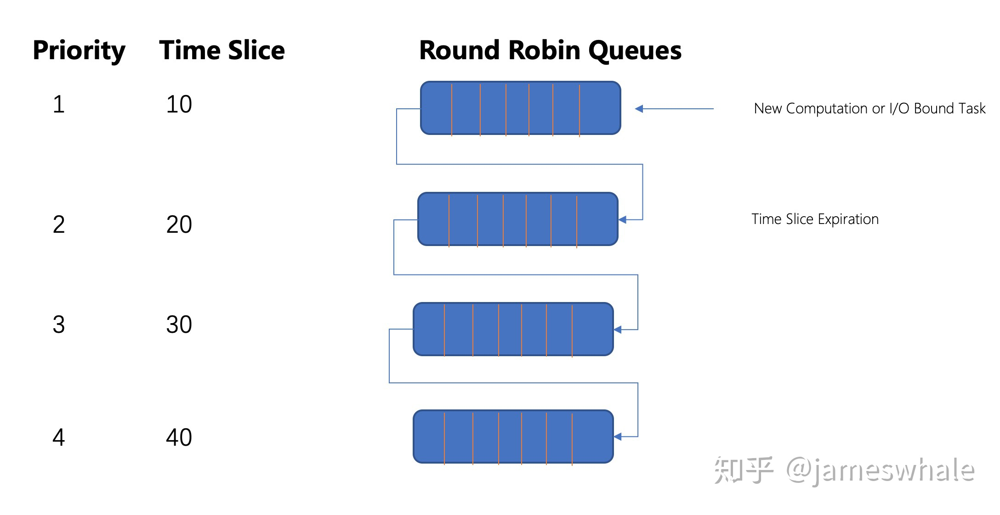
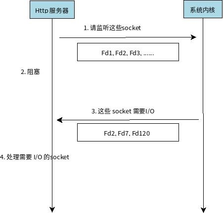

## 1. 内存

### 1.1. 分段

+ 内存重定位

  把相对地址映射成真实地址的过程。如果不支持重定位，只能在使用内存时硬编码地址；基于分段，程序只需要使用基于段的相对地址，然后更改段基地址。也使得应用程序不会修改系统和其他应用的内存空间。

  分段其实是80*86系列CPU的legacy。对于现代操作系统来说，由于已经引入了分页，分段更多的是一种历史包袱，而不是能够提供多大实际作用的内存管理机制。

### 1.2. 分页

+ 虚拟内存

  虚拟内存是计算机系统内存管理的一种技术，使得应用程序认为它拥有连续的可用内存，实际上通常是被分隔成多个物理内存碎片，还有部分暂时存储在外部磁盘，需要进行实时数据交换。

  这种技术使得大型程序编写更容易，对真正的物理内存的(RAM)使用也更有效率。

+ 缺页中断

  页(Page)是物理内存和外部存储传输的单位，当一个程序访问一个映射到地址空间却实际并未加载到物理内存的页时，硬件向软件发出一次中断(Page fault)，进而调用中断处理程序将页载入物理内存。

+ 抖动

  内存中只存放经常使用的页面，其他页面放在外存中，当进程运行需要的内容不在内存便启动磁盘读操作获取内容到内存，若内存中没有空闲物理块，需要将某页面置换出去。如果某页面刚被淘汰，又需要访问，如此反复而不能完成有效工作，这种现象称为抖动。

## 2. 进程

1. 进程间通信（IPC）

   + 管道：父子进程，基于Fork实现
   + 命名管道（FIFO）：不相关进程；
   + 消息队列
   + 信号量（[semaphores](https://gist.github.com/aspyct/3118858)），和java提供semaphores相似，用于限流
   + 共享内存：进程共享存储区
   
2. 网络IPC（Socket）

   + 新建套接字获得FD
   + bind(port)
   + listen
   + 将FD加入epoll
   + eventNum=epoll_wait()
   + 根据eventNum遍历event，在event的fd==FD时表示收到连接；
   + connFD=accept(FD)完成socket的链接，这里生成了新的文件描述符；
   + 将connFD交给线程池异步处理。
   
3. 僵尸进程、孤儿进程

   **僵尸进程**:子进程退出后父进程没有进行wait/waitPid，子进程维护的PCB始终无法退出。

   **孤儿进程**:父进程在子进程之前退出，此时子进程的父进程变为init进程，init会循环wait处理运行完成的子进程的PCB，因此孤儿进程是避免僵尸进程的一种手段。

## 3. 线程

1. 线程和进程的区别

   + 定义：进程是程序在某个数据集合上的一次运行活动；线程是进程中的一条执行路径；
   + 角色：在支持线程机制的平台上，进程是系统资源分配的单位，线程是CPU调度的单位；
   + 资源共享：进程之间不共享资源，线程共享所在进程的资源；同时线程有自己独立的栈、栈指针、程序计数器等。
   + 独立性：进程有自己独立的空间，线程没有，线程依赖于进程存在；
   + 性能：进程切换需要切换空间，开销较大；线程切换开销较小。

2. 协程 

   伪多线程、在用户态不被内核管理，开销小于线程，应用于IO密集型场景。

   在函数的执行过程中，如果遇到了耗时的 I/O 操作，函数可以临时让出控制权，让 CPU 执行其他函数，等 I/O 操作执行完毕以后再收回控制权。

### 3.1 线程调度算法

1. First In First Out

   适用于任务时长差不多的场景。

   优点：

   + 任务切换开销为0；
   + 吞吐量最大；
   + 最朴实的公平

   缺点：

   + 平均等待时间长。

2. Shortest Job First

   剩余执行时间最短的job优先执行，几乎没有使用场景。

   优点： 

   + 平均等待时间较低

   缺点：

   + 耗时长的任务迟迟得不到调度，容易形成饥饿；
   + 频繁切换，调度的额外开销大

3. Round Robin

   第一个任务先执行，时间到了将任务放到队列尾部。时间片较大则退化为FIFO，任务的完成时间变长。适用于耗时差不多的任务，不适用与计算型任务和IO型任务混合的队列。

   优点：

   + 每个任务都能得到公平调度；
   + 耗时短的任务及时后加入也能较快的得到执行；

   缺点：

   + 切换开销
   + 时间片不好设置

4. Max-Min Fairness

   先平均分配，若有剩余，将剩余的平均分配给未满足条件的任务，未满足的任务需要等待。在此基础上可以**带权重的最大最小公平算法**

5. Multi-Level Feedback Queue

   

   此方法兼顾响应时间，调度开销，饥饿避免，公平性，在三大操作系统都有使用。

   - 有多个Level，从上到下，优先级越来越低，分片时长越来越大。
   - 位于高优先级Level的任务可以抢占低优先级Level的任务。
   - 新任务首先位于高优先级Level，当一个时间片用完之后，若任务结束，则正常退出系统，若任务还没有结束，则下滑到低一等级的Level。若是因等待I/O而主动让出CPU处理，则停留在当前Level（或者提高一个Level）。
   - 同一Level的任务采用Round Robin算法。
   - 为避免系统中有太多的I/O任务而导致计算型任务迟迟得不到处理，MFQ算法会监控每个任务的处理耗时、确保其拥有公平的资源分配（按照最大最小公平算法）。在每个Level的所有任务，若有任务还没有用完分配给他的资源，则相应提高他的优先级，反之则降低其优先级。

6. 多核场景下的MFQ

   为每个CPU核分配一个MFQ，同时采用Affinity Scheduling策略，保证同一线程的执行尽量落在同一CPU核（挂起中断后重新执行）。若出现某些CPU核特别繁忙，会进行Rebalancing操作，将部分线程迁移到其他空闲的CPU核执行。线程在同一个CPU核处理可以最大化利用CPU Cache，避免频繁的从内存加载数据到CPU Cache。

   

## 4. IO

1. epoll

   

   + 水平触发：
     + 读缓冲区非空--可读--一只通知可读信号；
     + 写缓冲区不满--可写--一直通知可写信号；
   + 边缘触发
     + 读缓冲区由空变为非空--通知可读信号
     + 写缓冲区由满变为不满--通知可写信号；
   + LT是默认的，支持阻塞和非阻塞，内核通知程序FD就绪，程序对FD进行IO，如果程序不进行处理，LT会一直通知，这种模式不容易出错（poll、select）就是这种模式。假设读缓冲区中收到2kb内容，两种模式都发出可读信号，没读完时LT会一直通知，ET则不会，因此要求程序尽量一次读完，并且设置FD为非阻塞
   
2. nio和bio区别，aio区别

   1. BIO 就是传统的 [java.io](https://link.zhihu.com/?target=http%3A//java.io/) 包，它是基于流模型实现的，交互的方式是同步、阻塞方式，也就是说在读入输入流或者输出流时，在读写动作完成之前，线程会一直阻塞在那里，它们之间的调用时可靠的线性顺序。它的有点就是代码比较简单、直观；缺点就是 IO 的效率和扩展性很低，容易成为应用性能瓶颈。
   
   2. NIO 是 Java 1.4 引入的 java.nio 包，提供了 Channel、Selector、Buffer 等新的抽象，可以构建多路复用的、同步非阻塞 IO 程序，同时提供了更接近操作系统底层高性能的数据操作方式。
   
   3. AIO 是 Java 1.7 之后引入的包，是 NIO 的升级版本，提供了异步非堵塞的 IO 操作方式，所以人们叫它 AIO（Asynchronous IO），异步 IO 是基于事件和回调机制实现的，也就是应用操作之后会直接返回，不会堵塞在那里，当后台处理完成，操作系统会通知相应的线程进行后续的操作。
   
      同步和异步指的调用关系，A调用B，A需要等待B返回，则是同步；否则异步。阻塞和非阻塞表示执行耗时操作时CPU能否去做其他事情。可以形成4中组合。
   
      |        | 同步 | 异步 |
      | ------ | ---- | ---- |
      | 阻塞   | BIO: |      |
      | 非阻塞 | NIO: | AIO: |
   
      

## 5. 其他

1. 字符集和字符编码

   计算机存储二进制，字符集是系统支持的抽象字符的合集，比如英文、汉字、ASCII字符集、Unicode字符集。将字符存储在计算机中，如`a`用什么表示，称作`编码`。**字符编码**是一套法则，用于将一个字符集与另一个集合进行配对，比如将英文转化为计算机存储的二进制。**可以这样理解：Unicode是字符集，UTF-32/ UTF-16/ UTF-8是三种字符编码方案**

2. 大端小端

   假设一个32bit=4byte的int为`0x04030201`

   | 每个字节               | 04   | 03   | 02   | 01   |
   | ---------------------- | ---- | ---- | ---- | ---- |
   | 有效字节               | MSB  |      |      | LSB  |
   | 小端：低字节位于低地址 | p[3] | p[2] | p[1] | p[0] |
   | 大端：低字节位于高地址 | p[0] | p[1] | p[2] | p[3] |

3. 用户态和内核态

   类UNIX操作系统把计算机物理组织相关的底层细节对用户运行的程序进行隐藏，当程序想用硬件资源时，必须向操作系统发出请求，内核对这个请求进行评估，如果允许使用这个资源，那么内核代表应用程序与相应的硬件进行交互。

   硬件CPU引入至少两种不同的执行模式：用户程序的非特权模式和内核的特权模式，unix把他们分为用户态和内核态。
   
4. `kill` 命令

   不带参数时等价于`kill -15`发送`SIGTERM`信号，通知程序终止，可以`catch`可以`ingonre`。`kill -9`发送`SIGKILL`信号`non-catchable`, `non-ignorable`。

   `Java`应用程序作为独立进程运行，通过`JVM`的关闭实现程序终止，分为3中方式：

   + 正常关闭：最后一个非守护线程结束或者调用`System.exit`或者通过其他特定平台关闭，如`SIGINT(2)`，`SIGTERM(15)`等
   + 强制关闭：通过调用`Runtime.halt`方法或者操作系统中强制`kill`(接收到`SIGKILL(9)`);
   + 异常关闭：运行中遇到`RuntimeException`等；

   `JVM`在接收到`Kill -15`时能够做一些清理动作，比如删除临时文件等，也为开发者提供了可以做清理动作的`shutdown hook`,比如让tomcat容器停止，让dubbo服务下线等。

   ```java
   Java.Runtime.addShutdownHook(Thread hook)
   ```

   非必要情况下不要使用`kill -9`，这可能带来数据丢失，数据不一致的情况，尤其是那些web应用、提供RPC服务、执行定时任务、包含长事务等应用中。