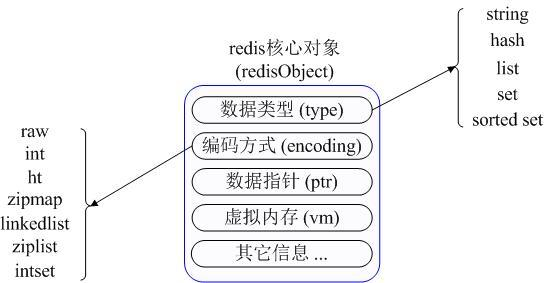
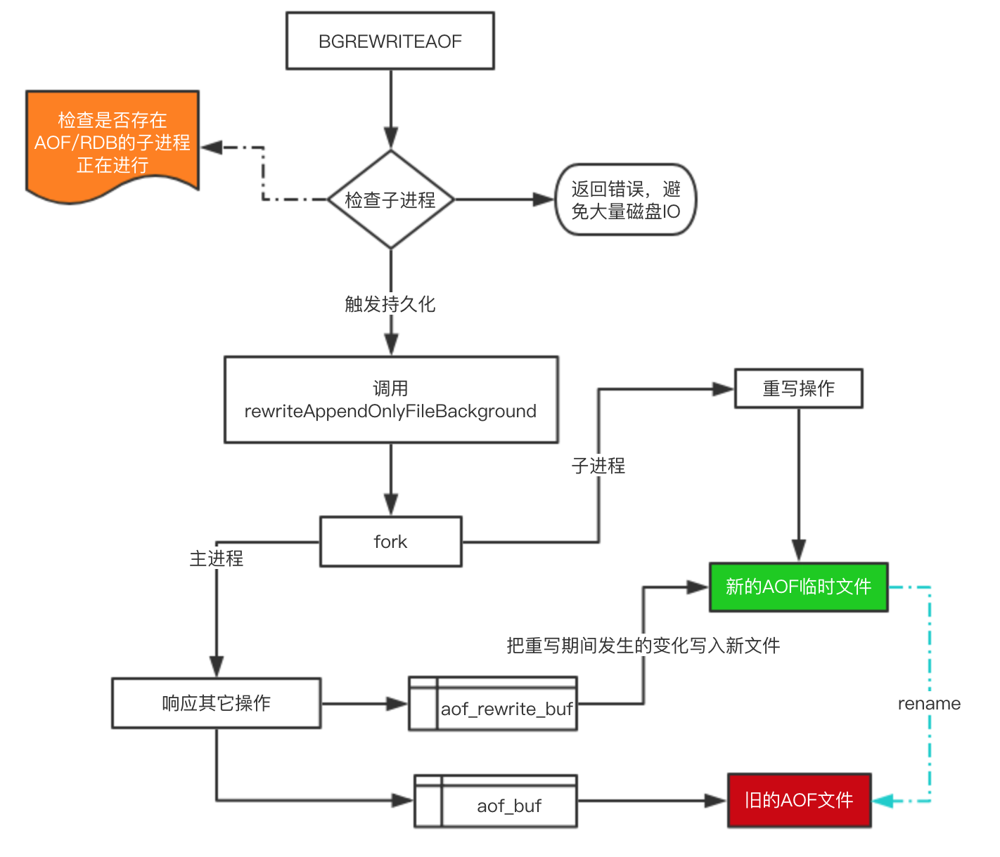

[redis的五大数据类型实现原理](https://www.cnblogs.com/ysocean/p/9102811.html)

## 1. 数据类型

+ **redisObject**

​	Redis内部使用一个redisObject对象来标识所有的key和value：

+ type：标识一个value对象具体的数据类型；

+ encoding：不同数据在redis内部的存储方式。

  比如：type=string，那么对应的encoding可以是raw或者是int，如果是int则代表实际redis内部是按数值型类存储和表示这个字符串的，前提是这个字符串本身可以用数值表示，比如:"123" "456"这样的字符串。

所有数据类型都是key-value模式，key用于索引，value表示存储，不同数据类型value不同。

### 1.1 String

value不仅可以是string也可以是数字，string是二进制安全，可以存储图片或序列化的对象。

+ 场景：key-value缓存，常规计数：微博数、粉丝数。

+ 命令：

  | get  |                       |
  | ---- | --------------------- |
  | set  |                       |
  | incr | value当作数值进行计算 |
  | decr | value当作数值进行计算 |
  | mget |                       |

  

### 1.2 hash

value是一个HashMap。存储一个对象时，如果使用String类型需要序列化和反序列化，修改对象某个属性需要获得整个对象；使用hash类型将对象的每个属性存为键值对，之后获取不需要序列化和反序列化，并且可直接修改某属性。

上面已经说到Redis Hash对应Value内部实际就是一个HashMap，实际这里会有2种不同实现，这个Hash的成员比较少时Redis为了节省内存会采用类似一维数组的方式来紧凑存储，而不会采用真正的HashMap结构，对应的value redisObject的encoding为zipmap，当成员数量增大时会自动转成真正的HashMap，此时encoding为ht。

+ 场景：存储部分变更数据，如用户信息等。

+ 命令

  | HMSET | HSET myhash field1 "Hello" field2 "World" |
  | ----- | ----------------------------------------- |
  | HMGET | HGET myhash field2                        |

### 1.3 list

value是字符串列表，按照插入顺序排序，可添加一个元素到列表头(lpush)部或尾部(rpush)。每个元素都是String类型的双向链表，支持反向查找和遍历。列表最多可存储 pow(2,32) - 1 元素。

+ 场景：消息队列系统，比如日志收集器：多个端点将日志写入redis，然后一个worker统一将所有日志写到磁盘。

+ 秒杀：atomicInteger记录卖出数量，增长过程中，将用户ID用rpush进入list，然后再逐渐lpop处理用户ID。

+ 命令

  | lpush  | 左边添加元素       |
  | ------ | ------------------ |
  | rpush  | 右边添加元素       |
  | lpop   | 移除左边第一个元素 |
  | rpop   | 移除右边第一个元素 |
  | lrange | 获取列表片段       |

### 1.4 set 

value 是string类型的无序集合，集合通过HashTable实现，可以交集、并集、差集等。元素添加、删除、查找复杂度都为O(1)。

 set 的内部实现是一个 value永远为null的HashMap，实际就是通过计算hash的方式来快速排重的，这也是set能提供判断一个成员是否在集合内的原因。

+ 场景：集合运算，在微博中，可以将一个用户所有的关注人存在一个集合中，将其所有粉丝存在一个集合。可以非常方便的实现如共同关注、共同喜好、二度好友等功能。

+ 命令

  | spush    |      |
  | -------- | ---- |
  | spop     |      |
  | smembers |      |
  | sunion   |      |

### 1.5 ZSet

value是string类型的元素集合，且不允许重复的元素。与set相比，sorted set关联了一个double类型权重参数score，使得集合中的元素能够按score进行有序排列，zset成员是唯一的但是score却可以重复。元素是插入有序的，并且可以通过用户额外提供一个score参数来为元素排序。

内部使用HashMap和跳跃表（SkipList）保证数据的存储和有序，

+ 场景：带权重的队列：比如普通消息的score为1，重要消息的score为2，然后工作线程可以选择按score的倒序来获取工作任务。让重要的任务优先执行。
  
+ 排行榜
  
+ 命令

  | zadd   | zadd runoob 0 mongodb |
  | ------ | --------------------- |
  | zrange |                       |
  | zrem   |                       |
  | zcard  |                       |

+ 原理

  在满足保存元素少于128且所有元素都是少于64byte时，使用ziplist编码（底层使用压缩链表实现）。否则使用skiplist实现。

  

  每个集合元素使用两个紧挨在一起的压缩列表节点保存，第一个节点保存元素成员，第二个节点保存元素的score。元素集合按照socre从小到大排列。

  + **Sikplist**

    [跳跃列表（Skip List）与其在Redis中的实现详解](https://www.jianshu.com/p/09c3b0835ba6)

    一个zset结构包含一个字典和一个跳表。字典的key保存元素的值，字典的value保存元素的分值；跳表节点的object属性保存元素的成员，跳表节点的score属性保存元素的分值。

    两种数据结构通过指针共享相同元素的的成员和分值，减少内存浪费。

## 2 集群

Redis集群使用分片（sharding）而非一致性hash实现。

所有key根据hash函数`CRC16[key]&16383`映射到0-16383槽内，每个节点维护部分槽及槽所映射的键值数据。采用了分散性较好的哈希函数，所有的数据大致均匀分布在0~16383各个槽中，解决了普通一致性哈希分区只有少量节点负载不均衡问题。

通过引入槽，让槽成为集群内数据管理和迁移的基本单位，简化了节点扩容和收缩难度，你只需要关注数据在哪个槽，并不需要关心数据在哪个节点上。

​	

这种结构很容易 **添加** 或者 **删除** 节点。如果 **增加** 一个节点 `6`，就需要从节点 `1 ~ 5` 获得部分 **槽** 分配到节点 `6` 上。如果想 **移除** 节点 `1`，需要将节点 `1` 中的 **槽** 移到节点 `2 ~ 5` 上，然后将 **没有任何槽** 的节点 `1` 从集群中 **移除** 即可。

[Redis Sentinel 高可用原理](https://juejin.im/post/5b7d226a6fb9a01a1e01ff64)

TODO 如何找到所在的槽和所在的节点。

## 3. 持久化

定时任务机制：配置文件通过`hz`配置，不建议超过500，频率过高会消耗CPU，从而影响读写性能。使用自己实现的**TimeEvent**，定时调用一些命令完成任务，这些任务可能阻塞主进程导致性能下降。

### 3.1 RDB

在指定的时间间隔内对数据进行快照存储。

#### 手动触发

+ `save`：阻塞当前服务，直到持久化完成，线上禁止使用
+ `bgsave`：`fork`子进程进行持久化，阻塞只发生在`fork`时

#### 自动触发

+ `save m n`规则
+ 从节点全量复制时，主节点发送rdb文件给从节点完成复制操作，主节点会触发 `bgsave`
+ 执行 `debug reload` 时；
+ 执行 `shutdown`时，如果没有开启aof，也会触发。

### 3.2 AOF

记录每次对服务器的写操作，服务器重启时重新执行这些命令来恢复原始数据.

#### 1. 命令实时写入

命令写入->追加到aof_buf ->同步到aof磁盘

这里不直接写入磁盘，防止磁盘IO影响性能。

#### 2. AOF重写

aof重写是为了减少aof文件的大小。

+ 在重写期间，由于主进程依然在响应命令，为了保证最终备份的完整性；因此它依然会写入旧的AOF file中，如果重写失败，能够保证数据不丢失。

+ 为了把重写期间响应的写入信息也写入到新的文件中，因此也会为子进程保留一个buf，防止新写的file丢失数据。

+ 重写是直接把当前内存的数据生成对应命令，并不需要读取老的AOF文件进行分析、命令合并。

+ AOF文件直接采用的文本协议，主要是兼容性好、追加方便、可读性高可认为修改修复。

  无论是RDB还是AOF都是先写入一个临时文件，然后通过 `rename` 完成文件的替换工作。

#### 3.3 数据恢复

只需要从起redis即可，启动时会先检查AOF文件是否存在，如果不存在就尝试加载RDB。那么为什么会优先加载AOF呢？因为AOF保存的数据更完整，通过上面的分析我们知道AOF基本上最多损失1s的数据。

