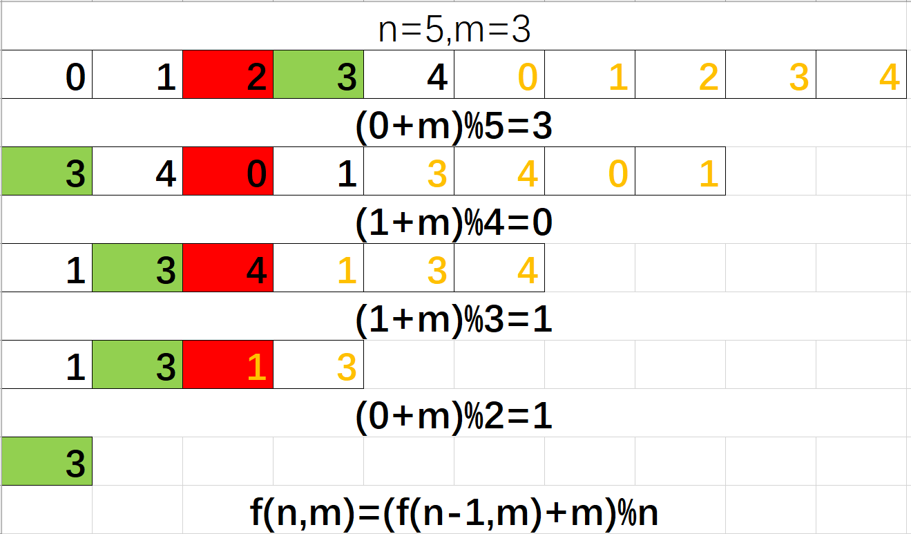

## 0. 数据结构和算法之美

数据结构为算法服务，算法要作用在特定的数据结构上。复杂度分析是数据结构和算法的精髓。

10 个数据结构：数组、链表、栈、队列、散列表、二叉树、堆、跳表、图、Trie 树；

10 个算法：递归、排序、二分查找、搜索、哈希算法、贪心算法、分治算法、回溯算法、动态规划、字符串匹配算法。

逐个攻破，“来历”“自身的特点”“适合解决的问题”以及“实际的应用场景”

### 0.1 复杂度分析

#### 0.1.1 时间复杂度

 大`O`分析是渐进时间复杂度分析：

+ 复杂度技巧
  + 只需要关注循环次数最多的一段代码
  + 加法法则：总复杂度等于量级最大的那段代码的复杂度
  + 乘法法则：嵌套代码的复杂度等于嵌套内外代码复杂度的乘积

+ 常用复杂度量级
  $$
  常量阶：O(1),
  对数阶：O(logn),
  线性阶：O(n),
  线性对数阶：O(nlogn)
  $$

  $$
  平方阶：O(n^2),
  立方阶：O(n^3),
  k次方阶：O(n^k)
  $$

  非多项式量级(Non-Deterministic Polynomial) 即**NP**难问题：
  $$
  指数阶：O(2^n)，
  阶乘阶：O(n!)
  $$

  + `O(logn)`

    ```java
     i=1;
     while (i <= n)  {// 循环条件i成等比数列变化 1,2,4,8...2^x
       i = i * 2; 
     }
    ```

    循环控制变量成等比变化，`2^x=n`所以`X=log2n`，这里忽略底数，因为:
    $$
    log_3n=log_32*log_2n
    $$
  
+ `O(nlogn)`来自于乘法法则，外层`O(n)`内层`O(logn)`

#### 0.1.2 空间复杂度

渐进空间复杂度：表示存储空间随数据规模增长的变化情况。

#### 0.1.3 最好、最坏、平均、均摊

```
// n表示数组array的长度
int find(int[] array, int n, int x) {
  int pos = -1;
  for (int i = 0; i < n; ++i) {
    if (array[i] == x) {
       pos = i;
       break;
    }
  }
  return pos;
}
```

+ 最好：O(1)

+ 最坏：O(n)

+ 平均（加权平均值/期望）：每种情况的概率*次数，然后平均。

+ 均摊复杂度:eg. 两个栈实现一个队列？

  对一个数据结构进行一组连续操作中，大部分情况下时间复杂度都很低，只有个别情况下时间复杂度比较高，而且这些操作之间存在前后连贯的时序关系，这个时候，我们就可以将这一组操作放在一块儿分析，看是否能将较高时间复杂度那次操作的耗时，平摊到其他那些时间复杂度比较低的操作上。而且，在能够应用均摊时间复杂度分析的场合，一般均摊时间复杂度就等于最好情况时间复杂度。

  ```c++
  // 全局变量，大小为10的数组array，长度len，下标i。
  int array[] = new int[10]; 
  int len = 10;
  int i = 0;
  
  // 往数组中添加一个元素
  void add(int element) {
     if (i >= len) { // 数组空间不够了
       // 重新申请一个2倍大小的数组空间
       int new_array[] = new int[len*2];
       // 把原来array数组中的数据依次copy到new_array
       for (int j = 0; j < len; ++j) {
         new_array[j] = array[j];
       }
       // new_array复制给array，array现在大小就是2倍len了
       array = new_array;
       len = 2 * len;
     }
     // 将element放到下标为i的位置，下标i加一
     array[i] = element;
     ++i;
  }
  ```

  前每隔len、len、2len、4len次`O(1)`的操作后进行一次O(len)、O(2len)、O(4len)、O(8len)的:

  | 扩容         | 0         | 1         | 2         | 3         |
  | ------------ | --------- | --------- | --------- | --------- |
  | O(1)次数     | len       | len       | 2len      | 4len      |
  | 扩容复杂度   | O(len)    | O(2len)   | O(4len)   | O(8len)   |
  | 均摊到前一段 | O(1)+O(1) | O(1)+O(2) | O(1)+O(2) | O(1)+O(2) |

  

## 1. 数据结构

### 1.1 数组&矩阵

`Java`中对象的数组值保存对象的引用，基本类型的数组才会直接保存值。`64bit`下(默认开启指针压缩。)引用大小为`4字节`

+ [二维数组(从左到右递增，从上到下递增)中的查找](https://www.nowcoder.com/practice/abc3fe2ce8e146608e868a70efebf62e?tpId=13&tqId=11154&tPage=1&rp=1&ru=/ta/coding-interviews&qru=/ta/coding-interviews/question-ranking)
  + 从左下角开始，大于目标值往右，小于目标值往上
+ 顺时针旋转方阵
  + 先沿着左上-右下对角线翻转
  + 再左右镜像翻转

### 1.2 链表

分为单向链表、双向链表、循环链表。`JCF.LinkedList`内部存储结构为双向链表，可作为栈和队列使用。

+ 从尾到头打印单向链表
  + 递归返回时打印节点；
  + 栈+循环
+ 倒数第n个节点：
  + 快慢指针，快的到达末尾，慢的就是结果。
+ 人字形链表的分叉点
  + 两个指针，第一次相同时为结果
+ 翻转链表
  + 递归到尾部，返回时切换指针方向。
+ 合并两个排序的链表
+ 用链表实现大数的和，345+456=801，用链表表示：5-4-3+6-5-4=1-0-8
  + 低位在前就可以直接两个的低位求和，计算是否进位，不进位部分放入结果链表。

### 1.3 树

```
1. 递归可以top-down 或 bottom-up；
1. 利用栈数据结构可以利用循环实现 top-down；
1. JCF中LinkedList 和ArrayDeque 是deque的实现，取代了Stack；
1. 需要处理树的同一层（按行打印）时，需要借助栈和循环实现。
```

1. 二叉树

   前序遍历、中序遍历、后序遍历

   + 根据前序和中序重建二叉树
     + 前序区间第一个节点是root，root在中序中可分隔左右子树
   + 后序遍历、不使用递归（借助栈实现）
   + 树的子结构
   + 二叉树的镜像 
   + 二叉树每个节点是0-9的数字，计算每条路径组成数字之和。
     + 父节点的sum递归给子节点，子节点将sum*10+自己得到新的sum；
     + 如果没有子节点，则返回sum，有则将sum递归给子节点；
     + 最后返回左右子树返回值的和。

2. 二叉搜索树 BST

3. 平衡二叉树(AVL)

4. 红黑树

   `JCF.HashMap`自1.8开始链表长度>8并且capicity>64时变为红黑树。

5. B树

6. B+树

   `innoDB`索引。

   

### 1.4 图

顶点、边

度：顶点的边的条数

#### 1.4.1 无向图

微信好友

#### 1.4.2 有向图

微博可单向关注

入度

出度

#### 1.4.3 带权图

QQ的亲密度

#### 1.4.4 存储方式

1. 邻接矩阵：基于二维数组，直观计算方便，但浪费存储空间（稀疏图），无向图只需要对角线分割的一半矩阵

   

2. 邻接表：节省空间，但是计算不方便，缓存不友好

   

### 1.4 栈

先入后出，用作需要逆序的辅助，`JCF`对应的数据结构有`ArrayDeque`、`LinkedList`、`Stack`

+ 两个栈模拟队列

### 1.5 队列

先入先出，`JCF`对应的数据结构有`ArrayDeque`、`LinkedList`

### 1.6 Hash


## 2. 算法

### 递归


### 2.1 排序

1. **Quick Sort**

   + partition过程
   + **每次partition，就能确定一个数的最终位置**，可用于快速查找一个数组中的topk个数。

   

2. 归并排序

   + 是否稳定

     取决于merge函数，是一个稳定函数。

   + 时间复杂度

     与数据有序程度无关，都是nlogn

   + 空间复杂度

     merge函数借助额外存储空间。每次都要开辟不同的空间，但是只考虑最大情况O(n)。

3. 冒泡排序

   + 空间复杂度
   + 是否稳定
   + 时间复杂度

4. 插入排序

   

5. 选择排序

   

6. 堆排序

7. 希尔排序

### 2.2 查找

1. 二分查找
   + 旋转数组中最小的数字
     + 查找最小，目标在右区间，因此从左边推进l=mid+1，r=mid；
     + l推进时可能掉低点，因此下一轮mid和l比较时导致漏掉答案，因此l推进时最好和r进行比较。

### 2.3 解空间搜索

1. n个相同的礼物分给k个小朋友，给出所有划分方案
   + n个礼物和k-1个分隔符之间的排列
   + 利用递归，决定当前层应该放礼物还是分隔符

### 2.4 动态规划

​	

动态规划题型重点是分析递归方程，**递归方程**刻画从上到下的规律，实现时，从下往上实现，往往需要辅助空间用以减少重复计算。

递归方程得到的结果不一定是问题的结果，问题的过程可能是递归计算过程中的最值。

动态规划适用场景：

+ **最优子结构性质**：一个最优化策略的子策略总是最优的
+ **无后效性**：每个状态都是过去历史的一个完整总结
+ **子问题的重叠**：存在冗余计算

​	对于简单问题，如果递归方程出来之后可以考虑能否直接数学计算。

1. 计算两段文本的编辑距离

   ```
    D[i][j] = if charI=charJ: D[i-1][j-1] 
    		 = else: min{D[i-1][j],D[i][j-1],D[i-1][j-1]}+1
    		 分别表示，增加、删除、替换三种操作
   ```

2. 青蛙跳台阶，每次能跳1或2步，一共多少种跳法。

   ```
   T(n) = T(n-1)+T(n-2) // 表示最后一次跳的1步还是两步
   ```

   + 矩形覆盖
   + 斐波那契数列

3. 变态青蛙跳台阶,每次能跳1...n步

   + 思路一：递归方程

   ```
   T(n) = T(n-1)+T(n-2)+ ....T(n-n+1)
   T(n-1) = T(n-2)+ ....T(n-n+1)
   T(n) = 2T(n-1)
   ```

   + 思路二：每个台阶存在与否，表示那个台阶是否经过。共`pow(2,n-1)`
   
4. #### [连续子数组的最大和](https://leetcode-cn.com/problems/lian-xu-zi-shu-zu-de-zui-da-he-lcof/)

   ```
   f(n) = max(f(n-1)+num[n], num[n])
   // f(n)表示包含num[n]结尾的子数组的最大和
   // f(n)并不是最终结果，最终结果是计算过程中的最值。
   ```

   

### 2.5 二进制

 	1. 输入一个整数，输出该数二进制表示中1的个数。
     + 1不断左移与输入数字&，结果正负证明该bit为0还是1.
 	2. 求base(double)的exponent(int)次方
     + pow(2,11)=pow(2, 1011)=pow(2, 0001)+pow(2, 0010)+pow(2, 1000)
     + exp不断右移，每次&1，结果为正数表示该bit有效
     + **正数右移计算更少**(负数右移填充不确定)：右移exp比左移1更好。

### 2.6 组合

#### 2.6.1 双指针

对于有序数组的组合利用双指针可以将`O(n^2)`的复杂度降低为`O(n)`，非有序的不能使用，有序才能保证组合结果不漏。

如果将非有序数组排序后进行双指针，则复杂度为`O(nlogn)+O(n)`任然低于原来的`O(n^2)`


+ 两数之和、三数之和

## 3 其他

1. 手写LRU
   
   + 继承LinkedHashMap实现，指定capicity，cacheSize，并继承`removeEldestEntry`使其不扩容大于cacheSize时进行丢弃。
   
2. [约瑟夫环](https://leetcode-cn.com/problems/yuan-quan-zhong-zui-hou-sheng-xia-de-shu-zi-lcof/)

   使用链表或数组模拟，但是可能会超时。公式推导如下：
   
   
   
   红色表示每一轮删除的元素，用复制表示循环，最后剩余元素及其位置用绿色表示。剩余元素的位置之间有关系：逆向递推公式，然后得到正向递推公式。
   
   + 之前的思路是关注每一轮要删除的元素的位置，但是目标是确定剩余元素在原始数组中的位置，因此应该逆向思考。
   + 循环数组问题，使用多次复制来表示更清晰。