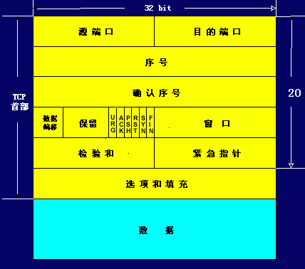
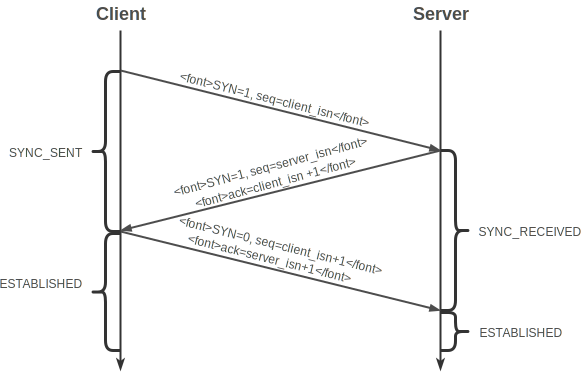

# Internet

1. OSI七层协议

   

   + 物理层：比特流的透明传输

     RJ45、CLOCK、IEEE802.3 （中继器，集线器）

   + 数据链路：通过各种控制协议，将有差错的物理信道变为无差错的、能可靠传输数据帧的数据链路

     PPP、FR、HDLC、VLAN、MAC （网桥，交换机）

   + 网络层：提供路由和寻址的功能，使两终端系统能够互连且决定最佳路径，并具有一定的拥塞控制和流量控制的能力。

     IP、ICMP、ARP、RARP、OSPF、IPX、RIP、IGRP、 （路由器）

   + 传输层：向用户提供可靠的端到端的差错和流量控制，保证报文的正确传输。传输层的作用是向高层屏蔽下层数据通信的细节，即向用户透明地传送报文

     TCP、UDP、SPX

   + 会话层：向两个实体的表示层提供建立和使用连接的方法。

     NFS、SQL、NETBIOS、RPC

   + 表示层：对来自应用层的命令和数据进行解释，对各种语法赋予相应的含义，并按照一定的格式传送给会话层

     JPEG、MPEG、ASII

   + 应用层：FTP、DNS、Telnet、SMTP、HTTP、WWW、NFS

1. 为什么要对网络进行分层

   + 各层相互独立，上层只需要知道下层提供的接口和功能，不用关注实现细节；
   + 各层之间灵活性好，一层的改变不影响另一层；
   + 易于实现和标准化，复杂问题分为多个简单的问题处理。

## 1. 物理层

## 2. 数据链路层

## 3. 网络层

### 3.1 IP 地址

+ 查看命令
  + Windows： `ipconfig`
  + Linux：`ip addr`、`ifconfig`

+ 定义和属性

  网卡在网络世界的通讯地址，被点分隔成4个部分，IPV4 = 8bit*4=32bit;

+ 五类地址

  

  每一类地址的数量：

  | 类别 | IP地址范围                | 最大主机数 | 私有IP地址范围              |
  | ---- | ------------------------- | ---------- | --------------------------- |
  | A    | 0.0.0.0-127.255.255.255   | 16777214   | 10.0.0.0-10.255.255.255     |
  | B    | 128.0.0.0-191.255.255.255 | 65534      | 172.16.0.0-172.31.255.255   |
  | C    | 192.0.0.0-223.255.255.255 | 254        | 192.168.0.0-192.168.255.255 |

  C类地址最大主机数太少，B类地址最大主机数太多。

+ 无类型域间选路(CIDR)

  不采用原有的五类地址划分，直接将32位地址分为网络号+主机号，eg.`10.100.122.2/24`表示前24是网络号，后8位是主机号。

  伴随着CIDR存在的，一个**广播地址**：`10.100.122.255`如果发送这个地址，所有`10.100.122`网络里面的及其都可以接收到；另一个是**子网掩码**，`255.255.255.0`.

  **网络号=IP AND 子网掩码**，eg. `10.100.122.255&255.255.255.0=10.100.122.0`。

+ 公有IP和私有IP

  

### 3.2 IP协议

### 3.3 ICMP

Ping与ICMP

### 3.4 ARP

## 4. 传输层

TCP和UDP区别

- TCP面向连接(三次握手）;UDP是无连接的，即发送数据之前不需要建立连接
- TCP提供可靠的服务。也就是说，通过TCP连接传送的数据，无差错，不丢失，不重复，且按序到达;UDP尽最大努力交付，不保证可靠交付；
- TCP面向字节流，实际上是TCP把数据看成一连串无结构的字节流;UDP是面向报文的UDP没有拥塞控制，因此网络出现拥塞不会使源主机的发送速率降低（对实时应用很有用，如IP电话，实时视频会议等）
- 每一条TCP连接只能是点到点的;UDP支持一对一，一对多，多对一和多对多的交互通信。
- TCP首部开销20字节;UDP的首部开销小，只有8个字节；
- TCP的逻辑通信信道是全双工的可靠信道，UDP则是不可靠信道。

### 4.1 TCP

1. TCP拥塞控制

   + 拥塞控制

     1. TCP连接初始化，将拥塞窗口cwind设置为1个报文段，即cwind=1；

     2. 执行慢开始算法，cwind按照指数规律增长；直到cwind==ssthresh时，开始执行拥塞避免算法，cwind按照线性规律增长；

     3. 当网络发生拥塞，把ssthresh(slow start thresh)更新为拥塞前的一半，cwind重新设置为1，再按照2执行。

        第3的目的是迅速减少主机发送到网络中的分组数，使得发生拥塞的路由器有足够的时间把队列中积压分组处理完毕。

        目前有非常多的拥塞控制协议：

        + 基于丢包：缓慢探测-出现丢包-拥塞窗口减小，Reno、Cubic。
        + 基于时延：时延增加-出现拥塞-减小拥塞窗口，Vegas、FastTCP。
        + 基于链路容量：实时测量网络带宽和延迟，报文总量>带宽*延迟时出现拥塞，BBR。
        + 基于学习：借助评价函数，使用机器学习的方法形成控制策略。

   + 流量控制

     如果发送方把数据发送得过快，接收方可能会来不及接收，这就会造成数据的丢失。

     TCP的流量控制是利用滑动窗口机制实现的，接收方在返回的ACK中会包含自己的接收窗口的大小，以控制发送方的数据发送。但是，当某个ACK报文丢失，就会出现互相等待的死锁状态，为了解决这种问题引入了持续计数器，当A收到rwnd=0时，就启用该计时器，时间到了则发送一个1字节的探测报文，询问B是繁忙还是丢失了上个ACK，然后B回应自身的接收窗口大小，返回rwnd=0（A重置计时器继续等待）或rwnd=x。

1. TCP 报文

   

   + 16位源端口号：标识报文的返回地址
   + 16位目的端口号：指明报文接收计算机上的应用程序地址接口
   + 32位序号：接收端用于将报文重新分段成最初的形式。当SYN出现，序列码实际上是初始序列码（Initial Sequence Number，ISN），而第一个数据字节是ISN+1。这个序列号（序列码）可用来补偿传输中的不一致。
   + 32位确认序号：由接收端计算机使用，重组分段的报文成最初形式。如果设置了ACK控制位，这个值表示一个准备接收的包的序列码。
   + 4位首部长度：表示TCP头大小，指示何处数据开始。
   + 保留（6位）：为了将来定义新的用途而保留，这些位必须是0。
   + 标志（6位）：
     + SYN(synchronous),建立联机。
     + ACK(acknowledgement),确认。
     + PSH(push),传输。
     + FIN(finish),结束。
     + RST(reset),重置。
     + URG(urgent),紧急
   + 16位窗口大小：用来表示想收到的每个TCP数据段的大小。TCP的流量控制由连接的每一端通过声明的窗口大小来提供。窗口大小为字节数，起始于确认序号字段指明的值，这个值是接收端正期望接收的字节。窗口大小是一个16字节字段，因而窗口大小最大为65535字节。
   + 16位校验和：源机器基于数据内容计算一个数值，用于证明数据的有效性。这是一个强制性的字段，一定是由发送端计算和存储，并由接收端进行验证的。
   + 16位紧急指针：指向后面是优先数据的字节，在URG标志设置了时才有效。如果URG标志没有被设置，紧急域作为填充。加快处理标示为紧急的数据段。
   + 选项：长度不定，但长度必须为1个字节。如果没有选项就表示这个1字节的域等于0。
   + 数据：该TCP协议包负载的数据。

1. tcp的三次握手和四次挥手

   socket编程中由客户端调用connect发起。

   

   

   
   建立连接时，三次握手：

   - 建立连接时，客户端发送SYN包（seq=C）到服务器，并进入到SYN-SEND状态，等待服务器确认
   - 服务器收到SYN包，必须确认客户的SYN（ack=C+1）,同时自己也发送一个SYN包（seq=S）,即SYN+ACK包，此时服务器进入SYN-RECV状态
   - 客户端收到服务器的SYN+ACK包，向服务器发送确认报ACK（ack=S+1）,此包发送完毕，客户端和服务器进入ESTABLISHED状态，完成三次握手，客户端与服务器开始传送数据。

   

   
   断开连接时四次挥手，socket编程中由close来触发:

   - Initiator 发送一个FIN（seq=I）用来关闭自己到Receiver的数据传输，进入FIN_WAIT_1阶段；
   - Receiver接收到FIN后，返回一个ACK（ack=I+1)，进入CLOSE_WAIT阶段；
   - Receiver向Initiator发送一个FIN+ACK（seq=R,ack=I+1），进入LAST_ACK阶段；
   - Initiator 回复一个ACK（ack=R+1）的报文后进入TIME_WAIT状态。

1. 为什么是三次握手而不是两次或者四次

   TCP协议是全双工、支持半关闭的可靠传输协议，其中使用seq来判断哪些包需要重传，和包乱序的问题。三次握手能实现两个作用：

   + 初始化双方seq

     通信双方协商一个初始seq至少需要一次SYN和一次ACK，由于TCP是全双工的，所以需要协商两个初始seq，即需要2*（一次SYN和一次ACK），简单优化，可以将中间ACK和SYN合并就变成了三次握手。

   + 确认双方信道可以实现最低限度的全双工

     第二次握手证明C到S可靠，第三次握手证明S到C可靠。

1. 为什么连接的时候是三次握手，关闭的时候却是四次握手？

   TCP协议是全双工、支持半关闭：FIN+ACK表示C端关闭了，但是S端还可以继续传输。

   因为当Server端收到Client端的SYN连接请求报文后，可以直接发送SYN+ACK报文。其中ACK报文是用来应答的，SYN报文是用来同步的。但是关闭连接时，当Server端收到FIN报文时，很可能并不会立即关闭SOCKET，所以只能先回复一个ACK报文，告诉Client端，"你发的FIN报文我收到了"。只有等到我Server端所有的报文都发送完了（或者相关准备好了），我才能发送FIN报文，因此不能一起发送。故需要四步握手。

1. 为什么TIME_WAIT状态需要经过2MSL(最大报文段生存时间)才能返回到CLOSE状态？

  - ACK丢失时，对方没有收到，重新发送最后的FIN，TCP需要再次发送最后的ACK;
  - 经过时间2MSL，就可以使本连接持续的时间内所产生的所有报文段，都从网络中消失。这样就可以使下一个新的连接中不会出现这种旧的连接请求报文段。

### 4.2 UDP

## 5. 应用层

在OSI七层协议中，这里应用层分为会话层、表示层、应用层。

### 5.1 HTTP

1. HTTP 的方法

   - GET  `HTTP/0.9`

     显示请求指定资源，只用于数据的获取，不用于会产生副作用的·=`非幂等`操作，不安全；

   - HEAD `HTTP/1.0`

     与GET方法一样都是向服务器请求指定资源，但是服务器响应是不包括请求资源的内容，常用于客户端查看服务器性能。

   - POST `HTTP/1.0`

     向指定资源发送数据，请求服务器处理，如：表单提交，文件上传等。请求数据包含在请求体中，此方法是`非幂等`操作，可能会创建新的资源或修改现有资源。

   - PUT `HTTP/1.1`

     向指定资源位置上传最新的内容取代旧的内容，是`幂等`方法。

   - DELETE `HTTP/1.1`

     请求服务器删除URI标识的资源，也是`幂等`方法。

   - CONNECT `HTTP/1.1`

     能够将连接改为管道方式的代理服务器。通常用于[SSL](http://itbilu.com/other/relate/N16Uaoyp.html)加密服务器的链接与非加密的HTTP代理服务器的通信。

   - OPTIONS `HTTP/1.1`

     `OPTIONS`请求与`HEAD`类似，一般也是用于客户端查看服务器的性能。 请求服务器返回该资源所支持的所有HTTP请求方法。

   - TRACE `HTTP/1.1`

     请求服务器回显其收到的请求信息，用于HTTP请求的测试或诊断，比如：可以看到服务器最终接收的报文中的IP地址，推断是否经过了代理。

   - PATCH `HTTP/2`

     与`PUT`请求类似，同样用于资源的更新。`PATCH`用于资源的部分更新，`PUT`用于整体更新。当资源不存在时，`PATCH`会创建一个新的资源，而`PUT`只会对已在资源进行更新。

1. HTTP状态码

   | 分段 | 意义                                           | 举例                                              |
   | ---- | ---------------------------------------------- | ------------------------------------------------- |
   | 1**  | 信息，服务器收到请求，需要请求者继续执行操作   | 100: Continue; 101: Switching Protocols           |
   | 2**  | 成功，操作被成功接收并处理                     | 201: Created                                      |
   | 3**  | 重定向，需要进一步的操作以完成请求             | 301: Moved Permanently, 307: Temporary Redirect   |
   | 4**  | 客户端错误，请求包含语法错误或无法完成请求     | 403: Forbidden, 405: Method Not Allowed           |
   | 5**  | 服务器错误，服务器在处理请求的过程中发生了错误 | 502: Bad Gateway, 505: HTTP Version not supported |

1. HTTP长连接和短连接

   HTTP是一个无状态的面向连接的协议.。在HTTP/1.0中，默认使用的是短连接，从 HTTP/1.1起，默认使用长连接。

   网络通信时采用TCP协议，在真正的读写操作之前，server与client之间必须建立一个连接，当读写操作完成后，双方不再需要这个连接 时它们可以释放这个连接，连接的建立是需要三次握手的，而释放则需要4次握手，所以说每个连接的建立都是需要资源消耗和时间消耗的。

   - 短连接：

     - 连接—传输—关闭连接...连接—传输—关闭连接；

     - 对于服务器来说管理较为简单，存在的连接都是有用的连接，不需要额外的控制手段。但如果客户**请求频繁**，将在**TCP的建立和关闭操作上浪费时间和带宽**。

     - 并发量大，但每个用户无需频繁操作情况下需用短连好，比如网站的http服务。

   - 长连接：

     - 连接—传输...（保持连接）...传输—关闭连接

     - **长连接**可以**省去较多的TCP建立和关闭的操作，减少浪费，节约时间**。对于频繁请求资源的客户来说，较适用长连接。不过这里**存在一个问题**，**存活功能的探测周期太长**
     - 多用于操作频繁，点对点的通讯，而且连接数不能太多情况，如数据库连接。

## 6. 综合

1. DNS过程

   

1. session和cookie

   由于HTTP协议是无状态的协议，所以服务端需要记录用户的状态时，就需要用某种机制来识具体的用户，这个机制就是Session。

    一个保存key-value 的容器，每个用户对应一个key，用户的会话信息就是value。大型的网站，一般会有专门的Session服务器集群，用来保存用户会话，这个时候 Session 信息都是放在内存的，使用一些缓存服务比如Memcached 或者 Redis 之类的来放 Session。

   key如何和用户绑定呢，大多数的应用都是用 Cookie 来实现Session跟踪的，第一次创建Session时，服务端会在HTTP响应中（set-cookie: session_id），让浏览器在 Cookie 里面记录一个Session ID，之后的访问浏览器都会带着session_id访问服务器。

   如果客户端的浏览器禁用了 Cookie，这种情况下，会使用一种叫做URL重写的技术来进行会话跟踪，即每次HTTP交互，URL后面都会被附加上一个诸如 sid=xxxxx 这样的参数，服务端据此来识别用户。Cookie其实还可以用在一些方便用户的场景：自动登录。

   总之，Session是在服务端保存的一个数据结构，用来跟踪用户的状态，这个数据可以保存在集群、数据库、文件中；Cookie是客户端保存用户信息的一种机制，用来记录用户的一些信息，也是实现Session的一种方式

1. 用户输入url到返回结果的具体过程

   ​	

   - DNS 解析:将域名解析成 IP 地址
   - TCP 连接：TCP 三次握手
   - 发送 HTTP 请求
   - 服务器处理请求并返回 HTTP 报文
   - 浏览器解析渲染页面
   - 断开连接：TCP 四次挥手