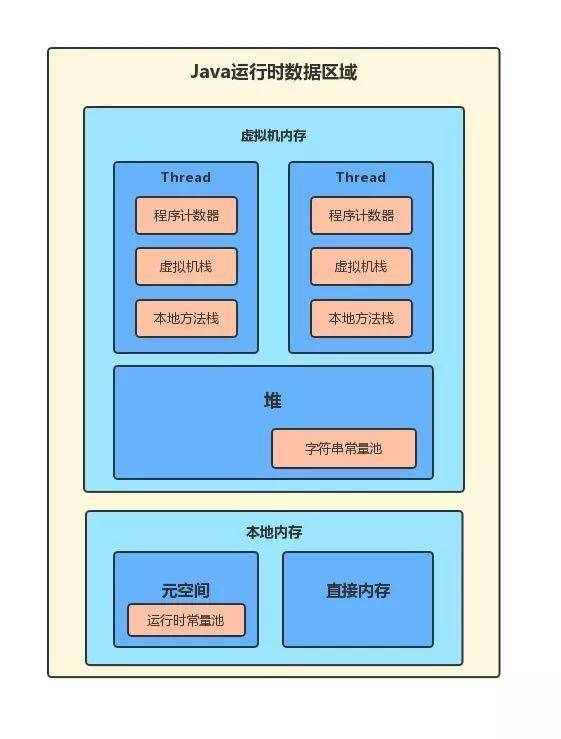

1. JVM运行时数据区

   

   + 主要变化：

     + JDK 1.6，字符串常量池位于永久代的运行时常量池中；
     + JDK 1.7，字符串常量池从永久代剥离，放入了堆中；
     + JDK 1.8，元空间取代了永久代，并且放入了本地内存（Native memory）中

   + **线程隔离**

     ​	

     + 程序计数器
     + 虚拟机栈
     + 本地方法栈

   + **所有线程共享**

     ​	

     + 堆

     + 元空间（方法区）

       方法区用于存放已被加载的类信息、常量、静态变量、及编译器编译后的代码等。

       注意：方法区是JVM的规范，在JDK1.8之前方法区的实现是永久代，从1.8开始JVM移除了永久代，使用本地内存来存储元数据，并称为元空间。

       + 运行时常量池

         Class文件中的常量池会在类加载后被放入到这个区域

     + 直接内存

       NIO相关。

2. GC

   主要是对堆进行GC

   + **对象存活判断**

     + 引用计数法

       在堆中存储的对象，它会维护一个counter计数器，如果有一个引用指向它时，则counter计数器加一，如果一个引用关系失效，则counter计数器减一。当该对象的counter值变为0时，则说明该对象没有任何引用，处于可以回收的状态，可以被垃圾回收器回收。

       未解决相互引用问题。

     + 可达性分析

       通过一系列的GC Root对象作为起点，从这些对象搜索引用的对象，形成多条引用链。如果一个对象到GC Root是不可达的，则说明这个对象不可用，则可以被回收了。可能的GC Root:

       1. 虚拟机栈中引用的对象
       2. 方法区中类静态属性引用的对象
       3. 方法区中常量引用的对象
       4. 本地方法栈中JNI（Native方法）引用的对象。

       + finalize()

         即使在可达性分析算法中不可达的对象，也并非一定会被回收。对象真正被回收需要至少经历**两次被标记**的过程。

         可达性是一次标记，之后进行筛选，当对象没有复写finalize()方法，或者finalize()方法已经被调用过了，则对象会被回收。

         如果对象被判定为有必要执行finalize()方法，则该对象会被放置到一个名为F-Queue的队列中，然后虚拟机会建立一个低优先级的线程Finalizer去执行对象的finalize()方法。finalize()方法是对象逃脱被回收命运的最后的机会，因为Java虚拟机会在稍后对F-Queue队列中的对象进行**第二次标记**。

   + 垃圾回收算法

     + 标记-清除算法

       首先发生GC操作时，将可以被回收的对象进行标记处理。第二步是回收第一步中被清除的对象所占的空间。

       缺点是内存碎片化。

     + 复制算法

       将内存分为大小相等的两块，每次只使用其中的一块，当一块内存满了之后，将这块内存中还存活的对象复制到另外一块内存

     + 标记-整理算法

       首先将需要清除的对象进行标记，第二阶段略微不一样的是，在标记后并不是清除垃圾对象，而是将存活对象向内存的一端进行移动，移动完毕后，清除剩下的内存空间

     + 分代收集算法

       

       1. 新生代

          分为一块较大的Eden和两块较小的Survivor空间，每次使用Eden和一块Survivor空间。

          回收时，将使用空间中存活的对象复制到未使用的Survivor空间中，然后将使用的空间清除；如果未使用的Survivor空间放不下，会放置这些对象到老生代。

       2. 老生代

          在新生代中经历了N次GC还存活的对象会放到老生代中。老生代采取标记整理算法。