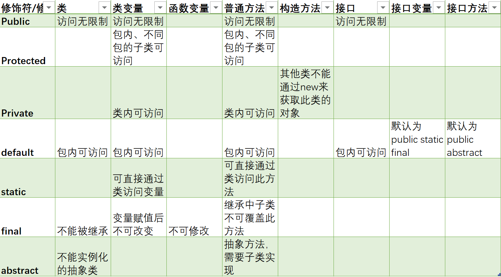
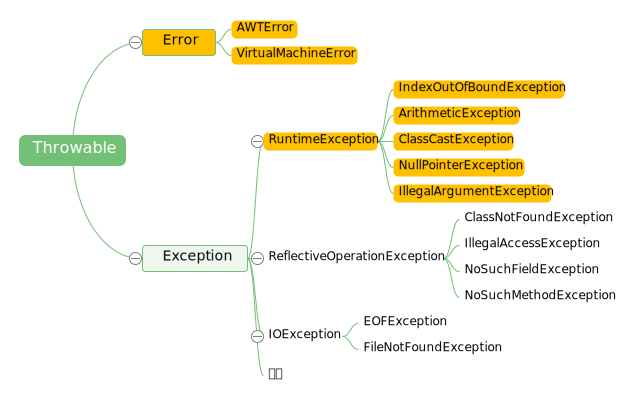

### 5.1. 语言基础

1. 泛型

   泛型是 Java SE 1.5 的新特性，泛型的本质是参数化类型，这种参数类型可以用在类、接口和方法的创建中，分别称为泛型类、泛型接口、泛型方法。

   在 Java SE 1.5 之前没有泛型的情况的下只能通过对类型 Object 的引用来实现参数的任意化，其带来的缺点是要做显式强制类型转换，而这种强制转换编译期是不做检查的，容易把问题留到运行时。

   - 优点：

     - 类型安全，提供编译期间的类型检测，避免在运行时出现 ClassCastException。
     - 前后兼容
     - 泛化代码,代码可以更多的重复利用，所有的强制转换都是自动和隐式的。
     - 性能较高，用泛型JAVA编写的代码可以为java编译器和虚拟机带来更多的类型信息，这些信息对java程序做进一步优化提供条件。

   - Java 泛型是如何工作的？什么是类型擦除？

     ​	泛型是通过类型擦除来实现的，编译器在编译时擦除了所有泛型类型相关的信息，所以在运行时不存在任何泛型类型相关的信息，譬如 List<Integer> 在运行时仅用一个 List 来表示，这样做的目的是为了和 Java 1.5 之前版本进行兼容。泛型擦除具体来说就是在编译成字节码时首先进行类型检查，接着进行类型擦除（即所有类型参数都用他们的限定类型替换，包括类、变量和方法），接着如果类型擦除和多态性发生冲突时就在子类中生成桥方法解决，接着如果调用泛型方法的返回类型被擦除则在调用该方法时插入强制类型转换。

   - Java 泛型类、泛型接口、泛型方法有什么区别？

     泛型类是在实例化类的对象时才能确定的类型，其定义譬如 class Test<T> {}，在实例化该类时必须指明泛型 T 的具体类型。

     泛型接口与泛型类一样，其定义譬如 interface Generator<E> { E dunc(E e); }。

     泛型方法所在的类可以是泛型类也可以是非泛型类，是否拥有泛型方法与所在的类无关，所以在我们应用中应该尽可能使用泛型方法，不要放大作用空间，尤其是在 static 方法时 static 方法无法访问泛型类的类型参数，所以更应该使用泛型的 static 方法（声明泛型一定要写在 static 后返回值类型前）。泛型方法的定义譬如 <T> void func(T val) {}。

   - 泛型边界

     - 在Java泛型定义时:

       用<T>等大写字母标识泛型类型，用于表示未知类型。
       用<T extends ClassA & InterfaceB …>等标识有界泛型类型，用于表示有边界的未知类型。

     - 在Java泛型实例化时:

       用<?>标识通配符，用于表示实例化时的未知类型。
       用<? extends 父类型>标识上边界通配符，用于表示实例化时可以确定父类型的未知类型。
       用<? super 子类型>标识下边界通配符，用于表示实例化时可以确定子类型的未知类型。

   - 可以把List<String>传递给一个接受List<Object>参数的方法吗？

     会导致编译错误，List<Object>可以存储任何类型的对象包括String, Integer等等，而List<String>却只能用来存储String s。

   - List<Object>和原始类型List之间的区别

     在编译时编译器不会对原始类型进行类型安全检查，却会对带参数的类型进行检查，通过使用Object作为类型，可以告知编译器该方法可以接受任何类型的对象，比如String或Integer。

     它们之间的第二点区别是，你可以把任何带参数的类型传递给原始类型List，但却不能把List<String>传递给接受 List<Object>的方法，会产生编译错误。

   - 编写一段泛型程序来实现LRU缓存

     可借助 `LinkedHashMap`，`LinkedHashMap`提供了一个称为`removeEldestEntry()`的方法，该方法会被`put()` 和`putAll()`调用来删除最老的键值对。

   - Array 中可以使用泛型吗

     Array事实上并不支持泛型，这也是为什么Joshua Bloch在Effective Java一书中建议使用List来代替Array，因为List可以提供编译期的类型安全保证，而Array却不能。

   - `@SuppressWarnings(“unchecked”)` 可屏蔽类型未检查警告

   - Java 中的泛型和 C++ 中的模板

     - C++ 中模板的实例化会为每一种类型都产生一套不同的代码，这就是所谓的代码膨胀。

     - Java 中并不会产生这个问题。虚拟机中并没有泛型类型对象，所有的对象都是普通类。

       当编译器对带有泛型的java代码进行编译时，它会去执行**类型检查**和**类型推断**，然后生成普通的不带泛型的字节码，这种普通的字节码可以被一般的 Java 虚拟机接收并执行，这在就叫做 **类型擦除**

   - 泛型的规则

     - 泛型的参数类型只能是类（包括自定义类），不能是简单类型。
     - 同一种泛型可以对应多个版本（因为参数类型是不确定的），不同版本的泛型类实例是不兼容的。
     - 泛型的类型参数可以有多个
     - 泛型的参数类型可以使用 extends 语句，习惯上称为“有界类型”
     - 泛型的参数类型还可以是通配符类型，例如 Class

2. 重写和重载区别

   - **重载**：同一个类中，相同方法名，不同参数类型、参数个数的多个方法。返回值类型可以相同也可以不相同。无法以返回型别作为重载函数的区分标准。调用方法时通过传递给它们的不同参数个数和参数类型来决定具体使用哪个方法, 这就是多态性。
   - **重写**：父类与子类之间的多态性，对父类的函数进行重新定义。如果在子类中定义某方法与其父类有相同的名称和参数，我们说该方法被重写 (Overriding)。如需父类中原有的方法，可使用super关键字，该关键字引用了当前类的父类。

3. 抽象类与接口类区别

   - **抽象类**：抽象类是对根源的抽象（eg. 男人，女人 --人）。如果一个类含有抽象方法，则称这个类为抽象类，抽象类必须在类前用abstract关键字修饰。因为抽象类中含有无具体实现的方法，所以不能用抽象类创建对象。
   - **接口**：接口是对行为的抽象（eg. 吃饭，睡觉），一堆抽象方法的集合。也不能实例化。
   - 区别
     - 抽象类可以提供成员方法的实现细节，而接口中只能存在public abstract 方法；
     - 抽象类中的成员变量可以是各种类型的，而接口中的成员变量只能是public static final类型的；
     - 接口中不能含有静态代码块以及静态方法，而抽象类可以有静态代码块和静态方法；
     - 一个类只能继承一个抽象类，而一个类却可以实现多个接口。

4. 封装、继承、多态

   

5. final，finalize，finally区别

   + `final` 

     + 修饰变量：变量一旦被初始化便不可改变，对基本类型来说是其值不可改变，而对于对于对象变量来说其引用不可再变。
     + 修饰方法：自己认为方法功能足够，可以继承，不能覆盖。允许编译器将所有对此方法的调用转化为inline(行内)调用的机制，直接将方法主体插入到调用处，而不是进行例行的方法调用。
     + 修饰类：自己认为此类设计完美，无法被任何人继承的，final 类的方法自然是final类型。
     + final不能用于修饰构造方法。

   + `finally`

     异常处理模型的最佳补充，finally结构使代码总会执行，而不管有无异常发生，使用finally可以维护对象的内部状态，并可以清理非内存资源。

   + `finalize`

     Java 技术允许使用 finalize() 方法在垃圾收集器将对象从内存中清除出去之前做必要的清理工作。这个方法是由垃圾收集器在确定这个对象没有被引用时对这个对象进行调用。finalize()方法是在垃圾收集器删除对象之前对这个对象调用的子类覆盖 finalize() 方法以整理系统资源或者执行其他清理操作。

     通常，finalize用于一些不容易控制、并且非常重要资源的释放，例如一些I/O的操作，数据的连接，这些资源的释放对整个应用程序时非常关键的。

6. 修饰符 

   

7. 异常处理

   

   Java把异常当作对象来处理，并定义一个基类`java.lang.Throwable`作为所有异常的超类。

   + 分类：

     + `Error`：JAVA 程序运行时系统的内部错误，通常比较严重，除了通知用户和尽力使应用程序安全地终止之外，无能为力，应用程序不应该尝试去捕获这种异常。通常为一些虚拟机异常，如 `StackOverflowError`、`OutOfMemoryError` 等。
     + `RuntimeException`：通常为程序逻辑引起的异常，如`ArithmeticException`，`ArrayIndexOutOfBoundException`。
     + `其他Exception`：通常是程序本身没有问题，由于像 I/O 错误等问题导致的异常

   + 分类二

     + `受查异常`：受查异常会在编译时被检测。如果一个方法中的代码会抛出受查异常，则该方法必须包含异常处理，即 try-catch 代码块，或在方法签名中用 throws 关键字声明该方法可能会抛出的受查异常，否则编译无法通过。如果一个方法可能抛出多个受查异常类型，就必须在方法的签名处列出所有的异常类。
     + `非受查异常`：非受查异常不会在编译时被检测。JAVA 中 Error 和 RuntimeException 类的子类属于非受查异常，除此之外继承自 Exception 的类型为受查异常。

   + 关键字

     + `try`：将要被监听的代码(可能抛出异常的代码)放在try语句块之内，当try语句块内发生异常时，异常就被抛出；
     + `catch`：用来捕获try语句块中发生的异常；
     + `finally`：此语句块总是会被执行。主要用于回收在try块里打开的物理资源(如数据库连接、网络连接、磁盘文件)。只有finally块，执行完成之后，才会回来执行try或者catch块中的return或者throw语句，如果finally中使用了return或者throw等终止方法的语句，则就不会跳回执行，直接停止。
     + `throw`：抛出异常；
     + `throws`：用在方法签名中，声明该方法可能抛出的异常。

   + JVM 如何处理异常

     在一个方法中如果发生异常，这个方法会创建一个异常对象，并转交给 JVM，该异常对象包含异常名称，异常描述以及异常发生时应用程序的状态。创建异常对象并转交给 JVM 的过程称为抛出异常。可能有一系列的方法调用，最终才进入抛出异常的方法，这一系列方法调用的有序列表叫做调用栈。

     JVM 会顺着调用栈去查找看是否有可以处理异常的代码，如果有，则调用异常处理代码。当 JVM 发现可以处理异常的代码时，会把发生的异常传递给它。如果 JVM 没有找到可以处理该异常的代码块，JVM 就会将该异常转交给默认的异常处理器（默认处理器为 JVM 的一部分），默认异常处理器打印出异常信息并终止应用程序。

   + NoClassDefFoundError 和 ClassNotFoundException 区别？

     NoClassDefFoundError 是一个 Error 类型的异常，是由 JVM 引起的，不应该尝试捕获这个异常。引起该异常的原因是 JVM 或 ClassLoader 尝试加载某类时在内存中找不到该类的定义，该动作发生在运行期间，即编译时该类存在，但是在运行时却找不到了，可能是编译后被删除了等原因导致；

     ClassNotFoundException 是一个受查异常，需要显式地使用 try-catch 对其进行捕获和处理，或在方法签名中用 throws 关键字进行声明。当使用 Class.forName, ClassLoader.loadClass 或 ClassLoader.findSystemClass 动态加载类到内存的时候，通过传入的类路径参数没有找到该类，就会抛出该异常；另一种抛出该异常的可能原因是某个类已经由一个类加载器加载至内存中，另一个加载器又尝试去加载它。

8. integer与int区别

   + Integer是int的包装类，int则是java的一种基本数据类型;
   + Integer变量必须实例化后才能使用，而int变量不需要;
   + Integer实际是对象的引用，当new一个Integer时，实际上是生成一个指针指向此对象；而int则是直接存储数据值;
   + Integer的默认值是null，int的默认值是0;

9. String 、stringbuffer、stringbuilder

   + 都是final类，都不允许被继承；

   + String是不可变对象，每次改变就会创建新的String对象，然后将指针指向新的对象；
   + StringBuffer和StringBuilder类长度是可以改变的；
   + StringBuffer线程安全，StringBuilder非线程安全，但性能略高，适合单线程使用；。

10. == 和 equals 的区别是什么

    两种数据类型：

    + 基本数据类型：byte,short,char,int,long,float,double,boolean
      他们之间的比较，应用双等号（==）,比较的是他们的值。

    + 复合数据类型(类)
      当他们用（==）进行比较的时候，比较的是他们在内存中的存放地址，所以，除非是同一个new出来的对象，他们的比较后的结果为true，否则比较后结果为false。 

      JAVA中所有类都是继承于Object这个基类的，在Object中定义了一个equals的方法，这个方法的初始行为是比较对象的内存地址，但在一些类库当中这个方法被覆盖掉了，如String,Integer,Date在这些类当中equals有其自身的实现，而不再是比较类在堆内存中的存放地址。

      注意：在使用了对象池技术的类比如String中，有时“==”可以返回True，这是因为共享了对象池中的对象。

11. 重写equals方法为什么要重写hashcode方法

    JavaAPI文档规定，如果两个对象调用equals方法返回是相等的，那么hashcode方法返回值必须相等。

    Object的默认实现的equals方式是调用==，也就是比较引用，默认实现的hashcode方法也是根据引用导出的。String类重载hashcode方法，利用内容导出hashcode，因此即使不是同一个String对象，但是内容相同，equals方法判断会相同，hashcode返回会相同，hashMap调用hashcode实现get和put，值相同的String才能对应到同一个bin。

    如果自定义类重写equals方法，不重写hashcode方法，那么equal的对象，在map中不能对应到同一个bin。

### 5.2. JCF

### 5.2.1. HashMap、HashTable、ConcurrentHashMap

+ **HashMap**

  + 非线程安全
  + key和value可为空

+ **HashTable**

  + 使用synchronized实现线程安全，锁定整个对象，粒度较大，在迭代时锁定时间长导致效率低下。
  + key和value都不能为null；

+ **ConcurrentHashMap**

  + Java1.7基于segment实现，只对segment加锁，而不是整个对象

  + java1.8基于CAS实现，f = tabAt(tab, i = (n - 1) & hash，put操作时锁定f

    + put：key对应数组元素null则通过CAS设置为当前值，如果对应元素不为null，则对该元素使用synchronized锁定，然后进行操作；

    + read：数组用volatile修饰，保证可见性；每个元素Node的key、hash由final修饰，val、next由volatile修饰，可见性有保障

      ```java
      static class Node<K,V> implements Map.Entry<K,V> {
        final int hash;
        final K key;
        volatile V val;
        volatile Node<K,V> next;
      }
      ```

      key对应的数组元素的可见性，由Unsafe的`getObjectVolatile`方法保证：

      ```java
      static final <K,V> Node<K,V> tabAt(Node<K,V>[] tab, int i) {
        return (Node<K,V>)U.getObjectVolatile(tab, ((long)i << ASHIFT) + ABASE);
      }
      ```

  + HashMap不允许通过Iterator遍历的同时通过HashMap修改，而ConcurrentHashMap允许该行为，并且该更新对后续的遍历可见

  + key和value都不能为null；

### 5.2.2. linkedlist、arraylist

+ **linkedlist**

  内部使用链表存储，随机访问复杂度O(n)，插入和删除复杂度O(1);

+ **arraylist**

  内部使用数组存储，随机访问复杂度O(1)，插入和删除复杂度O(n);