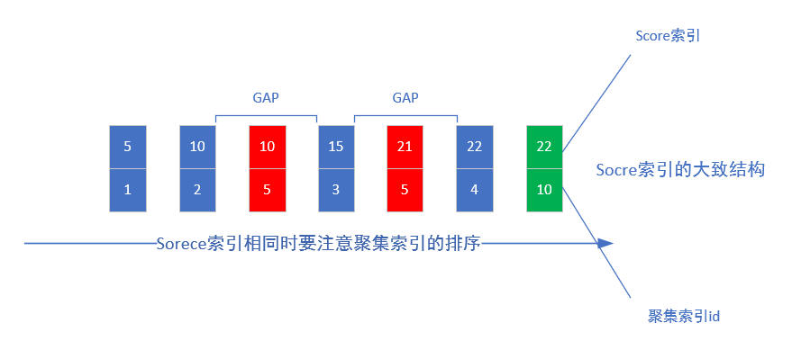
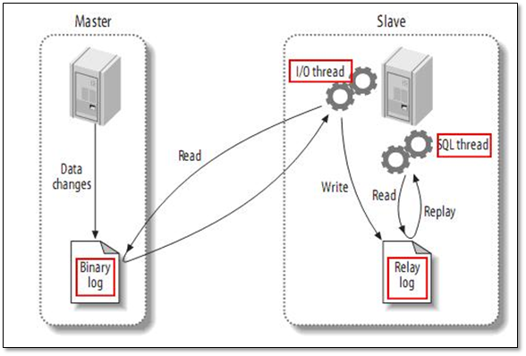
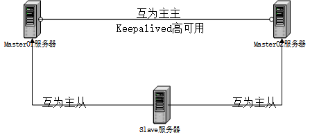

## 1. 基本使用

1. 查询优化

   + 只请求需要的行和列（limit,少使用*）
   + 全表扫描、索引扫描、范围扫描、唯一索引查询、常数引用从慢到快，扫描行数从多到少，可使用EXPLAIN语句中的type列查看使用的方式以进行优化。合理的索引能提高查询速度，当发现查询需要扫描大量的数据行但只返回少数的行，那么可以考虑使用覆盖索引，即把所有需要用到的列都放到索引中。这样存储引擎无须回表获取对应行就可以返回结果了。
   + 分解大的查询：缓存更高效，减少锁竞争（比如删除旧的数据），
   + 用IN取代OR：IN()先将自己列表中的数据进行排序，然后通过二分查找的方式确定列的值是否在IN()的列表中，这个时间复杂度是O(logn)。如果换成OR操作，则时间复杂度是O(n)
   + 优化排序：尽量让MySql使用索引进行排序

2. int(11)和int(10)结构一样吗 ？哪里不一样

   括号中的字符表示显示宽度，整数列的显示宽度与mysql需要用多少个字符来显示该列数值，与该整数需要的存储空间的大小都没有关系，int类型的字段能存储的数据上限还是2147483647(有符号型)和4294967295(无符号型)

   对于声明为INT(5) ZEROFILL的列，值4检索为00004。请注意如果在整数列保存超过显示宽度的一个值，当MySQL为复杂联接生成临时表时会遇到问题，因为在这些情况下MySQL相信数据适合原列宽度(设定的最大显示宽度)。

## 2. 存储结构

### 2.1 索引

加索引是慢查询的常见优化方式，索引其实是一种数据结构，这种数据结构能提高查询的速度，比如Mysql使用B+树做索引。

+ 哈希表、AVL、B树、B+树等都能提高处查询速度，为什么使用B+树？

  + hash表可以精确查询，但不支持范围查询；
  + AVL支持范围查找，但由于节点只有2，导致深度较大，IO更多；
  + B树比AVL深度更低，同一个节点可以存储多个元素
  + B+树非叶子节点的数据会冗余到叶子节点，叶子节点之间用指针相连。更少的磁盘IO和更高的范围查询效率。

+ B+树节点中存多少元素合适？

  一页或者页的倍数合适。Innodb一页的默认大小是16k。

+ 为什么16k就足够了？

  innodb中非叶子节点：存储主键和指针，主键假设bigint(8b)指针(6b)共14b，16k/14b=1k+条；叶子节点：存储数据，假设每条1k，可以存储16条。高度为2可以存储18k条左右，高度为3可以有1k\*1k\*16=千万级.

### 2.2 事务隔离级别

主要参考：[美团技术文章](https://tech.meituan.com/2014/08/20/innodb-lock.html)

+ 一次封锁OR两段锁

  一次封锁就是在方法开始阶段知道会使用哪些数据，全部锁住，方法结束后全部解锁，这种方式能预防死锁；

  数据库中，事务开始阶段不知道要使用哪些数据，因此分为两段锁，无法避免死锁，但能提高并行度。

  加锁阶段：对任何数据读之前申请S锁，写之前申请X锁。加锁不成功，则等待。

  解锁阶段：事务释放了一个封锁后，进入解锁阶段，该阶段只进行解锁操作。

+ 事务隔离级别

  | 隔离级别        | 脏读 | 不可重复读 | 幻读 |
  | --------------- | ---- | ---------- | ---- |
  | Read UnComitted | 是   | 是         | 是   |
  | Read Committed  | 否   | 是         | 是   |
  | Repeatable Read | 否   | 否         | 是   |
  | serializable    | 否   | 否         | 否   |

  + Read uncommitted：允许脏读，也就是可读到别的会话未提交事务修改的数据（一般不用）。
  + Read Committed：只能读到已经提交数据。Oracle
  + Repeatable Read：同一事务内可重复读，读的数据都是事务开始的快照，innoDB 默认级别。SQL标准中该级别消灭了不可重复读，但还存在幻读。
  + Serializable：每次读都需要表级共享锁，读写互相阻塞。
  + 不可重复读:同一事务中，多次读取相同记录得到结果不同，中间有另外的事务修改了数据，侧重Update和Delete。
  + 幻读：同一事务多次执行相同查询，发现新的记录；中间有另外事务插入了数据，侧重INSERT。

+ InnoDB RC

  需要手动开启，并设置binlog的模式

  在RC级别，数据读取不加锁，数据写入、修改、删除性需要加锁。

  如果where条件中字段C1有索引，则只对满足条件的C1数据行加锁，否则存储引擎对此表所有行加锁，再由MySQL server层过滤，发现不满足后调用unlock_row解锁不满足的行（这里违背二段锁协议约束）。

+ 悲观锁和乐观锁

  悲观锁大多数情况依赖数据库的锁机制实现，保证从操作最大程度的独占性。但是数据库性能开销大，并行度低。

  乐观锁大多基于数据版本（Version）记录实现。比如，数据表增加一个“version”字段，读取时，只读小于事务的字段；修改时：如果提交数据版本大于记录的版本号则更新，否则认为是过期数据。

+ InnoDB MVCC

  InnoDB每行记录增加两个额外字段（创建版本CV、过期版本DV），每开启一个事务，事务的版本号递增（可能有问题）。

  + SELECT：读取CV<=V的记录，DV为空或>V的记录；
  + INSERT：CV=V；
  + DELETE：DV=V;
  + UPDATE：插入记录，并CV=V，将原纪录的DV=V；

+ InnoDB 的读

  InnoDB 的“读”与事务隔离级别的“读”不同，MVCC中，读取的数据时快照(snapshot read)，可能是过时的，当需要读取当前的数据时称为当时读(current read).事务隔离级别定义的是当前读的级别。

  + 快照读：就是默认的select
    + select * from table ...;
  + 当时读：特殊SELECT，插入、更新、删除操作，必须处理当前数据。
    + select * from table where ? lock in share mode;
    + select * from table where ? for update;
    + insert;
    + update;
    + delete;

+ InnoDB的写（当前读）

  InnoDB的快照读解决了幻读的问题，为了解决当前读的幻读问题，

  执行Update时，InnoDB不仅锁定了影响的行，也锁定了前后区间的记录（GAP锁），这样其他事务在前后插入就会阻塞。

  行锁防止别的事务修改或删除，GAP锁防止别的事务新增，行锁和GAP锁结合形成的的Next-Key锁共同解决了RR级别在写数据时的幻读问题。

+ serializable：这个级别读加共享锁，写加排它锁，读写互斥。业务并发少时可使用。SELECT语句在这个级别也会加锁哦。

+ GAP锁：

  GAP锁，指的是索引与索引之间的区间，假设有如下表x：

  ```sql
  create table x(`id` int, `num` int, index `idx_id` (`id`));
  insert into x values(1, 1), (5, 5), (10, 10);
  ```

  表X中id为索引列，索引列有3个值1、5、10，因此存在4个GAP：

  ```
  (-inf,1],(1,5],(5,10],(10,inf)
  ```

  `select * from x where id = 5 for update`语句加上行锁的同时会对`(1,5],(5,10]`这两个GAP加上锁(因为这两个GAP中可能INSERT新的满足条件`where id =5`的记录)，因此在锁没释放之前，id属于[2, 3, 4, 6, 7, 8, 9]的记录都无法insert。**针对id等于1或10的临界情况需要结合主键进行考虑**。

  ```sql
  create table x(`id` int primary key, `num` int, index `idx_num` (`num`));
  insert into x values(1, 1), (5, 5), (10, 10);
  -- 事务A
  select * from x where num = 5 for update;
  -- 事务B
  -- 由于区间(1, 5)中，num=1的记录主键id=1，而(id=2, num=1)则落在(1, 5)这个区间上，所以insert会进入等待
  insert into x values(2, 1); 
  -- 事务C
  -- (id=0, num=1)落在区间外，这里insert会成功
  insert into x values(0, 1); 
  ```

  如果是唯一索引且只锁定一条记录（记录存在）则不会存在Gap锁。

  使用非唯一索引锁定；使用多列唯一索引；使用唯一索引锁定多行记录时（单条记录但是记录不存在）会产生间隙。

  

## 3. 架构

### 3.1 MySQL 主从

二进制日志（binlog）是主从复制的基础，记录每个完成的事件。主从复制的原理是：master服务器将所有数据和结构更改记录到binlog中，slave从master请求binlog并在本地应用其内容。

MySQL复制默认是异步复制，Master宕机，事务在Master上已提交，但很可能这些事务没有传到任何的Slave上，此时Slave也可能会丢失事务。在半同步复制的架构下，当master在将自己binlog发给slave上的时候，要确保slave已经接受到了这个二进制日志以后，才会返回数据给客户端。

半同步问题：

1. **事务还没发送到从库上**:客户端会收到事务提交失败的信息，重新提交到新的master，宕机的old-master重启后作为slave加入集群，发现该事务被提交了两次，一次是作为master时的，一次是匆匆现在master上同步过来的；
2. **事务已经发送到从库上**:slave已经接受并应用了该事务，但是client任然会收到事务提交失败的信息，重新提交到新的master上。



+ **应用场景**

  + slave作为master的实时数据备份；
  + master-slave实现读写分离，slave实现负载均衡；
  + 多个slave根据业务重要性进行拆分访问。

+ 搭建过程

  1. master开启binlog，并设置允许访问的slave用户`grant replication slave  on *.* to repl@'10.0.0.%' identified by '123';`； 
  2. slave 通过手工执行change master to 语句连接master，提供了连接的用户信息以及binlog的起始位置；然后start slave
  3. slave根据change master to 语句提供的file名和position号，IO线程向master发起binlog的请求
  4. master的dump线程根据slave的请求，将本地binlog以events的方式发给slave的IO线程;
  5. slave的IO线程接收binlog evnets，并存放到本地relay-log中，传送过来的信息，会记录到master.info中；
  6. slave的SQL线程应用relay-log，并且把应用过的记录到relay-log.info,默认情况下，已经应用过的relay会自动被清理purge；

+ **高可用方案**

  + [MySQL主主复制，mysql主从复制，MySQL+keepalived故障转移](https://blog.csdn.net/qq_36783142/article/details/78696129)

    

    + Keepalived

      基于VRRP(Virtual Router Redundancy Protocol)协议，将两台或多台路由设备虚拟成一个设备，对外提供虚拟路由器IP，而在路由器内部，通过选举确定master。

      + master选举
        1. 如果对外的虚拟IP就是某节点本身的IP的话，该节点始终是master；
        2. 否则，各节点都宣告自己是master，发送VRRP通告信息；
        3. 如果收到其他节点发来通告优先级都比自己高，转回Backup状态；
        4. 优先级相等时IP值较大的优先权高；

  + 自动故障转移工具--mysqlfailover

    按指定的时间间隔探测各节点的健康状态，一旦在捕获到主节点不可用时，将触发故障转移相关动作，自动执行故障切换到当前最佳的从服务器上。同时整个主从架构内的其他从节点将指向新的主节点，自动完成主从拓扑结构更新。

  + mha(Master High Availability)

    检测到主服务器故障，就会自动进行故障转移。即使有些从服务器没有收到最新的relay log，MHA自动从最新的从服务器上识别差异的relay log并把这些日志应用到其他从服务器上，因此所有的从服务器保持一致性了。