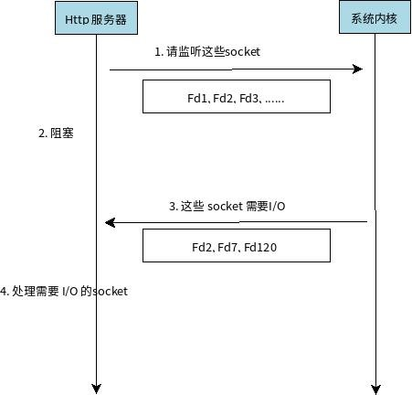

1. 线程和进程的区别

   + 定义：进程是程序在某个数据集合上的一次运行活动；线程是进程中的一条执行路径；
   + 角色：在支持线程机制的平台上，进程是系统资源分配的单位，线程是CPU调度的单位；
   + 资源共享：进程之间不共享资源，线程共享所在进程的资源；同时线程有自己独立的栈、栈指针、程序计数器等。
   + 独立性：进程有自己独立的空间，线程没有，线程依赖于进程存在；
   + 性能：进程切换需要切换空间，开销较大；线程切换开销较小。

2. 协程 

   伪多线程、在用户态不被内核管理，开销小于线程，应用于IO密集型场景。

   在函数的执行过程中，如果遇到了耗时的 I/O 操作，函数可以临时让出控制权，让 CPU 执行其他函数，等 I/O 操作执行完毕以后再收回控制权。

3. 进程间通信（IPC）

   + 管道：父子进程，基于Fork实现
   + 命名管道（FIFO）：不相关进程；
   + 消息队列
   + 信号量（semaphores）
   + 共享内存：进程共享存储区

4. 网络IPC（Socket）

   + 新建套接字获得FD
   + bind(port)
   + listen
   + 将FD加入epoll
   + eventNum=epoll_wait()
   + 根据eventNum遍历event，在event的fd==FD时表示收到连接；
   + connFD=accept(FD)完成socket的链接；
   + 将connFD交给线程池异步处理。

5. epoll

   

   + 水平触发：
     + 读缓冲区非空--可读--一只通知可读信号；
     + 写缓冲区不满--可写--一直通知可写信号；
   + 边缘触发
     + 读缓冲区由空变为非空--通知可读信号
     + 写缓冲区由满变为不满--通知可写信号；
   + LT是默认的，支持阻塞和非阻塞，内核通知程序FD就绪，程序对FD进行IO，如果程序不进行处理，LT会一直通知，这种模式不容易出错（poll、select）就是这种模式。假设读缓冲区中收到2kb内容，两种模式都发出可读信号，没读完时LT会一直通知，ET则不会，因此要求程序尽量一次读完，并且设置FD为非阻塞