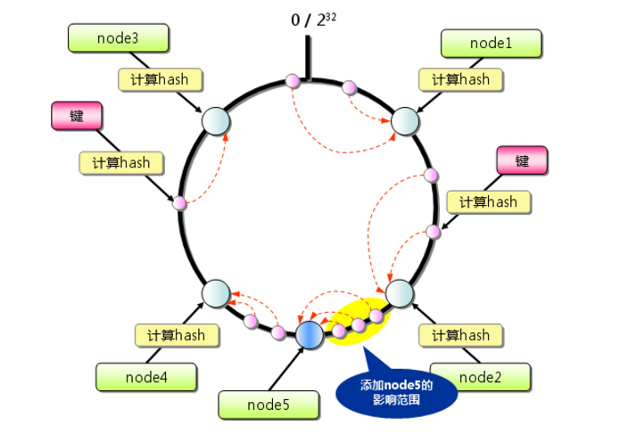

## 1. 经验

### 1.1. 公司习惯

1. 字节跳动面试算法题多
2. 美团基础问得多

## 1.2. 复习技巧

1. 每天做一道leetcode
2. 如果题目半小时没有思路，则查看题解
3. 刷完50题总结

### 1.3. 项目难点

+  **SMES**

  1. 图片访问慢

     图片压缩、定义存储的抽象接口，根据配置修改CDN；

  2. 上传图片偶尔会遇到问题，重启没有问题，后面看日志(tempory location not valid) google得知POST 方法需要使用临时目录存储，CentOS会经常删除临时目录。

     增加了配置：servlet.multipart.location: ${user.dir}

  3. 将一些接口的信息配置化，比如一页显示的数量，免运费额度，等，每一页显示的数量不再是前端决定，而是可以配置的（相当于在后台接口处得到这个配置）我需要将这些信息在项目启动的初期从数据库读入内存并且作为全局变量。后面查询了解到@postConstruct这个servlet的注解。

+ **IDE**

  1. 线程隔离的输入输出

     我们通过自定义一个System类来替换代码中对System的引用，期望实现将代码执行的标准输出和标准错误返回给客户端，由于System是全局共享的，因此需要改造标准输出和标准错误为线程封闭，这样多个任务的输出才不会互相干扰。客户端代码不会对System进行实例化，自定义System替换代码中的引用之后也是全局共享的，没有办法对每个任务新建输出流。最后使用ThreadLocal比较优雅的解决这个问题。

### 1.4 复习范围

1. 基础：OS、计网、数据结构、算法
2. Java基础、面向对象、JCF、java并发、JVM
3. Spring
4. Mybatis
5. MySQL
6. zookeeper

## 2. [数据结构和算法](dataStructure&algorithm.md)

## 4. [操作系统](Operating_System.md)

## 5. [计算机网络](Computer_network.md)

## 6. 设计模式

1. 责任链模式

2. 单例模式

   饿汉，懒汉，双重检测，为什么要双重检测

## 7. 数据库

### 7.1. [MySQL](MySQL.md)

### 7.2. [Redis](Redis.md)

## 8. [Java基础](Java_basic.md)

## 9. Java高级

### 9.1. [Java 并发](Java_Concurrency.md)

### 9.2. JVM

1. [运行时内存区域&GC](JVM_memory&GC.md)
3. [JVM类加载机制与双亲委派模型](JVM_classLoader.md)
3. [Java Native Interface](JVM_JNI.md)

## 10. Java Web 基础

### 10.1. [SpringBoot](SpringBoot.md)

#### 10.1.1 [Spring IOC](Spring_IoC.md)

#### 10.1.2 [Spring AOP](Spring_AOP.md)

#### 10.1.3 [Spring MVC](Spring_MVC.md)

### 10.2. Mybatis

## 11. 运维基础

### 11.1. Linux 常用操作

### 11.2. Docker 

## 12. Java Web高级
### 12.1 分布式相关知识
#### 12.1.1 2PC & 3PC
[分布式一致性之两阶段提交协议、三阶提交协议](https://zhuanlan.zhihu.com/p/35616810)

+ **两阶段提交**

  

  

  + 主要问题
    1. 同步阻塞：从投票阶段到提交阶段完成这段时间，资源是被锁住的。
    2. 单点故障：一旦协调者发生故障。参与者会一直阻塞下去。尤其在第二阶段，协调者发生故障，那么所有的参与者还都处于锁定事务资源的状态中，而无法继续完成事务操作。
    3. 数据不一致。在二阶段提交的阶段二中，当协调者向参与者发送commit请求之后，只有部分参与者成功commit。

+ **三阶段提交**

  ​	

  + 改动

    1. 同时在协调者和参与者中都引入超时机制。

    2. 把2PC的投票阶段一分为二：`CanCommit`、`PreCommit`、`DoCommit`

       为了在预执行（参与者真正执行事务）之前，保证从参与者都具备可执行条件，减少资源浪费。

  + 区别

    + 在doCommit阶段，如果参与者无法及时接收到来自协调者的doCommit或者rebort请求时，会在等待超时之后，会继续进行事务的提交。

  + 问题

    + 自动提交有小概率是没有接收到abort，导致数据不一致。

#### 12.1.2 Hash

hash的分区方式分为：节点取余、虚拟槽分区、一致性hash分区。节点取余容错性和拓展性不好，不适用与分布式计算。

+ **虚拟槽分区**

​	RedisCluster采用此分区，所有key根据hash函数`CRC16[key]&16383`映射到0-16383槽内，每个节点维护部分槽及槽所映射的键值数据。采用了分散性较好的哈希函数，所有的数据大致均匀分布在0~16383各个槽中，解决了普通一致性哈希分区只有少量节点负载不均衡问题。

通过引入槽，让槽成为集群内数据管理和迁移的基本单位，简化了节点扩容和收缩难度，你只需要关注数据在哪个槽，并不需要关心数据在哪个节点上。

​	

+ **一致性hash**

​		

  + **原理**
    + 首先计算服务器节点的hash值，并将其配置到0-2^32的圆上；
    + 用同样的方式计算存储数据的key的hash，并映射到相同的圆上；
    + 从数据映射位置顺时针查找，保存到找到的第一个服务器上，如果超过2^32任然找不到服务器，就会保存到第一台上。
  + 可拓展性：添加服务器时，只会影响服务器位置到逆时针第一台服务器之间的节点的命中率。
  + 容错性：某台机器故障，也只会影响服务器位置到前一个服务器之间的数据。
  + **虚拟节点机制**：可以再服务器很少时也保持相对均匀的数据分布。

### 12.2. 消息队列

### 12.4 [Redis ](Redis.md)

### 12.5 [zookeeper](zookeeper.md)