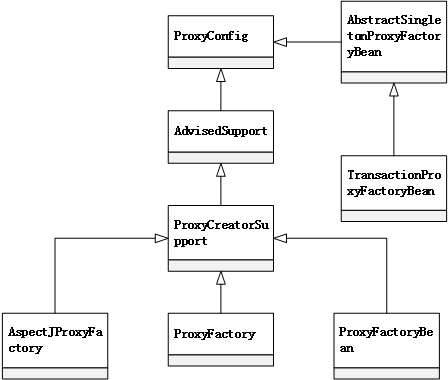
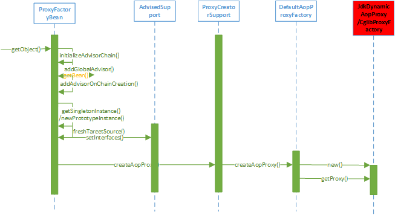
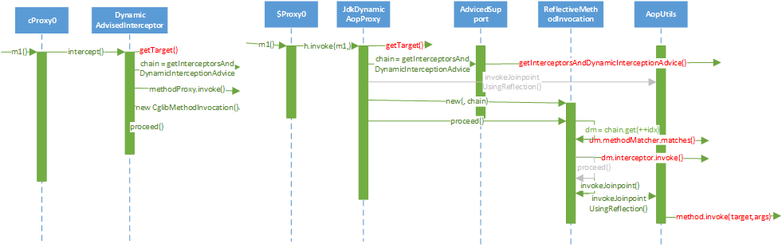
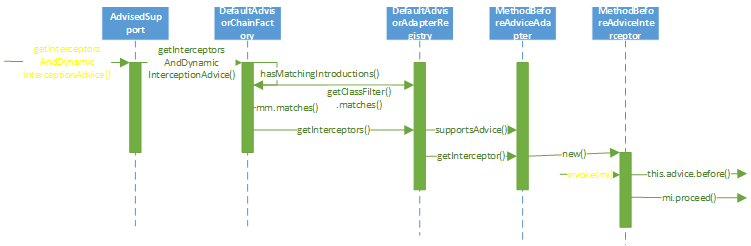

AOP基于Java的动态代理特性实现，详见 [designPattern_Proxy](/designPattern_Proxy)

#### 1. Basic Concept
+ **Advice:** 通知（切面），定义在连接点做什么，为切面增强提供织入接口。具体的类型有 BeforeAdvice、AfterAdvice、ThrowsAdvice；
+ **Pointcut:** 决定Advice通知应该作用于哪个连接点，也就是说通过pointcut定义需要增强的方法集合，例如可以通过正则表达式进行标识或根据某个方法名进行匹配等。
+ **Advisor:** 把Advice和Pointcut结合起来，通过Advisor，可以定义使用哪个通知并在哪个关注点使用它。

#### 2. 建立 AopProxy 代理对象
在Spring的AOP模块中，一个主要的部分是代理对象的生成，而对于Spring应用是通过配置和调用 Spring 的 ProxyFactoryBean 来完成这个任务，ProxyFactoryBean  中封装了主要代理对象的生成过程。

如上图所示：
+ ProxyConfig 为其子类提供了配置属性，可以看作为一个数据基类；
+ AdvisedSupport 封装了AOP对通知和通知器的相关操作，但是对于具体的AOP代理对象的创建，交给它的子类去完成；
+ ProxyCreatorSupport 可以看作是其子类创建 AOP 代理对象的一个辅助类；
+ 通过继承 ProxyCreatorSupport 的功能实现，具体的 AOP 代理对象的生成根据不同的需要，分别由 ProxyFactoryBean、AspectJProxyFactory 和 ProxyFactory 来完成。
+ 对于需要使用 AspectJ 的 AOP 应用，AspectJProxyFactory 起到了集成Spring和AspectJ的作用；
+ 对于使用 Spring AOP 的应用，ProxyFactoryBean 和 ProxyFactory 都提供了AOP 功能的封装，只是使用 ProxyFactoryBean，可以在IOC 容器中完成声明式的配置，而使用 ProxyFactory 需要编程式的使用 Spring AOP 的功能。

IOC中的学习我们知道，**从FactoryBean中获取对象，是以 getObject方法作为入口完成的，ProxyFactoryBean 实现了 getObject 方法，在这个方法中实现了对target对象增加增强处理（为Proxy代理对象配置Advisor链）**，然后由于Spring中有singleton和prototype两种类型，需要加以区分。

为Proxy代理对象配置Advisor链是在 `initializeAdvisorChain` 方法中实现的，这个过程中有一个标志位 `advisorChainInitialized` 使得初始化的工作只会发生在第一次通过 `ProxyFactoryBean` 去获取代理对象的时候；然后循环读取所有的 `interceptorNames (advisor)`，通过将名字交给容器的`getbean`方法，并通过回调来获得；然后把 `advisor` 加入拦截器链中。

`getSingletonInstance()` 是`ProxyFactoryBean` 生成 `AopProxy` 代理对象的入口，它首先通过`freshTargetSource()` 读取`ProxyFactoryBean` 中的配置，并为生成代理对象做好必要的准备，比如设置代理的方法的调用接口等；具体生成代理对象由`DefaultAopProxyFactory`中的`createAopProxy() `实现，在这个函数中决定通过`CGLIB`还是`JDK`生成需要的代理对象，如果目标对象是接口类，那么适合使用JDK来生成。

在` JdkDynamicAopProxy` 中，使用了 JDK 的 `Proxy` 类来生成代理对象:首先从`advised`对象中取得代理对象的代理接口配置；然后通过三个参数（classloader，代理接口，Proxy回调方法所在对象）调用`newProxyInstance`得到对应的`Prox`代理对象。`Proxy`回调方法所在对象需要实现 `InvocationHandler` 接口定义的 `invoke` 方法，`JdkDynamicAopProxy` 本身就实现了，也就是说，在Proxy代理的接口被调用时，会触发 `JdkDynamicAopProxy` 的`invoke` 方法，这个` invoke` 方法就是AOP编织实现的地方。`ObjenesisCglibAopProxy` 通过 `enhancer` 对象` callback`的设置实现` Spring` 的AOP。

#### 3. Spring AOP拦截器调用的实现
在 `JdkDynamicAopProxy` 中生成`Proxy`对象时，`JdkDynamicAopProxy` 实现了` InvocationHandler`接口，在`Proxy`对象的代理方法`m1`被调用时，`JdkDynamicAopProxy` 作为`Proxy`对象的一个属性，它的`invoke`方法被调用。`invoke` 方法的用途包括获取目标对象、拦截器链、同时把这些对象作为输入，创建了`ReflectiveMethodInvocation` 对象，通过这个对象完成了对AOP功能实现的封装。如果没有设置拦截器，那么会对目标对象的方法直接调用，对于jdk生成的方式，是通过`AopUtils`使用反射机制在`invokeJoinPointUsingReflection`方法中实现的。基于`CGLIB`生成的代理对象的调用也非常类似。
基于JDK和CGLIB两种方式最终都是对`ReflectionMethodInvocation`中的`proceed`方法的调用，在这个方法中会：

+ 对代理方法进行一个匹配判断，决定拦截器是否满足切面增强的要求（`pointcut`中的`matchs`）；
+ 逐个运行拦截器中的拦截方法；

在`AdvisedSupport`中，`getInterceptorsAndDynamicInterceptionAdvice` 方法在`JdkDynamicAopProxy`或者`DynamicAdvisedInterceptor`中被调用来获取拦截器链。

获取拦截器链的工作是由配置好的`AdvisorChainFactory`来完成的，默认是`DefaultAdvisorChainFactory`；它首先设置一个`List`，长度由配置属性决定；然后，通过`GlobalAdvisorAdapterRegistry`来实现拦截器的注册，`GlobalAdvisorAdapterRegistry`是一个单例实现，具体实现是`DefaultAdvisorAdapterRegestry`。`DefaultAdvisorAdapterRegestry` 的`getInterceptors`方法通过循环调用 `supportAdvice() `方法来判断`advisor`的类型，然后根据不同的类型来调用对应的`adapter` 的 `getInterceptro()` 注册不同的 `AdviceInterceptor`。这里用到了`adapter`模式。
具体拦截器的实现包括了`invoke`方法，`invoke`方法中调用增强的顺序不同，比如`MethodBeforeInterceptor `调用增强之后再调用源方法，其他的以此类推。

#### 4. Spring AOP的高级特性
+ **HotSwappableTargetSource**： 使得用户可以以线程安全的方式切换目标对象；
	+ 配置：将 `HotSwappableTargetSource` 配置到`ProxyFactoryBean` 的`target` 属性；
	+ 使用：调用`swap`方法（使用新的target对象调换目标target对象）；
	+ 注意：在`JdkDynamicAopProxy` 中的` invoke`中，通过`targetSource. getTraget() `来获取目标对象，这个对象是否被调换过，`invoke`不关心。