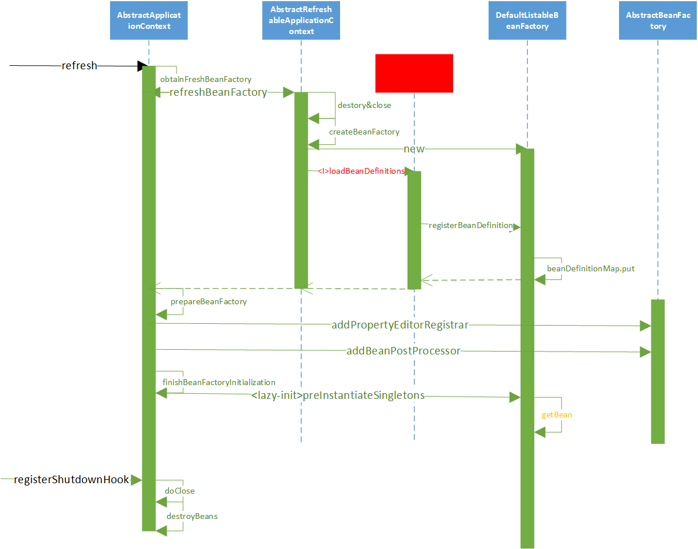
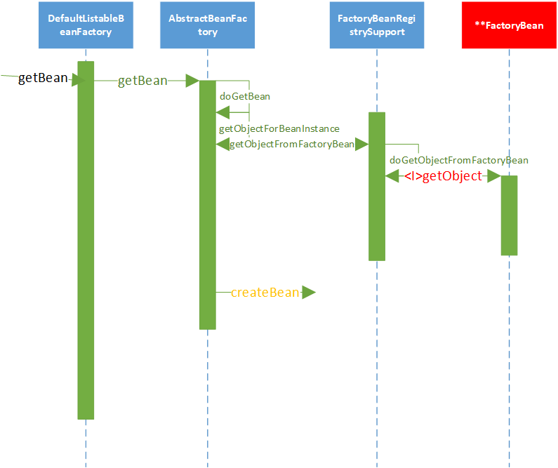
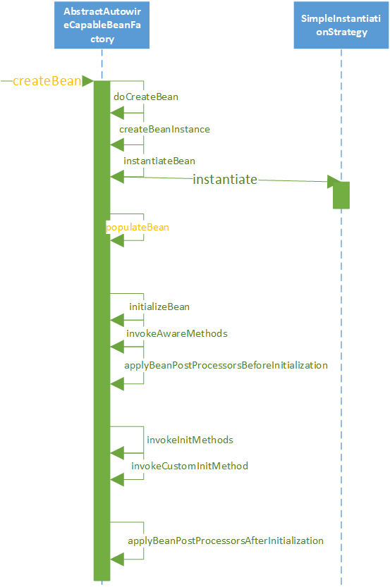
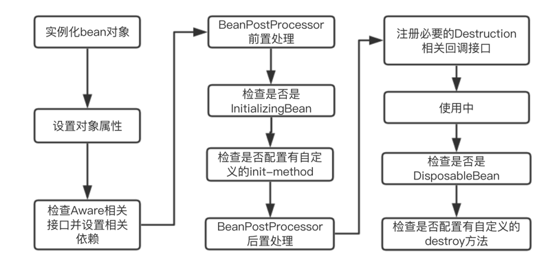

## 1. 简介

#### 1.1. 综述

把`Spring IoC`容器比作一间餐馆，当你来到餐馆，直接点菜！至于菜的原料是什么？如何用原料把菜做出来？可能你根本就不关心。

`IoC`容器，只需要告诉它需要某个`bean`，它就把对应的实例扔给你，至于这个bean是否依赖其他组件，怎样完成它的初始化，根本就不需要你关心。


本文章包含的所有图片是在 `springboot-5.1.8` 之上进行的简单分析。容器的初始化过程由具体的实现，用图中红色部分简略表示；整个过程由refresh的调用触发，一般是由具体的`applicationContext`调用，比如`FileSystemXmlApplicationContext`。

#### 1.2. 关键词
+ **Resource:** `Spring`用来封装IO操作的类；
+ **BeanDefinition(切好的菜):** 管理各个业务对象，以及它们之间的依赖关系，每一个`bean`都会对应一个`BeabDefinition`实例，该实例负责保存`bean`的所有必要信息，包括`bean`对象的`class`类型、是否是抽象类、构造方法和参数、其他属性等。依赖反转功能都是围绕对这个 `BeabDefubution` 的处理来完成的。
+ **BeanFactory（菜谱）:** 也就是`IoC`容器或者对象工厂，Spring 中所有的 Bean 都是 `BeanFactory `来进行管理的。
+ **FactoryBean:** 这个Bean 不是一个简单的 Bean ，而是一个能产生或者修饰对象生成的工厂 Bean，它的实现与设计模式中的工厂模式和修饰器模式类似。用户可以使用转义符“&”来得到`FactoryBean` 本身。
+ **DefaultListableBeanFactory:** 在Spring中是一个默认的功能完整的`IoC`容器，继承了`BeanFactory`和`BeanDefinitionRegistry` 承担了`bean`的注册管理工作。
+ **XmlBeanFactory:** 建立在 `DefaultListableBeanFactory` 这个基本容器之上，增加了 XML 读取的功能。

## 2. 两种容器

#### 2.1. BeanFactory

定义了容器的基本功能；可以使用不同的 `Bean `检索方法从`IoC`容器中得到需要的`Bean`；

+ 编程式使用`IoC`容器的过程
	```
	ClassPathResource res = new ClassPathResource("base.xml");
	DefaultListableBeanFactory factory  = new DefaultListableBeanFactory ();
	XmlBeanDefinitionReader reader = new XmlBeanDefinitionReader(factory);
	reader.loadBeanDefinitions(res);
	```
	1. 创建` IoC` 配置文件的抽象资源，这个资源包含了 `BeanDefinition` 的定义信息；
	1. 创建一个 `BeanFactory`；
	1. 创建一个载入 `BeanDefinition`的读取器，通过一个回调配置给`BeanFactory`；
	1. 读取配置信息。

#### 2.2 ApplicationContext
在简单容器的基础上增加了许多面向框架的特性，同时对应用环境做了许多适配。在容器启动时全部完成初始化和依赖注入操作。

+ 新特性
	1. 支持不同的信息源（`extends MessageSource`），这些信息源的拓展功能可以支持国际化的实现，支持了多语言版本的开发；
	1. 从不同的地方得到`Bean`定义资源（`extends ResourcePatternResolver( extends ResourceLoader)`）使用户程序可以灵活的定义Bean 定义信息；
	1. 支持应用事件(`ApplicationEventPublisher`)，从而在上下文中引入了事件机制。这些事件和`Bean`的生命周期的结合为`Bean`的管理提供便利；
	1. 其他附加服务，面向框架的使用风格。

## 3. 具体流程

#### 3.1. 容器的初始化

`注意`：这里的容器初始化过程不包括`Bean`的依赖注入，Spring的`IoC`中`Bean`定义的载入和依赖注入是两个独立的过程，依赖注入一般发生在应用第一次通过`getBean`向容器索取Bean的时候。（如果设置了Bean中的`lazyinit`属性，这个`Bean`的依赖注入在`IoC`容器初始化时就预先完成）

1. `Resource` 定位
	由`ResourceLoader`通过统一的`Resource`接口来完成，这个`Resource`对各种`Bean Definition`都提供了统一的接口（文件系统中的使用`FileSystemResource`，类路径中的使用`ClassPathResource`）。
1. `BeanDefinition`的载入
	把用户定义好的Bean表示成`IoC`容器内部的数据结构`BeanDefinition`。
1. 向`IoC`容器注册`BeanDefinition`
	调用`BeanDefinitionRegistry`将`BeanDefinition`向`IoC`容器进行注册，注册到一个`HashMap`。

#### 3.2. 容器的依赖注入
依赖注入的过程是用户第一次向`IoC`容器索要`Bean`时触发的，或者是在`BeanDefinition`信息中通过控制`lazy-init`属性来让容器完成对`Bean`的预实例化。过程的触发入口在 `DefalutListableBeanFactory` 中 `getBean` ，具体实现在 `AbstractBeanFactory` 的 `doGetBean`。


`doGetBean` 调用实现在 `AbstractAutowireCapableBeanFactory` 中的 `createBean` ，`createBean` 不仅依据 `BeanDefinition` 定义的要求生成了需要的 `Bean`， 还对 `Bean` 的初始化进行了处理，比如实现了在 `BeanDefinition` 中的 `init-method`属性定义，`Bean` 后置处理器等。与依赖注入关系密切的方法有 `createBeanInstance` 和 `populateBean`， 在 `createBeanInstance` 中生成了 `Bean` 所包含的 `Java` 对象（可以通过工厂方法生成，也可以通过 `autowire` 特性来生成，由相关的 `BeanDefinition` 来指定）。 这里使用 `CGLIB` 对 `Bean` 进行实例化，`SimpleInstantiationStrategy` 这个 `Strategy` 是 `Spring` 用来生成 `Bean` 对象的默认类，它提供了两种实例化Java对象的方法，一种是通过 `BeanUtils`，它使用了`JVM`的反射功能，一种是通过 `CGLIB` 来生成。


在实例化 `Bean` 对象生成的基础上，通过`populateBean` 将这些`Bean`对象的依赖关系处理好，这些依赖关系处理的依据就是已经解析得到的 `BeanDefinition`。`populateBean` 首先处理`autowire`的注入（可以根据`Bean`的名字或者类型）；然后通过 `applyPropertyValues` 对属性进行解析和注入：这里通过 `BeanDefinitionValueResolver` 中的 `resolveValueIfNecessary`对` BeanDefinition` 进行解析，然后注入到 `property` 中。在完成这个解析过程后，已经为依赖注入准备好了条件，真正把`Bean`对象设置到它所依赖的另一个`Bean`的属性中去的是 `AbstractNestablePropertyAccessor` 中的 `setPropertyValue`。


## 4. 综合

#### 4.1 容器的其他相关特性

1. `FactoryBean` 的实现
	如第二张图片所示，`AbstractBeanFactory` 的 `doGetBean` 调用 `getObjectForBeanInstance`这个流程开始，最终返回的是作为工厂的`FactoryBean`生产的产品，而不是 `FactoryBean` 本身，这里采用工厂模式 `getObject` 由具体的 `FactoryBean` 实现。

1. `BeanPostProcessor` 的实现
	这个 `Bean` 的后置处理器是一个监听器，可以监听容器触发的事件。将它向`IoC`容器注册后，容器中管理的`Bean`具备了接受`IoC`容器事件回调的能力。图三展示了调用的位置。	

1. `autowire` 的实现
	触发的位置是 `AbstractAutowireCapableBeanFactory` 的 `populateBean` 中，如图四所示。

1. `Bean` 对 `IoC` 容器的感知
	`Spring` 通过`ApplicationContextAwareProcessor`中的`postProcessBeforeInitialization`来传递容器的状态给`Bean`（前三个通过`AbstractAutowireCapableBeanFactory` 中的 `invokeAwareMethods`方法传递），前提是`Bean`是`**Aware`接口的实例，并且在 `bean` 中实现相应的函数，比如 `setApplicationContext` 函数。
	+ `BeanNameAware`： 向 `Bean` 传递 `IoC` 容器的名称；
	+ `BeanClassLoaderAware` 5.1.8 有；
	+ `BeanFactoryAware`： 向 `Bean` 传递 `IoC` 容器，从而直接在`Bean`中使用容器的服务；
	+ `ApplicationContextAware`： 向 `Bean` 传递 `Bean` 所在的上下文，从而可以在`Bean`中发布应用上下文的事件；
	+ `MessageSourceAware`： 向 `Bean` 传递消息源；
	+ `ApplicationEventPublisherAware`： 向 `Bean` 传递应用上下文的事件发布器，从而可以在 `Bean` 中发布应用上下文事件；
	+ `ResourceLoaderAware`： 向 Bean 传递 `ResourceLoader`， 从而可以在 `Bean` 中使用 `ResourceLoader` 加载外部对应的 `Resource` 资源。
	+ `EmbeddedValueResolverAware` 5.1.8 有；
	+ `EnvironmentAware` 5.1.8 有；

#### 4.2. Spring容器的拓展机制

`IoC`容器负责管理容器中所有`bean`的生命周期，而在`bean`生命周期的不同阶段，`Spring`提供了不同的扩展点来改变`bean`的命运。

+ **BeanFactoryPostProcessor**

  容器的启动阶段，`BeanFactoryPostProcessor`允许在容器实例化相应对象之前，对注册到容器的`BeanDefinition`所保存的信息做一些额外的操作，比如修改`bean`定义的某些属性或者增加其他信息等。

  自定义扩展类，通常需要实现`org.springframework.beans.factory.config.BeanFactoryPostProcessor`接口，与此同时，因为容器中可能有多个`BeanFactoryPostProcessor`，可能还需要实现`org.springframework.core.Ordered`接口，以保证`BeanFactoryPostProcessor`按照顺序执行。`Spring`实现了少量`BeanFactoryPostProcessor`实现，如`PropertyPlaceholderConfigurer`。

  在Spring项目的XML配置文件中，许多配置项的值使用占位符，将占位符所代表的值单独配置到独立的properties文件，这样可以将散落在不同XML文件中的配置集中管理，而且也方便运维根据不同的环境进行配置不同的值。这个实用的功能就是由·`PropertyPlaceholderConfigurer`实现。

  根据前文，当`BeanFactory`加载完所有配置信息时，`BeanFactory`中保存的对象的属性还是以占位符方式存在的，比如`${jdbc.mysql.url}`。当`PropertyPlaceholderConfigurer`作为`BeanFactoryPostProcessor`被应用时，它会使用`properties`配置文件中的值来替换相应的`BeanDefinition`中占位符所表示的属性值。当需要实例化`bean`时，`bean`定义中的属性值就已经被替换成我们配置的值。

+ **BeanPostProcessor**

  BeanFactoryPostProcessor处理bean的定义，而BeanPostProcessor则处理bean完成实例化后的对象。BeanPostProcessor定义了两个接口：

  ```java
  public interface BeanPostProcessor {
      Object postProcessBeforeInitialization(Object bean, String beanName) throws BeansException;
      Object postProcessAfterInitialization(Object bean, String beanName) throws BeansException;
  }
  ```

  

  `Bean`的生命周期如图所示，可以对比3.2容器的依赖注入。`postProcessBeforeInitialization()`方法与`postProcessAfterInitialization()`分别对应图中前置处理和后置处理两个步骤将执行的方法。这两个方法中都传入了`bean`对象实例的引用，为扩展容器的对象实例化过程提供了很大便利，在这儿几乎可以对传入的实例执行任何操作。注解、`AOP`等功能的实现均大量使用了`BeanPostProcessor`，比如有一个自定义注解，你完全可以实现`BeanPostProcessor`的接口，在其中判断`bean`对象的脑袋上是否有该注解，如果有，则进行处理。

  在`Spring`中经常能够看到各种各样的`Aware`接口，其作用就是在对象实例化完成以后将`Aware`接口定义中规定的依赖注入到当前实例中。比如最常见的`ApplicationContextAware`接口，实现了这个接口的类都可以获取到一个`ApplicationContext`对象。当容器中每个对象的实例化过程走到`BeanPostProcessor`前置处理这一步时，容器会检测到之前注册到容器的`ApplicationContextAwareProcessor`，然后就会调用其`postProcessBeforeInitialization()`方法，检查并设置`Aware`相关依赖。

  ```java
  // 代码来自：org.springframework.context.support.ApplicationContextAwareProcessor
  // 其postProcessBeforeInitialization方法调用了invokeAwareInterfaces方法
  private void invokeAwareInterfaces(Object bean) {
      if (bean instanceof EnvironmentAware) {
          ((EnvironmentAware) bean).setEnvironment(this.applicationContext.getEnvironment());
      }
      if (bean instanceof ApplicationContextAware) {
          ((ApplicationContextAware) bean).setApplicationContext(this.applicationContext);
      }
      // ......
  }
  ```