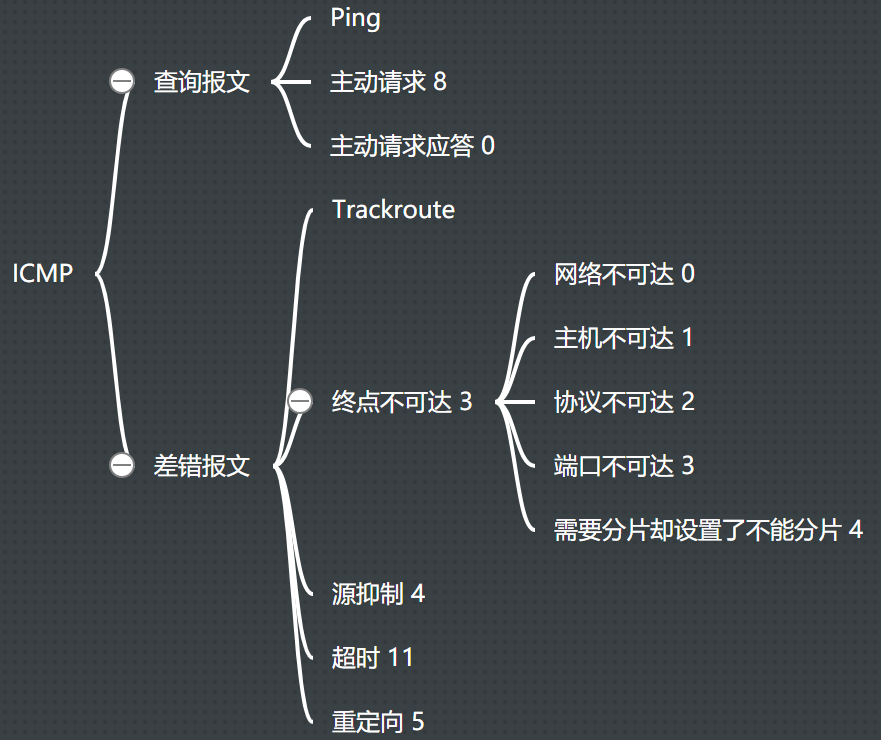
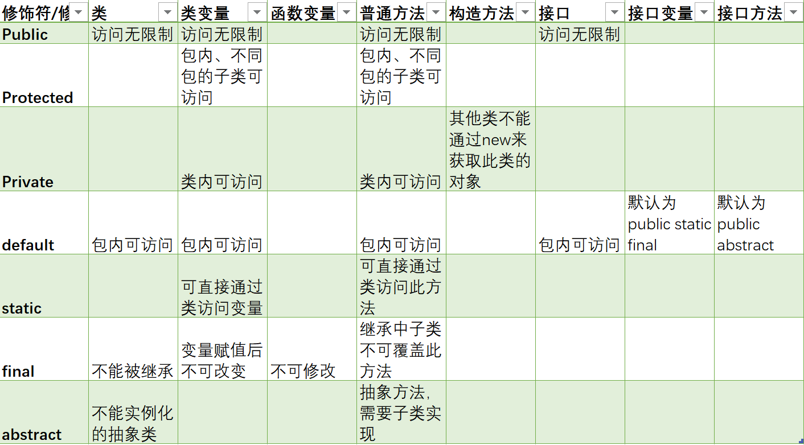
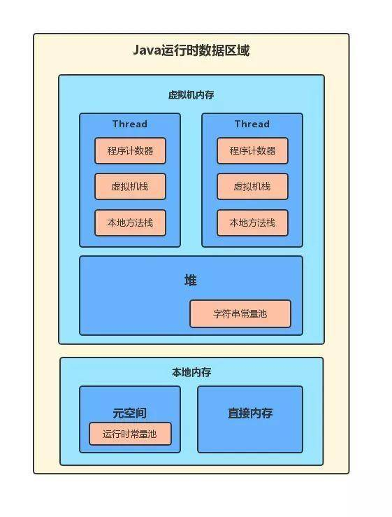
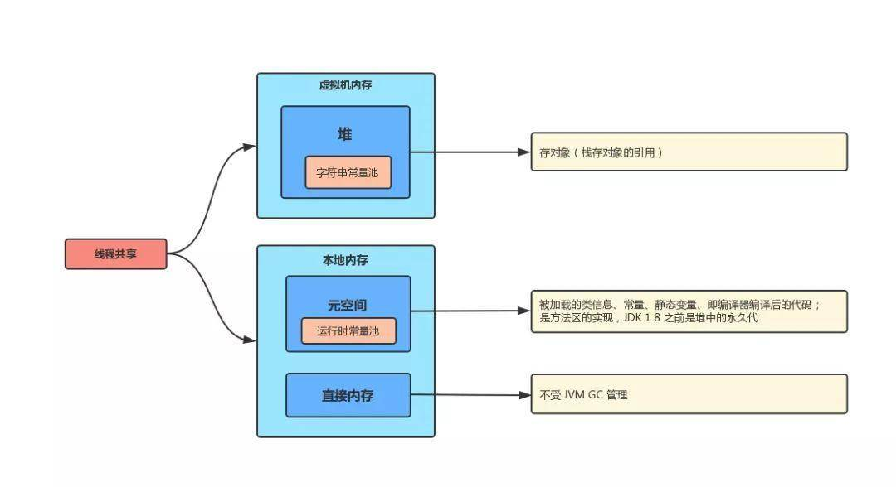
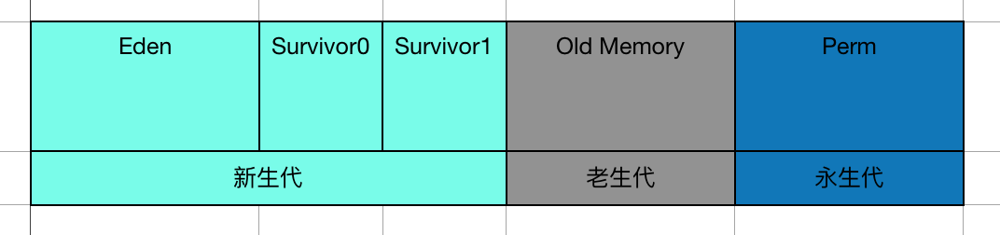

## 1. 经验

### 1.1. 公司习惯

1. 字节跳动面试算法题多
2. 美团基础问得多

## 1.2. 复习技巧

1. 每天做一道leetcode
2. 如果题目半小时没有思路，则查看题解
3. 刷完50题总结

### 1.3. 项目难点

+  **SMES**

  1. 图片访问慢

     图片压缩、定义存储的抽象接口，根据配置修改CDN；

  2. 上传图片偶尔会遇到问题，重启没有问题，后面日志(tempory location not valid) google得知POST 方法需要使用临时目录存储，CentOS会经常删除临时目录。

     增加了配置：servlet.multipart.location: ${user.dir}

  3. 将一些接口的信息配置化，比如一页显示的数量，免运费额度，等，每一页显示的数量不再是前端决定，而是可以配置的（相当于在后台接口处得到这个配置）我需要将这些信息在项目启动的初期从数据库读入内存并且作为全局变量。后面查询了解到@postConstruct这个servlet的注解。

+ **IDE**

  1. 线程隔离的输入输出

     我们通过自定义一个System类来替换代码中对System的引用，期望实现将代码执行的标准输出和标准错误返回给客户端，由于System是全局共享的，因此需要改造标准输出和标准错误为线程封闭，这样多个任务的输出才不会互相干扰。客户端代码不会对System进行实例化，自定义System替换代码中的引用之后也是全局共享的，没有办法对每个任务新建输出流。最后使用ThreadLocal比较优雅的解决这个问题。

## 2. 算法

1. 快排

   快排复杂度o（nlogn）是为什么。n是什么logn是什么

2. 最长公共子串

3. 一个二维数组从左到右递增，从上到下递增，判断某个数在不在里面

## 3. 数据结构

1. B+树
2. B+，B-，红黑树，二叉搜索树，平衡搜索树

## 4. 操作系统

1. 线程和进程的区别
   + 定义：进程是程序在某个数据集合上的一次运行活动；线程是进程中的一条执行路径；
   + 角色：在支持线程机制的平台上，进程是系统资源分配的单位，线程是CPU调度的单位；
   + 资源共享：进程之间不共享资源，线程共享所在进程的资源；同时线程有自己独立的栈、栈指针、程序计数器等。
   + 独立性：进程有自己独立的空间，线程没有，线程依赖于进程存在；
   + 性能：进程切换需要切换空间，开销较大；线程切换开销较小。
   
2. 协程 

   伪多线程、在用户态不被内核管理，开销小于线程，应用于IO密集型场景。

   在函数的执行过程中，如果遇到了耗时的 I/O 操作，函数可以临时让出控制权，让 CPU 执行其他函数，等 I/O 操作执行完毕以后再收回控制权。

3. 进程间通信（IPC）

   + 管道：父子进程，基于Fork实现
   + 命名管道（FIFO）：不相关进程；
   + 消息队列
   + 信号量（semaphores）
   + 共享内存：进程共享存储区

4. 网络IPC（Socket）

   + 新建套接字获得FD
   + bind(port)
   + listen
   + 将FD加入epoll
   + eventNum=epoll_wait()
   + 根据eventNum遍历event，在event的fd==FD时表示收到连接；
   + connFD=accept(FD)完成socket的链接；
   + 将connFD交给线程池异步处理。

5. epoll

   

   + 水平触发：
     + 读缓冲区非空--可读--一只通知可读信号；
     + 写缓冲区不满--可写--一直通知可写信号；
   + 边缘触发
     + 读缓冲区由空变为非空--通知可读信号
     + 写缓冲区由满变为不满--通知可写信号；
   + LT是默认的，支持阻塞和非阻塞，内核通知程序FD就绪，程序对FD进行IO，如果程序不进行处理，LT会一直通知，这种模式不容易出错（poll、select）就是这种模式。假设读缓冲区中收到2kb内容，两种模式都发出可读信号，没读完时LT会一直通知，ET则不会，因此要求程序尽量一次读完，并且设置FD为非阻塞。

## 5. 计算机网络

1. OSI七层协议
   
    
    
    + 物理层：比特流的透明传输
    
      RJ45、CLOCK、IEEE802.3 （中继器，集线器）
    
    + 数据链路：通过各种控制协议，将有差错的物理信道变为无差错的、能可靠传输数据帧的数据链路
    
      PPP、FR、HDLC、VLAN、MAC （网桥，交换机）

    + 网络层：提供路由和寻址的功能，使两终端系统能够互连且决定最佳路径，并具有一定的拥塞控制和流量控制的能力。
    
      IP、ICMP、ARP、RARP、OSPF、IPX、RIP、IGRP、 （路由器）
    
    + 传输层：向用户提供可靠的端到端的差错和流量控制，保证报文的正确传输。传输层的作用是向高层屏蔽下层数据通信的细节，即向用户透明地传送报文
    
      TCP、UDP、SPX
    
    + 会话层：向两个实体的表示层提供建立和使用连接的方法。
    
      NFS、SQL、NETBIOS、RPC
    
    + 表示层：对来自应用层的命令和数据进行解释，对各种语法赋予相应的含义，并按照一定的格式传送给会话层
    
      JPEG、MPEG、ASII
    
    + 应用层：FTP、DNS、Telnet、SMTP、HTTP、WWW、NFS
    
1. 为什么要对网络进行分层
   
    + 各层相互独立，上层只需要知道下层提供的接口和功能，不用关注实现细节；
    + 各层之间灵活性好，一层的改变不影响另一层；
    + 易于实现和标准化，复杂问题分为多个简单的问题处理。
    
1. DNS过程
   
    
    
1. TCP和UDP区别
   
    - TCP面向连接(三次握手）;UDP是无连接的，即发送数据之前不需要建立连接
    - TCP提供可靠的服务。也就是说，通过TCP连接传送的数据，无差错，不丢失，不重复，且按序到达;UDP尽最大努力交付，不保证可靠交付；
    - TCP面向字节流，实际上是TCP把数据看成一连串无结构的字节流;UDP是面向报文的UDP没有拥塞控制，因此网络出现拥塞不会使源主机的发送速率降低（对实时应用很有用，如IP电话，实时视频会议等）
    - 每一条TCP连接只能是点到点的;UDP支持一对一，一对多，多对一和多对多的交互通信。
    - TCP首部开销20字节;UDP的首部开销小，只有8个字节；
    - TCP的逻辑通信信道是全双工的可靠信道，UDP则是不可靠信道。
    
1. TCP拥塞控制

    + 拥塞控制

      1. TCP连接初始化，将拥塞窗口cwind设置为1个报文段，即cwind=1；

      2. 执行慢开始算法，cwind按照指数规律增长；直到cwind==ssthresh时，开始执行拥塞避免算法，cwind按照线性规律增长；

      3. 当网络发生拥塞，把ssthresh(slow start thresh)更新为拥塞前的一半，cwind重新设置为1，再按照2执行。

         第3的目的是迅速减少主机发送到网络中的分组数，使得发生拥塞的路由器有足够的时间把队列中积压分组处理完毕。

         目前有非常多的拥塞控制协议：

         + 基于丢包：缓慢探测-出现丢包-拥塞窗口减小，Reno、Cubic。
         + 基于时延：时延增加-出现拥塞-减小拥塞窗口，Vegas、FastTCP。
         + 基于链路容量：实时测量网络带宽和延迟，报文总量>带宽*延迟时出现拥塞，BBR。
         + 基于学习：借助评价函数，使用机器学习的方法形成控制策略。

    + 流量控制

      如果发送方把数据发送得过快，接收方可能会来不及接收，这就会造成数据的丢失。

      TCP的流量控制是利用滑动窗口机制实现的，接收方在返回的ACK中会包含自己的接收窗口的大小，以控制发送方的数据发送。但是，当某个ACK报文丢失，就会出现互相等待的死锁状态，为了解决这种问题引入了持续计数器，当A收到rwnd=0时，就启用该计时器，时间到了则发送一个1字节的探测报文，询问B是繁忙还是丢失了上个ACK，然后B回应自身的接收窗口大小，返回rwnd=0（A重置计时器继续等待）或rwnd=x。

1. TCP 报文

    

    + 16位源端口号：标识报文的返回地址
    + 16位目的端口号：指明报文接收计算机上的应用程序地址接口
    + 32位序号：接收端用于将报文重新分段成最初的形式。当SYN出现，序列码实际上是初始序列码（Initial Sequence Number，ISN），而第一个数据字节是ISN+1。这个序列号（序列码）可用来补偿传输中的不一致。
    + 32位确认序号：由接收端计算机使用，重组分段的报文成最初形式。如果设置了ACK控制位，这个值表示一个准备接收的包的序列码。
    + 4位首部长度：表示TCP头大小，指示何处数据开始。
    + 保留（6位）：为了将来定义新的用途而保留，这些位必须是0。
    + 标志（6位）：
      + SYN(synchronous),建立联机。
      + ACK(acknowledgement),确认。
      + PSH(push),传输。
      + FIN(finish),结束。
      + RST(reset),重置。
      + URG(urgent),紧急
    + 16位窗口大小：用来表示想收到的每个TCP数据段的大小。TCP的流量控制由连接的每一端通过声明的窗口大小来提供。窗口大小为字节数，起始于确认序号字段指明的值，这个值是接收端正期望接收的字节。窗口大小是一个16字节字段，因而窗口大小最大为65535字节。
    + 16位校验和：源机器基于数据内容计算一个数值，用于证明数据的有效性。这是一个强制性的字段，一定是由发送端计算和存储，并由接收端进行验证的。
    + 16位紧急指针：指向后面是优先数据的字节，在URG标志设置了时才有效。如果URG标志没有被设置，紧急域作为填充。加快处理标示为紧急的数据段。
    + 选项：长度不定，但长度必须为1个字节。如果没有选项就表示这个1字节的域等于0。
    + 数据：该TCP协议包负载的数据。

1. tcp的三次握手和四次挥手
   
    socket编程中由客户端调用connect发起。
    
    
    
    
    
    
    建立连接时，三次握手：
	
    - 建立连接时，客户端发送SYN包（seq=C）到服务器，并进入到SYN-SEND状态，等待服务器确认
    - 服务器收到SYN包，必须确认客户的SYN（ack=C+1）,同时自己也发送一个SYN包（seq=S）,即SYN+ACK包，此时服务器进入SYN-RECV状态
    - 客户端收到服务器的SYN+ACK包，向服务器发送确认报ACK（ack=S+1）,此包发送完毕，客户端和服务器进入ESTABLISHED状态，完成三次握手，客户端与服务器开始传送数据。
    
    
    
    
    断开连接时四次挥手，socket编程中由close来触发:
    
    - Initiator 发送一个FIN（seq=I）用来关闭自己到Receiver的数据传输，进入FIN_WAIT_1阶段；
    - Receiver接收到FIN后，返回一个ACK（ack=I+1)，进入CLOSE_WAIT阶段；
    - Receiver向Initiator发送一个FIN+ACK（seq=R,ack=I+1），进入LAST_ACK阶段；
    - Initiator 回复一个ACK（ack=R+1）的报文后进入TIME_WAIT状态。
    
1. 为什么是三次握手而不是两次或者四次

    TCP协议是全双工、支持半关闭的可靠传输协议，其中使用seq来判断哪些包需要重传，和包乱序的问题。三次握手能实现两个作用：

    + 初始化双方seq

      通信双方协商一个初始seq至少需要一次SYN和一次ACK，由于TCP是全双工的，所以需要协商两个初始seq，即需要2*（一次SYN和一次ACK），简单优化，可以将中间ACK和SYN合并就变成了三次握手。

    + 确认双方信道可以实现最低限度的全双工

      第二次握手证明C到S可靠，第三次握手证明S到C可靠。

1. 为什么连接的时候是三次握手，关闭的时候却是四次握手？

    TCP协议是全双工、支持半关闭：FIN+ACK表示C端关闭了，但是S端还可以继续传输。

    因为当Server端收到Client端的SYN连接请求报文后，可以直接发送SYN+ACK报文。其中ACK报文是用来应答的，SYN报文是用来同步的。但是关闭连接时，当Server端收到FIN报文时，很可能并不会立即关闭SOCKET，所以只能先回复一个ACK报文，告诉Client端，"你发的FIN报文我收到了"。只有等到我Server端所有的报文都发送完了（或者相关准备好了），我才能发送FIN报文，因此不能一起发送。故需要四步握手。

1. 为什么TIME_WAIT状态需要经过2MSL(最大报文段生存时间)才能返回到CLOSE状态？

  - ACK丢失时，对方没有收到，重新发送最后的FIN，TCP需要再次发送最后的ACK;
  - 经过时间2MSL，就可以使本连接持续的时间内所产生的所有报文段，都从网络中消失。这样就可以使下一个新的连接中不会出现这种旧的连接请求报文段。

1. HTTP 的方法

    - GET  `HTTP/0.9`

      显示请求指定资源，只用于数据的获取，不用于会产生副作用的·=`非幂等`操作，不安全；

    - HEAD `HTTP/1.0`

      与GET方法一样都是向服务器请求指定资源，但是服务器响应是不包括请求资源的内容，常用于客户端查看服务器性能。

    - POST `HTTP/1.0`

      向指定资源发送数据，请求服务器处理，如：表单提交，文件上传等。请求数据包含在请求体中，此方法是`非幂等`操作，可能会创建新的资源或修改现有资源。

    - PUT `HTTP/1.1`

      向指定资源位置上传最新的内容取代旧的内容，是`幂等`方法。

    - DELETE `HTTP/1.1`

      请求服务器删除URI标识的资源，也是`幂等`方法。

    - CONNECT `HTTP/1.1`

      能够将连接改为管道方式的代理服务器。通常用于[SSL](http://itbilu.com/other/relate/N16Uaoyp.html)加密服务器的链接与非加密的HTTP代理服务器的通信。

    - OPTIONS `HTTP/1.1`

      `OPTIONS`请求与`HEAD`类似，一般也是用于客户端查看服务器的性能。 请求服务器返回该资源所支持的所有HTTP请求方法。

    - TRACE `HTTP/1.1`

      请求服务器回显其收到的请求信息，用于HTTP请求的测试或诊断，比如：可以看到服务器最终接收的报文中的IP地址，推断是否经过了代理。

    - PATCH `HTTP/2`

      与`PUT`请求类似，同样用于资源的更新。`PATCH`用于资源的部分更新，`PUT`用于整体更新。当资源不存在时，`PATCH`会创建一个新的资源，而`PUT`只会对已在资源进行更新。

1. HTTP状态码

    | 分段 | 意义                                           | 举例                                              |
    | ---- | ---------------------------------------------- | ------------------------------------------------- |
    | 1**  | 信息，服务器收到请求，需要请求者继续执行操作   | 100: Continue; 101: Switching Protocols           |
    | 2**  | 成功，操作被成功接收并处理                     | 201: Created                                      |
    | 3**  | 重定向，需要进一步的操作以完成请求             | 301: Moved Permanently, 307: Temporary Redirect   |
    | 4**  | 客户端错误，请求包含语法错误或无法完成请求     | 403: Forbidden, 405: Method Not Allowed           |
    | 5**  | 服务器错误，服务器在处理请求的过程中发生了错误 | 502: Bad Gateway, 505: HTTP Version not supported |

1. HTTP长连接和短连接

    HTTP是一个无状态的面向连接的协议.。在HTTP/1.0中，默认使用的是短连接，从 HTTP/1.1起，默认使用长连接。

    网络通信时采用TCP协议，在真正的读写操作之前，server与client之间必须建立一个连接，当读写操作完成后，双方不再需要这个连接 时它们可以释放这个连接，连接的建立是需要三次握手的，而释放则需要4次握手，所以说每个连接的建立都是需要资源消耗和时间消耗的。

    - 短连接：

      - 连接—传输—关闭连接...连接—传输—关闭连接；

      - 对于服务器来说管理较为简单，存在的连接都是有用的连接，不需要额外的控制手段。但如果客户**请求频繁**，将在**TCP的建立和关闭操作上浪费时间和带宽**。

      - 并发量大，但每个用户无需频繁操作情况下需用短连好，比如网站的http服务。

    - 长连接：

      - 连接—传输...（保持连接）...传输—关闭连接

      - **长连接**可以**省去较多的TCP建立和关闭的操作，减少浪费，节约时间**。对于频繁请求资源的客户来说，较适用长连接。不过这里**存在一个问题**，**存活功能的探测周期太长**
      - 多用于操作频繁，点对点的通讯，而且连接数不能太多情况，如数据库连接。

1. session和cookie

    由于HTTP协议是无状态的协议，所以服务端需要记录用户的状态时，就需要用某种机制来识具体的用户，这个机制就是Session。

     一个保存key-value 的容器，每个用户对应一个key，用户的会话信息就是value。大型的网站，一般会有专门的Session服务器集群，用来保存用户会话，这个时候 Session 信息都是放在内存的，使用一些缓存服务比如Memcached 或者 Redis 之类的来放 Session。

    key如何和用户绑定呢，大多数的应用都是用 Cookie 来实现Session跟踪的，第一次创建Session时，服务端会在HTTP响应中（set-cookie: session_id），让浏览器在 Cookie 里面记录一个Session ID，之后的访问浏览器都会带着session_id访问服务器。

    如果客户端的浏览器禁用了 Cookie，这种情况下，会使用一种叫做URL重写的技术来进行会话跟踪，即每次HTTP交互，URL后面都会被附加上一个诸如 sid=xxxxx 这样的参数，服务端据此来识别用户。Cookie其实还可以用在一些方便用户的场景：自动登录。

    总之，Session是在服务端保存的一个数据结构，用来跟踪用户的状态，这个数据可以保存在集群、数据库、文件中；Cookie是客户端保存用户信息的一种机制，用来记录用户的一些信息，也是实现Session的一种方式

1. 用户输入url到返回结果的具体过程

    ​	

    - DNS 解析:将域名解析成 IP 地址
    - TCP 连接：TCP 三次握手
    - 发送 HTTP 请求
    - 服务器处理请求并返回 HTTP 报文
    - 浏览器解析渲染页面
    - 断开连接：TCP 四次挥手

1. Ping与ICMP

     

    

1. 粘包、半包

## 6. 设计模式

1. 责任链模式

   

2. 单例模式

   饿汉，懒汉，双重检测，为什么要双重检测

## 7. 数据库

### 7.1. MySQL

1. 索引

   加索引是慢查询的常见优化方式，索引其实是一种数据结构，这种数据结构能提高查询的速度，比如Mysql使用B+树做索引。

   + 哈希表、AVL、B树、B+树等都能提高处查询速度，为什么使用B+树？

     + hash表可以精确查询，但不支持范围查询；
     + AVL支持范围查找，但由于节点只有2，导致深度较大，IO更多；
     + B树比AVL深度更低，同一个节点可以存储多个元素
     + B+树非叶子节点的数据会冗余到叶子节点，叶子节点之间用指针相连。更少的磁盘IO和更高的范围查询效率。

   + B+树节点中存多少元素合适？

     一页或者页的倍数合适。Innodb一页的默认大小是16k。

   + 为什么16k就足够了？

     innodb中非叶子节点：存储主键和指针，主键假设bigint(8b)指针(6b)共14b，16k/14b=1k+条；叶子节点：存储数据，假设每条1k，可以存储16条。高度为2可以存储18k条左右，高度为3可以有1k\*1k\*16=千万级.

2. 查询优化

   + 只请求需要的行和列（limit,少使用*）
   + 全表扫描、索引扫描、范围扫描、唯一索引查询、常数引用从慢到快，扫描行数从多到少，可使用EXPLAIN语句中的type列查看使用的方式以进行优化。合理的索引能提高查询速度，当发现查询需要扫描大量的数据行但只返回少数的行，那么可以考虑使用覆盖索引，即把所有需要用到的列都放到索引中。这样存储引擎无须回表获取对应行就可以返回结果了。
   + 分解大的查询：缓存更高效，减少锁竞争（比如删除旧的数据），
   + 用IN取代OR：IN()先将自己列表中的数据进行排序，然后通过二分查找的方式确定列的值是否在IN()的列表中，这个时间复杂度是O(logn)。如果换成OR操作，则时间复杂度是O(n)
   + 优化排序：尽量让MySql使用索引进行排序

3. ACID，隔离级别

4. int(11)和int(10)结构一样吗 ？哪里不一样

   括号中的字符表示显示宽度，整数列的显示宽度与mysql需要用多少个字符来显示该列数值，与该整数需要的存储空间的大小都没有关系，int类型的字段能存储的数据上限还是2147483647(有符号型)和4294967295(无符号型)

   对于声明为INT(5) ZEROFILL的列，值4检索为00004。请注意如果在整数列保存超过显示宽度的一个值，当MySQL为复杂联接生成临时表时会遇到问题，因为在这些情况下MySQL相信数据适合原列宽度(设定的最大显示宽度)。

### 7.2. Redis

1. list底层
2. 

## 8. Java基础

### 5.1. 语言基础

1. 泛型

   泛型是 Java SE 1.5 的新特性，泛型的本质是参数化类型，这种参数类型可以用在类、接口和方法的创建中，分别称为泛型类、泛型接口、泛型方法。

   在 Java SE 1.5 之前没有泛型的情况的下只能通过对类型 Object 的引用来实现参数的任意化，其带来的缺点是要做显式强制类型转换，而这种强制转换编译期是不做检查的，容易把问题留到运行时。

   - 优点：
     - 类型安全，提供编译期间的类型检测，避免在运行时出现 ClassCastException。
     - 前后兼容
     - 泛化代码,代码可以更多的重复利用，所有的强制转换都是自动和隐式的。
     - 性能较高，用泛型JAVA编写的代码可以为java编译器和虚拟机带来更多的类型信息，这些信息对java程序做进一步优化提供条件。

   - Java 泛型是如何工作的？什么是类型擦除？

     ​	泛型是通过类型擦除来实现的，编译器在编译时擦除了所有泛型类型相关的信息，所以在运行时不存在任何泛型类型相关的信息，譬如 List<Integer> 在运行时仅用一个 List 来表示，这样做的目的是为了和 Java 1.5 之前版本进行兼容。泛型擦除具体来说就是在编译成字节码时首先进行类型检查，接着进行类型擦除（即所有类型参数都用他们的限定类型替换，包括类、变量和方法），接着如果类型擦除和多态性发生冲突时就在子类中生成桥方法解决，接着如果调用泛型方法的返回类型被擦除则在调用该方法时插入强制类型转换。

   - Java 泛型类、泛型接口、泛型方法有什么区别？

     泛型类是在实例化类的对象时才能确定的类型，其定义譬如 class Test<T> {}，在实例化该类时必须指明泛型 T 的具体类型。

     泛型接口与泛型类一样，其定义譬如 interface Generator<E> { E dunc(E e); }。

     泛型方法所在的类可以是泛型类也可以是非泛型类，是否拥有泛型方法与所在的类无关，所以在我们应用中应该尽可能使用泛型方法，不要放大作用空间，尤其是在 static 方法时 static 方法无法访问泛型类的类型参数，所以更应该使用泛型的 static 方法（声明泛型一定要写在 static 后返回值类型前）。泛型方法的定义譬如 <T> void func(T val) {}。

   - 泛型边界

     - 在Java泛型定义时:

       用<T>等大写字母标识泛型类型，用于表示未知类型。
       用<T extends ClassA & InterfaceB …>等标识有界泛型类型，用于表示有边界的未知类型。

     - 在Java泛型实例化时:

       用<?>标识通配符，用于表示实例化时的未知类型。
       用<? extends 父类型>标识上边界通配符，用于表示实例化时可以确定父类型的未知类型。
       用<? super 子类型>标识下边界通配符，用于表示实例化时可以确定子类型的未知类型。

   - 可以把List<String>传递给一个接受List<Object>参数的方法吗？

     会导致编译错误，List<Object>可以存储任何类型的对象包括String, Integer等等，而List<String>却只能用来存储String s。

   - List<Object>和原始类型List之间的区别

     在编译时编译器不会对原始类型进行类型安全检查，却会对带参数的类型进行检查，通过使用Object作为类型，可以告知编译器该方法可以接受任何类型的对象，比如String或Integer。

     它们之间的第二点区别是，你可以把任何带参数的类型传递给原始类型List，但却不能把List<String>传递给接受 List<Object>的方法，会产生编译错误。

   - 编写一段泛型程序来实现LRU缓存

     可借助 `LinkedHashMap`，`LinkedHashMap`提供了一个称为`removeEldestEntry()`的方法，该方法会被`put()` 和`putAll()`调用来删除最老的键值对。

   - Array 中可以使用泛型吗

     Array事实上并不支持泛型，这也是为什么Joshua Bloch在Effective Java一书中建议使用List来代替Array，因为List可以提供编译期的类型安全保证，而Array却不能。

   - `@SuppressWarnings(“unchecked”)` 可屏蔽类型未检查警告

   - Java 中的泛型和 C++ 中的模板

     - C++ 中模板的实例化会为每一种类型都产生一套不同的代码，这就是所谓的代码膨胀。

     - Java 中并不会产生这个问题。虚拟机中并没有泛型类型对象，所有的对象都是普通类。

       当编译器对带有泛型的java代码进行编译时，它会去执行**类型检查**和**类型推断**，然后生成普通的不带泛型的字节码，这种普通的字节码可以被一般的 Java 虚拟机接收并执行，这在就叫做 **类型擦除**

   - 泛型的规则
     - 泛型的参数类型只能是类（包括自定义类），不能是简单类型。
     - 同一种泛型可以对应多个版本（因为参数类型是不确定的），不同版本的泛型类实例是不兼容的。
     - 泛型的类型参数可以有多个
     - 泛型的参数类型可以使用 extends 语句，习惯上称为“有界类型”
     - 泛型的参数类型还可以是通配符类型，例如 Class

2. 重写和重载区别

   - **重载**：同一个类中，相同方法名，不同参数类型、参数个数的多个方法。返回值类型可以相同也可以不相同。无法以返回型别作为重载函数的区分标准。调用方法时通过传递给它们的不同参数个数和参数类型来决定具体使用哪个方法, 这就是多态性。
   - **重写**：父类与子类之间的多态性，对父类的函数进行重新定义。如果在子类中定义某方法与其父类有相同的名称和参数，我们说该方法被重写 (Overriding)。如需父类中原有的方法，可使用super关键字，该关键字引用了当前类的父类。

3. 抽象类与接口类区别

   - **抽象类**：抽象类是对根源的抽象（eg. 男人，女人 --人）。如果一个类含有抽象方法，则称这个类为抽象类，抽象类必须在类前用abstract关键字修饰。因为抽象类中含有无具体实现的方法，所以不能用抽象类创建对象。
   - **接口**：接口是对行为的抽象（eg. 吃饭，睡觉），一堆抽象方法的集合。也不能实例化。
   - 区别
     - 抽象类可以提供成员方法的实现细节，而接口中只能存在public abstract 方法；
     - 抽象类中的成员变量可以是各种类型的，而接口中的成员变量只能是public static final类型的；
     - 接口中不能含有静态代码块以及静态方法，而抽象类可以有静态代码块和静态方法；
     - 一个类只能继承一个抽象类，而一个类却可以实现多个接口。

4. 封装、继承、多态

   

5. final，finalize，finally区别

   + `final` 

     + 修饰变量：变量一旦被初始化便不可改变，对基本类型来说是其值不可改变，而对于对于对象变量来说其引用不可再变。
     + 修饰方法：自己认为方法功能足够，可以继承，不能覆盖。允许编译器将所有对此方法的调用转化为inline(行内)调用的机制，直接将方法主体插入到调用处，而不是进行例行的方法调用。
     + 修饰类：自己认为此类设计完美，无法被任何人继承的，final 类的方法自然是final类型。
     + final不能用于修饰构造方法。

   + `finally`

     异常处理模型的最佳补充，finally结构使代码总会执行，而不管有无异常发生，使用finally可以维护对象的内部状态，并可以清理非内存资源。

   + `finalize`

     Java 技术允许使用 finalize() 方法在垃圾收集器将对象从内存中清除出去之前做必要的清理工作。这个方法是由垃圾收集器在确定这个对象没有被引用时对这个对象进行调用。finalize()方法是在垃圾收集器删除对象之前对这个对象调用的子类覆盖 finalize() 方法以整理系统资源或者执行其他清理操作。

     通常，finalize用于一些不容易控制、并且非常重要资源的释放，例如一些I/O的操作，数据的连接，这些资源的释放对整个应用程序时非常关键的。

6. 修饰符 

   

7. 异常处理

   

   Java把异常当作对象来处理，并定义一个基类`java.lang.Throwable`作为所有异常的超类。

   + 分类：
     + `Error`：JAVA 程序运行时系统的内部错误，通常比较严重，除了通知用户和尽力使应用程序安全地终止之外，无能为力，应用程序不应该尝试去捕获这种异常。通常为一些虚拟机异常，如 `StackOverflowError`、`OutOfMemoryError` 等。
     + `RuntimeException`：通常为程序逻辑引起的异常，如`ArithmeticException`，`ArrayIndexOutOfBoundException`。
     + `其他Exception`：通常是程序本身没有问题，由于像 I/O 错误等问题导致的异常

   + 分类二

     + `受查异常`：受查异常会在编译时被检测。如果一个方法中的代码会抛出受查异常，则该方法必须包含异常处理，即 try-catch 代码块，或在方法签名中用 throws 关键字声明该方法可能会抛出的受查异常，否则编译无法通过。如果一个方法可能抛出多个受查异常类型，就必须在方法的签名处列出所有的异常类。
     + `非受查异常`：非受查异常不会在编译时被检测。JAVA 中 Error 和 RuntimeException 类的子类属于非受查异常，除此之外继承自 Exception 的类型为受查异常。

   + 关键字

     + `try`：将要被监听的代码(可能抛出异常的代码)放在try语句块之内，当try语句块内发生异常时，异常就被抛出；
     + `catch`：用来捕获try语句块中发生的异常；
     + `finally`：此语句块总是会被执行。主要用于回收在try块里打开的物理资源(如数据库连接、网络连接、磁盘文件)。只有finally块，执行完成之后，才会回来执行try或者catch块中的return或者throw语句，如果finally中使用了return或者throw等终止方法的语句，则就不会跳回执行，直接停止。
     + `throw`：抛出异常；
     + `throws`：用在方法签名中，声明该方法可能抛出的异常。

   + JVM 如何处理异常

     在一个方法中如果发生异常，这个方法会创建一个异常对象，并转交给 JVM，该异常对象包含异常名称，异常描述以及异常发生时应用程序的状态。创建异常对象并转交给 JVM 的过程称为抛出异常。可能有一系列的方法调用，最终才进入抛出异常的方法，这一系列方法调用的有序列表叫做调用栈。

     JVM 会顺着调用栈去查找看是否有可以处理异常的代码，如果有，则调用异常处理代码。当 JVM 发现可以处理异常的代码时，会把发生的异常传递给它。如果 JVM 没有找到可以处理该异常的代码块，JVM 就会将该异常转交给默认的异常处理器（默认处理器为 JVM 的一部分），默认异常处理器打印出异常信息并终止应用程序。

   + NoClassDefFoundError 和 ClassNotFoundException 区别？

     NoClassDefFoundError 是一个 Error 类型的异常，是由 JVM 引起的，不应该尝试捕获这个异常。引起该异常的原因是 JVM 或 ClassLoader 尝试加载某类时在内存中找不到该类的定义，该动作发生在运行期间，即编译时该类存在，但是在运行时却找不到了，可能是编译后被删除了等原因导致；

     ClassNotFoundException 是一个受查异常，需要显式地使用 try-catch 对其进行捕获和处理，或在方法签名中用 throws 关键字进行声明。当使用 Class.forName, ClassLoader.loadClass 或 ClassLoader.findSystemClass 动态加载类到内存的时候，通过传入的类路径参数没有找到该类，就会抛出该异常；另一种抛出该异常的可能原因是某个类已经由一个类加载器加载至内存中，另一个加载器又尝试去加载它。

8. integer与int区别

   + Integer是int的包装类，int则是java的一种基本数据类型;
   + Integer变量必须实例化后才能使用，而int变量不需要;
   + Integer实际是对象的引用，当new一个Integer时，实际上是生成一个指针指向此对象；而int则是直接存储数据值;
   + Integer的默认值是null，int的默认值是0;

9. String 、stringbuffer、stringbuilder

   + 都是final类，都不允许被继承；

   + String是不可变对象，每次改变就会创建新的String对象，然后将指针指向新的对象；
   + StringBuffer和StringBuilder类长度是可以改变的；
   + StringBuffer线程安全，StringBuilder非线程安全，但性能略高，适合单线程使用；。

10. == 和 equals 的区别是什么

    两种数据类型：

    + 基本数据类型：byte,short,char,int,long,float,double,boolean
       他们之间的比较，应用双等号（==）,比较的是他们的值。

    + 复合数据类型(类)
      当他们用（==）进行比较的时候，比较的是他们在内存中的存放地址，所以，除非是同一个new出来的对象，他们的比较后的结果为true，否则比较后结果为false。 

      JAVA中所有类都是继承于Object这个基类的，在Object中定义了一个equals的方法，这个方法的初始行为是比较对象的内存地址，但在一些类库当中这个方法被覆盖掉了，如String,Integer,Date在这些类当中equals有其自身的实现，而不再是比较类在堆内存中的存放地址。

      注意：在使用了对象池技术的类比如String中，有时“==”可以返回True，这是因为共享了对象池中的对象。
    
11. 重写equals方法为什么要重写hashcode方法

    JavaAPI文档规定，如果两个对象调用equals方法返回是相等的，那么hashcode方法返回值必须相等。

    Object的默认实现的equals方式是调用==，也就是比较引用，默认实现的hashcode方法也是根据引用导出的。String类重载hashcode方法，利用内容导出hashcode，因此即使不是同一个String对象，但是内容相同，equals方法判断会相同，hashcode返回会相同，hashMap调用hashcode实现get和put，值相同的String才能对应到同一个bin。

    如果自定义类重写equals方法，不重写hashcode方法，那么equal的对象，在map中不能对应到同一个bin。

### 5.2. JCF
### 5.2.1. HashMap、HashTable、ConcurrentHashMap

+ **HashMap**
  + 非线程安全
  + key和value可为空
+ **HashTable**
  + 使用synchronized实现线程安全，锁定整个对象，粒度较大，在迭代时锁定时间长导致效率低下。
  + key和value都不能为null；
+ **ConcurrentHashMap**
  + Java1.7基于segment实现，只对segment加锁，而不是整个对象
  + java1.8基于CAS实现，f = tabAt(tab, i = (n - 1) & hash，put操作时锁定f
  + HashMap不允许通过Iterator遍历的同时通过HashMap修改，而ConcurrentHashMap允许该行为，并且该更新对后续的遍历可见
  + key和value都不能为null；

### 5.2.2. linkedlist、arraylist

+ **linkedlist**

  内部使用链表存储，随机访问复杂度O(n)，插入和删除复杂度O(1);

+ **arraylist**

  内部使用数组存储，随机访问复杂度O(1)，插入和删除复杂度O(n);

## 9. Java高级

### 9.1. Java 并发

1. volatile

   实现原理

2. 同步的方法

3. 乐观锁和悲观锁

4. 线程池

5. lock的实现，公平锁、非公平锁

6. cas

   是什么，怎么实现的，会有什么问题

### 9.2. JVM

1. JVM运行时数据区

   

   + 主要变化：
     + JDK 1.6，字符串常量池位于永久代的运行时常量池中；
     + JDK 1.7，字符串常量池从永久代剥离，放入了堆中；
     + JDK 1.8，元空间取代了永久代，并且放入了本地内存（Native memory）中

   + **线程隔离**

     ​	

     + 程序计数器
     + 虚拟机栈
     + 本地方法栈

   + **所有线程共享**

     ​	

     + 堆

     + 元空间（方法区）

       方法区用于存放已被加载的类信息、常量、静态变量、及编译器编译后的代码等。

       注意：方法区是JVM的规范，在JDK1.8之前方法区的实现是永久代，从1.8开始JVM移除了永久代，使用本地内存来存储元数据，并称为元空间。

       + 运行时常量池

         Class文件中的常量池会在类加载后被放入到这个区域

     + 直接内存

       NIO相关。

2. GC

   主要是对堆进行GC

   + **对象存活判断**

     + 引用计数法

       在堆中存储的对象，它会维护一个counter计数器，如果有一个引用指向它时，则counter计数器加一，如果一个引用关系失效，则counter计数器减一。当该对象的counter值变为0时，则说明该对象没有任何引用，处于可以回收的状态，可以被垃圾回收器回收。

       未解决相互引用问题。

     + 可达性分析

       通过一系列的GC Root对象作为起点，从这些对象搜索引用的对象，形成多条引用链。如果一个对象到GC Root是不可达的，则说明这个对象不可用，则可以被回收了。可能的GC Root:

       1. 虚拟机栈中引用的对象
       2. 方法区中类静态属性引用的对象
       3. 方法区中常量引用的对象
       4. 本地方法栈中JNI（Native方法）引用的对象。

       + finalize()

         即使在可达性分析算法中不可达的对象，也并非一定会被回收。对象真正被回收需要至少经历**两次被标记**的过程。

         可达性是一次标记，之后进行筛选，当对象没有复写finalize()方法，或者finalize()方法已经被调用过了，则对象会被回收。

         如果对象被判定为有必要执行finalize()方法，则该对象会被放置到一个名为F-Queue的队列中，然后虚拟机会建立一个低优先级的线程Finalizer去执行对象的finalize()方法。finalize()方法是对象逃脱被回收命运的最后的机会，因为Java虚拟机会在稍后对F-Queue队列中的对象进行**第二次标记**。

   + 垃圾回收算法

     + 标记-清除算法

       首先发生GC操作时，将可以被回收的对象进行标记处理。第二步是回收第一步中被清除的对象所占的空间。

       缺点是内存碎片化。

     + 复制算法

       将内存分为大小相等的两块，每次只使用其中的一块，当一块内存满了之后，将这块内存中还存活的对象复制到另外一块内存

     + 标记-整理算法

       首先将需要清除的对象进行标记，第二阶段略微不一样的是，在标记后并不是清除垃圾对象，而是将存活对象向内存的一端进行移动，移动完毕后，清除剩下的内存空间

     + 分代收集算法

       

       1. 新生代

          分为一块较大的Eden和两块较小的Survivor空间，每次使用Eden和一块Survivor空间。

          回收时，将使用空间中存活的对象复制到未使用的Survivor空间中，然后将使用的空间清除；如果未使用的Survivor空间放不下，会放置这些对象到老生代。

       2. 老生代

          在新生代中经历了N次GC还存活的对象会放到老生代中。老生代采取标记整理算法。

3. JVM类加载机制

## 10. Java Web 基础

### 10.1. [Spring](SpringBoot.md)

### 10.2. Mybatis

## 11. 运维基础

### 11.1. Linux 常用操作

### 11.2. Docker 

## 12. Java Web高级

### 12.1. 消息队列

