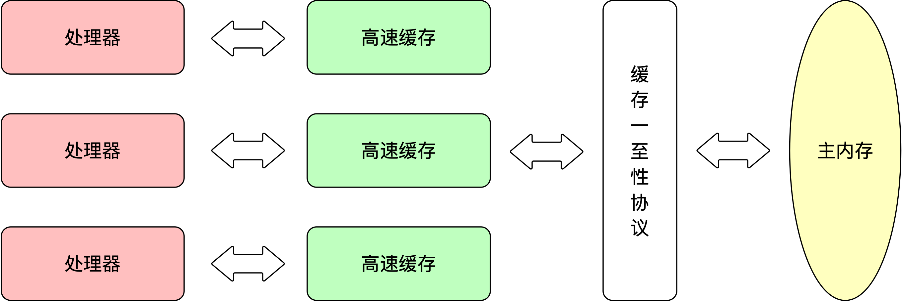

## 内存模型与线程

由于计算机的存储设备与处理器的运算速度有几个数量级的差距，现代计算机通过加入一层读写速度尽可能接近处理器运算速度的高速缓存(Cache)到中间作为缓冲。这种解决方案引入了新的问题：缓存一致性(Cache Coerence) 。多处理器系统中，每个处理器都有自己的高速缓存，但它们共享同一主存(Main Memory).

当多个处理器的运算任务都涉及到同一块主存区域时，可能导致各自的缓存数据不一致。为了解决这个问题，各处理器需要在访问缓存时都遵循共同的协议。这类协议有 MSI、MESI、MOSI、Synapse、Firefly及Dragon Protocol等。

除了增加高速缓存之外，为了使处理器内部运算单元尽可能被充分利用，处理器可能会对收入代码进行乱序执行(Out-Of-Order Execution)优化，计算之后将执行结果进行重组，保证该结果与顺序执行的结果一致，但不保证程序中各个语句计算先后顺序与代码一致。Java虚拟机中的即时编译器中也有类似的指令重排序(Instruction Reorder)优化。因此如果一个计算任务依赖另一个计算任务的中间结果，其顺序性不能靠代码的先后顺序来保证。

**内存模型**：可理解为在特定的操作协议下，对特定的内存或高速缓存进行读写访问的过程抽象。不同架构的物理机器可以拥有不同的内存模型，而Java虚拟机实现了自己的内存模型。并与硬件的内存模型很相似。
#### Java 内存模型
Java虚拟机规范中试图定义一种Java内存模型(Java Memory Model, JMM)
#### Java 线程