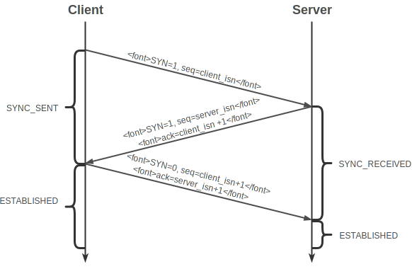

以网上面经为指导的复习。

## 经验

### 公司习惯

1. 字节跳动面试算法题多
2. 美团基础问得多

## 1. 算法

1. 快排

   快排复杂度o（nlogn）是为什么。n是什么logn是什么

2. 最长公共子串

3. 一个二维数组从左到右递增，从上到下递增，判断某个数在不在里面

## 2. 数据结构

1. B+树
2. B+，B-，红黑树，二叉搜索树，平衡搜索树

## 3. 操作系统

1. 线程和进程的区别
   + 定义：进程是程序在某个数据集合上的一次运行活动；线程是进程中的一条执行路径；
   + 角色：在支持线程机制的平台上，进程是系统资源分配的单位，线程是CPU调度的单位；
   + 资源共享：进程之间不共享资源，线程共享所在进程的资源；同时线程有自己独立的栈、栈指针、程序计数器等。
   + 独立性：进程有自己独立的空间，线程没有，线程依赖于进程存在；
   + 性能：进程切换需要切换空间，开销较大；线程切换开销较小。

## 4. 计算机网络

1. tcp的三次握手和四次挥手
    
    建立连接时，三次握手：
    
    - Client发送一个SYN表示希望建立连接，带有一个ISN；
    - Server收到请求之后，回复一个包含Server的ISN的SYN作为应答。同时将确认序号ACK设置为Client的ISN+1以对Client的SYN进行确认；
    - Client将确认序号ACK设置为服务端的ISN+1以对服务器的SYN进行确认。
    
    
    
    
断开连接时四次挥手:
    
    - Initiator 发送一个FIN（带有一个ISN）用来关闭自己到Receiver的数据传输；
    - Receiver接收到FIN后，返回一个确认序号ACK为收到的ISN+1；
    - Receiver向Initiator发送一个FIN（带有自己的ISN），确认序号ACK为收到的ISN+1；
    - Initiator 回复一个确认序号ACK为Receiver的ISN+1的报文后进入TIME_WAIT状态。
    
    
    状态转换如上图所示。深红色箭头表示Client的正常路径，蓝色箭头表示Server的正常路径，虚线表示异常路径。“/”左边表示接收到，右边表示发出。
    
    + 为什么连接的时候是三次握手，关闭的时候却是四次握手？
    
      因为当Server端收到Client端的SYN连接请求报文后，可以直接发送SYN+ACK报文。其中ACK报文是用来应答的，SYN报文是用来同步的。但是关闭连接时，当Server端收到FIN报文时，很可能并不会立即关闭SOCKET，所以只能先回复一个ACK报文，告诉Client端，"你发的FIN报文我收到了"。只有等到我Server端所有的报文都发送完了（或者相关准备好了），我才能发送FIN报文，因此不能一起发送。故需要四步握手。
    
    + 为什么TIME_WAIT状态需要经过2MSL(最大报文段生存时间)才能返回到CLOSE状态？
    
      - ACK丢失时，对方没有收到，重新发送最后的FIN，TCP需要再次发送最后的ACK;
      - 经过时间2MSL，就可以使本连接持续的时间内所产生的所有报文段，都从网络中消失。这样就可以使下一个新的连接中不会出现这种就得连接请求报文段。
    
1. TCP和UDP区别

    

1. Http 的方法

1. 长连接和短连接

1. session和cookie区别与联系

1. 用户输入url到返回结果的具体过程

1. 一个长url怎么变成短的url

## 设计模式

1. 责任链模式

2. 单例模式

   饿汉，懒汉，双重检测，为什么要双重检测

## 7. 数据库

### 7.1. MySQL

1. 索引
2. 优化sql
3. ACID，隔离级别
4. 数据库的int(4)和int(10)结构一样吗？哪里不一样

### 7.2. Redis

1. list底层
2. 

## 5. Java基础

### 语言基础

1. 泛型
2. 常见的异常类
3. integer与int区别
4. 重写和重载区别
5. 抽象类与接口类区别
6. 封装、继承、多态
7. final，finalize，finally区别
8. 修饰符 static，default、public、private、protected
9. stringbuffer与stringbuilder
10. == 和 equals 的区别是什么

### 5.1. JCF

1. hashmap 原理和实现
2. courrentHashmap 原理和实现
3. hashtable和hashmap的区别，hashtable是否线程安全？
4. linkedlist和arraylist有什么区别

## 6. Java高级

### 6.1. Java 并发

1. volatile

   实现原理

2. 同步的方法

3. 乐观锁和悲观锁

4. 线程池

5. lock的实现，公平锁、非公平锁

6. cas

   是什么，怎么实现的，会有什么问题

### JVM

1. JVM类加载机制
2. JVM分区
3. GC
4. 垃圾收集器

## 7. Java Web 基础

### 7.1. Spring

1. Spring MVC的设计模式

### 7.2. Mybatis

## 8. 运维基础

### 8.1. Linux 常用操作

### 8.2. Docker 

## 9. Java Web高级

### 9.1. 消息队列

