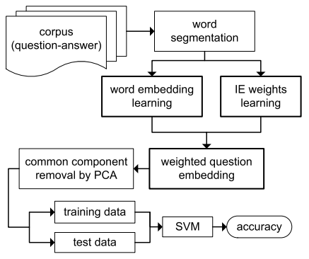
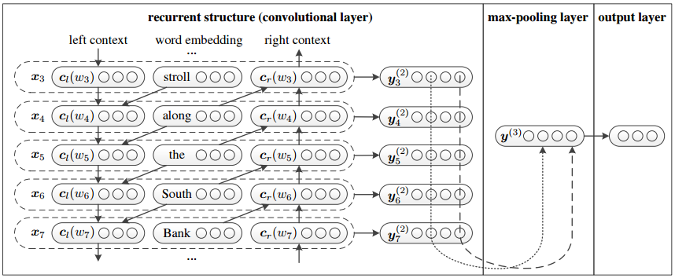
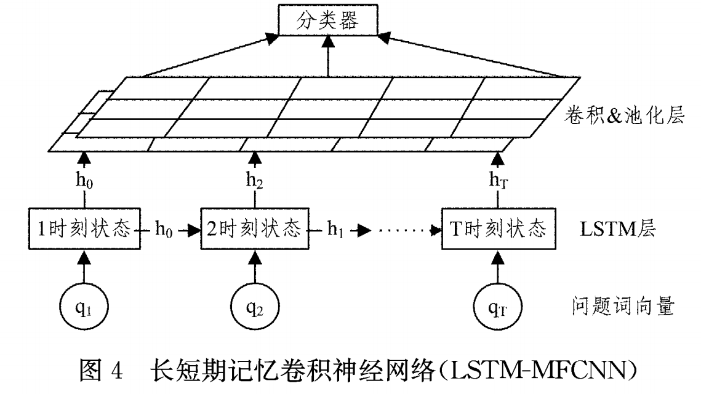
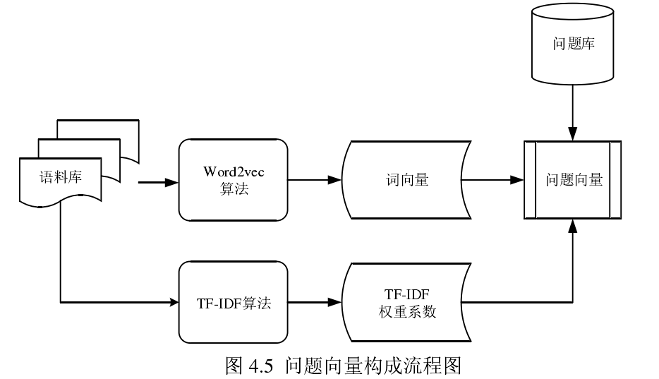
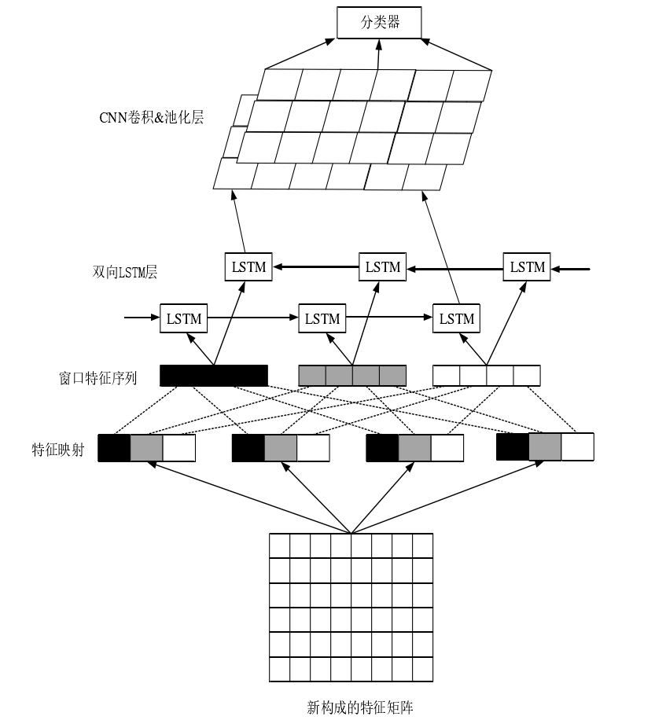

# 问句分类

## 分类体系

1. 基于答案类型的分类体系

   + UIUC 分类体系

     6个大类（ABBR，DESC，ENTY，HUM，LOC，NUM），50个小类，每个大类包含着不重复的小类。

   + 哈工大中文问句分类体系

     7个大类(人物, 地点, 数字, 时间, 实体, 描述, 未知)，每个大类根据实际情况又定义了一些小类，共60小类。

   + 根据实际问题定义分类体系(我们的系统)

2. 基于问句语义信息的分类体系

3. 基于混合信息的分类体系

## 分类方法

1. 基于规则或模板

2. 统计机器学习

   机器学习作为分类器，但是前提是特征抽取；特征抽取需要根据实际问题定义，迁移性差，重复的人工劳动，因此有论文提出自动化的特征提取。

   + 朴素贝叶斯(Naive Bayes)
   + 支持向量机(SVM)
   + K-邻近模型(KNN)
   + 最大熵模型(ME)

3. 深度学习

   由于问句有信息量少，口语化，歧义化的特点，顶会上对于这个领域的文章很少，有开源代码将文本分类的模型用于问句分类，效果并不理想；问句分类中`引入额外的信息`是一个普遍途径，除了问句和类型标注，有论文引入答案，问句的描述。

   + 基于文本分类模型迁移
   + 问句的分类模型

## 相关论文

1. Information Entropy-Informed Sentence Representation for Question Classification(2017 IEEE)

   + 准确率：

     百度知道：78%左右；农业领域90%左右。

   + 架构图

   

   + 步骤

     + 分词，词向量表示

       加入答案的知识丰富训练；

     + 权重学习(根据自己的分类定义权重的方式)

       词语级别的信息熵和词对分类的重要程度负相关；

     + 将权重应用到 word embedding;

     + 将词向量输入到 SVM 分类。

2. 基于 Bi-LSTM 和 CNN 并包含注意力机制的社区问答问句分类方法(2018 计算机系统应用研究)

   + 准确率：

     作者在百度知道和360问答爬取的数据集下结果：78.9%。

   + 架构图

   

   + 步骤
     + 分词，词向量表示
     + 如果问句带有答案信息，加入答案信息一起表示此问题
     + 卷积层，BiLSTM层，Attention层，SoftMax层

3. Recurrent Convolutional Neural Networks for Text Classification(2015 AAAI)

   + 准确率：

     本方法有开源代码将其实现用于问句分类，作者给的问句准确率：74%.

   + 架构图

   

   + 步骤
     + 领域公共语料分词并通过Word2vec的到词向量；
     + 问句向量化
     + 上文，这个词的embedding，下文组成X
     + X输入激活函数，max-pooling 层，softmax层。

4. 基于深度学习的问题分类方法研究(2016 计算机科学)

   + 准确率：

     哈工大问句+NLPCC2015+复旦大学问句集工9600个问题6个大类84个小类：大类93%小类78%.

   + 结构

     

   + 步骤

     + 词向量表示

     + LSTM表示自然语言中的时序规律

     + 学习到的特征输入到多粒度卷积核卷积神经网络 MFCNN

       由于问题所含信息较少，使用MFCNN挖掘更多隐含在问题中的特征。

     + softmax 分类器

5. 基于深度学习的自然语言处理中问题分析的研究（2018 西安邮电硕士论文）

   + 准确率

     哈工大问句+NLPCC2015+复旦大学问句集工9600个问题6个大类84个小类：大类94.43%小类84.37%.

   + 结构图

     

     

   + 步骤

     + 问句分词与向量化表示
     + 根据TF-IDF 获得权重系数，对问句向量加权
     + 输入双向LSTM
     + 输入到卷积和池化层
     + 分类器分类。

## 总结

​	目前问句分类方面的研究主要在特征提取+机器学习分类器的方式上，2017 IEEE对手动提取特征改为使用最大熵对词向量进行加权，然后进行SVM分类。

​	最近的工作(08年的硕士论文)开始使用深度学习来做问句分类的任务，但是国际顶会上没有找到相关的文章。目前的工作受限制于问句有信息量少，口语化，歧义化的特点，大类（eg. 人物、数字、描述、时间、地点、实体）的划分结果不错，达到90%以上；但是小类（eg. 温度、面积、体积、重量、速度、频率、距离）的划分不太理想，在80%左右，论文中看到结果最好的（西安邮电大学08年硕士论文）准确率大类94%小类84%；

​	除了之前那个基于RCNN的源代码，其他论文（包括发邮件联系作者）没有找到源代码，打算结合几个模型的优点部分，组合一个新的模型尝试结果：

+ 领域公共语料训练词向量（考虑使用音乐的评论）

+ 问句语料构造，丰富（同义词拓展，表述多样化）

+ 问句进行分词和向量化表示

+ 问句向量加权（可考虑最大熵和TFIDF）

  这两种加权的方式基本上都是用于开放领域的问句分类，可能不适用于我们的领域。 

+ BILSTM+CNN+Pooling+Softmax

